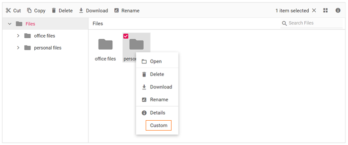

# How to add custom menu item in context menu

The context menu can be customized using the `ContextMenuSettings`, `MenuOpened`, and `OnMenuClick` events.

The following example shows adding a custom item in the context menu.

The `ContextMenuSettings` is used to add new menu item. The `MenuOpened` event is used to add the icon to the new menu item. The `OnMenuClick` event is used to add an event handler to the new menu item.

```csharp

@using Syncfusion.Blazor.FileManager

    <SfFileManager TValue="FileManagerDirectoryContent">
        <FileManagerAjaxSettings Url="/api/SampleData/FileOperations"
                                 UploadUrl="/api/SampleData/Upload"
                                 DownloadUrl="/api/SampleData/Download"
                                 GetImageUrl="/api/SampleData/GetImage">
        </FileManagerAjaxSettings>
        <FileManagerContextMenuSettings  File="@Items" Folder="@Items"></FileManagerContextMenuSettings>
    </SfFileManager>

@code {
    public string[] Items = new string[] { "Open", "|", "Delete", "Download", "Rename", "|", "Details", "Custom" };
}

```

## Run the application

After successful compilation of your application, simply press `F5` to run the application.

Output be like the below.

