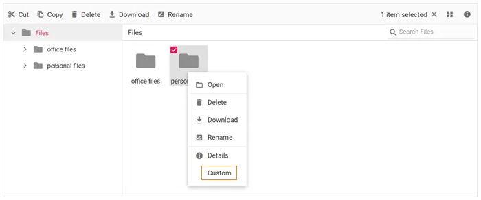

# Adding Custom Item to Context Menu in Blazor File Manager Component

The context menu can be customized using the [`ContextMenuSettings`](https://help.syncfusion.com/cr/blazor/Syncfusion.Blazor.FileManager.FileManagerContextMenuSettings.html), [`MenuOpened`](https://help.syncfusion.com/cr/blazor/Syncfusion.Blazor.FileManager.FileManagerEvents-1.html#Syncfusion_Blazor_FileManager_FileManagerEvents_1_MenuOpened), and [`OnMenuClick`](https://help.syncfusion.com/cr/blazor/Syncfusion.Blazor.FileManager.FileManagerEvents-1.html#Syncfusion_Blazor_FileManager_FileManagerEvents_1_OnMenuClick) events. Additionally, the File Manager component provides [`DisableMenuItems()`](https://help.syncfusion.com/cr/blazor/Syncfusion.Blazor.FileManager.SfFileManager-1.html#Syncfusion_Blazor_FileManager_SfFileManager_1_DisableMenuItems_System_String___) and [`EnableMenuItems()`](https://help.syncfusion.com/cr/blazor/Syncfusion.Blazor.FileManager.SfFileManager-1.html#Syncfusion_Blazor_FileManager_SfFileManager_1_EnableMenuItems_System_String___) methods for dynamic menu item management based on application logic and user permissions. For detailed information about context menu properties, refer to the [Context Menu documentation](../context-menu.md).

## Adding Custom Menu Items

The following example shows adding a custom item in the context menu. The `ContextMenuSettings` is used to add new menu item. The [`MenuOpened`](https://help.syncfusion.com/cr/blazor/Syncfusion.Blazor.FileManager.FileManagerEvents-1.html#Syncfusion_Blazor_FileManager_FileManagerEvents_1_MenuOpened) event is used to add the icon to the new menu item. The [`OnMenuClick`](https://help.syncfusion.com/cr/blazor/Syncfusion.Blazor.FileManager.FileManagerEvents-1.html#Syncfusion_Blazor_FileManager_FileManagerEvents_1_OnMenuClick) event is used to add an event handler to the new menu item.

```cshtml

@using Syncfusion.Blazor.FileManager

<SfFileManager TValue="FileManagerDirectoryContent" @ref="FileManager">
    <FileManagerEvents TValue="FileManagerDirectoryContent"></FileManagerEvents>
    <FileManagerAjaxSettings Url="https://ej2-aspcore-service.azurewebsites.net/api/FileManager/FileOperations"
                             UploadUrl="https://ej2-aspcore-service.azurewebsites.net/api/FileManager/Upload"
                             DownloadUrl="https://ej2-aspcore-service.azurewebsites.net/api/FileManager/Download"
                             GetImageUrl="https://ej2-aspcore-service.azurewebsites.net/api/FileManager/GetImage">
    </FileManagerAjaxSettings>
    <FileManagerContextMenuSettings File="@Items" Folder="@Items" Layout="@Items"></FileManagerContextMenuSettings>
    <FileManagerEvents TValue="FileManagerDirectoryContent" MenuOpened="MenuOpened" OnMenuClick="OnMenuClick"></FileManagerEvents>
</SfFileManager>

@code {
    SfFileManager<FileManagerDirectoryContent>? FileManager;
    // Define custom menu items by adding "Custom" to the items array
    public string[] Items = new string[] { "NewFolder", "Upload", "Delete", "Download", "Rename", "SortBy", "Refresh", "Selection", "View", "Details", "Custom" };
    public void MenuOpened(MenuOpenEventArgs<FileManagerDirectoryContent> args)
    {
        // Customize the appearance of the custom menu item when the context menu opens
        for(int i=0; i < args.Items.Count(); i++)
        {
            if (args.Items[i].Id == FileManager?.ID + "_cm_custom")
            {
                args.Items[i].IconCss = "e-icons e-fe-tick";
            }
        }
    }
    public void OnMenuClick(MenuClickEventArgs<FileManagerDirectoryContent> args)
    {
        // Handle custom menu item clicks here
    }
}

<style>
    .e-fe-tick::before {
        content: '\e614';
    }
</style> 

```
## Run the application

After successful compilation of your application, simply press `F5` to run the application.



## Handling Custom Menu Item Clicks

The [`OnMenuClick`](https://help.syncfusion.com/cr/blazor/Syncfusion.Blazor.FileManager.FileManagerEvents-1.html#Syncfusion_Blazor_FileManager_FileManagerEvents_1_OnMenuClick) event fires when a user selects a context menu item. This event receives the `MenuClickEventArgs` object, which provides access to the clicked menu item through the `Item` property and file/folder details through the `FileDetails` property. This allows developers to implement custom business logic based on the clicked menu item and the context in which it was clicked.

The following example shows how to handle context menu item clicks and execute custom actions such as selecting all files:

```cshtml
@using Syncfusion.Blazor.FileManager

<SfFileManager TValue="FileManagerDirectoryContent" @ref="fileManager">
    <FileManagerAjaxSettings Url="https://ej2-aspcore-service.azurewebsites.net/api/FileManager/FileOperations"
                             UploadUrl="https://ej2-aspcore-service.azurewebsites.net/api/FileManager/Upload"
                             DownloadUrl="https://ej2-aspcore-service.azurewebsites.net/api/FileManager/Download"
                             GetImageUrl="https://ej2-aspcore-service.azurewebsites.net/api/FileManager/GetImage">
    </FileManagerAjaxSettings>
    <FileManagerContextMenuSettings File="@Items" Folder="@Items" Layout="@Items"></FileManagerContextMenuSettings>
    <FileManagerEvents TValue="FileManagerDirectoryContent" OnMenuClick="OnMenuClick"></FileManagerEvents>
</SfFileManager>

@code {
    SfFileManager<FileManagerDirectoryContent> fileManager;
    public string[] Items = new string[] { "Open", "|", "Delete", "Download", "Rename", "|", "Details", "SelectAll" };

    public async void OnMenuClick(MenuClickEventArgs<FileManagerDirectoryContent> args)
    {
        if (args.Item.Text == "SelectAll")
        {
            await fileManager.SelectAllAsync();
        }
    }
}
```

## Enabling and Disabling Menu Items

The File Manager component provides methods to programmatically control context menu item visibility and accessibility. These methods allow dynamic management of menu item states based on application logic, user permissions, or file characteristics.

### DisableMenuItems Method

The [`DisableMenuItems()`](https://help.syncfusion.com/cr/blazor/Syncfusion.Blazor.FileManager.SfFileManager-1.html#Syncfusion_Blazor_FileManager_SfFileManager_1_DisableMenuItems_System_String___) method disables specified context menu items in the File Manager component, making them non-interactive (grayed out). This is useful when certain operations should not be available based on the current context, user permissions, or application state.

The following example demonstrates how to disable specific menu items. In this case, the `DisableMenuItems()` method is called within the `MenuOpened` event to restrict Delete and Rename operations:

```cshtml
@using Syncfusion.Blazor.FileManager

<SfFileManager TValue="FileManagerDirectoryContent" @ref="FileManager">
    <FileManagerAjaxSettings Url="https://ej2-aspcore-service.azurewebsites.net/api/FileManager/FileOperations"
                             UploadUrl="https://ej2-aspcore-service.azurewebsites.net/api/FileManager/Upload"
                             DownloadUrl="https://ej2-aspcore-service.azurewebsites.net/api/FileManager/Download"
                             GetImageUrl="https://ej2-aspcore-service.azurewebsites.net/api/FileManager/GetImage">
    </FileManagerAjaxSettings>
    <FileManagerContextMenuSettings File="@Items" Folder="@Items"></FileManagerContextMenuSettings>
    <FileManagerEvents TValue="FileManagerDirectoryContent" MenuOpened="OnMenuOpened"></FileManagerEvents>
</SfFileManager>

@code {
    SfFileManager<FileManagerDirectoryContent> FileManager;
    public string[] Items = new string[] { "Open", "|", "Delete", "Download", "Rename", "|", "Custom" };

    public void OnMenuOpened(MenuOpenEventArgs<FileManagerDirectoryContent> args)
    {
        FileManager.DisableMenuItems(new string[] { "Delete", "Rename" });  
    }
}
```

### EnableMenuItems Method

The [`EnableMenuItems()`](https://help.syncfusion.com/cr/blazor/Syncfusion.Blazor.FileManager.SfFileManager-1.html#Syncfusion_Blazor_FileManager_SfFileManager_1_EnableMenuItems_System_String___) method enables specified context menu items in the File Manager component, making them interactive (active). This method is used to restore menu item functionality after previously disabling them or to conditionally show items based on state changes.

The following example demonstrates a common pattern: disabling menu items via a button click, then automatically re-enabling them when the context menu is opened again:

```cshtml
@using Syncfusion.Blazor.FileManager

<button @onclick="DisableMenuItems" class="e-btn">Disable Menu Items</button>

<SfFileManager TValue="FileManagerDirectoryContent" @ref="FileManager">
    <FileManagerAjaxSettings Url="https://ej2-aspcore-service.azurewebsites.net/api/FileManager/FileOperations"
                             UploadUrl="https://ej2-aspcore-service.azurewebsites.net/api/FileManager/Upload"
                             DownloadUrl="https://ej2-aspcore-service.azurewebsites.net/api/FileManager/Download"
                             GetImageUrl="https://ej2-aspcore-service.azurewebsites.net/api/FileManager/GetImage">
    </FileManagerAjaxSettings>
    <FileManagerContextMenuSettings File="@Items" Folder="@Items"></FileManagerContextMenuSettings>
    <FileManagerEvents TValue="FileManagerDirectoryContent" MenuOpened="OnMenuOpened"></FileManagerEvents>
</SfFileManager>

@code {
    SfFileManager<FileManagerDirectoryContent> FileManager;
    public string[] Items = new string[] { "Open", "|", "Delete", "Download", "Rename", "|", "Details" };

    public void DisableMenuItems()
    {
        // Disable Delete, Rename, and Download menu items when button is clicked
        FileManager.DisableMenuItems(new string[] { "Delete", "Rename", "Download" });
    }

    public void OnMenuOpened(MenuOpenEventArgs<FileManagerDirectoryContent> args)
    {
        // Re-enable menu items when context menu opens
        FileManager.EnableMenuItems(new string[] { "Delete", "Rename", "Download" });
    }
}
```

## Conditional Menu Item Management

Menu items can be dynamically controlled based on file properties, allowing different menu options for files versus folders. The following example demonstrates enabling or disabling menu items conditionally based on whether the selected item is a file or folder:

```cshtml
@using Syncfusion.Blazor.FileManager

<SfFileManager TValue="FileManagerDirectoryContent" @ref="FileManager">
    <FileManagerAjaxSettings Url="https://ej2-aspcore-service.azurewebsites.net/api/FileManager/FileOperations"
                             UploadUrl="https://ej2-aspcore-service.azurewebsites.net/api/FileManager/Upload"
                             DownloadUrl="https://ej2-aspcore-service.azurewebsites.net/api/FileManager/Download"
                             GetImageUrl="https://ej2-aspcore-service.azurewebsites.net/api/FileManager/GetImage">
    </FileManagerAjaxSettings>
    <FileManagerContextMenuSettings File="@FileItems" Folder="@FolderItems"></FileManagerContextMenuSettings>
    <FileManagerEvents TValue="FileManagerDirectoryContent" MenuOpened="OnMenuOpened"></FileManagerEvents>
</SfFileManager>

@code {
    SfFileManager<FileManagerDirectoryContent> FileManager;
    public string[] FileItems = new string[] { "Delete", "Download", "Rename", "|", "Details", "Compress", "Archive" };
    public string[] FolderItems = new string[] { "Open", "|", "Delete", "Rename", "|", "Details", "Archive", "Compress" };

    public void OnMenuOpened(MenuOpenEventArgs<FileManagerDirectoryContent> args)
    {
        if (args.MenuType == "File")
        {
            // For files: disable archive, enable compress
            FileManager.DisableMenuItems(new string[] { "Archive" });
            FileManager.EnableMenuItems(new string[] { "Compress" });
        }
        else if (args.MenuType == "Folder")
        {
            // For folders: disable compress, enable archive
            FileManager.DisableMenuItems(new string[] { "Compress" });
            FileManager.EnableMenuItems(new string[] { "Archive" });
        }
    }
}
```

### GetMenuItemIndex Method

The [`GetMenuItemIndex()`](https://help.syncfusion.com/cr/blazor/Syncfusion.Blazor.FileManager.SfFileManager-1.html#Syncfusion_Blazor_FileManager_SfFileManager_1_GetMenuItemIndex_System_String_) method returns the index position of a specified context menu item in the File Manager component. This method is useful for programmatically identifying the position of menu items, which can be used for advanced menu manipulation, insertion of items at specific positions, or for dynamically managing menu item order based on application requirements.

The method returns the zero-based index position of the specified menu item, or `-1` if the item is not found in the context menu.

The following example demonstrates retrieving the index position of menu items. The `GetMenuItemIndex()` method is used to determine where specific menu items are located, which helps in programmatic menu management.

```cshtml
@using Syncfusion.Blazor.FileManager

<div>@IndexMessage</div>

<SfFileManager TValue="FileManagerDirectoryContent" @ref="FileManager">
    <FileManagerAjaxSettings Url="https://ej2-aspcore-service.azurewebsites.net/api/FileManager/FileOperations"
                             UploadUrl="https://ej2-aspcore-service.azurewebsites.net/api/FileManager/Upload"
                             DownloadUrl="https://ej2-aspcore-service.azurewebsites.net/api/FileManager/Download"
                             GetImageUrl="https://ej2-aspcore-service.azurewebsites.net/api/FileManager/GetImage">
    </FileManagerAjaxSettings>
    <FileManagerContextMenuSettings File="@Items" Folder="@Items"></FileManagerContextMenuSettings>
    <FileManagerEvents TValue="FileManagerDirectoryContent" MenuOpened="OnMenuOpened"></FileManagerEvents>

</SfFileManager>

@code {
    SfFileManager<FileManagerDirectoryContent> FileManager;
    public string IndexMessage = "";
    public string[] Items = new string[] { "Open", "|", "Delete", "Download", "Rename", "|", "Details" };

    public void OnMenuOpened(MenuOpenEventArgs<FileManagerDirectoryContent> args)
    {
        // Get the index position of the Delete menu item
        int deleteIndex = FileManager.GetMenuItemIndex("Delete");

        if (deleteIndex != -1)
        {
            IndexMessage = $"Delete menu item is at index position: {deleteIndex}";
        }
        else
        {
            IndexMessage = "Delete menu item not found";
        }
    }
}
```