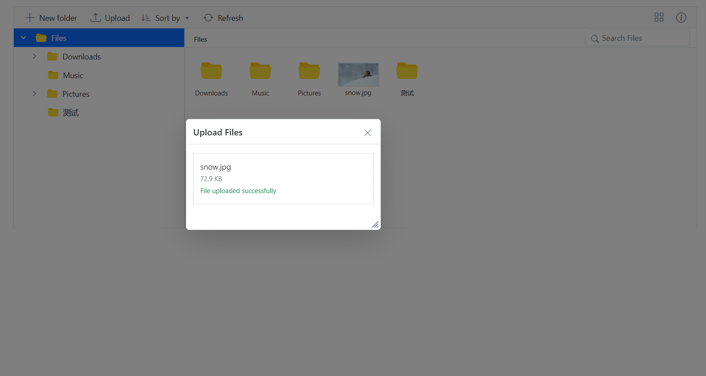

# Customizing the FileManager dialog popup

In the Blazor FileManager component, it is possible to set the target element using the [PopupTarget](https://help.syncfusion.com/cr/blazor/Syncfusion.Blazor.FileManager.SfFileManager-1.html#Syncfusion_Blazor_FileManager_SfFileManager_1_PopupTarget) property, where the FileManager's dialog will be displayed.


In the following example, we have set the target element to the body. Therefore, the FileManager's dialog popup will be displayed in the body element. If the target element cannot be found, the dialog will be displayed within the FileManager element.


```cshtml
@using Syncfusion.Blazor.FileManager

<SfFileManager TValue="FileManagerDirectoryContent" AllowMultiSelection="false" PopupTarget="BODY">
    <FileManagerAjaxSettings Url="https://ej2-aspcore-service.azurewebsites.net/api/FileManager/FileOperations"
                             UploadUrl="https://ej2-aspcore-service.azurewebsites.net/api/FileManager/Upload"
                             DownloadUrl="https://ej2-aspcore-service.azurewebsites.net/api/FileManager/Download"
                             GetImageUrl="https://ej2-aspcore-service.azurewebsites.net/api/FileManager/GetImage">
    </FileManagerAjaxSettings>
</SfFileManager>

```

## Run the application

After successful compilation of your application, simply press `F5` to run the application.

