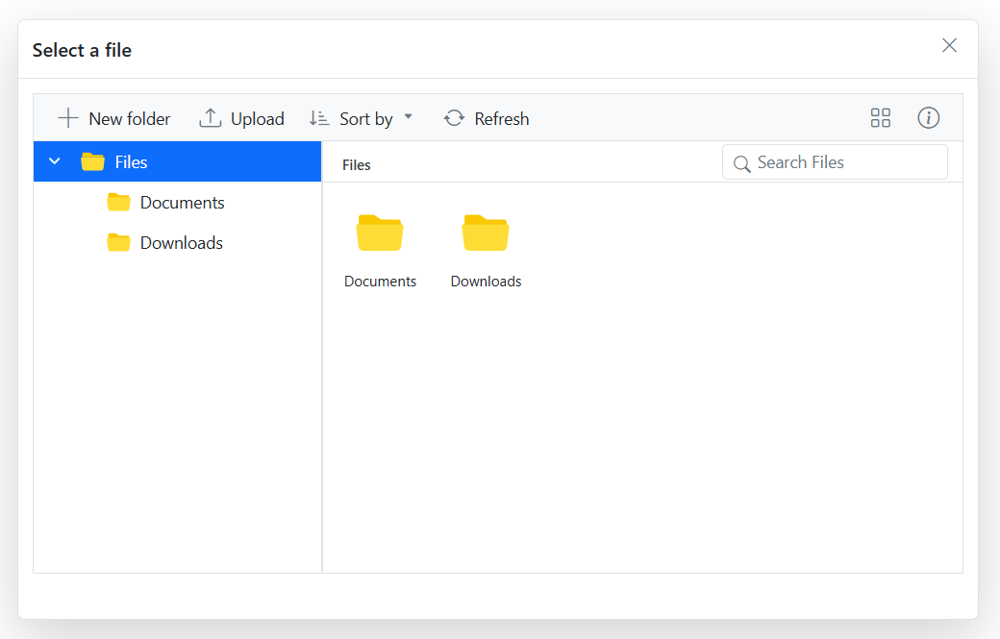

# Adding File Manager inside the Dialog

You can integrate the Blazor File Manager flat data sample within the SfDialog component using the [RefreshLayoutAsync](https://help.syncfusion.com/cr/blazor/Syncfusion.Blazor.FileManager.SfFileManager-1.html#Syncfusion_Blazor_FileManager_SfFileManager_1_RefreshLayoutAsync) method in the [Opened](https://help.syncfusion.com/cr/blazor/Syncfusion.Blazor.Popups.DialogEvents.html#Syncfusion_Blazor_Popups_DialogEvents_Opened) event. This ensures that the File Manager's layout is correctly initialized after the dialog is displayed.

The following example shows how to render the SfFileManager component inside the SfDialog component:

```cshtml

@using Syncfusion.Blazor.Popups
@using Syncfusion.Blazor.FileManager

<SfDialog Width="800px" Height="500px" ShowCloseIcon="true" Visible="true">
    <DialogTemplates>
        <Header>Select a file</Header>
        <Content>
            <SfFileManager @ref="FileManager" TValue="FileManagerDirectoryContent">
                <FileManagerEvents TValue="FileManagerDirectoryContent" OnRead="OnReadAsync"></FileManagerEvents>
            </SfFileManager>
        </Content>
    </DialogTemplates>
    <DialogEvents Opened="@DialogOpened"></DialogEvents>
</SfDialog>

@code {
    private SfFileManager<FileManagerDirectoryContent> FileManager;

    private async Task DialogOpened()
    {
        await FileManager.RefreshLayoutAsync();
    }

    private List<FileManagerDirectoryContent> Data { get; set; }

    protected override void OnInitialized()
    {
        Data = GetData();
    }

    private async Task OnReadAsync(ReadEventArgs<FileManagerDirectoryContent> args)
    {
        string path = args.Path;
        List<FileManagerDirectoryContent> fileDetails = args.Folder;
        var response = new FileManagerResponse<FileManagerDirectoryContent>();

        if (path == "/")
        {
            string parentId = Data
                .Where(x => string.IsNullOrEmpty(x.ParentId))
                .Select(x => x.Id)
                .First();

            response.CWD = Data
                .First(x => string.IsNullOrEmpty(x.ParentId));
            
            response.Files = Data
                .Where(x => x.ParentId == parentId)
                .ToList();
        }
        else
        {
            var childItem = fileDetails.Count > 0 && fileDetails[0] != null
                ? fileDetails[0]
                : Data.First(x => x.FilterPath == path);

            response.CWD = childItem;
            response.Files = Data
                .Where(x => x.ParentId == childItem.Id)
                .ToList();
        }

        await Task.Yield();
        args.Response = response;
    }

    private List<FileManagerDirectoryContent> GetData()
    {
        return new List<FileManagerDirectoryContent>
        {
            new FileManagerDirectoryContent
            {
                CaseSensitive = false,
                DateCreated = new DateTime(2022, 1, 2),
                DateModified = new DateTime(2022, 2, 3),
                FilterPath = "",
                FilterId = "",
                HasChild = true,
                Id = "0",
                IsFile = false,
                Name = "Files",
                ParentId = null,
                ShowHiddenItems = false,
                Size = 1779448,
                Type = "folder"
            },
            new FileManagerDirectoryContent
            {
                CaseSensitive = false,
                DateCreated = new DateTime(2022, 1, 2),
                DateModified = new DateTime(2022, 2, 3),
                FilterId = "0/",
                FilterPath = "/",
                HasChild = false,
                Id = "1",
                IsFile = false,
                Name = "Documents",
                ParentId = "0",
                ShowHiddenItems = false,
                Size = 680786,
                Type = "folder"
            },
            new FileManagerDirectoryContent
            {
                CaseSensitive = false,
                DateCreated = new DateTime(2022, 1, 2),
                DateModified = new DateTime(2022, 2, 3),
                FilterId = "0/",
                FilterPath = "/",
                HasChild = false,
                Id = "2",
                IsFile = false,
                Name = "Downloads",
                ParentId = "0",
                ShowHiddenItems = false,
                Size = 6172,
                Type = "folder"
            },
            new FileManagerDirectoryContent
            {
                CaseSensitive = false,
                DateCreated = new DateTime(2022, 1, 2),
                DateModified = new DateTime(2022, 2, 3),
                FilterId = "0/1/",
                FilterPath = "/Documents/",
                HasChild = false,
                Id = "5",
                IsFile = true,
                Name = "EJ2 File Manager.docx",
                ParentId = "1",
                ShowHiddenItems = false,
                Size = 12403,
                Type = ".docx"
            },
            new FileManagerDirectoryContent
            {
                CaseSensitive = false,
                DateCreated = new DateTime(2022, 1, 2),
                DateModified = new DateTime(2022, 2, 3),
                FilterId = "0/1/",
                FilterPath = "/Documents/",
                HasChild = false,
                Id = "6",
                IsFile = true,
                Name = "EJ2 File Manager.pdf",
                ParentId = "1",
                ShowHiddenItems = false,
                Size = 90099,
                Type = ".pdf"
            }
        };
    }
}

```

