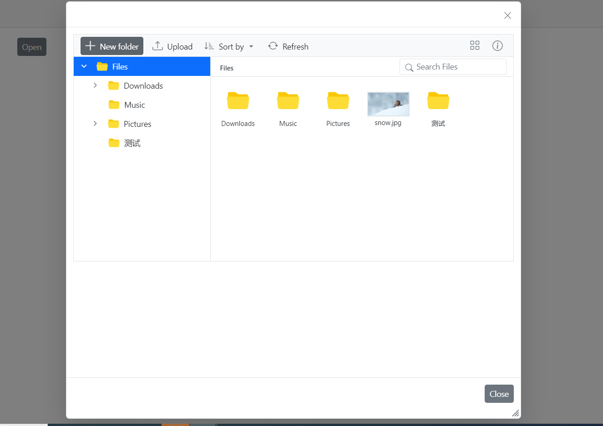

# Rendering the FileManager within the Dialog component

The following example demonstrates rendering the FileManager component within the Dialog. When the button is clicked, the Dialog popup opens and the FileManager component is rendered inside it. To adjust the available space in the Dialog component, the FileManager component needs to be refreshed inside the Dialog's `Opened` event.


```cshtml
@using Syncfusion.Blazor.FileManager
@using Syncfusion.Blazor.Popups;
@using Syncfusion.Blazor.Buttons;

<SfButton OnClick="BtnClicked">Open</SfButton>

@{ 
    if (ShowImageUploadModal)
    {
        <SfDialog Width=800 Height=800 ShowCloseIcon="true" IsModal="true" AllowDragging="true" EnableResize="true">
            <DialogTemplates>
                <Content>
                    <SfFileManager @ref="filemanager" TValue="FileManagerDirectoryContent">
                        <FileManagerAjaxSettings Url="https://ej2-aspcore-service.azurewebsites.net/api/FileManager/FileOperations"
                                UploadUrl="https://ej2-aspcore-service.azurewebsites.net/api/FileManager/Upload"
                                DownloadUrl="https://ej2-aspcore-service.azurewebsites.net/api/FileManager/Download"
                                GetImageUrl="https://ej2-aspcore-service.azurewebsites.net/api/FileManager/GetImage">
                        </FileManagerAjaxSettings>
                    </SfFileManager>
                </Content>
            </DialogTemplates>
            <DialogEvents Opened="@AfterOpen"  />
            <DialogButtons>
                <DialogButton Content="Close" IsPrimary="false" OnClick="(() => { ShowImageUploadModal = false; })" />
            </DialogButtons>
        </SfDialog>
    }
}

@code
 {
    SfFileManager<FileManagerDirectoryContent> filemanager;
    bool ShowImageUploadModal = false;
    void BtnClicked()
    {
        ShowImageUploadModal = !ShowImageUploadModal;
    }
    public void AfterOpen()
    {
        filemanager.RefreshLayoutAsync();
    }
}
```


## Run the application

After successful compilation of your application, simply press `F5` to run the application.

