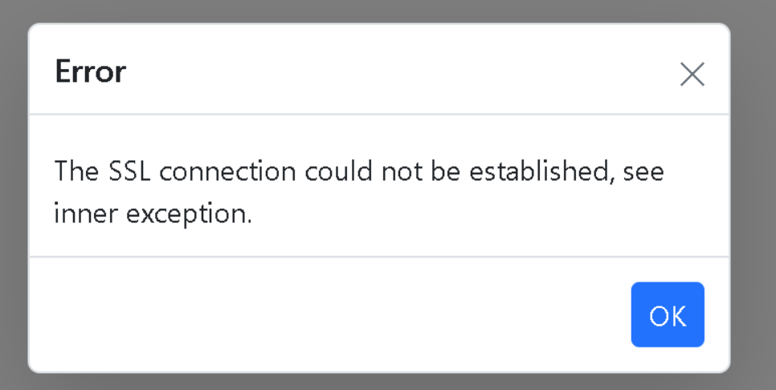

# Resolve the SSL connection error in the FileMnager

The SSL connection issue usually occurs due to the browser’s security policy. HTTPS requests without an SSL certificate will get rejected and cause the reported error. To overcome the issue, you can use the HTTP URL instead of HTTPS and remove the **app.UseHttpsRedirection()** (which forces convert HTTP URLs into HTTPS) in `Startup.cs` file.

