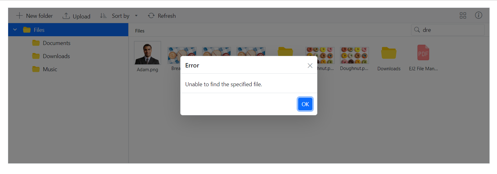

# Throw an exception in the event of a search operation failure

To throw an exception in the event of a search operation failure, you need to call the `FileNotFoundException` and return a message when the searched file is not found in the FileManager component. Add the below code changes in your `PhysicalFileProvider.cs` file.

```csharp
public virtual FileManagerResponse Search(string path, string searchString, bool showHiddenItems = false, bool caseSensitive = false, params FileManagerDirectoryContent[] data)
    {
        FileManagerResponse searchResponse = new FileManagerResponse();
        try
        {
            ...
            searchResponse.Files = (IEnumerable<FileManagerDirectoryContent>)foundedFiles;
            if (searchResponse.Files.Count() == 0)
            {
                throw new FileNotFoundException();
            }
            else
            {
                return searchResponse;
            }

        }
        catch (Exception e)
        {
           ...
        }
}
```

Then refresh the FileManager component files and folders using the [RefreshFilesAsync](https://help.syncfusion.com/cr/blazor/Syncfusion.Blazor.FileManager.SfFileManager-1.html#Syncfusion_Blazor_FileManager_SfFileManager_1_RefreshFilesAsync) method inside the [PopupClosed](https://help.syncfusion.com/cr/blazor/Syncfusion.Blazor.FileManager.FileManagerEvents-1.html#Syncfusion_Blazor_FileManager_FileManagerEvents_1_PopupClosed) event.

```csharp
@using Syncfusion.Blazor.FileManager

<SfFileManager @ref="filemanager" TValue="FileManagerDirectoryContent">
    <FileManagerAjaxSettings Url="https://ej2-aspcore-service.azurewebsites.net/api/FileManager/FileOperations"
                             UploadUrl="https://ej2-aspcore-service.azurewebsites.net/api/FileManager/Upload"
                             DownloadUrl="https://ej2-aspcore-service.azurewebsites.net/api/FileManager/Download"
                             GetImageUrl="https://ej2-aspcore-service.azurewebsites.net/api/FileManager/GetImage">
    </FileManagerAjaxSettings>
    <FileManagerEvents TValue="FileManagerDirectoryContent" PopupClosed="@refreshFileManager" ></FileManagerEvents>
</SfFileManager>

@code {
    SfFileManager<FileManagerDirectoryContent>  filemanager;
    public async Task refreshFileManager(PopupOpenCloseEventArgs args)
    {
        if(args.PopupName =="Error") {
            await Task.Delay(100);
            filemanager.RefreshFilesAsync();
        }
    }
}
```

## Output

After successful compilation of your application, simply press `F5` to run the application.



