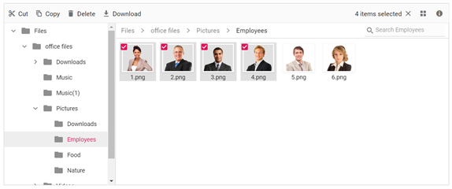

# Multiple File Selection

The file manager allows you to select multiple files by enabling the `AllowMultiSelection` property (enabled by default). The multiple selection can be done by pressing the `Ctrl` key or `Shift` key and selecting the files. The check box can also be used to do multiple selection. `Ctrl + A` can be used to select all files in the current directory. The `FileSelected` event will be triggered when the items of file manager control is selected or unselected.

```csharp

@using Syncfusion.Blazor.FileManager

    <SfFileManager AllowMultiSelection="true" TValue="FileManagerDirectoryContent">
        <FileManagerAjaxSettings  Url="/api/SampleData/FileOperations"
                                 UploadUrl="/api/SampleData/Upload"
                                 DownloadUrl="/api/SampleData/Download"
                                 GetImageUrl="/api/SampleData/GetImage">
        </FileManagerAjaxSettings>
    </SfFileManager>

```

## Output

After successful compilation of your application, simply press `F5` to run the application.

Output be like the below.

