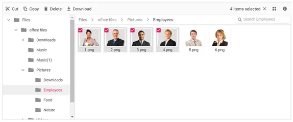

# Multiple File Selection in Blazor File Manager Component

The File Manager allows you to select multiple files and folders by enabling the [`AllowMultiSelection`](https://help.syncfusion.com/cr/blazor/Syncfusion.Blazor.FileManager.SfFileManager-1.html#Syncfusion_Blazor_FileManager_SfFileManager_1_AllowMultiSelection) property, which is enabled by default. Hold `Ctrl` or `Shift` while selecting items, use the check boxes, or press `Ctrl + A` to select all items in the current directory. The [`FileSelected`](https://help.syncfusion.com/cr/blazor/Syncfusion.Blazor.FileManager.FileManagerEvents-1.html#Syncfusion_Blazor_FileManager_FileManagerEvents_1_FileSelected) event is triggered when an item is selected or unselected.

The examples use Syncfusion-hosted sample services. To configure a local backend, see [Data Binding](https://blazor.syncfusion.com/documentation/file-manager/data-binding).

```cshtml

@using Syncfusion.Blazor.FileManager

<SfFileManager AllowMultiSelection="true" TValue="FileManagerDirectoryContent">
    <FileManagerAjaxSettings Url="https://physical-service.syncfusion.com/api/FileManager/FileOperations"
                         UploadUrl="https://physical-service.syncfusion.com/api/FileManager/Upload"
                         DownloadUrl="https://physical-service.syncfusion.com/api/FileManager/Download"
                         GetImageUrl="https://physical-service.syncfusion.com/api/FileManager/GetImage">
</FileManagerAjaxSettings>
</SfFileManager>

```

## Output

After successful compilation of your application, simply press `F5` to run the application.




## Getting Selected Files

In the Blazor File Manager component, you can retrieve the details of the selected files or folders using the [GetSelectedFiles](https://help.syncfusion.com/cr/blazor/Syncfusion.Blazor.FileManager.SfFileManager-1.html#Syncfusion_Blazor_FileManager_SfFileManager_1_GetSelectedFiles) method. 

Additionally, you can obtain these details through the [FileDetails](https://help.syncfusion.com/cr/blazor/Syncfusion.Blazor.FileManager.FileSelectionEventArgs-1.html#Syncfusion_Blazor_FileManager_FileSelectionEventArgs_1_FileDetails) argument of the [FileSelection](https://help.syncfusion.com/cr/blazor/Syncfusion.Blazor.FileManager.FileManagerEvents-1.html#Syncfusion_Blazor_FileManager_FileManagerEvents_1_FileSelection) event.

```cshtml

@using Syncfusion.Blazor.FileManager
@using Syncfusion.Blazor.Buttons

<SfButton OnClick="GetSelectedFiles">ClickToGetSelectedFiles</SfButton>
<SfFileManager @ref="FileManager" AllowMultiSelection="false" TValue="FileManagerDirectoryContent">
        <FileManagerAjaxSettings Url="https://physical-service.syncfusion.com/api/FileManager/FileOperations"
                                 UploadUrl="https://physical-service.syncfusion.com/api/FileManager/Upload"
                                 DownloadUrl="https://physical-service.syncfusion.com/api/FileManager/Download"
                                 GetImageUrl="https://physical-service.syncfusion.com/api/FileManager/GetImage">
        </FileManagerAjaxSettings>
        <FileManagerEvents TValue="FileManagerDirectoryContent" FileSelection="FileSelection"></FileManagerEvents>
</SfFileManager>

@code {
    SfFileManager<FileManagerDirectoryContent>? FileManager;
    public void FileSelection(FileSelectionEventArgs<FileManagerDirectoryContent> args)
    {
        var SelectedFiles = args.FileDetails;
    }
    List<FileManagerDirectoryContent> SelectedFiles = new List<FileManagerDirectoryContent>();
    public void GetSelectedFiles()
    {
        SelectedFiles = this.FileManager?.GetSelectedFiles();
    }
}

```

## Prevent Selection for Specific Files/Folders

In the Blazor File Manager component, you are able to prevent selection of specific files or folders by setting the [FileSelection](https://help.syncfusion.com/cr/blazor/Syncfusion.Blazor.FileManager.FileManagerEvents-1.html#Syncfusion_Blazor_FileManager_FileManagerEvents_1_FileSelection) event's [Cancel](https://help.syncfusion.com/cr/blazor/Syncfusion.Blazor.FileManager.FileSelectionEventArgs-1.html#Syncfusion_Blazor_FileManager_FileSelectionEventArgs_1_Cancel) argument value to **true**. 

For example, in the following example, selection is prevented for the **Music** folder.


```cshtml

@using Syncfusion.Blazor.FileManager

<SfFileManager TValue="FileManagerDirectoryContent">
        <FileManagerAjaxSettings Url="https://physical-service.syncfusion.com/api/FileManager/FileOperations"
                                 UploadUrl="https://physical-service.syncfusion.com/api/FileManager/Upload"
                                 DownloadUrl="https://physical-service.syncfusion.com/api/FileManager/Download"
                                 GetImageUrl="https://physical-service.syncfusion.com/api/FileManager/GetImage">
        </FileManagerAjaxSettings>
        <FileManagerEvents TValue="FileManagerDirectoryContent" FileSelection="FileSelection"></FileManagerEvents>
</SfFileManager>

@code {
    public void FileSelection(FileSelectionEventArgs<FileManagerDirectoryContent> args)
    {
        if (args.FileDetails.Name=="Music")
        {
            args.Cancel = true;
        }
    }
}

```

## Range Selection

The File Manager supports selecting files and folders in a range by dragging across the file and folder list, similar to File Explorer. This is useful when selecting a large group of items without clicking each one individually.

### Enabling Range Selection

To enable range selection, you need to set the [EnableRangeSelection](https://help.syncfusion.com/cr/blazor/Syncfusion.Blazor.FileManager.SfFileManager-1.html#Syncfusion_Blazor_FileManager_SfFileManager_1_EnableRangeSelection) property to `true` and ensure that multi-selection is allowed using the [AllowMultiSelection](https://help.syncfusion.com/cr/blazor/Syncfusion.Blazor.FileManager.SfFileManager-1.html#Syncfusion_Blazor_FileManager_SfFileManager_1_AllowMultiSelection) property.

````cshtml
@using Syncfusion.Blazor.FileManager;
<div class="control-section">
    <div class="control_wrapper">
        <SfFileManager @ref="File" TValue="FileManagerDirectoryContent" AllowMultiSelection="true" EnableRangeSelection="true">
            <FileManagerAjaxSettings Url="https://amazon-service.syncfusion.com/AmazonS3Fileoperations"
                                     UploadUrl="https://amazon-service.syncfusion.com/AmazonS3Upload"
                                     DownloadUrl="https://amazon-service.syncfusion.com/AmazonS3Download"
                                     GetImageUrl="https://amazon-service.syncfusion.com/AmazonS3GetImage">
            </FileManagerAjaxSettings>
        </SfFileManager>
    </div>
</div>
````

## Events

The Blazor File Manager component includes the `FileSelection` and `FileSelected` events. `FileSelection` is triggered before an item is selected and can be canceled; `FileSelected` is triggered when an item is selected or unselected. Bind these events using the **FileManagerEvents** component and provide **TValue**.

N> All the events should be provided in a single **FileManagerEvents** component.

### FileSelection

The [FileSelection](https://help.syncfusion.com/cr/blazor/Syncfusion.Blazor.FileManager.FileManagerEvents-1.html#Syncfusion_Blazor_FileManager_FileManagerEvents_1_FileSelection) event of the Blazor File Manager component is triggered before a file or folder is selected.

```cshtml

@using Syncfusion.Blazor.FileManager

<SfFileManager TValue="FileManagerDirectoryContent">
    <FileManagerAjaxSettings Url="https://physical-service.syncfusion.com/api/FileManager/FileOperations"
                             UploadUrl="https://physical-service.syncfusion.com/api/FileManager/Upload"
                             DownloadUrl="https://physical-service.syncfusion.com/api/FileManager/Download"
                             GetImageUrl="https://physical-service.syncfusion.com/api/FileManager/GetImage">
    </FileManagerAjaxSettings>
    <FileManagerEvents TValue="FileManagerDirectoryContent" FileSelection="FileSelection">
    </FileManagerEvents>
</SfFileManager>

@code {
    public void FileSelection(FileSelectionEventArgs<FileManagerDirectoryContent> args)
    {
        // Here, you can customize your code.
    }
}

```

### FileSelected

The [FileSelected](https://help.syncfusion.com/cr/blazor/Syncfusion.Blazor.FileManager.FileManagerEvents-1.html#Syncfusion_Blazor_FileManager_FileManagerEvents_1_FileSelected) event of the Blazor File Manager component is triggered when the file or folder is selected or unselected.

```cshtml

@using Syncfusion.Blazor.FileManager

<SfFileManager TValue="FileManagerDirectoryContent">
    <FileManagerAjaxSettings Url="https://physical-service.syncfusion.com/api/FileManager/FileOperations"
                             UploadUrl="https://physical-service.syncfusion.com/api/FileManager/Upload"
                             DownloadUrl="https://physical-service.syncfusion.com/api/FileManager/Download"
                             GetImageUrl="https://physical-service.syncfusion.com/api/FileManager/GetImage">
    </FileManagerAjaxSettings>
    <FileManagerEvents TValue="FileManagerDirectoryContent" FileSelected="FileSelected"></FileManagerEvents>
</SfFileManager>

@code {
    public void FileSelected(FileSelectEventArgs<FileManagerDirectoryContent> args)
    {
        // Here, you can customize your code.
    }
}

```