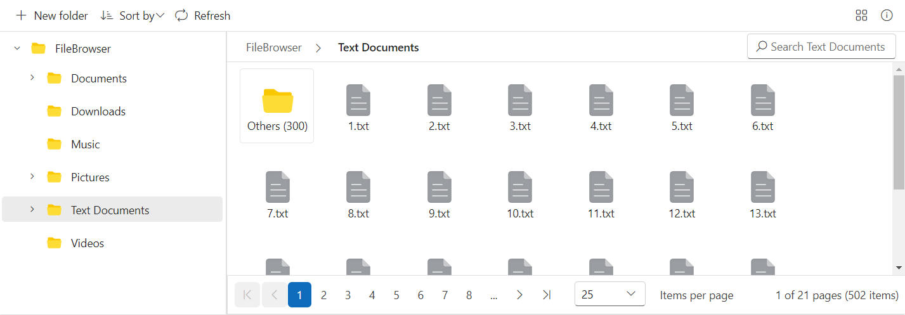

---
layout: post
title: Pagination in Blazor FileManager Component | Syncfusion
description: Checkout and learn here all about Pagination in the Syncfusion Blazor FileManager component and more.
platform: Blazor
control: File Manager
documentation: ug
---

# Pagination in Blazor FileManager Component

Pagination in the Blazor File Manager component optimizes the performance and user experience by loading only a specified number of files and folders per page. This feature significantly improves performance when managing large datasets, reducing load times and enhancing interaction.

## Enabling Pagination

To enable pagination in the File Manager, set the [AllowPaging](https://help.syncfusion.com/cr/blazor/Syncfusion.Blazor.FileManager.SfFileManager-1.html#Syncfusion_Blazor_FileManager_SfFileManager_1_AllowPaging) property to `true`. This enables pagination for both Details View and Large Icons View, ensuring efficient navigation and file management across various display modes.

## Page Size Configuration

The [FileManagerPageSettings](https://help.syncfusion.com/cr/blazor/Syncfusion.Blazor.html) component's `PageSizes` property enables a dropdown in pager that allows you to dynamically change the number of records displayed in the current page. `PageSize` property allows number of items to be loaded in a single page. Here files are sorted using [Custom sorting](https://blazor.syncfusion.com/documentation/file-manager/file-operations#custom-sorting).

Here is a sample demonstrating Pagination enabled in the File Manager.

```cshtml

@using Syncfusion.Blazor.FileManager

    <SfFileManager TValue="FileManagerDirectoryContent" AllowPaging="true" Path="/Text Documents/" SortComparer="new NaturalSortComparer()">
        <FileManagerAjaxSettings Url="https://ej2-aspcore-service.azurewebsites.net/api/Virtualization/FileOperations"
                                 UploadUrl="https://ej2-aspcore-service.azurewebsites.net/api/Virtualization/Upload"
                                 DownloadUrl="https://ej2-aspcore-service.azurewebsites.net/api/Virtualization/Download"
                                 GetImageUrl="https://ej2-aspcore-service.azurewebsites.net/api/Virtualization/GetImage">
        </FileManagerAjaxSettings>
        <FileManagerPageSettings PageSize="25" PageSizes="@(new List<int>(){10,25,50})"></FileManagerPageSettings>
    </SfFileManager>

```

Below is a screenshot illustrating the pagination feature in the File Manager component, showing how files and folders are displayed with paginated controls:



