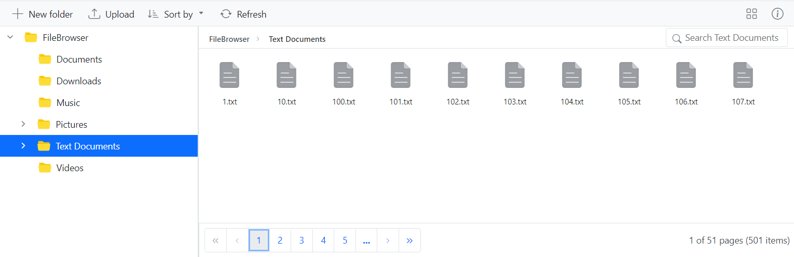

# Pagination in Blazor File Manager Component

Pagination provides an option to display files and folders in segmented pages, making it easier to navigate through large directories. This feature is particularly useful when dealing with extensive file systems in the File Manager component.

To enable pagination, set the [AllowPaging](https://help.syncfusion.com/cr/blazor/Syncfusion.Blazor.FileManager.SfFileManager-1.html#Syncfusion_Blazor_FileManager_SfFileManager_1_AllowPaging) property to **true**. This property determines whether paging is enabled or disabled for the File Manager. When `AllowPaging` is enabled, a pager control is rendered at the bottom of the File Manager, allowing navigation through different pages.

## Customize Pagination Options

Customizing the pagination options allows tailoring the File Manager pager to specific requirements. The pagination can be customized to display the number of pages using the `NumericItemsCount` property, change the current page using the `CurrentPage` property, display the number of records in the File Manager using the `PageSize` property, and adjust the page sizes in a dropdown using the `PageSizes` property.

### Change the Page Size

The number of records displayed per page can be controlled, providing flexibility in managing data. This feature is useful when adjusting the amount of data visible at any given time. To achieve this, use the [PageSize](https://help.syncfusion.com/cr/blazor/Syncfusion.Blazor.FileManager.FileManagerPageSettings.html#Syncfusion_Blazor_FileManager_FileManagerPageSettings_PageSize) property. This property specifies the initial number of records to display on each page.

The following example demonstrates how to change the page size of a File Manager using the `PageSize` property.

````cshtml
@using Syncfusion.Blazor.FileManager;
@using Syncfusion.Blazor.Navigations;

<SfFileManager  TValue="FileManagerDirectoryContent" AllowPaging="true">
    <FileManagerAjaxSettings Url="https://ej2-aspcore-service.azurewebsites.net/api/Virtualization/FileOperations"
                             UploadUrl="https://ej2-aspcore-service.azurewebsites.net/api/Virtualization/Upload"
                             DownloadUrl="https://ej2-aspcore-service.azurewebsites.net/api/Virtualization/Download"
                             GetImageUrl="https://ej2-aspcore-service.azurewebsites.net/api/Virtualization/GetImage">
    </FileManagerAjaxSettings>
    <FileManagerPageSettings PageSize="3"></FileManagerPageSettings>
</SfFileManager>
````
Below is a screenshot illustrating the `PageSize` property in the File Manager component.


### Change the Page Count

The [NumericItemsCount](https://help.syncfusion.com/cr/blazor/Syncfusion.Blazor.FileManager.FileManagerPageSettings.html#Syncfusion_Blazor_FileManager_FileManagerPageSettings_NumericItemsCount) property controls the number of numeric buttons displayed in the pager when pagination is enabled.

 ````cshtml
 @using Syncfusion.Blazor.FileManager;
@using Syncfusion.Blazor.Navigations;
<SfFileManager TValue="FileManagerDirectoryContent" AllowPaging="true" >
    <FileManagerAjaxSettings Url="https://ej2-aspcore-service.azurewebsites.net/api/Virtualization/FileOperations"
                             UploadUrl="https://ej2-aspcore-service.azurewebsites.net/api/Virtualization/Upload"
                             DownloadUrl="https://ej2-aspcore-service.azurewebsites.net/api/Virtualization/Download"
                             GetImageUrl="https://ej2-aspcore-service.azurewebsites.net/api/Virtualization/GetImage">
    </FileManagerAjaxSettings>
    <FileManagerPageSettings NumericItemsCount="5"></FileManagerPageSettings>
</SfFileManager>
 ````

Below is a screenshot illustrating the `NumericItemsCount` property in the File Manager component.



### Change the Current Page

The currently displayed page can be changed, which is useful when navigating through different pages of data either upon the initial rendering of the File Manager or updating the displayed page based on interactions or specific conditions. The default value of **CurrentPage** property is 1.

To change the current page in the Syncfusion<sup style="font-size:70%">&reg;</sup> File Manager, utilize the [CurrentPage](https://help.syncfusion.com/cr/blazor/Syncfusion.Blazor.FileManager.FileManagerPageSettings.html#Syncfusion_Blazor_FileManager_FileManagerPageSettings_CurrentPage) property in [FileManagerPageSettings](https://help.syncfusion.com/cr/blazor/Syncfusion.Blazor.FileManager.FileManagerPageSettings.html) component, which defines the current page number of the pager.

The following example demonstrates how to implement the `CurrentPage` property.

````cshtml
@using Syncfusion.Blazor.FileManager;
@using Syncfusion.Blazor.Navigations;

<SfFileManager TValue="FileManagerDirectoryContent" AllowPaging="true">
    <FileManagerAjaxSettings Url="https://ej2-aspcore-service.azurewebsites.net/api/Virtualization/FileOperations"
                             UploadUrl="https://ej2-aspcore-service.azurewebsites.net/api/Virtualization/Upload"
                             DownloadUrl="https://ej2-aspcore-service.azurewebsites.net/api/Virtualization/Download"
                             GetImageUrl="https://ej2-aspcore-service.azurewebsites.net/api/Virtualization/GetImage">
    </FileManagerAjaxSettings>
    <FileManagerPageSettings PageSize="3" CurrentPage="2">
       
    </FileManagerPageSettings>
</SfFileManager>
````
Below is a screenshot illustrating the `CurrentPage` property in the File Manager component.


## Pager Template in Blazor File Manager

The [Template](https://help.syncfusion.com/cr/blazor/Syncfusion.Blazor.FileManager.FileManagerPageSettings.html#Syncfusion_Blazor_FileManager_FileManagerPageSettings_Template) property in the [FileManagerPageSettings](https://help.syncfusion.com/cr/blazor/Syncfusion.Blazor.FileManager.FileManagerPageSettings.html) allows inserting custom UI elements, such as buttons or any HTML elements, into the File Manager page settings. This offers greater flexibility and customization for the paging interface.

### Navigate to a Particular Page

By invoking the [GoToPageAsync](https://help.syncfusion.com/cr/blazor/Syncfusion.Blazor.FileManager.SfFileManager-1.html#Syncfusion_Blazor_FileManager_SfFileManager_1_GoToPageAsync_System_Int32_) method within the pager template, a specific page can be navigated to by passing the page number to the method.

Below is an example on how to customize pagination in the Syncfusion<sup style="font-size:70%">&reg;</sup> File Manager by adding a custom button and using the [GoToPageAsync](https://help.syncfusion.com/cr/blazor/Syncfusion.Blazor.FileManager.SfFileManager-1.html#Syncfusion_Blazor_FileManager_SfFileManager_1_GoToPageAsync_System_Int32_) method in the pager template for specific page navigation.

````cshtml
@using Syncfusion.Blazor.FileManager;
@using Syncfusion.Blazor.Navigations;
<SfFileManager @ref="fileManager" TValue="FileManagerDirectoryContent" AllowPaging="true">
    <FileManagerAjaxSettings Url="https://ej2-aspcore-service.azurewebsites.net/api/Virtualization/FileOperations"
                             UploadUrl="https://ej2-aspcore-service.azurewebsites.net/api/Virtualization/Upload"
                             DownloadUrl="https://ej2-aspcore-service.azurewebsites.net/api/Virtualization/Download"
                             GetImageUrl="https://ej2-aspcore-service.azurewebsites.net/api/Virtualization/GetImage">
    </FileManagerAjaxSettings>
    <FileManagerPageSettings PageSize="3">
        <Template>
            <button @onclick="NavigateToPage">Go To Page 2</button>
        </Template>
    </FileManagerPageSettings>
</SfFileManager>
@code {
    SfFileManager<FileManagerDirectoryContent> fileManager;
    
    private async Task NavigateToPage()
    { 
        await fileManager.GoToPageAsync(2);
    }
}

````

The screenshot below shows the Blazor File Manager component with a custom pagination button.


### Pager with Page Sizes Dropdown

The [FileManagerPageSettings](https://help.syncfusion.com/cr/blazor/Syncfusion.Blazor.FileManager.FileManagerPageSettings.html) component's [PageSizes](https://help.syncfusion.com/cr/blazor/Syncfusion.Blazor.FileManager.FileManagerPageSettings.html#Syncfusion_Blazor_FileManager_FileManagerPageSettings_PageSizes) property enables a dropdown in the pager that allows dynamically changing the number of records displayed on the current page.

Here is a sample demonstrating how `PageSizes` property is used when Pagination enabled in the File Manager.

```cshtml

@using Syncfusion.Blazor.FileManager

    <SfFileManager TValue="FileManagerDirectoryContent" AllowPaging="true" Path="/Text Documents/">
        <FileManagerAjaxSettings Url="https://ej2-aspcore-service.azurewebsites.net/api/Virtualization/FileOperations"
                                 UploadUrl="https://ej2-aspcore-service.azurewebsites.net/api/Virtualization/Upload"
                                 DownloadUrl="https://ej2-aspcore-service.azurewebsites.net/api/Virtualization/Download"
                                 GetImageUrl="https://ej2-aspcore-service.azurewebsites.net/api/Virtualization/GetImage">
        </FileManagerAjaxSettings>
        <FileManagerPageSettings PageSizes="@(new List<int>(){10,25,50})"></FileManagerPageSettings>
    </SfFileManager>

```

The screenshot below shows the page sizes dropdown in the File Manager.


## Events in Pagination

Events can be added to handle actions during pagination.

The [PageChanging](https://help.syncfusion.com/cr/blazor/Syncfusion.Blazor.FileManager.FileManagerEvents-1.html#Syncfusion_Blazor_FileManager_FileManagerEvents_1_PageChanging) event triggers before the page is changed, allowing handling of actions before navigation.

The [PageChanged](https://help.syncfusion.com/cr/blazor/Syncfusion.Blazor.FileManager.FileManagerEvents-1.html#Syncfusion_Blazor_FileManager_FileManagerEvents_1_PageChanged) event occurs after the page has been switched, allowing performing actions like loading new data after the page has changed.

````cshtml
@using Syncfusion.Blazor.FileManager;
@using Syncfusion.Blazor.Navigations;
<SfFileManager TValue="FileManagerDirectoryContent" AllowPaging="true">
    <FileManagerAjaxSettings Url="https://ej2-aspcore-service.azurewebsites.net/api/Virtualization/FileOperations"
                             UploadUrl="https://ej2-aspcore-service.azurewebsites.net/api/Virtualization/Upload"
                             DownloadUrl="https://ej2-aspcore-service.azurewebsites.net/api/Virtualization/Download"
                             GetImageUrl="https://ej2-aspcore-service.azurewebsites.net/api/Virtualization/GetImage">
    </FileManagerAjaxSettings>
    <FileManagerEvents TValue="FileManagerDirectoryContent" PageChanging="OnChanging" PageChanged="OnChanged"></FileManagerEvents>
</SfFileManager>
@code {

    public void OnChanging(PageChangingEventArgs args)
    {
        //Add the required code here
    }
    public void OnChanged(PageChangedEventArgs args)
    {
        //Add the required code here
    }
}

````