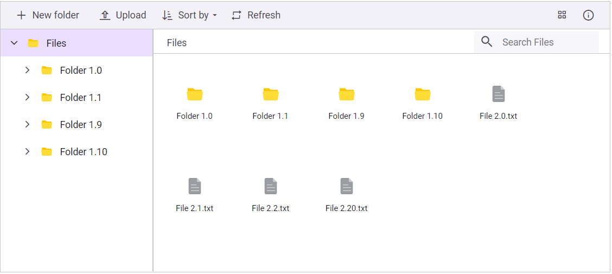
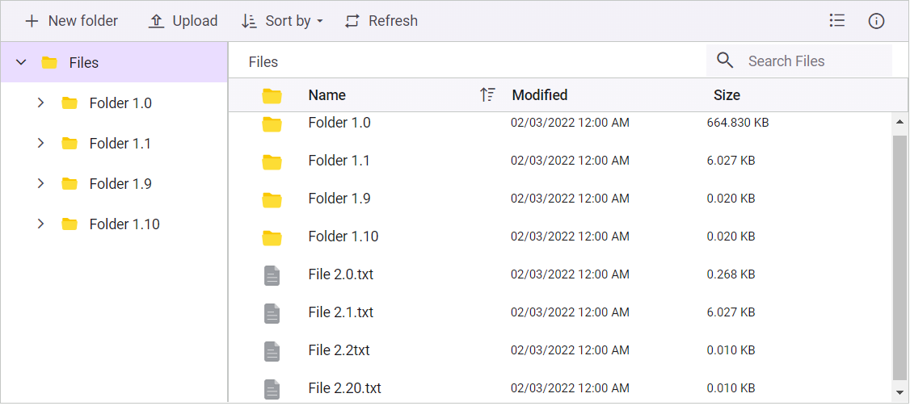

# Sorting Files and Folders 

In the Blazor FileManager component, you can perform sorting operations for both folders and files using the [SortBy](https://help.syncfusion.com/cr/blazor/Syncfusion.Blazor.FileManager.SfFileManager-1.html#Syncfusion_Blazor_FileManager_SfFileManager_1_SortBy) and [SortOrder](https://help.syncfusion.com/cr/blazor/Syncfusion.Blazor.FileManager.SfFileManager-1.html#Syncfusion_Blazor_FileManager_SfFileManager_1_SortOrder) properties. Additionally, you can use the **Sort by** toolbar button available in the FileManager component to perform sorting operations.

**SortBy** - A field name used to sort the folders and files in the FileManager component. The default value is Name.
**SortOrder** - sort order for the files and folders in the FileManager component.

The available options for the sort order are:

* [None](https://help.syncfusion.com/cr/blazor/Syncfusion.Blazor.FileManager.SortOrder.html#Syncfusion_Blazor_FileManager_SortOrder_None): The folders and files are not sorted.
* [Ascending](https://help.syncfusion.com/cr/blazor/Syncfusion.Blazor.FileManager.SortOrder.html#Syncfusion_Blazor_FileManager_SortOrder_Ascending): The folders and files are sorted in ascending order.
* [Descending](https://help.syncfusion.com/cr/blazor/Syncfusion.Blazor.FileManager.SortOrder.html#Syncfusion_Blazor_FileManager_SortOrder_Descending): The folders and files are sorted in descending order.

```cshtml

@using Syncfusion.Blazor.FileManager

<SfFileManager TValue="FileManagerDirectoryContent" SortBy="Size" SortOrder="SortOrder.Descending">
    <FileManagerAjaxSettings Url="https://ej2-aspcore-service.azurewebsites.net/api/FileManager/FileOperations"
                             UploadUrl="https://ej2-aspcore-service.azurewebsites.net/api/FileManager/Upload"
                             DownloadUrl="https://ej2-aspcore-service.azurewebsites.net/api/FileManager/Download"
                             GetImageUrl="https://ej2-aspcore-service.azurewebsites.net/api/FileManager/GetImage">
    </FileManagerAjaxSettings>
</SfFileManager>

```

## Custom sorting

The FileManager component provides a way to customize the default sort action for the LargeIconsView by defining the [`SortComparer`](https://help.syncfusion.com/cr/blazor/Syncfusion.Blazor.FileManager.SfFileManager-1.html#Syncfusion_Blazor_FileManager_SfFileManager_1_SortComparer) property and for sorting individual columns in the DetailsView by defining the `SortComparer` property in the [`FileManagerColumn`](https://help.syncfusion.com/cr/blazor/Syncfusion.Blazor.FileManager.FileManagerColumn.html) class.The `SortComparer` class should implement the [IComparer](https://learn.microsoft.com/en-us/dotnet/api/system.collections.generic.icomparer-1?view=net-8.0) interface.

The following example demonstrates how to define custom sort comparer function to achieve natural sorting behavior for the Name column in both DetailsView and LargeIconsView.




@using Syncfusion.Blazor.FileManager
@using System.Text.RegularExpressions;
@using FileManager.Data

@* SfFileManager component with a custom sorting SortComparer property *@
<SfFileManager TValue="FileManagerDirectoryContent" SortComparer="new NaturalSortComparer()">
    <FileManagerEvents TValue="FileManagerDirectoryContent" OnRead="OnReadAsync"></FileManagerEvents>
    @* FileManagerDetailsViewSettings component for configuring the details view of the file manager *@
    <FileManagerDetailsViewSettings>
        <FileManagerColumns>
            @* FileManagerColumn for the 'Name' field with a custom sorting SortComparer property *@
            <FileManagerColumn Field="Name" HeaderText="Name" SortComparer="new NaturalSortComparer()"></FileManagerColumn>
            <FileManagerColumn Field="DateModified" Format="MM/dd/yyyy h:mm tt" HeaderText="Modified"></FileManagerColumn>
            <FileManagerColumn Field="Size" HeaderText="Size">
            </FileManagerColumn>
        </FileManagerColumns>
    </FileManagerDetailsViewSettings>
</SfFileManager>

@code {
    public FileManagerService FileService = new FileManagerService();

    public async Task OnReadAsync(ReadEventArgs<FileManagerDirectoryContent> args)
    {
        args.Response = await FileService.ReadAsync(args.Path, args.Folder);
    }

    public class NaturalSortComparer : IComparer<Object>
    {
        public int Compare(Object XRowDataToCompare, Object YRowDataToCompare)
        {
            FileManagerDirectoryContent XRowDataToCompare1 = (FileManagerDirectoryContent)XRowDataToCompare;
            FileManagerDirectoryContent YRowDataToCompare1 = (FileManagerDirectoryContent)YRowDataToCompare;
			// Assuming Value property holds the value of the column
            dynamic reference = XRowDataToCompare1.GetType().GetProperty("Name").GetValue(XRowDataToCompare1, null);
			// Assuming Value property holds the value of the column
            dynamic comparer = YRowDataToCompare1.GetType().GetProperty("Name").GetValue(YRowDataToCompare1, null);
            bool referenceIsFile = XRowDataToCompare1.IsFile;
            bool comparerIsFile = YRowDataToCompare1.IsFile;

            if (referenceIsFile && !comparerIsFile) return 1;
            if (!referenceIsFile && comparerIsFile) return -1;

            var referenceParts = new List<(double, string)>();
            var comparerParts = new List<(double, string)>();

            Regex.Replace(reference, @"(\d+)|(\D+)", (MatchEvaluator)(m => { referenceParts.Add((m.Groups[1].Success ? double.Parse(m.Groups[1].Value) : double.PositiveInfinity, m.Groups[2].Value)); return ""; }));
            Regex.Replace(comparer, @"(\d+)|(\D+)", (MatchEvaluator)(m => { comparerParts.Add((m.Groups[1].Success ? double.Parse(m.Groups[1].Value) : double.PositiveInfinity, m.Groups[2].Value)); return ""; }));
            for (int i = 0; i < referenceParts.Count && i < comparerParts.Count; i++)
            {
                var referencePart = referenceParts[i];
                var comparerPart = comparerParts[i];
                int comparisonResult;
                if (referencePart.Item1 != double.PositiveInfinity && comparerPart.Item1 != double.PositiveInfinity)
                {
                    comparisonResult = referencePart.Item1.CompareTo(comparerPart.Item1);
                }
                else
                {
                    comparisonResult = String.Compare(referencePart.Item2, comparerPart.Item2);
                }
                if (comparisonResult != 0)
                {
                    return comparisonResult;
                }
            }

            return referenceParts.Count - comparerParts.Count;
        }
    }
}







using System.IO.Compression;
using Syncfusion.Blazor.FileManager;
using System.Collections.Generic;
using System.Linq;
using System;
using System.Threading.Tasks;
using System.Text;

namespace FileManager.Data
{
    public class FileManagerService
    {
        List<FileManagerDirectoryContent> CopyFiles = new List<FileManagerDirectoryContent>();
        List<FileManagerDirectoryContent> Data = new List<FileManagerDirectoryContent>();
        public FileManagerService()
        {
            this.GetData();
        }
        private void GetData()
        {
            Data.Add(new FileManagerDirectoryContent()
            {
                CaseSensitive = false,
                DateCreated = new DateTime(2022, 1, 2),
                DateModified = new DateTime(2022, 2, 3),
                FilterPath = "",
                FilterId = "",
                HasChild = true,
                Id = "0",
                IsFile = false,
                Name = "Files",
                ParentId = null,
                ShowHiddenItems = false,
                Size = 1779448,
                Type = "folder"
            });
            Data.Add(new FileManagerDirectoryContent()
            {
                CaseSensitive = false,
                DateCreated = new DateTime(2022, 1, 2),
                DateModified = new DateTime(2022, 2, 3),
                FilterId = "0/",
                FilterPath = "/",
                HasChild = true,
                Id = "1",
                IsFile = false,
                Name = "Folder 1.0",
                ParentId = "0",
                ShowHiddenItems = false,
                Size = 680786,
                Type = "folder"
            });
            Data.Add(new FileManagerDirectoryContent()
            {
                CaseSensitive = false,
                DateCreated = new DateTime(2022, 1, 2),
                DateModified = new DateTime(2022, 2, 3),
                FilterId = "0/",
                FilterPath = "/",
                HasChild = true,
                Id = "2",
                IsFile = false,
                Name = "Folder 1.1",
                ParentId = "0",
                ShowHiddenItems = false,
                Size = 6172,
                Type = "folder"
            });
            Data.Add(new FileManagerDirectoryContent()
            {
                CaseSensitive = false,
                DateCreated = new DateTime(2022, 1, 2),
                DateModified = new DateTime(2022, 2, 3),
                FilterId = "0/",
                FilterPath = "/",
                HasChild = true,
                Id = "3",
                IsFile = false,
                Name = "Folder 1.9",
                ParentId = "0",
                ShowHiddenItems = false,
                Size = 20,
                Type = "folder"
            });
            Data.Add(new FileManagerDirectoryContent()
            {
                CaseSensitive = false,
                DateCreated = new DateTime(2022, 1, 2),
                DateModified = new DateTime(2022, 2, 3),
                FilterId = "0/",
                FilterPath = "/",
                HasChild = true,
                Id = "4",
                IsFile = false,
                Name = "Folder 1.10",
                ParentId = "0",
                ShowHiddenItems = false,
                Size = 20,
                Type = "folder"
            });
            Data.Add(new FileManagerDirectoryContent()
            {
                CaseSensitive = false,
                DateCreated = new DateTime(2022, 1, 2),
                DateModified = new DateTime(2022, 2, 3),
                FilterId = "0/1/",
                FilterPath = "/Folder 1.0/",
                HasChild = false,
                Id = "5",
                IsFile = true,
                Name = "EJ2 File Manager.docx",
                ParentId = "1",
                ShowHiddenItems = false,
                Size = 12403,
                Type = ".docx"
            });
            Data.Add(new FileManagerDirectoryContent()
            {
                CaseSensitive = false,
                DateCreated = new DateTime(2022, 1, 2),
                DateModified = new DateTime(2022, 2, 3),
                FilterId = "0/2/",
                FilterPath = "/Folder 1.1/",
                HasChild = false,
                Id = "6",
                IsFile = true,
                Name = "EJ2 File Manager.pdf",
                ParentId = "2",
                ShowHiddenItems = false,
                Size = 90099,
                Type = ".pdf"
            });
            Data.Add(new FileManagerDirectoryContent()
            {
                CaseSensitive = false,
                DateCreated = new DateTime(2022, 1, 2),
                DateModified = new DateTime(2022, 2, 3),
                FilterId = "0/3/",
                FilterPath = "/Folder 1.9/",
                HasChild = false,
                Id = "7",
                IsFile = true,
                Name = "File Manager PPT.pptx",
                ParentId = "3",
                ShowHiddenItems = false,
                Size = 578010,
                Type = ".pptx"
            });
            Data.Add(new FileManagerDirectoryContent()
            {
                CaseSensitive = false,
                DateCreated = new DateTime(2022, 1, 2),
                DateModified = new DateTime(2022, 2, 3),
                FilterId = "0/4/",
                FilterPath = "/Folder 1.10/",
                HasChild = false,
                Id = "7",
                IsFile = true,
                Name = "File Manager PPT.pptx",
                ParentId = "4",
                ShowHiddenItems = false,
                Size = 578010,
                Type = ".pptx"
            });
            Data.Add(new FileManagerDirectoryContent()
            {
                CaseSensitive = false,
                DateCreated = new DateTime(2022, 1, 2),
                DateModified = new DateTime(2022, 2, 3),
                FilterId = "0/",
                FilterPath = "/",
                HasChild = false,
                Id = "8",
                IsFile = true,
                Name = "File 2.0.txt",
                ParentId = "0",
                ShowHiddenItems = false,
                Size = 274,
                Type = ".txt"
            });
            Data.Add(new FileManagerDirectoryContent()
            {
                CaseSensitive = false,
                DateCreated = new DateTime(2022, 1, 2),
                DateModified = new DateTime(2022, 2, 3),
                FilterId = "0/",
                FilterPath = "/",
                HasChild = false,
                Id = "9",
                IsFile = true,
                Name = "File 2.1.txt",
                ParentId = "0",
                ShowHiddenItems = false,
                Size = 6172,
                Type = ".txt"
            });
            Data.Add(new FileManagerDirectoryContent()
            {
                CaseSensitive = false,
                DateCreated = new DateTime(2022, 1, 2),
                DateModified = new DateTime(2022, 2, 3),
                FilterId = "0/",
                FilterPath = "/",
                HasChild = false,
                Id = "10",
                IsFile = true,
                Name = "File 2.2txt",
                ParentId = "0",
                ShowHiddenItems = false,
                Size = 10,
                Type = ".txt"
            });
            Data.Add(new FileManagerDirectoryContent()
            {
                CaseSensitive = false,
                DateCreated = new DateTime(2022, 1, 2),
                DateModified = new DateTime(2022, 2, 3),
                FilterId = "0/",
                FilterPath = "/",
                HasChild = false,
                Id = "11",
                IsFile = true,
                Name = "File 2.20.txt",
                ParentId = "0",
                ShowHiddenItems = false,
                Size = 10,
                Type = ".txt"
            });
        }
        public async Task<FileManagerResponse<FileManagerDirectoryContent>> ReadAsync(string path, List<FileManagerDirectoryContent> fileDetails)
        {
            FileManagerResponse<FileManagerDirectoryContent> response = new FileManagerResponse<FileManagerDirectoryContent>();
            if (path == "/")
            {
                string ParentId = Data
                    .Where(x => x.FilterPath == string.Empty)
                    .Select(x => x.Id).First();
                response.CWD = Data
                    .Where(x => x.FilterPath == string.Empty).First();
                response.Files = Data
                    .Where(x => x.ParentId == ParentId).ToList();
            }
            else
            {
                var id = fileDetails.Count > 0 && fileDetails[0] != null ? fileDetails[0].Id : Data
                    .Where(x => x.FilterPath == path)
                    .Select(x => x.ParentId).First();
                response.CWD = Data
                    .Where(x => x.Id == (fileDetails.Count > 0 && fileDetails[0] != null ? fileDetails[0].Id : id)).First();
                response.Files = Data
                    .Where(x => x.ParentId == (fileDetails.Count > 0 && fileDetails[0] != null ? fileDetails[0].Id : id)).ToList();
            }
            await Task.Yield();
            return await Task.FromResult(response);
        }
    }
}






