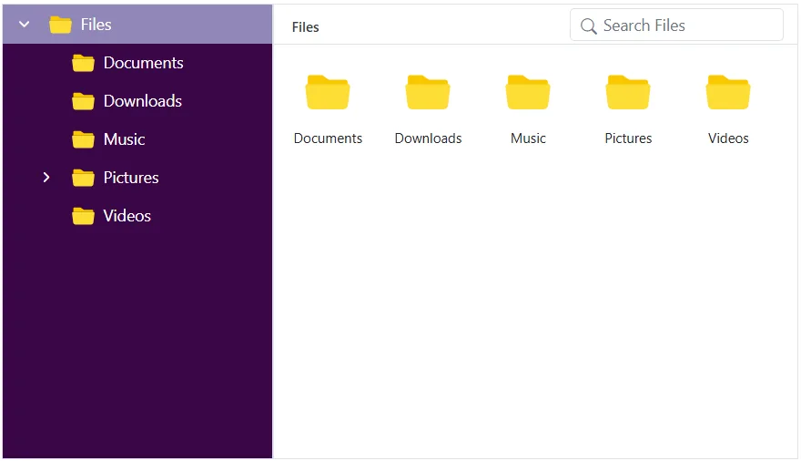
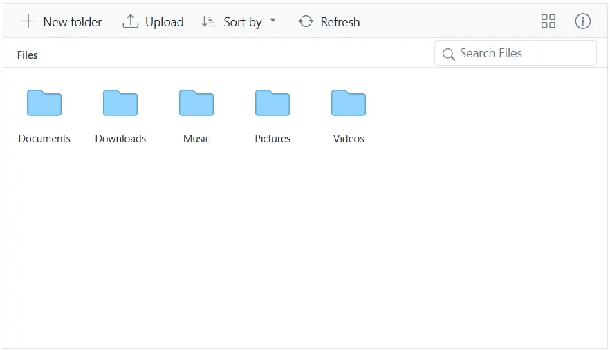
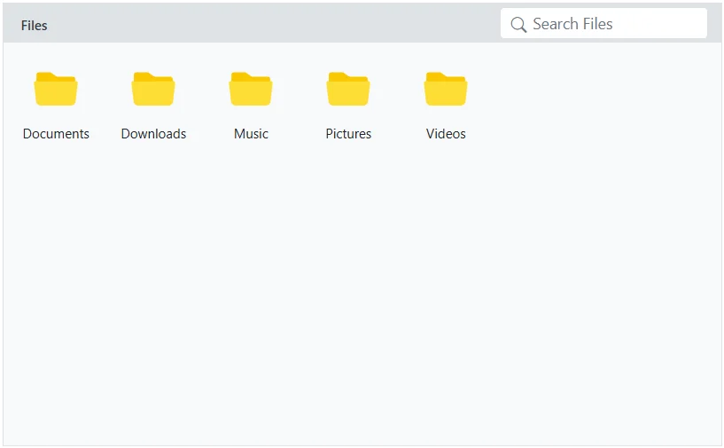
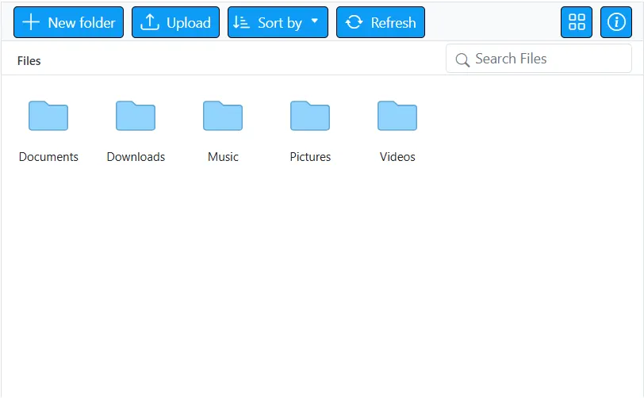
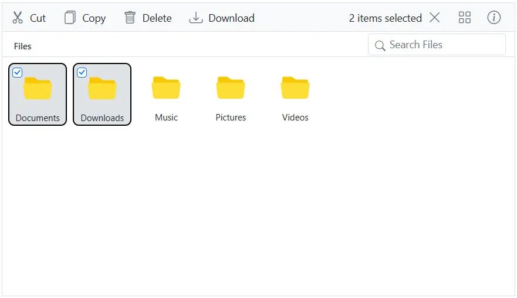
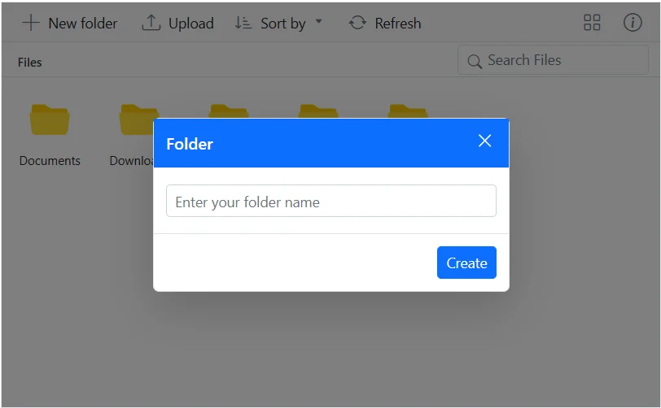

# Styles and Appearance in Blazor File Manager Component

Customize the Blazor File Manager's appearance by applying CSS to the selectors provided in this guide. The File Manager component renders with predefined Syncfusion CSS classes that you can override to match your application's design.

## How to Apply Custom Styles

1. **Add CSS to your Blazor component** — Define styles in a `<style>` block within your `.razor` component file:

```razor
<style>
    .e-filemanager .e-navigation {
        background: #3a0647;
    }
</style>

<SfFileManager TValue="FileManagerDirectoryContent">
    <!-- Component markup -->
</SfFileManager>
```

2. **Or use a global stylesheet** — Add styles to your `app.css` or `site.css` file in the `wwwroot` directory.

3. **Verify specificity** — Use your browser's DevTools (F12) to inspect elements and ensure your CSS has sufficient specificity to override default Syncfusion styles.

> **Version Note:** These CSS selectors apply to Syncfusion Blazor v20.0 and later. Verify selectors match your installed version by inspecting the rendered DOM.

---

## Customizing the File Manager Navigation Pane

The navigation pane displays folder structure as a tree. Use the `.e-navigation` selector to customize its appearance.

```css

/* Background color for the File Manager navigation pane */
.e-filemanager .e-navigation {
    background: #3a0647;
}

/* Style for active folder item in the TreeView */
.e-filemanager .e-treeview .e-list-item.e-active > .e-fullrow {
    background: #c3d3f9a1;
}

/* Text color for TreeView items */
.e-filemanager .e-treeview .e-list-text {
    color: #fff;
}

/* Icon color for collapsible/expandable folder nodes */
.e-treeview .e-icon-collapsible,
.e-treeview .e-icon-expandable {
    color: #fff;
}

```



## Customizing File Type Icons

Customize file type icons by applying background-image styles to CSS selectors representing different file extensions. Use the `background-image` property with SVG data URIs or image URLs.

| File Type | CSS Selector |
|-----------|--------------|
| Image | `.e-fe-image` |
| Music | `.e-fe-music` |
| Excel | `.e-fe-xlsx` |
| Video | `.e-fe-video` |
| PowerPoint | `.e-fe-pptx` |
| RAR | `.e-fe-rar` |
| ZIP | `.e-fe-zip` |
| Text | `.e-fe-txt` |
| JavaScript | `.e-fe-js` |
| CSS | `.e-fe-css` |
| HTML | `.e-fe-html` |
| Unknown | `.e-fe-unknown` |
| Executable | `.e-fe-exe` |
| MSI | `.e-fe-msi` |
| PHP | `.e-fe-php` |
| Word (.doc) | `.e-fe-doc` |
| Word (.docx) | `.e-fe-docx` |
| XML | `.e-fe-xml` |
| Folder | `.e-fe-folder` |

**Example:** Customize the folder icon to appear in both Large Icons and Details views:

```css

/* Applies to both Large Icons view and Details view in the File Manager */

.e-filemanager .e-large-icons .e-fe-folder, .e-filemanager .e-grid .e-fe-folder {
    background-image: url("");
}

```



## Customizing the File Manager Layout

The layout comprises the breadcrumb (path bar), content area, and status bar. Customize these components using the `.e-layout-content` selector.

```css

/* Background color for the breadcrumb path bar */
.e-filemanager .e-layout-content .e-address {
    background: #dee2e6;
}

/* Background for Large Icons view */
.e-filemanager .e-layout-content .e-large-icons {
    background: #f8f9fa;
}

/* Background for Details view table and content area */
.e-filemanager .e-layout-content .e-grid .e-table,
.e-filemanager .e-grid .e-gridcontent .e-content {
    background: #f8f9fa;
}

```



## Customizing the File Manager Toolbar

Customize toolbar buttons, icons, and text using the `.e-toolbar` selector. Style individual button states and icons.

```css

/* Background and border for toolbar buttons */
.e-filemanager .e-toolbar .e-tbar-btn {
    background: #0d9cf6;
    border: 1px solid #000000;
}

/* Icon color in toolbar buttons */
.e-filemanager .e-toolbar .e-tbar-btn .e-icons {
    color: #ffffff;
}

/* Button text color in toolbar */
.e-filemanager .e-toolbar .e-toolbar-item .e-tbar-btn .e-tbar-btn-text {
    color: #ffffff;
}

```



## Customizing Selected Files and Folders

Customize the appearance of selected items in both Large Icons and Details views using the `.e-active` class selector.

```css

/* Highlight for selected items in Large Icons view */
.e-filemanager li.e-list-item.e-large-icon.e-active,
.e-filemanager li.e-list-item.e-large-icon.e-active:hover {
    background: #dee2e6;
    border: 2px solid #000000;
    border-radius: 10%;
}

/* Text color for selected items */
.e-filemanager .e-large-icons .e-active {
    color: #212529;
}

/* Highlight for selected row in Details view */
.e-filemanager .e-grid td.e-active {
    background: #dee2e6;
}

```



## Customizing Dialogs

Customize dialog popups (upload, rename, delete, etc.) by targeting specific dialog elements. Common dialogs include file upload, rename, and delete confirmation dialogs.

| Dialog Element | CSS Selector | Purpose |
|---|---|---|
| Header | `.e-dlg-header-content` | Dialog title bar |
| Content Area | `.e-dlg-content` | Main dialog content |
| Overlay/Backdrop | `.e-dlg-overlay` | Semi-transparent background behind dialog |
| Footer | `.e-footer-content` | Dialog buttons (OK, Cancel, etc.) |

**Example:** Style the dialog header:

```css

/* Dialog header background color */
.e-filemanager .e-dialog .e-dlg-header-content {
    background-color: #0d6efd;
}

/* Dialog header text and close icon color */
.e-filemanager .e-dialog .e-icon-dlg-close,
.e-filemanager .e-dialog .e-dlg-header {
    color: #fff;
}

```



## Troubleshooting Custom Styles

If your custom CSS is not applying:

1. **Verify CSS specificity** — Ensure your selectors have sufficient specificity to override Syncfusion defaults. Add `.e-filemanager` prefix to increase specificity.
2. **Check placement** — Confirm CSS is in a `<style>` block or external stylesheet that's loaded before the component renders.
3. **Inspect element** — Use browser DevTools (F12) to inspect the rendered element and confirm the correct CSS selector names.
4. **Clear cache** — Hard-refresh your browser (Ctrl+Shift+R or Cmd+Shift+R) to clear cached styles.
5. **Use !important** — As a last resort, add `!important` to override conflicting styles (use sparingly).