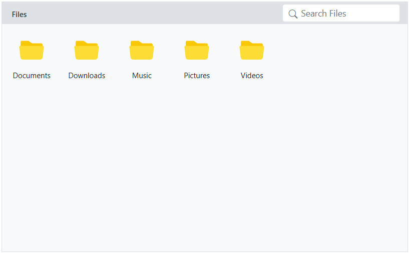
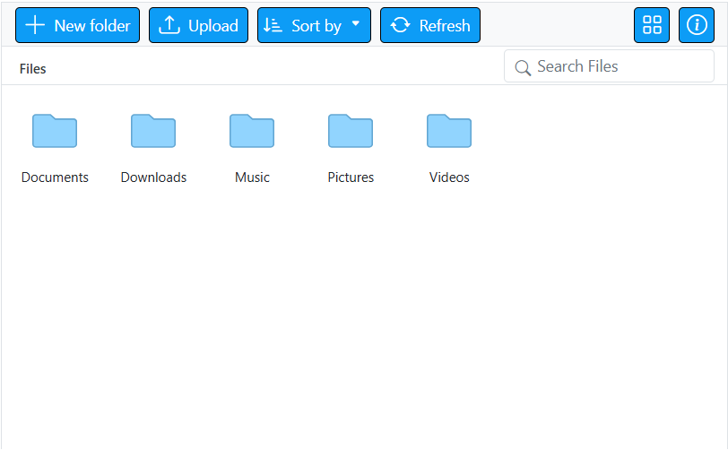
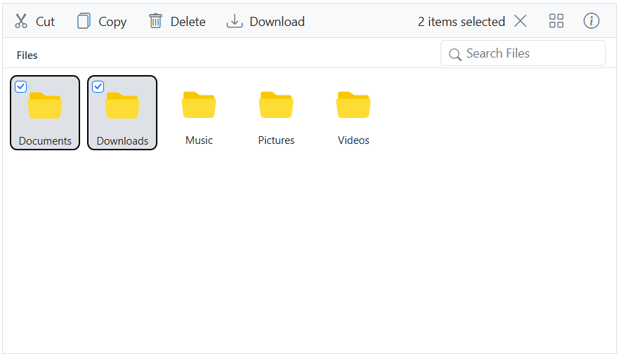
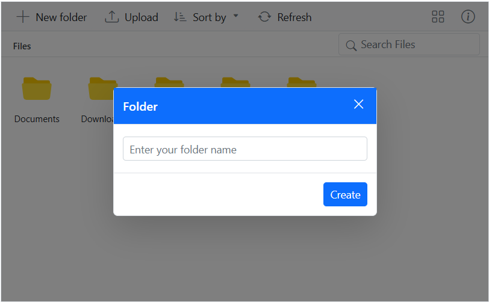

# Styles and Appearance in Blazor File Manager Component

The following content provides the exact CSS structure that can be used to modify the control's appearance based on the user preference.

## Customizing the File Manager navigation pane

To customize the File Manager navigation pane, use the `.e-navigation` selector and apply styles.

```css

/* Set background color for the File Manager navigation pane */
.e-filemanager .e-navigation {
    background: #3a0647;
}

/* Highlight the active item in the TreeView inside the navigation pane */
.e-filemanager .e-treeview .e-list-item.e-active > .e-fullrow {
    background: #c3d3f9a1;
}

/* Set text color for TreeView items in the navigation pane */
.e-filemanager .e-treeview .e-list-text {
    color: #fff;
}

/* Set icon color for collapsible and expandable TreeView nodes */
.e-treeview .e-icon-collapsible,
.e-treeview .e-icon-expandable {
    color: #fff;
}

```


## Customizing the File Manager thumbnail

To customize the thumbnails in the File Manager, you can apply background-image styles to specific CSS selectors that represent different file types, as listed in the table below.

|File Type|CSS Selector|
|----|----|
|Image|.e-fe-image|
|Music|.e-fe-music|
|Excel|.e-fe-xlsx|
|Video|.e-fe-video|
|PowerPoint|.e-fe-pptx|
|RAR|.e-fe-rar|
|ZIP|.e-fe-zip|
|Text|.e-fe-txt|
|JavaScript|.e-fe-js|
|CSS|.e-fe-css|
|HTML|.e-fe-html|
|Unknown|.e-fe-unknown|
|Executable|.e-fe-exe|
|MSI|.e-fe-msi|
|PHP|.e-fe-php|
|Word|.e-fe-doc|
|Word(docx)|.e-fe-docx|
|XML|.e-fe-xml|
|Folder|.e-fe-folder|

The following example demonstrates how to customize the File Manager's thumbnail icon for folders:

```css

/* Applies to both Large Icons view and Details view in the File Manager */

.e-filemanager .e-large-icons .e-fe-folder, .e-filemanager .e-grid .e-fe-folder {
    background-image: url("data:image/svg+xml;base64,PD94bWwgdmVyc2lvbj0iMS4wIiBlbmNvZGluZz0idXRmLTgiPz48c3ZnIHZlcnNpb249IjEuMSIgaWQ9IkxheWVyXzEiIHhtbG5zPSJodHRwOi8vd3d3LnczLm9yZy8yMDAwL3N2ZyIgeG1sbnM6eGxpbms9Imh0dHA6Ly93d3cudzMub3JnLzE5OTkveGxpbmsiIHg9IjBweCIgeT0iMHB4IiB2aWV3Qm94PSIwIDAgMzIgMzIiIHN0eWxlPSJlbmFibGUtYmFja2dyb3VuZDpuZXcgMCAwIDMyIDMyOyIgeG1sOnNwYWNlPSJwcmVzZXJ2ZSI+PHN0eWxlIHR5cGU9InRleHQvY3NzIj4uc3Qwe2ZpbGw6I0ZGOTI5Mjt9LnN0MXtmaWxsOiNFODdFN0U7fS5zdDJ7ZmlsbDojRkZDM0MzO30uc3Qze2ZpbGw6IzkxRDRGRTt9LnN0NHtmaWxsOiM2M0E3RDM7fS5zdDV7ZmlsbDojQzFFN0ZGO30uc3Q2e2ZpbGw6I0ZGRkZGRjt9LnN0N3tmaWxsOiM4M0Q2Qjk7fS5zdDh7ZmlsbDojNDZDNjhDO30uc3Q5e2ZpbGw6I0JCRThEODt9LnN0MTB7ZmlsbDojRkVCMTdEO30uc3QxMXtmaWxsOiNERDk2NjY7fS5zdDEye2ZpbGw6I0ZFRDRCNzt9LnN0MTN7ZmlsbDojRjJBMkEyO30uc3QxNHtmaWxsOiNGMUM1QzU7fS5zdDE1e2ZpbGw6I0RCQjY2Mzt9LnN0MTZ7ZmlsbDojQ0VBMTUxO30uc3QxN3tmaWxsOiNFQkQ3QTk7fS5zdDE4e2ZpbGw6I0NFQ0VDRTt9LnN0MTl7ZmlsbDojQjdCN0I3O30uc3QyMHtmaWxsOiNFNEU0RTQ7fS5zdDIxe2ZpbGw6IzY1QUFEMTt9LnN0MjJ7ZmlsbDojRTU3QTdBO30uc3QyM3tmaWxsOiNFNkE2RTg7fS5zdDI0e2ZpbGw6I0Q2OEFENjt9LnN0MjV7ZmlsbDojRkZDQ0ZFO30uc3QyNntmaWxsOiM5OENFNUY7fS5zdDI3e2ZpbGw6IzhDQUYyQzt9LnN0Mjh7ZmlsbDojQzZFM0E3O30uc3QyOXtmaWxsOiNGRkI1Nzg7fS5zdDMwe2ZpbGw6I0VEOUY2NDt9LnN0MzF7ZmlsbDojRkZENkI1O30uc3QzMntmaWxsOiNGNEExRUY7fS5zdDMze2ZpbGw6I0REODdERDt9LnN0MzR7ZmlsbDojRjlDQkY2O30uc3QzNXtmaWxsOiNBOEEyRjQ7fS5zdDM2e2ZpbGw6Izg4ODVFODt9LnN0Mzd7ZmlsbDojQ0ZDQ0Y4O30uc3QzOHtmaWxsOiNCQ0JDQkM7fS5zdDM5e2ZpbGw6I0E4QThBODt9LnN0NDB7ZmlsbDojREFEQURBO30uc3Q0MXtmaWxsOiM3N0NDREI7fS5zdDQye2ZpbGw6IzREQkNDMTt9LnN0NDN7ZmlsbDojQjRFM0VCO30uc3Q0NHtmaWxsOiNGRkI3QTQ7fS5zdDQ1e2ZpbGw6I0Y2OUE3Qjt9LnN0NDZ7ZmlsbDojRkZEN0NEO30uc3Q0N3tmaWxsOiM3MUM4RjQ7fS5zdDQ4e2ZpbGw6IzhEQzk3Nzt9LnN0NDl7ZmlsbDojN0NBODUxO30uc3Q1MHtvcGFjaXR5OjAuNDU7ZmlsbDojRkZGRkZGO308L3N0eWxlPjxnPjxwYXRoIGNsYXNzPSJzdDMiIGQ9Ik0yOS41LDI3LjVoLTI3Yy0xLjEsMC0yLTAuOS0yLTJ2LTE5YzAtMS4xLDAuOS0yLDItMmgxMC40bDMuNSwzLjFoMTMuMmMxLjEsMCwyLDAuOSwyLDJ2MTUuOUMzMS41LDI2LjYsMzAuNiwyNy41LDI5LjUsMjcuNXoiLz48cGF0aCBjbGFzcz0ic3Q0IiBkPSJNMjkuNSwyOGgtMjdDMS4xLDI4LDAsMjYuOSwwLDI1LjV2LTE5QzAsNS4xLDEuMSw0LDIuNSw0aDEwLjZsMy41LDMuMWgxM2MxLjQsMCwyLjUsMS4xLDIuNSwyLjV2MTUuOUMzMiwyNi45LDMwLjksMjgsMjkuNSwyOHogTTIuNSw1QzEuNyw1LDEsNS43LDEsNi41djE5QzEsMjYuMywxLjcsMjcsMi41LDI3aDI3YzAuOCwwLDEuNS0wLjcsMS41LTEuNVY5LjZjMC0wLjgtMC43LTEuNS0xLjUtMS41SDE2LjJMMTIuNyw1SDIuNXoiLz48L2c+PC9zdmc+");
}

```


## Customizing the File Manager layout

To customize the File Manager layout, use the `.e-layout-content` selector and apply styles. 

```css

/* Style for breadcrumb (address bar) */
.e-filemanager .e-layout-content .e-address {
    background: #dee2e6;
}

/* Customize the background for the Large Icons view */
.e-filemanager .e-layout-content .e-large-icons {
    background: #f8f9fa;
}

/* Customize the background for the Details view table and content area */
.e-filemanager .e-layout-content .e-grid .e-table,
.e-filemanager .e-grid .e-gridcontent .e-content {
    background: #f8f9fa;
}

```



## Customizing the File Manager Toolbar

To customize the File Manager toolbar items, use the `.e-toolbar` selector and apply styles.

```css

/* Style for individual toolbar buttons */
.e-filemanager .e-toolbar .e-tbar-btn {
        background: #0d9cf6;
    border: 1px solid #000000;
}

/* Style for toolbar icons */
.e-filemanager .e-toolbar .e-tbar-btn .e-icons {
    color: #ffffff;
}

/* Style for toolbar button text */
.e-filemanager .e-toolbar .e-toolbar-item .e-tbar-btn .e-tbar-btn-text {
    color: #ffffff;
}

```



## Customizing the File Manager selected files/folders

To customize the File Manager selected files/folders, use the below selectors and apply styles.

```css

/* Highlight for active and hover item in Large Icons view */
.e-filemanager li.e-list-item.e-large-icon.e-active,
.e-filemanager li.e-list-item.e-large-icon.e-active:hover {
    background: #dee2e6;
    border: 2px solid #000000;
    border-radius: 10%;
}

/* Color for text */
.e-filemanager .e-large-icons .e-active {
    color: #212529;
}

/* Highlight for active row in Details view */
.e-filemanager .e-grid td.e-active {
    background: #dee2e6;
}

```



## Customizing the File Manager Dialog

To customize the dialog popup in the File Manager, you can apply styles to specific CSS selectors, as listed in the table below.

|Element|CSS Selector|
|---------|------------|
|Header|`.e-dlg-header-content`|
|Content|`.e-dlg-content`|
|Overlay|`.e-dlg-overlay`|
|Footer|`.e-footer-content`|

In this example, we have applied styles to the header content.

```css

/* For File Manager Dialog header */
.e-filemanager .e-dialog .e-dlg-header-content {
    background-color: #0d6efd;
}
/* For File Manager Dialog header close icon and text*/
.e-filemanager .e-dialog .e-icon-dlg-close,
.e-filemanager .e-dialog .e-dlg-header {
    color: #fff;
}

```

