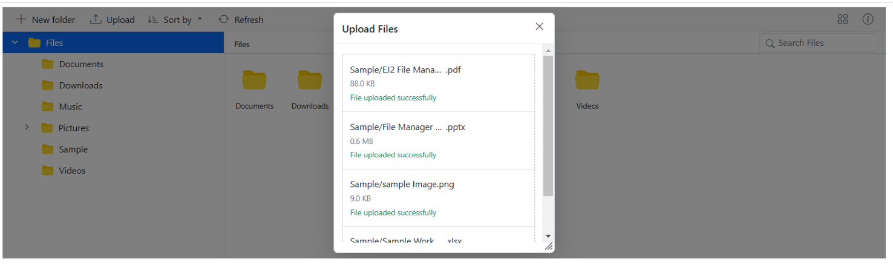
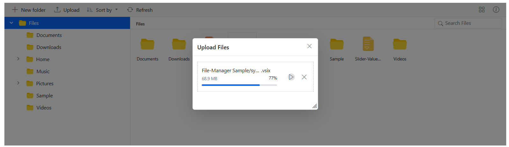
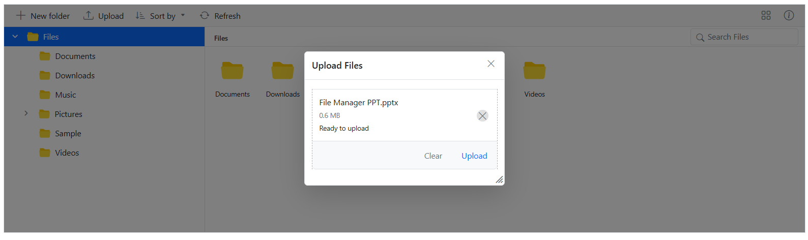
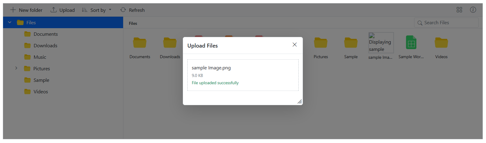

# Upload in Blazor File Manager component

The Blazor File Manager component provides a [FileManagerUploadSettings](https://help.syncfusion.com/cr/blazor/Syncfusion.Blazor.FileManager.FileManagerUploadSettings.html) property with various options to customize how files are uploaded, such as controlling file size, restricting file types, and enabling chunk uploads.

## Directory Upload

The [DirectoryUpload](https://help.syncfusion.com/cr/blazor/Syncfusion.Blazor.FileManager.FileManagerUploadSettings.html#Syncfusion_Blazor_FileManager_FileManagerUploadSettings_DirectoryUpload) property controls whether users can browse and upload entire directories (folders) in the Syncfusion Blazor File Manager component. 

To enable directory upload, set the `DirectoryUpload` property to `true` in the [FileManagerUploadSettings](https://help.syncfusion.com/cr/blazor/Syncfusion.Blazor.FileManager.FileManagerUploadSettings.html) configuration.

When set to `true`, this property enables directory upload in the FileManager, allowing users to upload entire folders. If set to `false`, only individual files can be uploaded.

```cshtml

@using Syncfusion.Blazor.FileManager

<SfFileManager TValue="FileManagerDirectoryContent">
    <FileManagerUploadSettings DirectoryUpload  = "true"></FileManagerUploadSettings>
    <FileManagerAjaxSettings Url="https://ej2-aspcore-service.azurewebsites.net/api/FileManager/FileOperations"
                             UploadUrl="https://ej2-aspcore-service.azurewebsites.net/api/FileManager/Upload"
                             DownloadUrl="https://ej2-aspcore-service.azurewebsites.net/api//FileManager/Download"
                             GetImageUrl="https://ej2-aspcore-service.azurewebsites.net/api/test/FileManager/GetImage">
    </FileManagerAjaxSettings>
</SfFileManager>

```
N> When `DirectoryUpload` is set to `true`, only folders can be uploaded. When it is set to `false`, only individual files can be uploaded. Simultaneous uploading of files and folders is not supported.

The screenshot below shows after successfully selecting a directory it uploads all the file inside it automatically. This demonstrates how the `DirectoryUpload` property works in the Blazor File Manager component.





## Chunk Upload

The [ChunkSize](https://help.syncfusion.com/cr/blazor/Syncfusion.Blazor.FileManager.FileManagerUploadSettings.html#Syncfusion_Blazor_FileManager_FileManagerUploadSettings_ChunkSize) property specifies the size of each chunk when uploading large files. It divides the file into smaller parts, which are uploaded sequentially to the server

This property allows enabling chunked uploads for large files by specifying a `ChunkSize`.

By specifying a `ChunkSize`, the large file is divided into smaller parts, reducing the load on the network and making the upload process more efficient.

```cshtml

@using Syncfusion.Blazor.FileManager

<SfFileManager TValue="FileManagerDirectoryContent">
    <FileManagerUploadSettings DirectoryUpload="true" ChunkSize="5242880" MaxFileSize="73728000"></FileManagerUploadSettings>
    <FileManagerAjaxSettings Url="https://ej2-aspcore-service.azurewebsites.net/api/FileManager/FileOperations"
                             UploadUrl="https://ej2-aspcore-service.azurewebsites.net/api/FileManager/Upload"
                             DownloadUrl="https://ej2-aspcore-service.azurewebsites.net/api//FileManager/Download"
                             GetImageUrl="https://ej2-aspcore-service.azurewebsites.net/api/test/FileManager/GetImage">
    </FileManagerAjaxSettings>
</SfFileManager>

```
In the following example, the ChunkSize is set to 5 MB (5,242,880 bytes), and the MaxFileSize is set to 70 MB (73,728,000 bytes). This means files that are up to 70 MB will be uploaded in 5 MB chunks.

With chunk upload, the pause and resume options gives users enhanced control over the file upload process.



## Auto Upload

The [AutoUpload](https://help.syncfusion.com/cr/blazor/Syncfusion.Blazor.FileManager.FileManagerUploadSettings.html#Syncfusion_Blazor_FileManager_FileManagerUploadSettings_AutoUpload) property controls whether files are automatically uploaded when they are added to the upload queue in the File Manager component.

The default value is `true`. If `AutoUpload` is set to `true`, the File Manager will automatically upload files as soon as they are added to the upload queue. If set to `false`, the files will not be uploaded automatically, giving a chance to manipulate the files before uploading them to the server.

```cshtml

@using Syncfusion.Blazor.FileManager

<SfFileManager TValue="FileManagerDirectoryContent">
    <FileManagerUploadSettings AutoUpload = "false"></FileManagerUploadSettings>
    <FileManagerAjaxSettings Url="https://ej2-aspcore-service.azurewebsites.net/api/FileManager/FileOperations"
                             UploadUrl="https://ej2-aspcore-service.azurewebsites.net/api/FileManager/Upload"
                             DownloadUrl="https://ej2-aspcore-service.azurewebsites.net/api//FileManager/Download"
                             GetImageUrl="https://ej2-aspcore-service.azurewebsites.net/api/test/FileManager/GetImage">
    </FileManagerAjaxSettings>
</SfFileManager>

```

The screenshot demonstrates the AutoUpload property set to `false`. When disabled, files are added to the queue without being automatically uploaded, and the `Upload` and `Clear` buttons remain visible for manual control.



## Auto Close

The [AutoClose](https://help.syncfusion.com/cr/blazor/Syncfusion.Blazor.FileManager.FileManagerUploadSettings.html#Syncfusion_Blazor_FileManager_FileManagerUploadSettings_AutoClose) property controls whether the upload dialog automatically closes after all the files have been uploaded.

The default value is set to `false`, the upload dialog remains open even after the upload process is complete. If `AutoClose` set to `true`, the upload dialog will automatically close after all the files in the upload queue are uploaded.

```cshtml

@using Syncfusion.Blazor.FileManager

<SfFileManager TValue="FileManagerDirectoryContent">
    <FileManagerUploadSettings  AutoClose="true"></FileManagerUploadSettings>
    <FileManagerAjaxSettings Url="https://ej2-aspcore-service.azurewebsites.net/api/FileManager/FileOperations"
                             UploadUrl="https://ej2-aspcore-service.azurewebsites.net/api/FileManager/Upload"
                             DownloadUrl="https://ej2-aspcore-service.azurewebsites.net/api//FileManager/Download"
                             GetImageUrl="https://ej2-aspcore-service.azurewebsites.net/api/test/FileManager/GetImage">
    </FileManagerAjaxSettings>
</SfFileManager>

```

## Prevent upload based on file extensions

The [AllowedExtensions](https://help.syncfusion.com/cr/blazor/Syncfusion.Blazor.FileManager.FileManagerUploadSettings.html#Syncfusion_Blazor_FileManager_FileManagerUploadSettings_AllowedExtensions) property specifies which file types are allowed for upload in the File Manager component by defining their extensions.

This property lets define which file types can be uploaded by specifying allowed extensions, separated by commas. For example, to allow only image files, set the `AllowedExtensions` property to `.jpg,.png`.

By setting the `AllowedExtensions` property, file types that can be uploaded are restricted. Only files with the specified extensions will be accepted.

If it is desired to allow only image files like `.jpg` and `.png`, set the property as follows:

```cshtml

@using Syncfusion.Blazor.FileManager

<SfFileManager TValue="FileManagerDirectoryContent">
    <FileManagerUploadSettings  AllowedExtensions=".jpg,.png"></FileManagerUploadSettings>
    <FileManagerAjaxSettings Url="https://ej2-aspcore-service.azurewebsites.net/api/FileManager/FileOperations"
                             UploadUrl="https://ej2-aspcore-service.azurewebsites.net/api/FileManager/Upload"
                             DownloadUrl="https://ej2-aspcore-service.azurewebsites.net/api//FileManager/Download"
                             GetImageUrl="https://ej2-aspcore-service.azurewebsites.net/api/test/FileManager/GetImage">
    </FileManagerAjaxSettings>
</SfFileManager>

```


## Upload Mode

The [UploadMode](https://help.syncfusion.com/cr/blazor/Syncfusion.Blazor.FileManager.FileManagerUploadSettings.html#Syncfusion_Blazor_FileManager_FileManagerUploadSettings_UploadMode) property defines the method used to perform the upload operation in the File Manager component.

This property lets choose between two upload modes:
*   `FormSubmit`: Uses the traditional form submission method for file uploads.
*   `HttpClient`: Uses the HttpClient instance for the upload, providing more control over the request.

By default, the `UploadMode` is set to `FormSubmit`, but it can be switched to `HttpClient` for more control, such as managing headers or authorizing the upload response.




@using Microsoft.AspNetCore.Components;
@using Syncfusion.Blazor.FileManager;
@using System.Net.Http.Headers;

<SfFileManager TValue="FileManagerDirectoryContent">
    <FileManagerUploadSettings  UploadMode="UploadMode.HttpClient"></FileManagerUploadSettings>
    <FileManagerEvents TValue="FileManagerDirectoryContent" OnSend="OnBeforeSend"></FileManagerEvents>
    <FileManagerAjaxSettings Url="https://ej2-aspcore-service.azurewebsites.net/api/FileManager/FileOperations"
                             UploadUrl="https://ej2-aspcore-service.azurewebsites.net/api/FileManager/Upload"
                             DownloadUrl="https://ej2-aspcore-service.azurewebsites.net/api//FileManager/Download"
                             GetImageUrl="https://ej2-aspcore-service.azurewebsites.net/api/test/FileManager/GetImage">
    </FileManagerAjaxSettings>
</SfFileManager>

@code { 

    private IApiAuthTokenService ApiAuthTokenService { get; set; }
    
    private async Task OnBeforeSend(BeforeSendEventArgs args)
    {
        var token = await ApiAuthTokenService.GetToken();
        args.HttpClientInstance.DefaultRequestHeaders.Add("Authorization", "Bearer " + token);
    }
}







namespace Blazor
{
    public class ApiAuthTokenService : IApiAuthTokenService
    {
        private readonly IHttpClientFactory _httpClientFactory;
        private string _token;
        private int _expiresIn = 3600;
        private DateTime? _requestTime;

        public ApiAuthTokenService(IHttpClientFactory httpClientFactory)
        {
            _httpClientFactory = httpClientFactory;
        }

        public async Task<string> GetToken()
        {
            if (!string.IsNullOrWhiteSpace(_token) && _requestTime != null)
            {
                var expiryTimeStamp = _requestTime.Value.AddSeconds(_expiresIn);
                var oneMinuteAgo = DateTime.Now.AddMinutes(-1);

                if (expiryTimeStamp < oneMinuteAgo)
                {
                    return _token;
                }
            }

            _requestTime = DateTime.Now;
            var httpClient = _httpClientFactory.CreateClient();

            var uri = new Uri("https://localhost:7218/login?useCookies=false&useSessionCookies=false");

            var response = await httpClient.PostAsJsonAsync(uri, new TokenRequestModel()
            {
                Email = string.Empty,
                Password = string.Empty,
                TwoFactorCode = string.Empty,
                TwoFactorRecoveryCode = string.Empty
            });

            var apiResponse = await response.Content.ReadFromJsonAsync<TokenResponseModel>();

            _expiresIn = apiResponse.ExpiresIn;
            _token = apiResponse.AccessToken;

            return _token;
        }
    }
}




## Drag and Drop upload

The Blazor File Manager component allows easy drag-and-drop file uploads. Files can be dragged from the local file system and dropped directly into the FileManager. Additionally, the drop area for file uploads can be customized using the [DropArea](https://help.syncfusion.com/cr/blazor/Syncfusion.Blazor.FileManager.FileManagerUploadSettings.html#Syncfusion_Blazor_FileManager_FileManagerUploadSettings_DropArea) property in the [FileManagerUploadSettings](https://help.syncfusion.com/cr/blazor/Syncfusion.Blazor.FileManager.FileManagerUploadSettings.html) class.

```cshtml

@using Syncfusion.Blazor.FileManager

<SfFileManager TValue="FileManagerDirectoryContent">
    <FileManagerAjaxSettings Url="https://ej2-aspcore-service.azurewebsites.net/api/FileManager/FileOperations"
                             UploadUrl="https://ej2-aspcore-service.azurewebsites.net/api/FileManager/Upload"
                             DownloadUrl="https://ej2-aspcore-service.azurewebsites.net/api/FileManager/Download"
                             GetImageUrl="https://ej2-aspcore-service.azurewebsites.net/api/FileManager/GetImage">
    </FileManagerAjaxSettings>
    <FileManagerUploadSettings DropArea=".e-layout-content"></FileManagerUploadSettings>
</SfFileManager>

```

## See Also

* [Set min and max file size in upload](https://blazor.syncfusion.com/documentation/file-manager/how-to/upload-large-files)

* [Restrict drag and drop upload](https://blazor.syncfusion.com/documentation/file-manager/how-to/restrict-drag-and-drop-upload)
