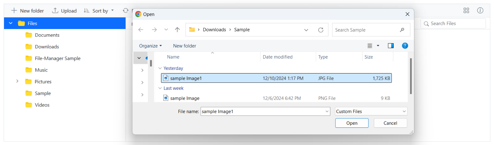

# Upload in Blazor FileManager component

The Blazor FileManager component provides a [FileManagerUploadSettings](https://help.syncfusion.com/cr/blazor/Syncfusion.Blazor.FileManager.FileManagerUploadSettings.html) feature that allows users to upload files to the FileManager. It provides various settings and options to customize how files are uploaded, such as controlling file size, restricting file types, and enabling chunk uploads.

## Directory Upload

The [DirectoryUpload](https://help.syncfusion.com/cr/blazor/Syncfusion.Blazor.FileManager.FileManagerUploadSettings.html#Syncfusion_Blazor_FileManager_FileManagerUploadSettings_DirectoryUpload) property controls whether users can browse and upload entire directories (folders) in the Syncfusion Blazor FileManager component. 

To enable directory upload, set the `DirectoryUpload` property to `true` in the `FileManagerUploadSettings` configuration.

When set to `true`, this property enables directory upload in the FileManager, allowing users to upload entire folders. If set to `false`, only individual files can be uploaded.

```cshtml

@using Syncfusion.Blazor.FileManager

<SfFileManager TValue="FileManagerDirectoryContent">
    <FileManagerUploadSettings DirectoryUpload  = "true"></FileManagerUploadSettings>
    <FileManagerAjaxSettings Url="https://ej2-aspcore-service.azurewebsites.net/api/FileManager/FileOperations"
                             UploadUrl="https://ej2-aspcore-service.azurewebsites.net/api/FileManager/Upload"
                             DownloadUrl="https://ej2-aspcore-service.azurewebsites.net/api//FileManager/Download"
                             GetImageUrl="https://ej2-aspcore-service.azurewebsites.net/api/test/FileManager/GetImage">
    </FileManagerAjaxSettings>
</SfFileManager>

```

The screenshot below shows after successfully selecting a directory it uploads all the file inside it automatically. This demonstrates how the `DirectoryUpload` property works in the Blazor FileManager component.


## Chunk Upload

The [ChunkSize](https://help.syncfusion.com/cr/blazor/Syncfusion.Blazor.FileManager.FileManagerUploadSettings.html#Syncfusion_Blazor_FileManager_FileManagerUploadSettings_ChunkSize) property specifies the size of each chunk when uploading large files. It divides the file into smaller parts, which are uploaded sequentially to the server

This property allows you to enable chunked uploads for large files by specifying a `ChunkSize`. When set, the file is split into smaller chunks, and each chunk is uploaded individually to the server in sequence. This approach improves upload efficiency and reliability, especially for large files.

By specifying a `ChunkSize`, the large file is divided into smaller parts, reducing the load on the network and making the upload process more efficient.

```cshtml

@using Syncfusion.Blazor.FileManager

<SfFileManager TValue="FileManagerDirectoryContent">
    <FileManagerUploadSettings DirectoryUpload="true" ChunkSize="5242880" MaxFileSize="73728000"></FileManagerUploadSettings>
    <FileManagerAjaxSettings Url="https://ej2-aspcore-service.azurewebsites.net/api/FileManager/FileOperations"
                             UploadUrl="https://ej2-aspcore-service.azurewebsites.net/api/FileManager/Upload"
                             DownloadUrl="https://ej2-aspcore-service.azurewebsites.net/api//FileManager/Download"
                             GetImageUrl="https://ej2-aspcore-service.azurewebsites.net/api/test/FileManager/GetImage">
    </FileManagerAjaxSettings>
</SfFileManager>

```
In the following example, the ChunkSize is set to 5 MB (5,242,880 bytes), and the MaxFileSize is set to 70 MB (73,728,000 bytes). This means files that are up to 70 MB will be uploaded in 5 MB chunks.

While using chunk upload, the Pause and Cancel features allow users to stop the upload completely, removing the file from the queue. Both actions provide greater control over the file upload process.


## Auto Upload and Auto Close

The [AutoUpload](https://help.syncfusion.com/cr/blazor/Syncfusion.Blazor.FileManager.FileManagerUploadSettings.html#Syncfusion_Blazor_FileManager_FileManagerUploadSettings_AutoUpload) property controls whether files are automatically uploaded when they are added to the upload queue in the FileManager component.

The default value is to `true`, the FileManager will automatically upload files as soon as they are added to the upload queue. If set to `false`, the files will not be uploaded automatically, giving you the chance to manipulate the files before uploading them to the server.

```cshtml

@using Syncfusion.Blazor.FileManager

<SfFileManager TValue="FileManagerDirectoryContent">
    <FileManagerUploadSettings AutoUpload = "false"></FileManagerUploadSettings>
    <FileManagerAjaxSettings Url="https://ej2-aspcore-service.azurewebsites.net/api/FileManager/FileOperations"
                             UploadUrl="https://ej2-aspcore-service.azurewebsites.net/api/FileManager/Upload"
                             DownloadUrl="https://ej2-aspcore-service.azurewebsites.net/api//FileManager/Download"
                             GetImageUrl="https://ej2-aspcore-service.azurewebsites.net/api/test/FileManager/GetImage">
    </FileManagerAjaxSettings>
</SfFileManager>

```

The screenshot demonstrates the AutoUpload property set to `false`. When disabled, files are added to the queue without being automatically uploaded, and the `Upload` and `Clear` buttons remain visible for manual control.


### Auto close

The [AutoClose](https://help.syncfusion.com/cr/blazor/Syncfusion.Blazor.FileManager.FileManagerUploadSettings.html#Syncfusion_Blazor_FileManager_FileManagerUploadSettings_AutoClose) property controls whether the upload dialog automatically closes after all the files have been uploaded.

The default value is set to `false`, the upload dialog remains open even after the upload process is complete. If `AutoClose` set to `true`, the upload dialog will automatically close after all the files in the upload queue are uploaded.

```cshtml

@using Syncfusion.Blazor.FileManager

<SfFileManager TValue="FileManagerDirectoryContent">
    <FileManagerUploadSettings  AutoClose="true"></FileManagerUploadSettings>
    <FileManagerAjaxSettings Url="https://ej2-aspcore-service.azurewebsites.net/api/FileManager/FileOperations"
                             UploadUrl="https://ej2-aspcore-service.azurewebsites.net/api/FileManager/Upload"
                             DownloadUrl="https://ej2-aspcore-service.azurewebsites.net/api//FileManager/Download"
                             GetImageUrl="https://ej2-aspcore-service.azurewebsites.net/api/test/FileManager/GetImage">
    </FileManagerAjaxSettings>
</SfFileManager>

```

The screenshot demonstrates after uploading the files, the upload dialog automatically closes, providing a seamless user experience once the upload is complete.


## Prevent upload based on file extensions

The [AllowedExtensions](https://help.syncfusion.com/cr/blazor/Syncfusion.Blazor.FileManager.FileManagerUploadSettings.html#Syncfusion_Blazor_FileManager_FileManagerUploadSettings_AllowedExtensions) property specifies which file types are allowed for upload in the FileManager component by defining their extensions.

This property lets you define which file types can be uploaded by specifying allowed extensions, separated by commas. For example, to allow only image files, you would set the `AllowedExtensions` property to .jpg,.png.

By setting the `AllowedExtensions` property, you restrict the file types that can be uploaded. Only files with the specified extensions will be accepted.

If you want to allow only image files like .jpg and .png, you would set the property as follows:

```cshtml

@using Syncfusion.Blazor.FileManager

<SfFileManager TValue="FileManagerDirectoryContent">
    <FileManagerUploadSettings  AllowedExtensions=".jpg,.png"></FileManagerUploadSettings>
    <FileManagerAjaxSettings Url="https://ej2-aspcore-service.azurewebsites.net/api/FileManager/FileOperations"
                             UploadUrl="https://ej2-aspcore-service.azurewebsites.net/api/FileManager/Upload"
                             DownloadUrl="https://ej2-aspcore-service.azurewebsites.net/api//FileManager/Download"
                             GetImageUrl="https://ej2-aspcore-service.azurewebsites.net/api/test/FileManager/GetImage">
    </FileManagerAjaxSettings>
</SfFileManager>

```


## Upload Mode

The [UploadMode](https://help.syncfusion.com/cr/blazor/Syncfusion.Blazor.FileManager.FileManagerUploadSettings.html#Syncfusion_Blazor_FileManager_FileManagerUploadSettings_UploadMode) property defines the method used to perform the upload operation in the FileManager component.

This property lets you choose between two upload modes. `FormSubmit` Uses the traditional form submission method for file uploads.
`HttpClient` Uses the HttpClient instance for the upload, providing more control over the request.

By default, the `UploadMode` is set to `FormSubmit`, but you can switch to HttpClient for more control, such as managing headers or authorizing the upload response.

```cshtml

@using Syncfusion.Blazor.FileManager

<SfFileManager TValue="FileManagerDirectoryContent">
    <FileManagerUploadSettings  UploadMode="UploadMode.FormSubmit"></FileManagerUploadSettings>
    <FileManagerAjaxSettings Url="https://ej2-aspcore-service.azurewebsites.net/api/FileManager/FileOperations"
                             UploadUrl="https://ej2-aspcore-service.azurewebsites.net/api/FileManager/Upload"
                             DownloadUrl="https://ej2-aspcore-service.azurewebsites.net/api//FileManager/Download"
                             GetImageUrl="https://ej2-aspcore-service.azurewebsites.net/api/test/FileManager/GetImage">
    </FileManagerAjaxSettings>
</SfFileManager>

```


## See also

* [Set min and max file size in upload](https://blazor.syncfusion.com/documentation/file-manager/how-to/upload-large-files)

* [Restrict drag and drop upload](https://blazor.syncfusion.com/documentation/file-manager/how-to/restrict-drag-and-drop-upload)
