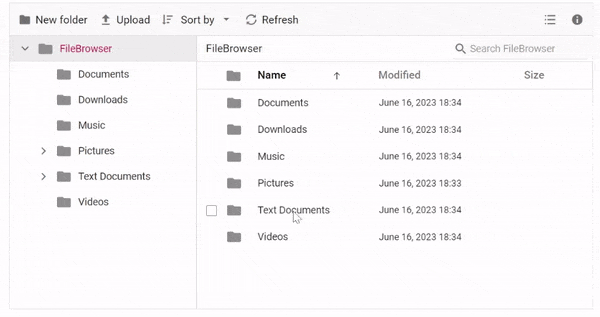

# Virtualization in Blazor File Manager Component

File Manager’s UI virtualization allows the dynamic loading of a large number of directories and files in both the [Details](https://help.syncfusion.com/cr/blazor/Syncfusion.Blazor.FileManager.ViewType.html#Syncfusion_Blazor_FileManager_ViewType_Details) and [LargeIcons](https://help.syncfusion.com/cr/blazor/Syncfusion.Blazor.FileManager.ViewType.html#Syncfusion_Blazor_FileManager_ViewType_LargeIcons) ViewType without degrading performance. The virtualization of the File Manager component is based on the height and width of the viewport. The items will be loaded in both **Details** and **LargeIcons** based on the viewport size.

To enable virtualization, set the [EnableVirtualization](https://help.syncfusion.com/cr/blazor/Syncfusion.Blazor.FileManager.SfFileManager-1.html#Syncfusion_Blazor_FileManager_SfFileManager_1_EnableVirtualization) property to `true`. 

Here is a sample demonstrating Virtualization enabled in the **Details** ViewType.

```cshtml

@using Syncfusion.Blazor.FileManager

<SfFileManager TValue="FileManagerDirectoryContent" View="ViewType.Details" EnableVirtualization="true">
        <FileManagerAjaxSettings Url="https://ej2-aspcore-service.azurewebsites.net/api/Virtualization/FileOperations"
                                 UploadUrl="https://ej2-aspcore-service.azurewebsites.net/api/Virtualization/Upload"
                                 DownloadUrl="https://ej2-aspcore-service.azurewebsites.net/api/Virtualization/Download"
                                 GetImageUrl="https://ej2-aspcore-service.azurewebsites.net/api/Virtualization/GetImage">
        </FileManagerAjaxSettings>        
    </SfFileManager>

```


The below GIF demonstrates the file loading when virtualization is enabled, a sizable collection of files can be found in the folders **Documents** and **Text Documents**..



## Limitations

* Programmatic selection using the [**SelectAllAsync**](https://help.syncfusion.com/cr/blazor/Syncfusion.Blazor.FileManager.SfFileManager-1.html#Syncfusion_Blazor_FileManager_SfFileManager_1_SelectAllAsync) method is not supported with virtual scrolling.
* The keyboard shortcut **CTRL+A** will only select the files and directories that are currently visible within the viewport, rather than selecting all files and directories in the entire directory tree.
* Selected file items are not maintained while scrolling and view switching, considering the performance of the component.
