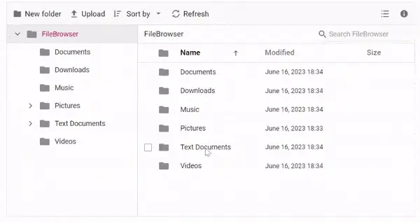

# Virtualization in Blazor File Manager Component

File Manager's UI virtualization enables dynamic loading of a large number of directories and files in both [Details](https://help.syncfusion.com/cr/blazor/Syncfusion.Blazor.FileManager.ViewType.html#Syncfusion_Blazor_FileManager_ViewType_Details) and [LargeIcons](https://help.syncfusion.com/cr/blazor/Syncfusion.Blazor.FileManager.ViewType.html#Syncfusion_Blazor_FileManager_ViewType_LargeIcons) view types without degrading performance. Virtualization dynamically loads items based on the viewport height and width.

To enable virtualization, set the [EnableVirtualization](https://help.syncfusion.com/cr/blazor/Syncfusion.Blazor.FileManager.SfFileManager-1.html#Syncfusion_Blazor_FileManager_SfFileManager_1_EnableVirtualization) property to `true`.

## Prerequisites

- Syncfusion Blazor FileManager NuGet package installed
- Backend AJAX service endpoints configured to handle FileOperations, Upload, Download, and GetImage requests
- .NET 6.0 or later; Blazor WebAssembly or Server-side Blazor

## Basic Example

The following example enables virtualization in Details view with a remote AJAX service:

```cshtml

@using Syncfusion.Blazor.FileManager

<SfFileManager TValue="FileManagerDirectoryContent" View="ViewType.Details" EnableVirtualization="true">
        <FileManagerAjaxSettings Url="https://physical-service.syncfusion.com/api/Virtualization/FileOperations"
                                 UploadUrl="https://physical-service.syncfusion.com/api/Virtualization/Upload"
                                 DownloadUrl="https://physical-service.syncfusion.com/api/Virtualization/Download"
                                 GetImageUrl="https://physical-service.syncfusion.com/api/Virtualization/GetImage">
        </FileManagerAjaxSettings>        
    </SfFileManager>

```


The GIF below demonstrates file loading with virtualization enabled across large folders like **Documents** and **Text Documents**:



## When to Use Virtualization

Enable virtualization when:
- Managing directories with **1,000+ files** to avoid rendering performance degradation
- Working with remote file systems (cloud storage, network paths) where lazy-loading improves responsiveness
- Supporting users on lower-end devices or slower networks

Do **not** enable virtualization for:
- Directories with fewer than 100 items (overhead outweighs benefits)
- Workflows requiring full directory selection (use standard view mode instead)
- Read-only file browsers where performance is not a bottleneck

## Limitations & Workarounds

* **SelectAllAsync not supported** — Programmatic selection using [SelectAllAsync](https://help.syncfusion.com/cr/blazor/Syncfusion.Blazor.FileManager.SfFileManager-1.html#Syncfusion_Blazor_FileManager_SfFileManager_1_SelectAllAsync) doesn't work with virtual scrolling. *Workaround:* Implement server-side bulk operations or pagination-based selection UI.

* **CTRL+A limited scope** — The keyboard shortcut selects only visible viewport items, not the entire directory. *Workaround:* Display a confirmation dialog prompting users to select all via the server or current view only.

* **Selection not persisted during scroll/view switch** — Selected items are cleared for performance optimization. *Workaround:* Store selections server-side or disable view switching during active selection workflows.
