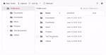

# Virtualization in Blazor FileManager Component

File Manager’s UI virtualization allows you for the dynamic loading of a large number of directories and files in both the detailsView and largeIconsView without degrading its performance. The virtualization of the File Manager component is based on the height and width of the viewport. The items will be loaded in both largeIconsView and detailsView based on the viewport size.

In order to enable virtualization, you must set the [EnableVirtualization](https://help.syncfusion.com/cr/blazor/Syncfusion.Blazor.FileManager.SfFileManager-1.html#Syncfusion_Blazor_FileManager_SfFileManager_1_EnableVirtualization) to true. 

In the instance below, a sizable collection of files can be found in the folders **Documents** and **Text Documents**.

```cshtml

@using Syncfusion.Blazor.FileManager

<SfFileManager TValue="FileManagerDirectoryContent" View="ViewType.Details" EnableVirtualization="true">
        <FileManagerAjaxSettings Url="https://ej2-aspcore-service.azurewebsites.net/api/Virtualization/FileOperations"
                                 UploadUrl="https://ej2-aspcore-service.azurewebsites.net/api/Virtualization/Upload"
                                 DownloadUrl="https://ej2-aspcore-service.azurewebsites.net/api/Virtualization/Download"
                                 GetImageUrl="https://ej2-aspcore-service.azurewebsites.net/api/Virtualization/GetImage">
        </FileManagerAjaxSettings>        
    </SfFileManager>

```

The below GIF demonstrates the file loading when virtualization is enabled.



## Limitations

* Programmatic selection using the selectAll method is not supported with virtual scrolling.
* The keyboard shortcut CTRL+A will only select the files and directories that are currently visible within the viewport, rather than selecting all files and directories in the entire directory tree.
* Selected file items are not maintained while scrolling and view switching, considering the performance of the component.
