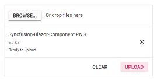

# Asynchronous upload

The uploader component allows you to upload the files asynchronously.
The upload process requires save and remove action URL to manage the upload process in the server.

    *   The save action is necessary to handle the upload operation.
    *   The remove action is optional, one can handle the removed files from server.

The file can be uploaded automatically or manually. For more information, you can refer to the [Auto Upload](https://help.syncfusion.com/cr/blazor/Syncfusion.Blazor.Inputs.SfUploader.html#Syncfusion_Blazor_Inputs_SfUploader_AutoUpload) section from the documentation.

## Multiple file upload

By Default, the uploader component allows you to select and upload multiple files simultaneously.
The selected files are organized in a list for every file selection until you clear it by clicking clear button that is shown in footer. You can add the multiple attributes to original input element of file by enabling the multiple file selection.
The following example explains about [AllowMultiple](https://help.syncfusion.com/cr/blazor/Syncfusion.Blazor.Inputs.SfUploader.html#Syncfusion_Blazor_Inputs_SfUploader_AllowMultiple) file upload settings.

`SaveUrl` and `RemoveUrl` action explained in this [link](./chunk-upload/#save-and-remove-action-for-blazor-aspnet-core-hosted-application).

```cshtml
@using Syncfusion.Blazor.Inputs

<SfUploader ID="UploadFiles">
<UploaderAsyncSettings SaveUrl="api/SampleData/Save" RemoveUrl="api/SampleData/Remove">
</UploaderAsyncSettings>
</SfUploader>
```

## Single file upload

You can select and upload a single file by disabling the [AllowMultiple](https://help.syncfusion.com/cr/blazor/Syncfusion.Blazor.Inputs.SfUploader.html#Syncfusion_Blazor_Inputs_SfUploader_AllowMultiple) file selection property.
The file list item is removed for every selection and it always maintain a single file to upload.
You can remove the multiple attributes form the original input element of file by enabling the single file upload property.

The following example explains about single file upload settings.

`SaveUrl` and `RemoveUrl` action explained in this [link](./chunk-upload/#save-and-remove-action-for-blazor-aspnet-core-hosted-application).

```cshtml
@using Syncfusion.Blazor.Inputs

<SfUploader ID="UploadFiles" AllowMultiple=false>
<UploaderAsyncSettings SaveUrl="api/SampleData/Save" RemoveUrl="api/SampleData/Remove">
</UploaderAsyncSettings>
</SfUploader>
```

## Auto upload

By default, the uploader processes the files to upload once the files are selected and added in upload queue. To upload manually, disable the [AutoUpload](https://help.syncfusion.com/cr/blazor/Syncfusion.Blazor.Inputs.SfUploader.html#Syncfusion_Blazor_Inputs_SfUploader_AutoUpload) property. When you disable this property, you can use the action buttons to call upload all or clear all actions manually. You can change those buttons text using the [Buttons](https://help.syncfusion.com/cr/blazor/Syncfusion.Blazor.Inputs.SfUploader.html#Syncfusion_Blazor_Inputs_SfUploader_Buttons) property in Uploader component.

`SaveUrl` and `RemoveUrl` action explained in this [link](./chunk-upload/#save-and-remove-action-for-blazor-aspnet-core-hosted-application).

```cshtml
@using Syncfusion.Blazor.Inputs

<SfUploader ID="UploadFiles" AllowMultiple=false AutoUpload=false>
<UploaderAsyncSettings SaveUrl="api/SampleData/Save" RemoveUrl="api/SampleData/Remove">
</UploaderAsyncSettings>
</SfUploader>
```

The auto upload output will be as follows.


The auto upload false output will be as follows.



## Sequential upload

By default, the uploader component process multiple files to upload simultaneously. When you enable the [SequentialUpload](https://help.syncfusion.com/cr/blazor/Syncfusion.Blazor.Inputs.SfUploader.html#Syncfusion_Blazor_Inputs_SfUploader_SequentialUpload) property, the selected files will process sequentially (one after the other) to the server. If the file uploaded successfully or failed, the next file will upload automatically in this sequential upload. This feature helps to reduce the upload traffic and reduce the failure of file upload.

`SaveUrl` and `RemoveUrl` action explained in this [link](./chunk-upload/#save-and-remove-action-for-blazor-aspnet-core-hosted-application).

```cshtml
@using Syncfusion.Blazor.Inputs

<SfUploader ID="UploadFiles" SequentialUpload=true AutoUpload=false>
<UploaderAsyncSettings SaveUrl="api/SampleData/Save" RemoveUrl="api/SampleData/Remove">
</UploaderAsyncSettings>
</SfUploader>
```

## Preload files

The uploader component allows you to preload the list of files that are uploaded in the server. The preloaded files are useful to view and remove the files from server that can be achieved by the [Files](https://help.syncfusion.com/cr/blazor/Syncfusion.Blazor.Inputs.SfUploader.html#Syncfusion_Blazor_Inputs_SfUploader_Files) property. By default, the files are configured with uploaded successfully state on rendering file list. The following properties are mandatory to configure the preloaded files:

* Name
* Size
* Type

`SaveUrl` and `RemoveUrl` action explained in this [link](./chunk-upload/#save-and-remove-action-for-blazor-aspnet-core-hosted-application).

```cshtml
@using Syncfusion.Blazor.Inputs

<SfUploader ID="UploadFiles" AutoUpload=false>
    <UploaderAsyncSettings SaveUrl="api/SampleData/Save" RemoveUrl="api/SampleData/Remove">
    </UploaderAsyncSettings>
    <UploaderFiles>
        <UploaderUploadedFiles Name="Nature" Size=500000 Type=".png"></UploaderUploadedFiles>
        <UploaderUploadedFiles Name="TypeScript Succinctly" Size=12000 Type=".pdf"></UploaderUploadedFiles>
        <UploaderUploadedFiles Name="ASP.NET Webhooks" Size=500000 Type=".docx"></UploaderUploadedFiles>
    </UploaderFiles>
</SfUploader>
```

The output will be as follows.


