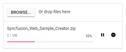

# Chunk Upload in Blazor File Upload Component

The Uploader component supports uploading large files by splitting them into smaller chunks and sending them to the server using AJAX. Chunking improves reliability on unstable networks and enables pause, resume, and retry for failed chunks.

N> The chunk upload works only with asynchronous upload.

To enable chunk upload, configure the [ChunkSize](https://help.syncfusion.com/cr/blazor/Syncfusion.Blazor.Inputs.SfUploader.html#Syncfusion_Blazor_Inputs_SfUploader_AsyncSettings) option with a value in bytes. The [OnChunkUploadStart](https://help.syncfusion.com/cr/blazor/Syncfusion.Blazor.Inputs.UploaderEvents.html#Syncfusion_Blazor_Inputs_UploaderEvents_OnChunkUploadStart) event is triggered at the beginning of the chunk upload process. Ensure the server endpoint specified in SaveUrl can accept and append chunk data and finalize the file when all chunks are received.

## Save and remove action for Blazor (ASP.NET Core hosted) application

The server-side implementation depends on application requirements. The following code demonstrates handling chunk uploads using the File Upload component.

> The `chunk-index` and `total-chunk` values are accessible through the form data using `Request.Form`, which retrieves these details from the incoming request.
* `chunk-index` - Indicates the index of the current chunk being received.
* `total-chunk` - Represents the total number of chunks for the file being uploaded.

```csharp
public string uploads = Path.Combine(Directory.GetCurrentDirectory(), "Uploaded Files"); // Set your desired upload directory path

public async Task<IActionResult> Save(IFormFile UploadFiles)
{
    try
    {
        if (UploadFiles.Length > 0)
        {
            var fileName = UploadFiles.FileName;

            // Create upload directory if it doesn't exist
            if (!Directory.Exists(uploads))
            {
                Directory.CreateDirectory(uploads);
            }

            if (UploadFiles.ContentType == "application/octet-stream") //Handle chunk upload
            {
                // Fetch chunk-index and total-chunk from form data
                var chunkIndex = Request.Form["chunk-index"];
                var totalChunk = Request.Form["total-chunk"];

                // Path to save the chunk files with .part extension
                var tempFilePath = Path.Combine(uploads, fileName + ".part");

                using (var fileStream = new FileStream(tempFilePath, chunkIndex == "0" ? FileMode.Create : FileMode.Append))
                {
                    await UploadFiles.CopyToAsync(fileStream);
                }

                // If all chunks are uploaded, move the file to the final destination
                if (Convert.ToInt32(chunkIndex) == Convert.ToInt32(totalChunk) - 1)
                {
                    var finalFilePath = Path.Combine(uploads, fileName);

                    // Move the .part file to the final destination without the .part extension
                    System.IO.File.Move(tempFilePath, finalFilePath);

                    return Ok(new { status = "File uploaded successfully" });
                }

                return Ok(new { status = "Chunk uploaded successfully" });
            }
            else //Handle normal upload
            {
                var filePath = Path.Combine(uploads, fileName);

                using (var fileStream = new FileStream(filePath, FileMode.Create))
                {
                    await UploadFiles.CopyToAsync(fileStream);
                }

                return Ok(new { status = "File uploaded successfully" });
            }
        }

        return BadRequest(new { status = "No file to upload" });
    }
    catch (Exception ex)
    {
        return StatusCode(500, new { status = "Error", message = ex.Message });
    }
}

// Method to handle file removal (optional if needed)
public async Task<IActionResult> Remove(string UploadFiles)
{
    try
    {
        var filePath = Path.Combine(uploads, UploadFiles);

        if (System.IO.File.Exists(filePath))
        {
            System.IO.File.Delete(filePath);
            return Ok(new { status = "File deleted successfully" });
        }
        else
        {
            return NotFound(new { status = "File not found" });
        }
    }
    catch (Exception ex)
    {
        return StatusCode(500, new { status = "Error", message = ex.Message });
    }
}
```

```cshtml
@using Syncfusion.Blazor.Inputs

<SfUploader ID="UploadFiles">
    <UploaderAsyncSettings SaveUrl="api/SampleData/Save" RemoveUrl="api/SampleData/Remove" ChunkSize="500000"></UploaderAsyncSettings>
    <UploaderEvents OnChunkUploadStart="@OnChunkUploadStartHandler" OnChunkSuccess="@OnChunkSuccessHandler" Success="@SuccessHandler" OnChunkFailure="@OnChunkFailureHandler"></UploaderEvents>
</SfUploader>
@code {
    private void OnChunkUploadStartHandler(UploadingEventArgs args)
    {
        // Here, you can customize your code.
    }
    private void OnChunkSuccessHandler(SuccessEventArgs args)
    {
        // Here, you can customize your code.
    }
    private void SuccessHandler(SuccessEventArgs args)
    {
        // Here, you can customize your code.
    }
    private void OnChunkFailureHandler(FailureEventArgs args)
    {
        // Here, you can customize your code.
    }
}
```



Chunk upload splits selected files into data blobs (chunks) and sends them via AJAX requests. Chunks are sent in sequential order, and the next chunk is sent only after the previous one succeeds. If any chunk fails, remaining chunks are not sent. The [ChunkSuccess](https://help.syncfusion.com/cr/blazor/Syncfusion.Blazor.Inputs.UploaderModel.html#Syncfusion_Blazor_Inputs_UploaderModel_ChunkSuccess) or [ChunkFailure](https://help.syncfusion.com/cr/blazor/Syncfusion.Blazor.Inputs.UploaderModel.html#Syncfusion_Blazor_Inputs_UploaderModel_ChunkFailure) event is triggered after each chunk transfer. When all chunks are successfully uploaded and combined on the server, the uploader [Success](https://help.syncfusion.com/cr/blazor/Syncfusion.Blazor.Inputs.UploaderEvents.html#Syncfusion_Blazor_Inputs_UploaderEvents_Success) event is triggered. For production scenarios, validate file size and type on the server, generate unique file names, write to a dedicated uploads directory, and sanitize user inputs.

N> Chunk upload works when the selected file size is greater than the specified chunk size; otherwise, files are uploaded using the default behavior.

## Save action configuration in server-side blazor

The uploader save action configuration in server-side blazor application, using MVC via `UseMvcWithDefaultRoute` in ASP.NET Core 3.0 and `services.AddMvc(option => option.EnableEndpointRouting = false).SetCompatibilityVersion(CompatibilityVersion.Version_3_0)` on IServiceCollection requires an explicit opt-in inside **Startup.cs** page. This is required because MVC must know whether it can rely on the authorization and CORS Middle ware during initialization.

```csharp
using Microsoft.AspNetCore.Mvc;

public void ConfigureServices(IServiceCollection services)
{
    services.AddMvc(option => option.EnableEndpointRouting = false).SetCompatibilityVersion(CompatibilityVersion.Version_3_0);
    services.AddRazorPages();
    services.AddServerSideBlazor();
    services.AddSingleton<WeatherForecastService>();
}

public void Configure(IApplicationBuilder app, IWebHostEnvironment env)
{
    if (env.IsDevelopment())
    {
        app.UseDeveloperExceptionPage();
    }
    else
    {
        app.UseExceptionHandler("/Error");
        app.UseHsts();
    }

    app.UseHttpsRedirection();
    app.UseStaticFiles();

    app.UseRouting();
    app.UseMvcWithDefaultRoute();

    app.UseEndpoints(endpoints =>
    {
        endpoints.MapBlazorHub<App>(selector: "app");
        endpoints.MapFallbackToPage("/_Host");
    });
}
```

## Additional configurations

To modify chunk upload behavior, the following options can be used.

* **RetryAfterDelay**: If an error occurs while sending any chunk request from JavaScript, the operation is held for 500 milliseconds (by default) and then retried. This can be configured through the [AsyncSettings](https://help.syncfusion.com/cr/blazor/Syncfusion.Blazor.Inputs.SfUploader.html#Syncfusion_Blazor_Inputs_SfUploader_AsyncSettings) property by specifying the interval in milliseconds.

* **RetryCount**: Specifies the number of retry attempts when a file fails to upload. By default, the retry action is performed 3 times. If the file continues to fail, the request is aborted and the uploader [Failure](https://help.syncfusion.com/cr/blazor/Syncfusion.Blazor.Inputs.UploaderModel.html#Syncfusion_Blazor_Inputs_UploaderModel_Failure) event triggers.

The following sample sets the chunk upload delay to 3000 milliseconds and the retry count to 5. The failure event triggers because an incorrect saveUrl is used.

`SaveUrl` and `RemoveUrl` actions are explained in this [link](./chunk-upload/#save-and-remove-action-for-blazor-aspnet-core-hosted-application).

```cshtml
@using Syncfusion.Blazor.Inputs

<SfUploader ID="UploadFiles">
    <UploaderAsyncSettings SaveUrl="api/SampleData/Save" RemoveUrl="api/SampleData/Remove" ChunkSize=500000 RetryCount=5 RetryAfterDelay =3000>
</UploaderAsyncSettings>
</SfUploader>
```

## Resumable upload

Chunk upload allows resuming an interrupted upload after a network failure or a manual pause. Pause and resume can be performed using public methods (`pause` and `resume`) as well as UI interactions. The pause icon becomes available after the upload begins. The [Paused](https://help.syncfusion.com/cr/blazor/Syncfusion.Blazor.Inputs.UploaderEvents.html#Syncfusion_Blazor_Inputs_UploaderEvents_Paused) event is triggered when pausing an upload, and the [OnResume](https://help.syncfusion.com/cr/blazor/Syncfusion.Blazor.Inputs.UploaderEvents.html#Syncfusion_Blazor_Inputs_UploaderEvents_OnResume) event is triggered when resuming to upload the remaining file. Ensure the server appends chunks consistently so that resume continues from the last successful chunk.

N> The pause and resume features are available only when chunk upload is enabled.

`SaveUrl` and `RemoveUrl` actions are explained in this [link](./chunk-upload/#save-and-remove-action-for-blazor-aspnet-core-hosted-application).

```cshtml
@using Syncfusion.Blazor.Inputs

<SfUploader ID="UploadFiles">
    <UploaderAsyncSettings SaveUrl="api/SampleData/Save" RemoveUrl="api/SampleData/Remove"  ChunkSize=500000>
</UploaderAsyncSettings>
<UploaderEvents OnResume="@OnResumeHandler" Paused="@PausedHandler"></UploaderEvents>
</SfUploader>
@code {
    private void OnResumeHandler(PauseResumeEventArgs args)
    {
        // Here, you can customize your code.
    }
    private void PausedHandler(PauseResumeEventArgs args)
    {
        // Here, you can customize your code.
    }
}
```


## Cancel upload

The uploader component allows canceling an uploading file. This can be done by selecting the cancel icon or by using the `Cancel` method. The [Canceling](https://help.syncfusion.com/cr/blazor/Syncfusion.Blazor.Inputs.UploaderModel.html#Syncfusion_Blazor_Inputs_UploaderModel_Canceling) event fires whenever the upload request is canceled. When canceling, any partially uploaded file data is removed from the server according to the server implementation.

When a request fails, the pause icon changes to a retry icon. Selecting the retry icon resends the failed chunk request and continues from the failure point. The canceled upload request can also be retried using the retry UI or `Retry` methods; in that case, the upload starts from the beginning.

The following example demonstrates chunk upload with cancel support.

`SaveUrl` and `RemoveUrl` actions are explained in this [link](./chunk-upload#save-and-remove-action-for-blazor-aspnet-core-hosted-application).

```cshtml
@using Syncfusion.Blazor.Inputs

<SfUploader ID="UploadFiles">
<UploaderAsyncSettings SaveUrl="api/SampleData/Save" RemoveUrl="api/SampleData/Remove" ChunkSize=500000>
</UploaderAsyncSettings>
</SfUploader>
```


N> The retry action has different behavior for chunk upload and default upload.
<br/> * Chunk upload: Retries the failed request from the point of failure.
<br/> * Default upload: Retries the failed file from the beginning.