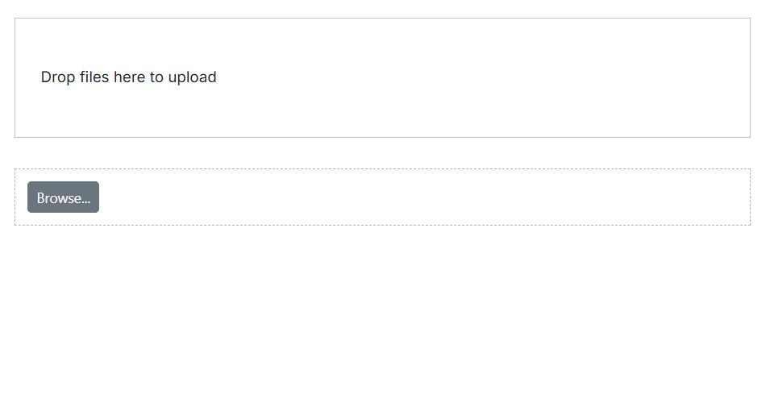
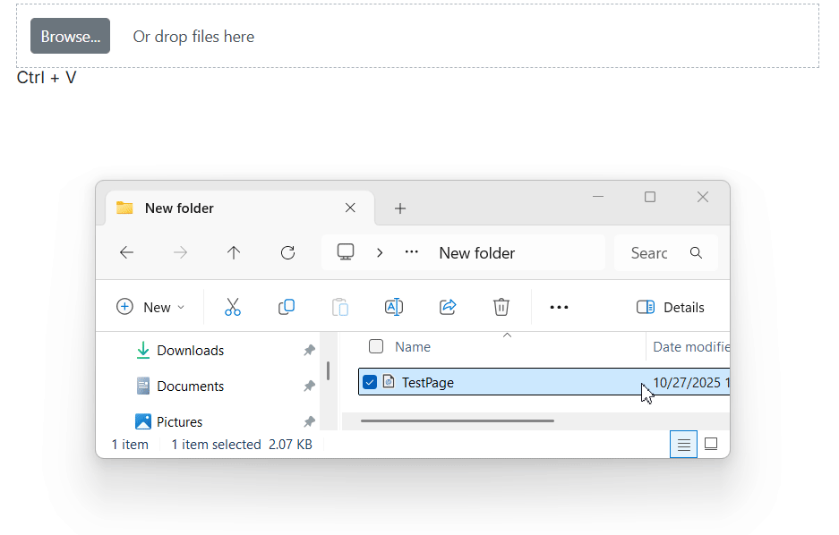

# Drag and drop in Blazor File Upload Component

The uploader component supports drag-and-drop file selection. Users can drag files from the file explorer and drop them into the drop area. By default, the uploader component acts as the drop area. The drop area is highlighted when files are dragged over it to indicate that dropping is supported.

## Custom DropArea

The uploader component allows configuring an external target element as the drop area by using the [DropArea](https://help.syncfusion.com/cr/blazor/Syncfusion.Blazor.Inputs.UploaderModel.html#Syncfusion_Blazor_Inputs_UploaderModel_DropArea) property. The element can be specified as an HTML element reference or by using the element’s ID.

```cshtml
@using Syncfusion.Blazor.Inputs

<div ID="DropArea">
    Drop files here to upload
</div>

<SfUploader ID="UploadFiles" AutoUpload="false" DropArea="#DropArea">
</SfUploader>

<style>
#DropArea {
    padding: 50px 25px;
    margin: 30px auto;
    border: 1px solid #c3c3c3;
    text-align: center;
    width: 100%;
    display: inline-flex;
}

.e-file-select,
.e-file-drop {
    display: none;
}

body .e-upload-drag-hover {
    outline: 2px dashed brown;
}

#uploadfile {
    width: 60%;
    display: inline-flex;
    margin-left: 5%;
}
</style>
```




## DropEffect

The uploader exposes a DropEffect property that controls the cursor feedback and allowed drop operation during drag-and-drop. Set this property to Default, Copy, Move, Link, or None. Default uses the browser’s behavior. Dropped files are added to the selected files list and processed according to component settings (for example, AutoUpload, SaveUrl/RemoveUrl, AllowedExtensions, MinFileSize, and MaxFileSize).

### Copy

Shows a copy cursor during drag-and-drop. Dropped files are added to the uploader’s selection without modifying the originals. Upload proceeds based on the component configuration.

```cshtml

@using Syncfusion.Blazor.Inputs

<SfUploader ID="UploadFiles" AutoUpload="false" DropEffect="DropEffect.Copy">
    <UploaderEvents FileSelected="onFileSelect"></UploaderEvents>
</SfUploader>

@code{
    private void onFileSelect(SelectedEventArgs args)
    {
        // here you can get dropped file data
    }
}

```




### Move

Shows a move cursor during drag-and-drop. Source files are not moved from their original location; the uploader only adds them to the selection and uploads according to configuration.

```cshtml

@using Syncfusion.Blazor.Inputs

<SfUploader ID="UploadFiles" AutoUpload="false" DropEffect="DropEffect.Move">
    <UploaderEvents FileSelected="onFileSelect"></UploaderEvents>
</SfUploader>

@code{
    private void onFileSelect(SelectedEventArgs args)
    {
        // here you can get dropped file data
    }
}

```




### Link

Shows a link cursor during drag-and-drop. This changes the cursor feedback only; upload behavior remains unchanged.

```cshtml

@using Syncfusion.Blazor.Inputs

<SfUploader ID="UploadFiles" AutoUpload="false" DropEffect="DropEffect.Link">
    <UploaderEvents FileSelected="onFileSelect"></UploaderEvents>
</SfUploader>

@code{
    private void onFileSelect(SelectedEventArgs args)
    {
        // here you can get dropped file data
    }
}

```




### None

Prevents dropping files on the uploader or the configured drop area. Use this when disabling drops is required regardless of validation rules.

```cshtml

@using Syncfusion.Blazor.Inputs

<SfUploader ID="UploadFiles" AutoUpload="false" DropEffect="DropEffect.None">
    <UploaderEvents FileSelected="onFileSelect"></UploaderEvents>
</SfUploader>

@code{
    private void onFileSelect(SelectedEventArgs args)
    {
        // here you can get dropped file data
    }
}

```




## Clipboard Paste

The File Upload component supports file selection through clipboard paste operations. Click on the uploader element and press Ctrl+V to paste files from the clipboard. The pasted files are added to the selected files list.

```cshtml
@using Syncfusion.Blazor.Inputs

<SfUploader ID="UploadFiles" AutoUpload="false">
    <UploaderEvents FileSelected="onFileSelect"></UploaderEvents>
</SfUploader>

@code{
    private void onFileSelect(SelectedEventArgs args)
    {
        // Access pasted file data here
    }
}
```


