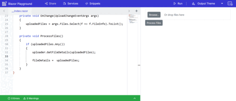

# File Upload Methods in Syncfusion Blazor Uploader

This section details the various methods available to interact with and manage the Syncfusion Blazor File Upload component programmatically.

### GetFileDetails

The [`GetFileDetails`](https://help.syncfusion.com/cr/blazor/Syncfusion.Blazor.Inputs.SfUploader.html#Syncfusion_Blazor_Inputs_SfUploader_GetFileDetails_System_Collections_Generic_List_Syncfusion_Blazor_Inputs_FileInfo__) method retrieves the details of all files currently selected or uploaded in the File Upload component. This is useful for validating file properties like size, type, and name before or after the upload process.

**Use Case:** Imagine a scenario where you want to display a summary of selected files, including their names and sizes, before the user initiates the actual upload. [`GetFileDetails`](https://help.syncfusion.com/cr/blazor/Syncfusion.Blazor.Inputs.SfUploader.html#Syncfusion_Blazor_Inputs_SfUploader_GetFileDetails_System_Collections_Generic_List_Syncfusion_Blazor_Inputs_FileInfo__) allows you to access this information.

```cshtml
<SfUploader @ref="uploader">
    <UploaderEvents ValueChange="@OnChange" />
</SfUploader>

<SfButton OnClick="ProcessFiles">Process Files</SfButton>

@if (fileDetails != null && fileDetails.Any())
{
    <h4>Processed File Details:</h4>
    <ul>
        @foreach (var file in uploadedFiles)
        {
            <li>@file.Name (@((file.Size / 1024).ToString("F2")) KB) - @file.Type</li>
        }
    </ul>
}

@code {
    SfUploader uploader;
    List<Syncfusion.Blazor.Inputs.FileInfo> uploadedFiles = new();
    List<Syncfusion.Blazor.Inputs.FileInfo> fileDetails;

    private void OnChange(UploadChangeEventArgs args)
    {
        uploadedFiles = args.Files.Select(f => f.FileInfo).ToList();
    }

    private void ProcessFiles()
    {
        if (uploadedFiles.Any())
        {
            uploader.GetFileDetails(uploadedFiles);

            fileDetails =  uploadedFiles;
        }
    }
}
```

> **Note:** The [`GetFileDetails`](https://help.syncfusion.com/cr/blazor/Syncfusion.Blazor.Inputs.SfUploader.html#Syncfusion_Blazor_Inputs_SfUploader_GetFileDetails_System_Collections_Generic_List_Syncfusion_Blazor_Inputs_FileInfo__) method returns a `List<FileInfo>` object, where each `FileInfo` contains properties like `Name`, `Size`, `Type`, etc., allowing for comprehensive inspection of selected files.






## GetFilesDataAsync

The [`GetFilesDataAsync`](https://help.syncfusion.com/cr/blazor/Syncfusion.Blazor.Inputs.SfUploader.html#Syncfusion_Blazor_Inputs_SfUploader_GetFilesDataAsync_System_Nullable_System_Double__) method retrieves a list of `FileInfo` objects representing the files that have been successfully uploaded through the File Upload component. This is particularly useful when you need to perform server-side operations on the uploaded files or update your UI based on the upload status.

**Use Case:** After a user uploads multiple files, you might want to display a success message listing the names of all successfully uploaded files, or store this information in a database. [`GetFilesDataAsync`](https://help.syncfusion.com/cr/blazor/Syncfusion.Blazor.Inputs.SfUploader.html#Syncfusion_Blazor_Inputs_SfUploader_GetFilesDataAsync_System_Nullable_System_Double__)  provides the necessary data to achieve this.

```cshtml
@using Syncfusion.Blazor.Inputs
@using Syncfusion.Blazor.Buttons
<SfUploader @ref="uploader" AutoUpload="true">
</SfUploader>
<SfButton OnClick="GetUploadedFiles">Get Uploaded Files</SfButton>

@if (uploadedFiles != null && uploadedFiles.Any())
{
    <h4>Uploaded Files:</h4>
    <ul>
        @foreach (var file in uploadedFiles)
        {
            <li>@file.Name - @file.Status</li>
        }
    </ul>
}

@code {
    SfUploader uploader;
    List<FileInfo> uploadedFiles;
    public async Task GetUploadedFiles()
    {
        uploadedFiles = await uploader.GetFilesDataAsync();
        // You can now process uploadedFiles, e.g., display them in a list.
    }
}
```

> **Note:** The `GetFilesDataAsync` method returns a `List<FileInfo>`, which includes important properties like `Name`, `Size`, `Type`, and `Status` (`Uploaded`, `Failed`, etc.) for each file that has gone through the upload process.




## UploadAsync

The [`UploadAsync`](https://help.syncfusion.com/cr/blazor/Syncfusion.Blazor.Inputs.SfUploader.html#Syncfusion_Blazor_Inputs_SfUploader_UploadAsync_Syncfusion_Blazor_Inputs_FileInfo___System_Nullable_System_Boolean__) method programmatically initiates the upload process for all selected files in the File Upload component. This method is particularly useful when [`AutoUpload`](https://help.syncfusion.com/cr/blazor/Syncfusion.Blazor.Inputs.SfUploader.html#Syncfusion_Blazor_Inputs_SfUploader_AutoUpload) is set to `false`, allowing the user to trigger the upload manually at a specific time, such as after reviewing their selections.

**Use Case:** Consider a scenario where users select several files, and then, after confirming their choices with a separate "Upload All" button, you want to start the file transfer. [`UploadAsync`](https://help.syncfusion.com/cr/blazor/Syncfusion.Blazor.Inputs.SfUploader.html#Syncfusion_Blazor_Inputs_SfUploader_UploadAsync_Syncfusion_Blazor_Inputs_FileInfo___System_Nullable_System_Boolean__) provides the means to trigger this action.

```cshtml
@using Syncfusion.Blazor.Inputs
@using Syncfusion.Blazor.Buttons
<SfUploader @ref="uploader" AutoUpload="false" AllowedExtensions=".png, .jpg, .jpeg">
</SfUploader>
<SfButton OnClick="UploadFiles">Upload Selected Files</SfButton>

@code {
    SfUploader uploader;

    public async Task UploadFiles()
    {
        await uploader.UploadAsync();
        // The upload process for all selected files is now initiated.
    }
}
```

> **Note:** When [`AutoUpload`](https://help.syncfusion.com/cr/blazor/Syncfusion.Blazor.Inputs.SfUploader.html#Syncfusion_Blazor_Inputs_SfUploader_AutoUpload) is set to `false`, calling [`UploadAsync`](https://help.syncfusion.com/cr/blazor/Syncfusion.Blazor.Inputs.SfUploader.html#Syncfusion_Blazor_Inputs_SfUploader_UploadAsync_Syncfusion_Blazor_Inputs_FileInfo___System_Nullable_System_Boolean__) is essential to begin the file transfer. If [`AutoUpload`](https://help.syncfusion.com/cr/blazor/Syncfusion.Blazor.Inputs.SfUploader.html#Syncfusion_Blazor_Inputs_SfUploader_AutoUpload) is `true`, files will start uploading automatically upon selection, and [`UploadAsync`](https://help.syncfusion.com/cr/blazor/Syncfusion.Blazor.Inputs.SfUploader.html#Syncfusion_Blazor_Inputs_SfUploader_UploadAsync_Syncfusion_Blazor_Inputs_FileInfo___System_Nullable_System_Boolean__) may not be necessary.




## CancelAsync

The [`CancelAsync`](https://help.syncfusion.com/cr/blazor/Syncfusion.Blazor.Inputs.SfUploader.html#Syncfusion_Blazor_Inputs_SfUploader_CancelAsync_Syncfusion_Blazor_Inputs_FileInfo___) method allows you to programmatically cancel the upload of a specific file or all ongoing uploads within the File Upload component. This is useful for providing users with the ability to stop an upload that is in progress, for example, if they selected the wrong file or decide not to proceed.

**Use Case:** Imagine a scenario where a large file is being uploaded, and the user realizes they picked the incorrect file. Providing a "Cancel" button that triggers [`CancelAsync`](https://help.syncfusion.com/cr/blazor/Syncfusion.Blazor.Inputs.SfUploader.html#Syncfusion_Blazor_Inputs_SfUploader_CancelAsync_Syncfusion_Blazor_Inputs_FileInfo___) for that specific file (or all uploads) would enhance the user experience by allowing them to halt the transfer.

```cshtml
@using Syncfusion.Blazor.Inputs
@using Syncfusion.Blazor.Buttons
<SfUploader @ref="uploader" AutoUpload="true">
</SfUploader>
<SfButton OnClick="CancelUploads">Cancel All Uploads</SfButton>

@code {
    SfUploader uploader;

    public async Task CancelUploads()
    {
        // To cancel all uploads
        await uploader.CancelAsync();

        // To cancel a specific file's upload, you would need its unique ID or a way to identify it.
        // For example, if you have a list of file IDs:
        // await uploader.CancelAsync(fileIdToCancel);
    }
}
```

> **Note:** To cancel a specific file's upload, you typically need to pass an identifier like a `fileInfo[]` to the CancelAsync method. Without an argument, it generally attempts to cancel all pending or in-progress uploads. The exact behavior might depend on the implementation of the Uploader component.




## ClearAllAsync

The [`ClearAllAsync`](https://help.syncfusion.com/cr/blazor/Syncfusion.Blazor.Inputs.SfUploader.html#Syncfusion_Blazor_Inputs_SfUploader_ClearAllAsync) method allows you to programmatically clear all selected or uploaded files from the File Upload component's internal list and UI. This is useful for resetting the component and preparing it for a new selection of files, or for cleaning up after a successful (or failed) upload operation.

**Use Case:** After a user has successfully uploaded a batch of files, you might want to automatically clear the file list in the uploader component so they can start a new upload session without manually removing each file. [`ClearAllAsync`](https://help.syncfusion.com/cr/blazor/Syncfusion.Blazor.Inputs.SfUploader.html#Syncfusion_Blazor_Inputs_SfUploader_ClearAllAsync) simplifies this process.

```cshtml
@using Syncfusion.Blazor.Inputs
@using Syncfusion.Blazor.Buttons
<SfUploader @ref="uploader" AllowedExtensions=".png, .jpg, .jpeg">
</SfUploader>
<SfButton OnClick="ClearFiles">Clear All Files</SfButton>

@code {
    SfUploader uploader;

    public async Task ClearFiles()
    {
        await uploader.ClearAllAsync();
        // All files are now removed from the component's internal state and UI.
    }
}
```

> **Note:** [`ClearAllAsync`](https://help.syncfusion.com/cr/blazor/Syncfusion.Blazor.Inputs.SfUploader.html#Syncfusion_Blazor_Inputs_SfUploader_ClearAllAsync)  only affects the client-side representation in the File Upload component. It does not automatically delete files from the server if they have already been uploaded. Server-side deletion would require a separate call to your server-side API.




## RemoveAsync

The [`RemoveAsync`](https://help.syncfusion.com/cr/blazor/Syncfusion.Blazor.Inputs.SfUploader.html#Syncfusion_Blazor_Inputs_SfUploader_RemoveAsync_Syncfusion_Blazor_Inputs_FileInfo___System_Nullable_System_Boolean__System_Nullable_System_Boolean__System_Nullable_System_Boolean__System_Object_) method allows you to programmatically remove a specific file from the File Upload component's display and internal tracking. This method is particularly useful when you need to enable users to delete individual files from the list of selected files before or after upload, or as part of a post-upload management process.

**Use Case:** If a user has selected several files but then decides to remove one particular file from the list before initiating the upload, [`RemoveAsync`](https://help.syncfusion.com/cr/blazor/Syncfusion.Blazor.Inputs.SfUploader.html#Syncfusion_Blazor_Inputs_SfUploader_RemoveAsync_Syncfusion_Blazor_Inputs_FileInfo___System_Nullable_System_Boolean__System_Nullable_System_Boolean__System_Nullable_System_Boolean__System_Object_) can be used. It's also applicable if you want to provide a delete option for individually uploaded files.

```cshtml
<SfUploader @ref="uploader" >
    <UploaderEvents ValueChange="@OnChange" />
</SfUploader>

<SfButton OnClick="RemoveSpecificFile">Remove First File</SfButton>

@code {
    private SfUploader uploader;
    private List<Syncfusion.Blazor.Inputs.FileInfo> uploadedFiles = new();

    private void OnChange(UploadChangeEventArgs args)
    {
        uploadedFiles = args.Files.Select(f => f.FileInfo).ToList();
    }

    private async Task RemoveSpecificFile()
    {
        if (uploadedFiles.Any())
        {
            var fileToRemove = uploadedFiles.First();
            await uploader.RemoveAsync(new[] { fileToRemove });
        }
    }
}
```

> **Note:** The [`RemoveAsync`](https://help.syncfusion.com/cr/blazor/Syncfusion.Blazor.Inputs.SfUploader.html#Syncfusion_Blazor_Inputs_SfUploader_RemoveAsync_Syncfusion_Blazor_Inputs_FileInfo___System_Nullable_System_Boolean__System_Nullable_System_Boolean__System_Nullable_System_Boolean__System_Object_) method typically requires the fileInfo[] of the file you wish to remove. If [`RemoveAsync`](https://help.syncfusion.com/cr/blazor/Syncfusion.Blazor.Inputs.SfUploader.html#Syncfusion_Blazor_Inputs_SfUploader_RemoveAsync_Syncfusion_Blazor_Inputs_FileInfo___System_Nullable_System_Boolean__System_Nullable_System_Boolean__System_Nullable_System_Boolean__System_Object_) is configured in [`UploaderAsyncSettings`](https://help.syncfusion.com/cr/blazor/Syncfusion.Blazor.Inputs.UploaderAsyncSettings.html), calling [`RemoveAsync`](https://help.syncfusion.com/cr/blazor/Syncfusion.Blazor.Inputs.SfUploader.html#Syncfusion_Blazor_Inputs_SfUploader_RemoveAsync_Syncfusion_Blazor_Inputs_FileInfo___System_Nullable_System_Boolean__System_Nullable_System_Boolean__System_Nullable_System_Boolean__System_Object_) will also trigger a server-side call to the specified [`RemoveAsync`](https://help.syncfusion.com/cr/blazor/Syncfusion.Blazor.Inputs.SfUploader.html#Syncfusion_Blazor_Inputs_SfUploader_RemoveAsync_Syncfusion_Blazor_Inputs_FileInfo___System_Nullable_System_Boolean__System_Nullable_System_Boolean__System_Nullable_System_Boolean__System_Object_) to handle server-side file deletion. If no [`RemoveAsync`](https://help.syncfusion.com/cr/blazor/Syncfusion.Blazor.Inputs.SfUploader.html#Syncfusion_Blazor_Inputs_SfUploader_RemoveAsync_Syncfusion_Blazor_Inputs_FileInfo___System_Nullable_System_Boolean__System_Nullable_System_Boolean__System_Nullable_System_Boolean__System_Object_) is configured, [`RemoveAsync`](https://help.syncfusion.com/cr/blazor/Syncfusion.Blazor.Inputs.SfUploader.html#Syncfusion_Blazor_Inputs_SfUploader_RemoveAsync_Syncfusion_Blazor_Inputs_FileInfo___System_Nullable_System_Boolean__System_Nullable_System_Boolean__System_Nullable_System_Boolean__System_Object_) will only remove the file from the client-side component.




