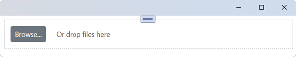

# Getting Started with Blazor File Upload Component

This guide describes how to integrate the Syncfusion<sup style="font-size:70%">&reg;</sup> Blazor File Upload component into a .NET MAUI Blazor application. It covers setup using Visual Studio and Visual Studio Code, adding required packages, registering resources, and rendering the component.





## Prerequisites

To use .NET MAUI project templates, install the Mobile development with .NET workload for Visual Studio. For details, refer to the .NET MAUI installation instructions or the Syncfusion Blazor extension documentation.

- .NET MAUI installation: https://learn.microsoft.com/en-us/dotnet/MAUI/get-started/installation?tabs=vswin
- Syncfusion Blazor Extension: https://blazor.syncfusion.com/documentation/visual-studio-integration/template-studio

## Create a new Blazor MAUI App in Visual Studio

Create a Blazor MAUI App using Visual Studio via [Microsoft Templates](https://learn.microsoft.com/en-us/dotnet/maui/get-started/first-app?pivots=devices-windows&view=net-maui-9.0&tabs=vswin). For detailed instructions, refer to [this Blazor MAUI App Getting Started](https://blazor.syncfusion.com/documentation/getting-started/maui-blazor-app) documentation.

## Install Syncfusion<sup style="font-size:70%">&reg;</sup> Blazor Inputs and Themes NuGet in the app

To use the Blazor File Upload component, install the following packages via the NuGet Package Manager (Tools → NuGet Package Manager → Manage NuGet Packages for Solution):

- Syncfusion.Blazor.Inputs
- Syncfusion.Blazor.Themes




Install-Package Syncfusion.Blazor.Inputs -Version {{ site.releaseversion }}
Install-Package Syncfusion.Blazor.Themes -Version {{ site.releaseversion }}




N> Syncfusion<sup style="font-size:70%">&reg;</sup> Blazor components are available in [nuget.org](https://www.nuget.org/packages?q=syncfusion.blazor). Refer to [NuGet packages](https://blazor.syncfusion.com/documentation/nuget-packages) topic for available NuGet packages list with component details.





## Prerequisites

Ensure the .NET MAUI workload is installed. Visual Studio Code uses the .NET CLI to create and manage projects. For details, see the .NET MAUI installation guide and the Syncfusion Blazor extension documentation for VS Code.

- .NET MAUI installation: https://learn.microsoft.com/en-us/dotnet/maui/get-started/installation?view=net-maui-9.0&tabs=visual-studio-code
- Syncfusion Blazor Extension (VS Code): https://blazor.syncfusion.com/documentation/visual-studio-code-integration/create-project

## Create a new Blazor MAUI App in Visual Studio Code

Create a Blazor MAUI App using Visual Studio Code via [Microsoft templates](https://learn.microsoft.com/en-us/dotnet/maui/get-started/first-app?pivots=devices-windows&view=net-maui-9.0&tabs=visual-studio-code) or the [Syncfusion® Blazor Extension](https://blazor.syncfusion.com/documentation/visual-studio-code-integration/create-project). For detailed instructions, refer to [this Blazor MAUI App Getting Started](https://blazor.syncfusion.com/documentation/getting-started/maui-blazor-app) documentation.

## Install Blazor Inputs and Themes NuGet in the App

To add **Blazor File Upload**  component in the app, open the NuGet package manager in Visual Studio (Tools → NuGet Package Manager → Manage NuGet Packages for Solution), search and install [Syncfusion.Blazor.Inputs](https://www.nuget.org/packages/Syncfusion.Blazor.Inputs) and [Syncfusion.Blazor.Themes](https://www.nuget.org/packages/Syncfusion.Blazor.Themes/).





dotnet add package Syncfusion.Blazor.Inputs -v {{ site.releaseversion }}
dotnet add package Syncfusion.Blazor.Themes -v {{ site.releaseversion }}
dotnet restore





N> Syncfusion<sup style="font-size:70%">&reg;</sup> Blazor components are available in [nuget.org](https://www.nuget.org/packages?q=syncfusion.blazor). Refer to [NuGet packages](https://blazor.syncfusion.com/documentation/nuget-packages) topic for available NuGet packages list with component details.





## Add Import Namespaces

Open **~/_Imports.razor** and import the `Syncfusion.Blazor` and `Syncfusion.Blazor.Inputs` namespaces.




@using Syncfusion.Blazor 
@using Syncfusion.Blazor.Inputs




## Register Syncfusion<sup style="font-size:70%">&reg;</sup> Blazor Service

Register the Syncfusion<sup style="font-size:70%">&reg;</sup> Blazor Service in the **~/MauiProgram.cs** file.




using Microsoft.Extensions.Logging;
using Syncfusion.Blazor;

namespace MauiBlazorWindow;

    public static class MauiProgram
    {
        public static MauiApp CreateMauiApp()
        {
            var builder = MauiApp.CreateBuilder();
            builder
                .UseMauiApp<App>()
                .ConfigureFonts(fonts =>
                {
                    fonts.AddFont("OpenSans-Regular.ttf", "OpenSansRegular");
                });

            builder.Services.AddMauiBlazorWebView();
            builder.Services.AddSyncfusionBlazor();
#if DEBUG
            builder.Services.AddBlazorWebViewDeveloperTools();
            builder.Logging.AddDebug();
#endif

            return builder.Build();
        }
    }




## Add stylesheet and script resources

The theme stylesheet and scripts are provided via Static Web Assets from NuGet. Add the references to the head section of ~/wwwroot/index.html in the MAUI project.

```html
<head>
    ....
    <link href="_content/Syncfusion.Blazor.Themes/bootstrap5.css" rel="stylesheet" />
    <script src="_content/Syncfusion.Blazor.Core/scripts/syncfusion-blazor.min.js" type="text/javascript"></script>

    //Blazor File Upload Component script reference.
    <!-- <script src="_content/Syncfusion.Blazor.Inputs/scripts/sf-uploader.min.js" type="text/javascript"></script> -->
</head>
```
N> Check out the [Blazor Themes](https://blazor.syncfusion.com/documentation/appearance/themes) topic to discover various methods ([Static Web Assets](https://blazor.syncfusion.com/documentation/appearance/themes#static-web-assets), [CDN](https://blazor.syncfusion.com/documentation/appearance/themes#cdn-reference), and [CRG](https://blazor.syncfusion.com/documentation/common/custom-resource-generator)) for referencing themes in your Blazor application. Also, check out the [Adding Script Reference](https://blazor.syncfusion.com/documentation/common/adding-script-references) topic to learn different approaches for adding script references in your Blazor application.

## Add Blazor File Upload component

Add the Syncfusion<sup style="font-size:70%">&reg;</sup> Blazor File Upload component in the **~/Pages/Index.razor** file.




<SfUploader></SfUploader>




### How to Run the Sample on Windows

Run the sample in Windows Machine mode to host the .NET MAUI Blazor app on Windows.



### How to Run the Sample on Android

To run the Blazor File Upload component in an Android .NET MAUI app using the Android emulator, follow these steps:

- Install and launch the Android emulator: https://learn.microsoft.com/en-us/dotnet/maui/android/emulator/device-manager#android-device-manager-on-windows

N> If issues occur with the Android Emulator, see Troubleshooting Android Emulator for guidance: https://learn.microsoft.com/en-us/dotnet/maui/android/emulator/troubleshooting.


## Without server-side API endpoint

Upload the files and files of folders in the Blazor application without specifying the server-side API end point using [AsyncSettings](https://help.syncfusion.com/cr/blazor/Syncfusion.Blazor.Inputs.UploaderAsyncSettings.html).

### Save and Remove actions

Get the uploaded files as file stream in the [ValueChange](https://help.syncfusion.com/cr/blazor/Syncfusion.Blazor.Inputs.UploaderEvents.html#Syncfusion_Blazor_Inputs_UploaderEvents_ValueChange) event argument. Now, you can write the save handler inside ValueChange event to save the files to desired location. Find the save action code below.




@using Syncfusion.Blazor.Inputs
<SfUploader AutoUpload="true">
      <UploaderEvents ValueChange="@OnChange"></UploaderEvents>
</SfUploader>
@code {
    private async Task OnChange(UploadChangeEventArgs args)
    {
        try
        {
            foreach (var file in args.Files)
            {
                var path = @"" + file.FileInfo.Name;
                FileStream filestream = new FileStream(path, FileMode.Create, FileAccess.Write);
                await file.File.OpenReadStream(long.MaxValue).CopyToAsync(filestream);
                filestream.Close();
            }
        }
        catch (Exception ex)
        {
            Console.WriteLine(ex.Message);
        }
    }
}





While clicking on the remove icon in the file list, you will get the [OnRemove](https://help.syncfusion.com/cr/blazor/Syncfusion.Blazor.Inputs.UploaderEvents.html#Syncfusion_Blazor_Inputs_UploaderEvents_OnRemove) event with removing file name as argument. So, you can write the remove handler inside OnRemove event to remove the particular file from desired location. Find the remove action code below.




Private void onRemove(RemovingEventArgs args)
{
    foreach(var removeFile in args.FilesData)
    {
        if (File.Exists(Path.Combine(@"rootPath", removeFile.Name)))
        {
            File.Delete(Path.Combine(@"rootPath", removeFile.Name))
        }
    }
}




## With server-side API endpoint

The upload process can also be integrated with server endpoints via SaveUrl and RemoveUrl to manage files on the server.

N> * The save action is required to handle file uploads on the server.
<br/> * The remove action is optional and handles deleting files on the server.

The save action handler upload the files that needs to be specified in the [SaveUrl](https://help.syncfusion.com/cr/blazor/Syncfusion.Blazor.Inputs.UploaderAsyncSettings.html#Syncfusion_Blazor_Inputs_UploaderAsyncSettings_SaveUrl) property.

The save handler receives the submitted files and manages the save process in server. After uploading the files to server location, the color of the selected file name changes to green and the remove icon is changed as bin icon.

The remove action is optional. The remove action handler removes the files that needs to be specified in the [RemoveUrl](https://help.syncfusion.com/cr/blazor/Syncfusion.Blazor.Inputs.UploaderAsyncSettings.html#Syncfusion_Blazor_Inputs_UploaderAsyncSettings_RemoveUrl) property. [OnActionComplete](https://help.syncfusion.com/cr/blazor/Syncfusion.Blazor.Inputs.UploaderEvents.html#Syncfusion_Blazor_Inputs_UploaderEvents_OnActionComplete) event triggers after all the selected files have been processed to upload successfully or failed to server.




[Route("api/[controller]")]
public class SampleDataController : Controller
{
    public string uploads = ".\\Uploaded Files"; // replace with your directory path

    [HttpPost("[action]")]
    public async Task<IActionResult> Save(IFormFile UploadFiles) // Save the uploaded file here
    {
        if (UploadFiles.Length > 0)
        {
            //Create directory if not exists
            if (!Directory.Exists(uploads))
            {
                Directory.CreateDirectory(uploads);
            }

            var filePath = Path.Combine(uploads, UploadFiles.FileName);
            if (System.IO.File.Exists(filePath))
            {
                //Return conflict status code
                return new StatusCodeResult(StatusCodes.Status409Conflict);
            }
            using (var fileStream = new FileStream(filePath, FileMode.Create))
            {
                //Save the uploaded file to server
                await UploadFiles.CopyToAsync(fileStream);
            }
        }
        return Ok();
    }


    [HttpPost("[action]")]
    public void Remove(string UploadFiles) // Delete the uploaded file here
    {
        if(UploadFiles != null)
        {
            var filePath = Path.Combine(uploads, UploadFiles);
            if (System.IO.File.Exists(filePath))
            {
                //Delete the file from server
                System.IO.File.Delete(filePath);
            }
        }
    }
}




The [OnFailure](https://help.syncfusion.com/cr/blazor/Syncfusion.Blazor.Inputs.UploaderEvents.html#Syncfusion_Blazor_Inputs_UploaderEvents_OnFailure) event is triggered when there is a failure in the AJAX request during the uploading or removing of files. It provides a way to handle and respond to any errors or issues that occur during the file upload or removal process.




<SfUploader ID="UploadFiles">
    <UploaderAsyncSettings SaveUrl="api/SampleData/Save" RemoveUrl="api/SampleData/Remove"></UploaderAsyncSettings>
    <UploaderEvents OnFailure="@OnFailureHandler" OnActionComplete="@OnActionCompleteHandler"></UploaderEvents>
</SfUploader>
@code {
    private void OnFailureHandler(FailureEventArgs args)
    {
        // Here, you can customize your code.
    }
    private void OnActionCompleteHandler(ActionCompleteEventArgs args)
    {
        // Here, you can customize your code.
    }
}




## Configure allowed file types

Allow the specific files alone to upload using the [AllowedExtensions](https://help.syncfusion.com/cr/blazor/Syncfusion.Blazor.Inputs.UploaderModel.html#Syncfusion_Blazor_Inputs_UploaderModel_AllowedExtensions) property. The extension can be represented as collection by comma separators. The uploader component filters the selected or dropped files to match against the specified file types and processes the upload operation. The validation happens when you specify value to inline attribute to accept the original input element.




<SfUploader AllowedExtensions=".doc, .docx, .xls, .xlsx"></SfUploader>






N> View the sample on GitHub for a complete getting-started example: https://github.com/SyncfusionExamples/Blazor-Getting-Started-Examples/tree/main/FileUpload.

## See also

1. [Getting started with Syncfusion<sup style="font-size:70%">&reg;</sup> Blazor for client-side in .NET Core CLI](https://blazor.syncfusion.com/documentation/getting-started/blazor-webassembly-dotnet-cli)
2. [Getting started with Syncfusion<sup style="font-size:70%">&reg;</sup> Blazor for client-side in Visual Studio](https://blazor.syncfusion.com/documentation/getting-started/blazor-webassembly-visual-studio)
3. [Getting started with Syncfusion<sup style="font-size:70%">&reg;</sup> Blazor for server-side in .NET Core CLI](https://blazor.syncfusion.com/documentation/getting-started/blazor-server-side-dotnet-cli)
4. [Getting started with Syncfusion<sup style="font-size:70%">&reg;</sup> File Upload in Blazor WebAssembly using Visual Studio](https://blazor.syncfusion.com/documentation/file-upload/how-to/getting-started-with-blazor-webassembly)