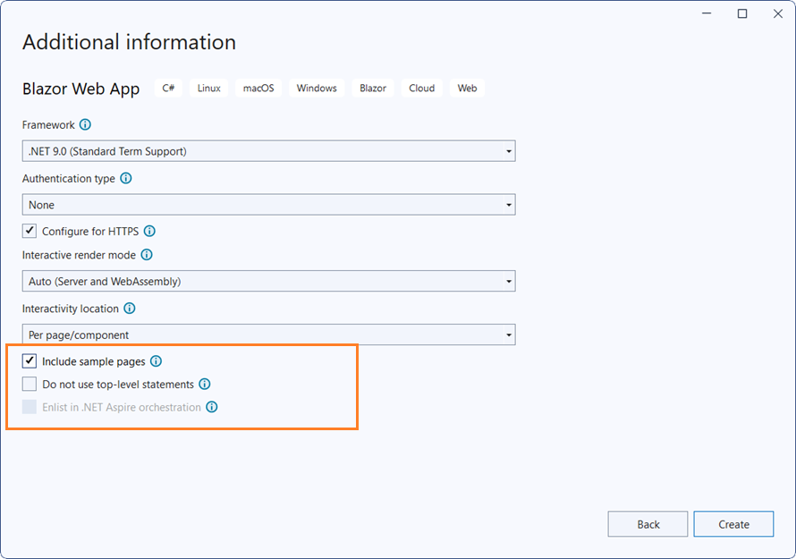

# Getting Started with Blazor File Upload Component in Web App

This section explains how to include the [Blazor File Upload](https://www.syncfusion.com/blazor-components/blazor-file-upload) component in a Blazor Web App using Visual Studio, Visual Studio Code, and the .NET CLI.





## Prerequisites

* [System requirements for Blazor components](https://blazor.syncfusion.com/documentation/system-requirements)

## Create a new Blazor Web App in Visual Studio

Create a **Blazor Web App** using Visual Studio 2022 via [Microsoft templates](https://learn.microsoft.com/en-us/aspnet/core/blazor/tooling?view=aspnetcore-8.0&pivots=vs) or the [Syncfusion<sup style="font-size:70%">&reg;</sup> Blazor Extension](https://blazor.syncfusion.com/documentation/visual-studio-integration/template-studio). For detailed instructions, refer to [this Blazor Web App Getting Started](https://blazor.syncfusion.com/documentation/getting-started/blazor-web-app) documentation.

Configure the appropriate [interactive render mode](https://learn.microsoft.com/en-us/aspnet/core/blazor/components/render-modes?view=aspnetcore-8.0#render-modes) and [interactivity location](https://learn.microsoft.com/en-us/aspnet/core/blazor/tooling?view=aspnetcore-8.0&pivots=vs) when creating the project.



## Install Syncfusion<sup style="font-size:70%">&reg;</sup> Blazor Inputs and Themes NuGet in the Blazor Web App

To add the **Blazor File Upload** component, open NuGet Package Manager in Visual Studio (Tools → NuGet Package Manager → Manage NuGet Packages for Solution), then install [Syncfusion.Blazor.Inputs](https://www.nuget.org/packages/Syncfusion.Blazor.Inputs/) and [Syncfusion.Blazor.Themes](https://www.nuget.org/packages/Syncfusion.Blazor.Themes/).

If using the `WebAssembly` or `Auto` render modes, install the Syncfusion<sup style="font-size:70%">&reg;</sup> Blazor NuGet packages in the client project.

Alternatively, use the following Package Manager commands.




Install-Package Syncfusion.Blazor.Inputs -Version {{ site.releaseversion }}
Install-Package Syncfusion.Blazor.Themes -Version {{ site.releaseversion }}




N> Syncfusion<sup style="font-size:70%">&reg;</sup> Blazor components are available on [nuget.org](https://www.nuget.org/packages?q=syncfusion.blazor). For a full list of packages and component details, see the [NuGet packages](https://blazor.syncfusion.com/documentation/nuget-packages) topic.





## Prerequisites

* [System requirements for Blazor components](https://blazor.syncfusion.com/documentation/system-requirements)

## Create a new Blazor Web App in Visual Studio Code

Create a **Blazor Web App** using Visual Studio Code via [Microsoft templates](https://learn.microsoft.com/en-us/aspnet/core/blazor/tooling?view=aspnetcore-8.0&pivots=vsc) or the [Syncfusion<sup style="font-size:70%">&reg;</sup> Blazor Extension](https://blazor.syncfusion.com/documentation/visual-studio-code-integration/create-project). For detailed instructions, refer to [this Blazor Web App Getting Started](https://blazor.syncfusion.com/documentation/getting-started/blazor-web-app?tabcontent=visual-studio-code) documentation.

Configure the appropriate interactive render mode and interactivity location during setup. For details, see the [interactive render mode documentation](https://blazor.syncfusion.com/documentation/common/interactive-render-mode).

For example, to create a Blazor Web App with the `Auto` interactive render mode:




dotnet new blazor -o BlazorWebApp -int Auto
cd BlazorWebApp
cd BlazorWebApp.Client




## Install Syncfusion<sup style="font-size:70%">&reg;</sup> Blazor Inputs and Themes NuGet in the App

If using the `WebAssembly` or `Auto` render modes, install Syncfusion<sup style="font-size:70%">&reg;</sup> Blazor NuGet packages in the client project.

* Press <kbd>Ctrl</kbd>+<kbd>`</kbd> to open the integrated terminal in Visual Studio Code.
* Ensure you are in the project directory that contains the target `.csproj` file.
* Run the following commands to install [Syncfusion.Blazor.Inputs](https://www.nuget.org/packages/Syncfusion.Blazor.Inputs) and [Syncfusion.Blazor.Themes](https://www.nuget.org/packages/Syncfusion.Blazor.Themes/), then restore packages.





dotnet add package Syncfusion.Blazor.Inputs -v {{ site.releaseversion }}
dotnet add package Syncfusion.Blazor.Themes -v {{ site.releaseversion }}
dotnet restore





N> Syncfusion<sup style="font-size:70%">&reg;</sup> Blazor components are available on [nuget.org](https://www.nuget.org/packages?q=syncfusion.blazor). For the complete package list with component details, see the [NuGet packages](https://blazor.syncfusion.com/documentation/nuget-packages) topic.





## Prerequisites

Install the latest [.NET SDK](https://dotnet.microsoft.com/en-us/download). To check the installed version, run the following command in a terminal or command prompt:




dotnet --version




## Create a Blazor Web App using .NET CLI

Run the following command to create a new Blazor Web App. For step-by-step guidance, see the [Blazor Web App getting started](https://blazor.syncfusion.com/documentation/getting-started/blazor-web-app?tabcontent=.net-cli) documentation.

Configure the appropriate interactive render mode and interactivity location during setup. For details, see the [interactive render mode documentation](https://blazor.syncfusion.com/documentation/common/interactive-render-mode).

For example, to create a Blazor Web App with the `Auto` interactive render mode:




dotnet new blazor -o BlazorApp -int Auto
cd BlazorApp
cd BlazorApp.Client




This command creates a new Blazor Web App in a directory named `BlazorApp` within the current location. See the [Create Blazor app](https://dotnet.microsoft.com/en-us/learn/aspnet/blazor-tutorial/create) and [dotnet new](https://learn.microsoft.com/en-us/aspnet/core/blazor/tooling?pivots=linux-macos&view=aspnetcore-8.0) topics for more details.

## Install Syncfusion<sup style="font-size:70%">&reg;</sup> Blazor Inputs and Themes NuGet in the App

Here's an example of how to add **Blazor File Upload** component in the application using the following command in the command prompt (Windows) or terminal (Linux and macOS) to install a [Syncfusion.Blazor.Inputs](https://www.nuget.org/packages/Syncfusion.Blazor.Inputs/) and [Syncfusion.Blazor.Themes](https://www.nuget.org/packages/Syncfusion.Blazor.Themes/) NuGet package. See [Install and manage packages using the dotnet CLI](https://learn.microsoft.com/en-us/nuget/consume-packages/install-use-packages-dotnet-cli) topics for more details.

If using the `WebAssembly` or `Auto` render modes, install packages in the client project.




dotnet add package Syncfusion.Blazor.Inputs --version {{ site.releaseversion }}
dotnet add package Syncfusion.Blazor.Themes --version {{ site.releaseversion }}
dotnet restore




N> Syncfusion<sup style="font-size:70%">&reg;</sup> Blazor components are available on [nuget.org](https://www.nuget.org/packages?q=syncfusion.blazor). For a complete package list, see the [NuGet packages](https://blazor.syncfusion.com/documentation/nuget-packages) topic.





## Add Import Namespaces

Open the **~/_Imports.razor** file in the client project and import the `Syncfusion.Blazor` and `Syncfusion.Blazor.Inputs` namespaces.




@using Syncfusion.Blazor
@using Syncfusion.Blazor.Inputs




## Register Syncfusion<sup style="font-size:70%">&reg;</sup> Blazor Service

Register the Syncfusion<sup style="font-size:70%">&reg;</sup> Blazor service in the **~/Program.cs** file of the Blazor Web App.

If the app uses `WebAssembly` or `Auto` interactive render modes, register the Syncfusion<sup style="font-size:70%">&reg;</sup> Blazor service in both the main Server project and the associated `.Client` project.




...
...
using Syncfusion.Blazor;

var builder = WebApplication.CreateBuilder(args);

// Add services to the container.
builder.Services.AddRazorComponents()
    .AddInteractiveServerComponents()
    .AddInteractiveWebAssemblyComponents();
builder.Services.AddSyncfusionBlazor();

var app = builder.Build();
....




...
using Syncfusion.Blazor;

var builder = WebAssemblyHostBuilder.CreateDefault(args);
builder.Services.AddSyncfusionBlazor();

await builder.Build().RunAsync();




## Add stylesheet and script resources

The theme stylesheet and script are available via [Static Web Assets](https://blazor.syncfusion.com/documentation/appearance/themes#static-web-assets). Add the stylesheet in the `<head>` and the script at the end of the `<body>` in **~/Components/App.razor** as shown below. When using the `WebAssembly` or `Auto` render modes, ensure the client project also references the required resources.

```html
<head>
    ....
    <link href="_content/Syncfusion.Blazor.Themes/bootstrap5.css" rel="stylesheet" />
</head>
....
<body>
    ....
    <script src="_content/Syncfusion.Blazor.Core/scripts/syncfusion-blazor.min.js" type="text/javascript"></script>

    //Blazor File Upload Component script reference.
    <!-- <script src="_content/Syncfusion.Blazor.Inputs/scripts/sf-uploader.min.js" type="text/javascript"></script> -->
</body>
```

N> See the [Blazor Themes](https://blazor.syncfusion.com/documentation/appearance/themes) topic for ways to reference themes ([Static Web Assets](https://blazor.syncfusion.com/documentation/appearance/themes#static-web-assets), [CDN](https://blazor.syncfusion.com/documentation/appearance/themes#cdn-reference), and [CRG](https://blazor.syncfusion.com/documentation/common/custom-resource-generator)). For adding scripts, see [Adding Script Reference](https://blazor.syncfusion.com/documentation/common/adding-script-references). If using the consolidated Syncfusion script, separate per-component scripts are typically not required.

## Add Syncfusion<sup style="font-size:70%">&reg;</sup> Blazor File Upload component

Add the Syncfusion<sup style="font-size:70%">&reg;</sup> Blazor File Upload component to a Razor page under the Pages folder (for example, Pages/Home.razor) in the **Server** or **Client** project. If the interactivity location is set to `Per page/component`, define a render mode at the top of the component as shown:

| Interactivity location | RenderMode | Code |
| --- | --- | --- |
| Per page/component | Auto | @rendermode InteractiveAuto |
|  | WebAssembly | @rendermode InteractiveWebAssembly |
|  | None | --- |

N> If the **Interactivity Location** is set to `Global` and the **Render Mode** is `Auto` or `WebAssembly`, the render mode is configured in `App.razor` by default.




@* desired render mode define here *@
@rendermode InteractiveAuto







<SfUploader></SfUploader>




* Press <kbd>Ctrl</kbd>+<kbd>F5</kbd> (Windows) or <kbd>⌘</kbd>+<kbd>F5</kbd> (macOS) to run the application. The Syncfusion<sup style="font-size:70%">&reg;</sup> Blazor File Upload component should render in the browser.



## Without server-side API endpoint

Upload files (and folder contents) without specifying a server-side API endpoint by using [AsyncSettings](https://help.syncfusion.com/cr/blazor/Syncfusion.Blazor.Inputs.UploaderAsyncSettings.html) and handling file streams in component events. This approach is suitable for local/demo scenarios. In production, validate file types and sizes, use unique file names, and store files in a secure, dedicated directory.

### Save and Remove actions

Access uploaded files as streams in the [ValueChange](https://help.syncfusion.com/cr/blazor/Syncfusion.Blazor.Inputs.UploaderEvents.html#Syncfusion_Blazor_Inputs_UploaderEvents_ValueChange) event and write them to the desired location. The following sample demonstrates the save action.




@using Syncfusion.Blazor.Inputs
<SfUploader AutoUpload="true">
      <UploaderEvents ValueChange="@OnChange"></UploaderEvents>
</SfUploader>
@code {
    private async Task OnChange(UploadChangeEventArgs args)
    {
        try
        {
            foreach (var file in args.Files)
            {
                var path = @"" + file.FileInfo.Name;
                FileStream filestream = new FileStream(path, FileMode.Create, FileAccess.Write);
                await file.File.OpenReadStream(long.MaxValue).CopyToAsync(filestream);
                filestream.Close();
            }
        }
        catch (Exception ex)
        {
            Console.WriteLine(ex.Message);
        }
    }
}





When selecting the remove icon in the file list, the [OnRemove](https://help.syncfusion.com/cr/blazor/Syncfusion.Blazor.Inputs.UploaderEvents.html#Syncfusion_Blazor_Inputs_UploaderEvents_OnRemove) event provides the file name to remove. Implement logic in the OnRemove event to delete the corresponding file from the chosen storage location. The following sample illustrates the remove action pattern.




Private void onRemove(RemovingEventArgs args)
{
    foreach(var removeFile in args.FilesData)
    {
        if (File.Exists(Path.Combine(@"rootPath", removeFile.Name)))
        {
            File.Delete(Path.Combine(@"rootPath", removeFile.Name))
        }
    }
}




## With server-side API endpoint

The upload process requires save and remove action URL to manage the upload process in the server.

N> * The save action is necessary to handle the upload operation.
<br/> * The remove action is optional, one can handle the removed files from server.

N> * The save action is required to process uploaded files on the server.
<br/> * The remove action is optional and is used to delete files from the server.

The save handler receives the submitted files and manages the save process in server. After uploading the files to server location, the color of the selected file name changes to green and the remove icon is changed as bin icon.

Specify the remove endpoint in the [RemoveUrl](https://help.syncfusion.com/cr/blazor/Syncfusion.Blazor.Inputs.UploaderAsyncSettings.html#Syncfusion_Blazor_Inputs_UploaderAsyncSettings_RemoveUrl) property. The [OnActionComplete](https://help.syncfusion.com/cr/blazor/Syncfusion.Blazor.Inputs.UploaderEvents.html#Syncfusion_Blazor_Inputs_UploaderEvents_OnActionComplete) event triggers after all selected files are processed (success or failure).




[Route("api/[controller]")]
public class SampleDataController : Controller
{
    public string uploads = ".\\Uploaded Files"; // replace with your directory path

    [HttpPost("[action]")]
    public async Task<IActionResult> Save(IFormFile UploadFiles) // Save the uploaded file here
    {
        if (UploadFiles.Length > 0)
        {
            //Create directory if not exists
            if (!Directory.Exists(uploads))
            {
                Directory.CreateDirectory(uploads);
            }

            var filePath = Path.Combine(uploads, UploadFiles.FileName);
            if (System.IO.File.Exists(filePath))
            {
                //Return conflict status code
                return new StatusCodeResult(StatusCodes.Status409Conflict);
            }
            using (var fileStream = new FileStream(filePath, FileMode.Create))
            {
                //Save the uploaded file to server
                await UploadFiles.CopyToAsync(fileStream);
            }
        }
        return Ok();
    }


    [HttpPost("[action]")]
    public void Remove(string UploadFiles) // Delete the uploaded file here
    {
        if(UploadFiles != null)
        {
            var filePath = Path.Combine(uploads, UploadFiles);
            if (System.IO.File.Exists(filePath))
            {
                //Delete the file from server
                System.IO.File.Delete(filePath);
            }
        }
    }
}




The [OnFailure](https://help.syncfusion.com/cr/blazor/Syncfusion.Blazor.Inputs.UploaderEvents.html#Syncfusion_Blazor_Inputs_UploaderEvents_OnFailure) event is triggered when there is a failure in the AJAX request during the uploading or removing of files. It provides a way to handle and respond to any errors or issues that occur during the file upload or removal process.




<SfUploader ID="UploadFiles">
    <UploaderAsyncSettings SaveUrl="api/SampleData/Save" RemoveUrl="api/SampleData/Remove"></UploaderAsyncSettings>
    <UploaderEvents OnFailure="@OnFailureHandler" OnActionComplete="@OnActionCompleteHandler"></UploaderEvents>
</SfUploader>
@code {
    private void OnFailureHandler(FailureEventArgs args)
    {
        // Here, you can customize your code.
    }
    private void OnActionCompleteHandler(ActionCompleteEventArgs args)
    {
        // Here, you can customize your code.
    }
}




## Configure allowed file types

Restrict uploads to specific file types using the [AllowedExtensions](https://help.syncfusion.com/cr/blazor/Syncfusion.Blazor.Inputs.UploaderModel.html#Syncfusion_Blazor_Inputs_UploaderModel_AllowedExtensions) property. Provide extensions as a comma-separated list. The Uploader filters selected or dropped files to match the specified types before uploading. For accurate client-side filtering, set the accept attribute on the underlying input element as needed.




<SfUploader AllowedExtensions=".doc, .docx, .xls, .xlsx"></SfUploader>






N> [View Sample in GitHub](https://github.com/SyncfusionExamples/Blazor-Getting-Started-Examples/tree/main/FileUpload).

## See also

1. [Getting Started with Syncfusion<sup style="font-size:70%">&reg;</sup> Blazor for client-side in .NET Core CLI](https://blazor.syncfusion.com/documentation/getting-started/blazor-webassembly-app)
2. [Getting Started with Syncfusion<sup style="font-size:70%">&reg;</sup> Blazor for client-side in Visual Studio](https://blazor.syncfusion.com/documentation/getting-started/blazor-webassembly-visual-studio)
3. [Getting Started with Syncfusion<sup style="font-size:70%">&reg;</sup> Blazor for server-side in .NET Core CLI](https://blazor.syncfusion.com/documentation/getting-started/blazor-web-app)
4. [Getting Started with Syncfusion<sup style="font-size:70%">&reg;</sup> File Upload in Blazor WebAssembly using Visual Studio](https://blazor.syncfusion.com/documentation/file-upload/how-to/getting-started-with-blazor-webassembly)