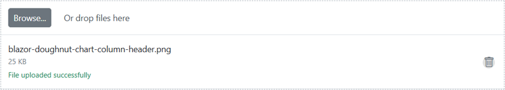

# Getting Started with Blazor File Upload Component in Web App

This section briefly explains about how to include [Blazor File Upload](https://www.syncfusion.com/blazor-components/blazor-file-upload) component in your Blazor Web App using [Visual Studio](https://visualstudio.microsoft.com/vs/), Visual Studio Code and .NET CLI.





## Prerequisites

* [System requirements for Blazor components](https://blazor.syncfusion.com/documentation/system-requirements)

## Create a new Blazor Web App in Visual Studio

You can create a **Blazor Web App** using Visual Studio 2022 via [Microsoft Templates](https://learn.microsoft.com/en-us/aspnet/core/blazor/tooling?view=aspnetcore-8.0&pivots=vs) or the [Syncfusion<sup style="font-size:70%">&reg;</sup> Blazor Extension](https://blazor.syncfusion.com/documentation/visual-studio-integration/template-studio). For detailed instructions, refer to [this Blazor Web App Getting Started](https://blazor.syncfusion.com/documentation/getting-started/blazor-web-app) documentation.

You need to configure the corresponding [Interactive render mode](https://learn.microsoft.com/en-us/aspnet/core/blazor/components/render-modes?view=aspnetcore-8.0#render-modes) and [Interactivity location](https://learn.microsoft.com/en-us/aspnet/core/blazor/tooling?view=aspnetcore-8.0&pivots=vs) while creating a Blazor Web Application.

## Install Syncfusion<sup style="font-size:70%">&reg;</sup> Blazor Inputs and Themes NuGet in the Blazor Web App

To add **Blazor File Upload** component in the app, open the NuGet package manager in Visual Studio (*Tools → NuGet Package Manager → Manage NuGet Packages for Solution*), search and install [Syncfusion.Blazor.Inputs](https://www.nuget.org/packages/Syncfusion.Blazor.Inputs/) and [Syncfusion.Blazor.Themes](https://www.nuget.org/packages/Syncfusion.Blazor.Themes/).

If you utilize `WebAssembly or Auto` render modes in the Blazor Web App need to be install Syncfusion<sup style="font-size:70%">&reg;</sup> Blazor components NuGet packages within the client project.

Alternatively, you can utilize the following package manager command to achieve the same.




Install-Package Syncfusion.Blazor.Inputs -Version {{ site.releaseversion }}
Install-Package Syncfusion.Blazor.Themes -Version {{ site.releaseversion }}




N> Syncfusion<sup style="font-size:70%">&reg;</sup> Blazor components are available in [nuget.org](https://www.nuget.org/packages?q=syncfusion.blazor). Refer to [NuGet packages](https://blazor.syncfusion.com/documentation/nuget-packages) topic for available NuGet packages list with component details.





## Prerequisites

* [System requirements for Blazor components](https://blazor.syncfusion.com/documentation/system-requirements)

## Create a new Blazor Web App in Visual Studio Code

You can create a **Blazor Web App** using Visual Studio Code via [Microsoft Templates](https://learn.microsoft.com/en-us/aspnet/core/blazor/tooling?view=aspnetcore-8.0&pivots=vsc) or the [Syncfusion<sup style="font-size:70%">&reg;</sup> Blazor Extension](https://blazor.syncfusion.com/documentation/visual-studio-code-integration/create-project). For detailed instructions, refer to [this Blazor Web App Getting Started](https://blazor.syncfusion.com/documentation/getting-started/blazor-web-app?tabcontent=visual-studio-code) documentation.

You need to configure the corresponding [Interactive render mode](https://learn.microsoft.com/en-us/aspnet/core/blazor/components/render-modes?view=aspnetcore-8.0#render-modes) and [Interactivity location](https://learn.microsoft.com/en-us/aspnet/core/blazor/tooling?view=aspnetcore-8.0&pivots=vsc) while creating a Blazor Web Application.

For example, in a Blazor Web App with the `Auto` interactive render mode, use the following commands.




dotnet new blazor -o BlazorWebApp -int Auto
cd BlazorWebApp
cd BlazorWebApp.Client




N> For more information on creating a **Blazor Web App** with various interactive modes and locations, refer to this [link](https://blazor.syncfusion.com/documentation/getting-started/blazor-web-app?tabcontent=visual-studio-code#render-interactive-modes).

## Install Syncfusion<sup style="font-size:70%">&reg;</sup> Blazor Inputs and Themes NuGet in the App

If you utilize `WebAssembly` or `Auto` render modes in the Blazor Web App need to be install Syncfusion<sup style="font-size:70%">&reg;</sup> Blazor components NuGet packages within the client project.

* Press <kbd>Ctrl</kbd>+<kbd>`</kbd> to open the integrated terminal in Visual Studio Code.
* Ensure you’re in the project root directory where your `.csproj` file is located.
* Run the following command to install a [Syncfusion.Blazor.Inputs](https://www.nuget.org/packages/Syncfusion.Blazor.Inputs) and [Syncfusion.Blazor.Themes](https://www.nuget.org/packages/Syncfusion.Blazor.Themes/) NuGet package and ensure all dependencies are installed.





dotnet add package Syncfusion.Blazor.Inputs -v {{ site.releaseversion }}
dotnet add package Syncfusion.Blazor.Themes -v {{ site.releaseversion }}
dotnet restore





N> Syncfusion<sup style="font-size:70%">&reg;</sup> Blazor components are available in [nuget.org](https://www.nuget.org/packages?q=syncfusion.blazor). Refer to [NuGet packages](https://blazor.syncfusion.com/documentation/nuget-packages) topic for available NuGet packages list with component details.





## Prerequisites

Latest version of the [.NET Core SDK](https://dotnet.microsoft.com/en-us/download). If you previously installed the SDK, you can determine the installed version by executing the following command in a command prompt (Windows) or terminal (macOS) or command shell (Linux).




dotnet --version




## Create a Blazor Web project using .NET CLI

Run the following command to create a new Blazor Web App in a command prompt (Windows) or terminal (macOS) or command shell (Linux).

For a Blazor Web App with `WebAssembly` interactive render mode & `Per page/component` interactivity location, use the following commands




dotnet new blazor -o BlazorApp -int WebAssembly
cd BlazorApp
cd BlazorApp.Client




For a Blazor Web App with `Auto` interactive render mode & `Per page/component` interactivity location, use the following commands




dotnet new blazor -o BlazorApp -int Auto
cd BlazorApp
cd BlazorApp.Client




This command creates new Blazor Web app project and places it in a new directory called `BlazorApp` inside your current location. See [Create Blazor app topic](https://dotnet.microsoft.com/en-us/learn/aspnet/blazor-tutorial/create) and [dotnet new CLI command](https://learn.microsoft.com/en-us/aspnet/core/blazor/tooling?pivots=linux-macos&view=aspnetcore-8.0) topics for more details.

## Install Syncfusion<sup style="font-size:70%">&reg;</sup> Blazor Inputs and Themes NuGet in the App

Here's an example of how to add **Blazor File Upload** component in the application using the following command in the command prompt (Windows) or terminal (Linux and macOS) to install a [Syncfusion.Blazor.Inputs](https://www.nuget.org/packages/Syncfusion.Blazor.Inputs/) and [Syncfusion.Blazor.Themes](https://www.nuget.org/packages/Syncfusion.Blazor.Themes/) NuGet package. See [Install and manage packages using the dotnet CLI](https://learn.microsoft.com/en-us/nuget/consume-packages/install-use-packages-dotnet-cli) topics for more details.

If you utilize `WebAssembly or Auto` render modes in the Blazor Web App need to be install Syncfusion<sup style="font-size:70%">&reg;</sup> Blazor components NuGet packages within the client project.




dotnet add package Syncfusion.Blazor.Inputs --version {{ site.releaseversion }}
dotnet add package Syncfusion.Blazor.Themes --version {{ site.releaseversion }}
dotnet restore




N> Syncfusion<sup style="font-size:70%">&reg;</sup> Blazor components are available in [nuget.org](https://www.nuget.org/packages?q=syncfusion.blazor). Refer to [NuGet packages](https://blazor.syncfusion.com/documentation/nuget-packages) topic for available NuGet packages list with component details.





## Add Import Namespaces

Open the **~/_Imports.razor** file from the client project and import the `Syncfusion.Blazor` and `Syncfusion.Blazor.Inputs` namespace.




@using Syncfusion.Blazor
@using Syncfusion.Blazor.Inputs




## Register Syncfusion<sup style="font-size:70%">&reg;</sup> Blazor Service

Register the Syncfusion<sup style="font-size:70%">&reg;</sup> Blazor Service in the **~/Program.cs** file of your Blazor Web App.

If the **Interactive Render Mode** is set to `WebAssembly` or `Auto`, you need to register the Syncfusion<sup style="font-size:70%">&reg;</sup> Blazor service in both **~/Program.cs** files of your Blazor Web App.




...
...
using Syncfusion.Blazor;

var builder = WebApplication.CreateBuilder(args);

// Add services to the container.
builder.Services.AddRazorComponents()
    .AddInteractiveServerComponents()
    .AddInteractiveWebAssemblyComponents();
builder.Services.AddSyncfusionBlazor();

var app = builder.Build();
....




...
using Syncfusion.Blazor;

var builder = WebAssemblyHostBuilder.CreateDefault(args);
builder.Services.AddSyncfusionBlazor();

await builder.Build().RunAsync();




## Add stylesheet and script resources

The theme stylesheet and script can be accessed from NuGet through [Static Web Assets](https://blazor.syncfusion.com/documentation/appearance/themes#static-web-assets). Include the stylesheet reference in the `<head>` section and the script reference at the end of the `<body>` in the **~/Components/App.razor** file as shown below:

```html
<head>
    ....
    <link href="_content/Syncfusion.Blazor.Themes/bootstrap5.css" rel="stylesheet" />
</head>
....
<body>
    ....
    <script src="_content/Syncfusion.Blazor.Core/scripts/syncfusion-blazor.min.js" type="text/javascript"></script>

    //Blazor File Upload Component script reference.
    <!-- <script src="_content/Syncfusion.Blazor.Inputs/scripts/sf-uploader.min.js" type="text/javascript"></script> -->
</body>
```

N> Check out the [Blazor Themes](https://blazor.syncfusion.com/documentation/appearance/themes) topic to discover various methods ([Static Web Assets](https://blazor.syncfusion.com/documentation/appearance/themes#static-web-assets), [CDN](https://blazor.syncfusion.com/documentation/appearance/themes#cdn-reference), and [CRG](https://blazor.syncfusion.com/documentation/common/custom-resource-generator)) for referencing themes in your Blazor application. Also, check out the [Adding Script Reference](https://blazor.syncfusion.com/documentation/common/adding-script-references) topic to learn different approaches for adding script references in your Blazor application.

## Add Syncfusion<sup style="font-size:70%">&reg;</sup> Blazor File Upload component

Add the Syncfusion<sup style="font-size:70%">&reg;</sup> Blazor File Upload component in `.razor` file inside the `Pages` folder. If an interactivity location as `Per page/component` in the web app, define a render mode at top of the component, as follows:

| Interactivity location | RenderMode | Code |
| --- | --- | --- |
| Per page/component | Auto | @rendermode InteractiveAuto |
|  | WebAssembly | @rendermode InteractiveWebAssembly |
|  | None | --- |

N> If an **Interactivity Location** is set to `Global` and the **Render Mode** is set to `Auto` or `WebAssembly`, the render mode is configured in the `App.razor` file by default.




@* desired render mode define here *@
@rendermode InteractiveAuto







<SfUploader></SfUploader>




* Press <kbd>Ctrl</kbd>+<kbd>F5</kbd> (Windows) or <kbd>⌘</kbd>+<kbd>F5</kbd> (macOS) to launch the application. This will render the Syncfusion<sup style="font-size:70%">&reg;</sup> Blazor File Upload component in your default web browser.



## Without server-side API endpoint

You can upload the files and files of folders in the Blazor application without specifying the server-side API end point using [AsyncSettings](https://help.syncfusion.com/cr/blazor/Syncfusion.Blazor.Inputs.UploaderAsyncSettings.html).

### Save and Remove actions

You can get the uploaded files as file stream in the [ValueChange](https://help.syncfusion.com/cr/blazor/Syncfusion.Blazor.Inputs.UploaderEvents.html#Syncfusion_Blazor_Inputs_UploaderEvents_ValueChange) event argument. Now, you can write the save handler inside ValueChange event to save the files to desired location. Find the save action code below.




@using Syncfusion.Blazor.Inputs
<SfUploader AutoUpload="true">
      <UploaderEvents ValueChange="@OnChange"></UploaderEvents>
</SfUploader>
@code {
    private async Task OnChange(UploadChangeEventArgs args)
    {
        try
        {
            foreach (var file in args.Files)
            {
                var path = @"" + file.FileInfo.Name;
                FileStream filestream = new FileStream(path, FileMode.Create, FileAccess.Write);
                await file.File.OpenReadStream(long.MaxValue).CopyToAsync(filestream);
                filestream.Close();
            }
        }
        catch (Exception ex)
        {
            Console.WriteLine(ex.Message);
        }
    }
}






While clicking on the remove icon in the file list, you will get the [OnRemove](https://help.syncfusion.com/cr/blazor/Syncfusion.Blazor.Inputs.UploaderEvents.html#Syncfusion_Blazor_Inputs_UploaderEvents_OnRemove) event with removing file name as argument. So, you can write the remove handler inside OnRemove event to remove the particular file from desired location. Find the remove action code below.




Private void onRemove(RemovingEventArgs args)
{
    foreach(var removeFile in args.FilesData)
    {
        if (File.Exists(Path.Combine(@"rootPath", removeFile.Name)))
        {
            File.Delete(Path.Combine(@"rootPath", removeFile.Name))
        }
    }
}




## With server-side API endpoint

The upload process requires save and remove action URL to manage the upload process in the server.

N> * The save action is necessary to handle the upload operation.
<br/> * The remove action is optional, one can handle the removed files from server.

The save action handler upload the files that needs to be specified in the [SaveUrl](https://help.syncfusion.com/cr/blazor/Syncfusion.Blazor.Inputs.UploaderAsyncSettings.html#Syncfusion_Blazor_Inputs_UploaderAsyncSettings_SaveUrl) property.

The save handler receives the submitted files and manages the save process in server. After uploading the files to server location, the color of the selected file name changes to green and the remove icon is changed as bin icon.

The remove action is optional. The remove action handler removes the files that needs to be specified in the [RemoveUrl](https://help.syncfusion.com/cr/blazor/Syncfusion.Blazor.Inputs.UploaderAsyncSettings.html#Syncfusion_Blazor_Inputs_UploaderAsyncSettings_RemoveUrl) property. [OnActionComplete](https://help.syncfusion.com/cr/blazor/Syncfusion.Blazor.Inputs.UploaderEvents.html#Syncfusion_Blazor_Inputs_UploaderEvents_OnActionComplete) event triggers after all the selected files have been processed to upload successfully or failed to server.




[Route("api/[controller]")]
public class SampleDataController : Controller
{
    public string uploads = ".\\Uploaded Files"; // replace with your directory path

    [HttpPost("[action]")]
    public async Task<IActionResult> Save(IFormFile UploadFiles) // Save the uploaded file here
    {
        if (UploadFiles.Length > 0)
        {
            //Create directory if not exists
            if (!Directory.Exists(uploads))
            {
                Directory.CreateDirectory(uploads);
            }

            var filePath = Path.Combine(uploads, UploadFiles.FileName);
            if (System.IO.File.Exists(filePath))
            {
                //Return conflict status code
                return new StatusCodeResult(StatusCodes.Status409Conflict);
            }
            using (var fileStream = new FileStream(filePath, FileMode.Create))
            {
                //Save the uploaded file to server
                await UploadFiles.CopyToAsync(fileStream);
            }
        }
        return Ok();
    }


    [HttpPost("[action]")]
    public void Remove(string UploadFiles) // Delete the uploaded file here
    {
        if(UploadFiles != null)
        {
            var filePath = Path.Combine(uploads, UploadFiles);
            if (System.IO.File.Exists(filePath))
            {
                //Delete the file from server
                System.IO.File.Delete(filePath);
            }
        }
    }
}




The [OnFailure](https://help.syncfusion.com/cr/blazor/Syncfusion.Blazor.Inputs.UploaderEvents.html#Syncfusion_Blazor_Inputs_UploaderEvents_OnFailure) event is triggered when there is a failure in the AJAX request during the uploading or removing of files. It provides a way to handle and respond to any errors or issues that occur during the file upload or removal process.




<SfUploader ID="UploadFiles">
    <UploaderAsyncSettings SaveUrl="api/SampleData/Save" RemoveUrl="api/SampleData/Remove"></UploaderAsyncSettings>
    <UploaderEvents OnFailure="@OnFailureHandler" OnActionComplete="@OnActionCompleteHandler"></UploaderEvents>
</SfUploader>
@code {
    private void OnFailureHandler(FailureEventArgs args)
    {
        // Here, you can customize your code.
    }
    private void OnActionCompleteHandler(ActionCompleteEventArgs args)
    {
        // Here, you can customize your code.
    }
}




## Configure allowed file types

You can allow the specific files alone to upload using the [AllowedExtensions](https://help.syncfusion.com/cr/blazor/Syncfusion.Blazor.Inputs.UploaderModel.html#Syncfusion_Blazor_Inputs_UploaderModel_AllowedExtensions) property. The extension can be represented as collection by comma separators. The uploader component filters the selected or dropped files to match against the specified file types and processes the upload operation. The validation happens when you specify value to inline attribute to accept the original input element.




<SfUploader AllowedExtensions=".doc, .docx, .xls, .xlsx"></SfUploader>






N> [View Sample in GitHub](https://github.com/SyncfusionExamples/Blazor-Getting-Started-Examples/tree/main/FileUpload).

## See also

1. [Getting Started with Syncfusion<sup style="font-size:70%">&reg;</sup> Blazor for client-side in .NET Core CLI](https://blazor.syncfusion.com/documentation/getting-started/blazor-webassembly-dotnet-cli)
2. [Getting Started with Syncfusion<sup style="font-size:70%">&reg;</sup> Blazor for client-side in Visual Studio](https://blazor.syncfusion.com/documentation/getting-started/blazor-webassembly-visual-studio)
3. [Getting Started with Syncfusion<sup style="font-size:70%">&reg;</sup> Blazor for server-side in .NET Core CLI](https://blazor.syncfusion.com/documentation/getting-started/blazor-server-side-dotnet-cli)
4. [Getting Started with Syncfusion<sup style="font-size:70%">&reg;</sup> File Upload in Blazor WebAssembly using Visual Studio](https://blazor.syncfusion.com/documentation/file-upload/how-to/getting-started-with-blazor-webassembly)

