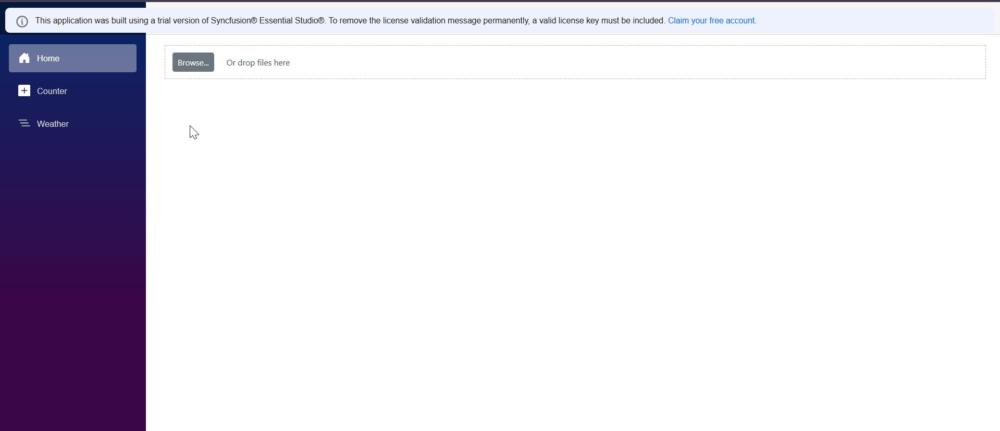
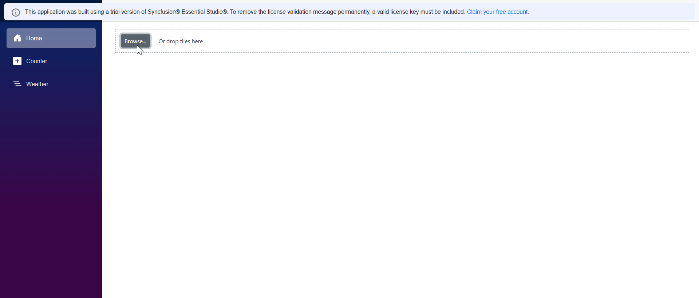
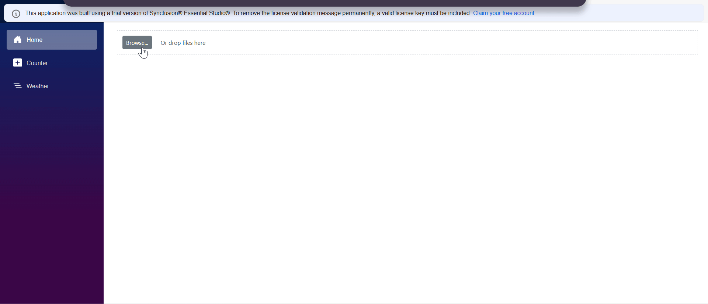

# Getting Started with Blazor File Upload Component

This section briefly explains how to include the [Blazor File Upload](https://www.syncfusion.com/blazor-components/blazor-file-upload) component in your Blazor WebAssembly App using Visual Studio, Visual Studio Code, and the .NET CLI.





## Prerequisites

*   [System requirements for Blazor components](https://blazor.syncfusion.com/documentation/system-requirements)

## Create a new Blazor App in Visual Studio

You can create a **Blazor WebAssembly App** using Visual Studio via [Microsoft Templates](https://learn.microsoft.com/en-us/aspnet/core/blazor/tooling?view=aspnetcore-9.0&pivots=vs) or the [Syncfusion<sup>&reg;</sup> Blazor Extension](https://blazor.syncfusion.com/documentation/visual-studio-integration/template-studio). For detailed instructions, refer to [this guide](https://blazor.syncfusion.com/documentation/getting-started/blazor-webassembly-app).

## Install Syncfusion<sup>&reg;</sup> Blazor Inputs and Themes NuGet in the App

To add the **Blazor File Upload** component in the app, open the NuGet package manager in Visual Studio (*Tools → NuGet Package Manager → Manage NuGet Packages for Solution*), search and install [Syncfusion.Blazor.Inputs](https://www.nuget.org/packages/Syncfusion.Blazor.Inputs) and [Syncfusion.Blazor.Themes](https://www.nuget.org/packages/Syncfusion.Blazor.Themes/). Alternatively, you can utilize the following package manager command to achieve the same.




Install-Package Syncfusion.Blazor.Inputs -Version {{ site.releaseversion }}
Install-Package Syncfusion.Blazor.Themes -Version {{ site.releaseversion }}




N> Syncfusion<sup>&reg;</sup> Blazor components are available in [nuget.org](https://www.nuget.org/packages?q=syncfusion.blazor). Refer to [NuGet packages](https://blazor.syncfusion.com/documentation/nuget-packages) topic for available NuGet packages list with component details.





## Prerequisites

*   [System requirements for Blazor components](https://blazor.syncfusion.com/documentation/system-requirements)

## Create a new Blazor App in Visual Studio Code

You can create a **Blazor WebAssembly App** using Visual Studio Code via [Microsoft Templates](https://learn.microsoft.com/en-us/aspnet/core/blazor/tooling?view=aspnetcore-7.0&pivots=vsc) or the [Syncfusion<sup>&reg;</sup> Blazor Extension](https://blazor.syncfusion.com/documentation/visual-studio-code-integration/create-project). For detailed instructions, refer to [this guide](https://blazor.syncfusion.com/documentation/getting-started/blazor-webassembly-app?tabcontent=visual-studio-code).

Alternatively, you can create a WebAssembly application using the following command in the terminal(<kbd>Ctrl</kbd>+<kbd>`</kbd>).





dotnet new blazorwasm -o BlazorApp
cd BlazorApp





## Install Syncfusion<sup>&reg;</sup> Blazor Inputs and Themes NuGet in the App

*   Press <kbd>Ctrl</kbd>+<kbd>`</kbd> to open the integrated terminal in Visual Studio Code.
*   Ensure you’re in the project root directory where your `.csproj` file is located.
*   Run the following command to install a [Syncfusion.Blazor.Inputs](https://www.nuget.org/packages/Syncfusion.Blazor.Inputs) and [Syncfusion.Blazor.Themes](https://www.nuget.org/packages/Syncfusion.Blazor.Themes/) NuGet package and ensure all dependencies are installed.





dotnet add package Syncfusion.Blazor.Inputs -v {{ site.releaseversion }}
dotnet add package Syncfusion.Blazor.Themes -v {{ site.releaseversion }}
dotnet restore





N> Syncfusion<sup>&reg;</sup> Blazor components are available in [nuget.org](https://www.nuget.org/packages?q=syncfusion.blazor). Refer to [NuGet packages](https://blazor.syncfusion.com/documentation/nuget-packages) topic for available NuGet packages list with component details.





## Prerequisites

Latest version of the [.NET Core SDK](https://dotnet.microsoft.com/en-us/download). If you previously installed the SDK, you can determine the installed version by executing the following command in a command prompt (Windows) or terminal (macOS) or command shell (Linux).




dotnet --version




## Create a Blazor WebAssembly project using .NET CLI

Run the `dotnet new blazorwasm` command to create a new Blazor WebAssembly application in a command prompt (Windows) or terminal (macOS) or command shell (Linux).




dotnet new blazorwasm -o BlazorApp
cd BlazorApp




This command creates new Blazor WebAssembly app project and places it in a new directory called `BlazorApp` inside your current location. See [Create Blazor app topic](https://dotnet.microsoft.com/en-us/learn/aspnet/blazor-tutorial/create) and [dotnet new CLI command](https://learn.microsoft.com/en-us/dotnet/core/tools/dotnet-new) topics for more details.

## Install Syncfusion<sup>&reg;</sup> Blazor Inputs and Themes NuGet in the App

Here's an example of how to add the **Blazor File Upload** component in the application using the following command in the command prompt (Windows) or terminal (Linux and macOS) to install a [Syncfusion.Blazor.Inputs](https://www.nuget.org/packages/Syncfusion.Blazor.Inputs/) and [Syncfusion.Blazor.Themes](https://www.nuget.org/packages/Syncfusion.Blazor.Themes/) NuGet package. See [Install and manage packages using the dotnet CLI](https://learn.microsoft.com/en-us/nuget/consume-packages/install-use-packages-dotnet-cli) topics for more details.




dotnet add package Syncfusion.Blazor.Inputs -Version {{ site.releaseversion }}
dotnet add package Syncfusion.Blazor.Themes -Version {{ site.releaseversion }}
dotnet restore




N> Syncfusion<sup>&reg;</sup> Blazor components are available in [nuget.org](https://www.nuget.org/packages?q=syncfusion.blazor). Refer to [NuGet packages](https://blazor.syncfusion.com/documentation/nuget-packages) topic for available NuGet packages list with component details.





## Add Import Namespaces

Open the **~/_Imports.razor** file and import the `Syncfusion.Blazor` and `Syncfusion.Blazor.Inputs` namespace.




@using Syncfusion.Blazor
@using Syncfusion.Blazor.Inputs




## Register Syncfusion<sup>&reg;</sup> Blazor Service

Register the Syncfusion<sup>&reg;</sup> Blazor Service in the **~/Program.cs** file of your Blazor WebAssembly App.




using Microsoft.AspNetCore.Components.Web;
using Microsoft.AspNetCore.Components.WebAssembly.Hosting;
using Syncfusion.Blazor;

var builder = WebAssemblyHostBuilder.CreateDefault(args);
builder.RootComponents.Add<App>("#app");
builder.RootComponents.Add<HeadOutlet>("head::after");

builder.Services.AddScoped(sp => new HttpClient { BaseAddress = new Uri(builder.HostEnvironment.BaseAddress) });

builder.Services.AddSyncfusionBlazor();
await builder.Build().RunAsync();
....




## Add Stylesheet and Script Resources

The theme stylesheet and script can be accessed from NuGet through [Static Web Assets](https://blazor.syncfusion.com/documentation/appearance/themes#static-web-assets). Include the stylesheet and script references in the `<head>` section of the **~/index.html** file.

```html
<head>
    ....
    <link href="_content/Syncfusion.Blazor.Themes/bootstrap5.css" rel="stylesheet" />
    <script src="_content/Syncfusion.Blazor.Core/scripts/syncfusion-blazor.min.js" type="text/javascript"></script>

    //Blazor File Upload Component script reference.
    <!-- <script src="_content/Syncfusion.Blazor.Inputs/scripts/sf-uploader.min.js" type="text/javascript"></script> -->
</head>
```
N> Check out the [Blazor Themes](https://blazor.syncfusion.com/documentation/appearance/themes) topic to discover various methods ([Static Web Assets](https://blazor.syncfusion.com/documentation/appearance/themes#static-web-assets), [CDN](https://blazor.syncfusion.com/documentation/appearance/themes#cdn-reference), and [CRG](https://blazor.syncfusion.com/documentation/common/custom-resource-generator)) for referencing themes in your Blazor application. Also, check out the [Adding Script Reference](https://blazor.syncfusion.com/documentation/common/adding-script-references) topic to learn different approaches for adding script references in your Blazor application.

## Add Syncfusion® Blazor File Upload component

The Syncfusion Blazor File Upload component allows you to seamlessly integrate file upload functionalities into your Blazor applications. It supports various features like asynchronous and synchronous uploads, file type validation, progress tracking, and custom templates. A common use case is enabling users to upload documents, images, or other files to a server, or process them directly within the client-side application.

## Simple Code to render a Usable File Upload Component

The most basic way to render the File Upload component is by adding the `<SfUploader>` tag to your `.razor` page. By default, this component provides a clean interface for users to select files locally.

Add the Syncfusion<sup style="font-size:70%">&reg;</sup> Blazor File Upload component in the **~/Components/Pages/Home.razor** file. If an interactivity location as `per page/component`, define a render mode at the top of the `Home.razor` page.

N> If an Interactivity Location is set to `Global` and the **Render Mode** is set to `Server`, the render mode is configured in the `App.razor` file by default.

```
@* desired render mode define here *@
@rendermode InteractiveServer
```




<SfUploader></SfUploader>




### Preview

*   Press <kbd>Ctrl</kbd>+<kbd>F5</kbd> (Windows) or <kbd>⌘</kbd>+<kbd>F5</kbd> (macOS) to launch the application. This will render the Syncfusion<sup style="font-size:70%">&reg;</sup> Blazor File Upload component in your default web browser.




## Use ValueChange Event

The [`ValueChange`](https://help.syncfusion.com/cr/blazor/Syncfusion.Blazor.Inputs.UploaderEvents.html#Syncfusion_Blazor_Inputs_UploaderEvents_ValueChange) event fires when files are selected or removed from the uploader. This event is crucial for client-side processing of selected files, allowing you to access file details and their content, which is useful for previewing files or handling uploads without a server-side endpoint.

### Code Example

This example demonstrates how to use the [`ValueChange`](https://help.syncfusion.com/cr/blazor/Syncfusion.Blazor.Inputs.UploaderEvents.html#Syncfusion_Blazor_Inputs_UploaderEvents_ValueChange) event to save uploaded files directly to a local directory when the [`AutoUpload`](https://help.syncfusion.com/cr/blazor/Syncfusion.Blazor.Inputs.SfUploader.html#Syncfusion_Blazor_Inputs_SfUploader_AutoUpload) property is set to `true`. This is useful for scenarios where you want to process files immediately after selection without an explicit upload button.




@using Syncfusion.Blazor.Inputs
@using System.IO

<SfUploader AutoUpload="true">
      <UploaderEvents ValueChange="@OnChange"></UploaderEvents>
</SfUploader>

@code {
    private async Task OnChange(UploadChangeEventArgs args)
    {
        try
        {
            foreach (var fileEntry in args.Files)
            {
                // Define a path where you want to save the file.
                // For a Blazor Server app, this path will be on the server.
                var uploadsFolder = Path.Combine(Directory.GetCurrentDirectory(), "wwwroot", "uploads");
                if (!Directory.Exists(uploadsFolder))
                {
                    Directory.CreateDirectory(uploadsFolder);
                }

                // Construct the full file path.
                var filePath = Path.Combine(uploadsFolder, fileEntry.FileInfo.Name);

                // Use a FileStream to write the uploaded file's content to the server.
                await using (var fileStream = new FileStream(filePath, FileMode.Create, FileAccess.Write))
                {
                    // OpenReadStream with long.MaxValue allows reading the entire stream.
                    await fileEntry.File.OpenReadStream(long.MaxValue).CopyToAsync(fileStream);
                }
                Console.WriteLine($"File '{fileEntry.FileInfo.Name}' saved successfully to '{filePath}'");
            }
        }
        catch (Exception ex)
        {
            Console.WriteLine($"Error saving file: {ex.Message}");
        }
    }
}




N> When saving files directly in a Blazor Server application using [`ValueChange`](https://help.syncfusion.com/cr/blazor/Syncfusion.Blazor.Inputs.UploaderEvents.html#Syncfusion_Blazor_Inputs_UploaderEvents_ValueChange) and [`AutoUpload`](https://help.syncfusion.com/cr/blazor/Syncfusion.Blazor.Inputs.SfUploader.html#Syncfusion_Blazor_Inputs_SfUploader_AutoUpload), the files are saved on the server where the Blazor Server app is running, not on the client's machine. You need appropriate file system permissions for the server process to write to the specified directory. Also, ensure the target directory (`wwwroot/uploads` in this example) exists or is created programmatically. In a production environment, consider secure storage solutions for uploaded files.

### Preview






## Memory stream

When you need to process uploaded files in memory—perhaps for resizing images, reading content, or sending them to another service without saving them to disk first—using a `MemoryStream` is an efficient approach. This is particularly useful for temporary processing or when dealing with sensitive data that shouldn't persist on the file system.

### Code Example

This example demonstrates how to read the content of an uploaded file into a [MemoryStream Class](https://learn.microsoft.com/en-us/dotnet/api/system.io.memorystream)`. This allows you to perform in-memory operations on the file, such as converting an image to a Base64 string, without requiring disk I/O.




@using Syncfusion.Blazor.Inputs
@using System.IO

<SfUploader AutoUpload="true">
      <UploaderEvents ValueChange="@OnValueChangeMemoryStream"></UploaderEvents>
</SfUploader>

@if (!string.IsNullOrEmpty(base64Image))
{
    <h4>Uploaded Image Preview (Base64)</h4>
    
}

@code {
    private string base64Image;

    private async Task OnValueChangeMemoryStream(UploadChangeEventArgs args)
    {
        base64Image = string.Empty; // Clear previous image

        foreach (var fileEntry in args.Files)
        {
            if (fileEntry.FileInfo.Type.StartsWith("image/", StringComparison.OrdinalIgnoreCase))
            {
                // Create a MemoryStream to hold the file content.
                using var memoryStream = new MemoryStream();
                
                // Copy the file's content from the upload stream to the MemoryStream.
                await fileEntry.File.OpenReadStream(long.MaxValue).CopyToAsync(memoryStream);
                
                // Convert the MemoryStream content to a byte array.
                byte[] imageBytes = memoryStream.ToArray();
                
                // Convert byte array to Base64 string for display or further processing.
                base64Image = Convert.ToBase64String(imageBytes);
                Console.WriteLine($"Image '{fileEntry.FileInfo.Name}' loaded into MemoryStream and converted to Base64.");
            }
            else
            {
                Console.WriteLine($"File '{fileEntry.FileInfo.Name}' is not an image and won't be processed for Base64 preview.");
                // For non-image files, you could read their content as text or handle differently.
                // Example for text file:
                // memoryStream.Position = 0; // Reset stream position
                // using var reader = new StreamReader(memoryStream);
                // var content = await reader.ReadToEndAsync();
                // Console.WriteLine($"Content of {fileEntry.FileInfo.Name}: {content}");
            }
        }
    }
}




N> When using `MemoryStream` for large files, be mindful of server memory consumption. If you expect very large files, consider processing them in chunks or saving them to temporary storage before processing to avoid out-of-memory exceptions. The `long.MaxValue` in `OpenReadStream` indicates the maximum buffer size. In a Blazor Server app, `Stream` operations occur on the server.

#### Preview



#### Gif




## Created Event

The [`Created`](https://help.syncfusion.com/cr/blazor/Syncfusion.Blazor.Inputs.UploaderEvents.html#Syncfusion_Blazor_Inputs_UploaderEvents_Created) event fires after the File Upload component has been rendered and initialized. This event is a good place to perform any initial setup, attach custom event listeners to the component's DOM elements, or apply custom styling that requires the component to be fully rendered.

### Code Example

This example shows how to use the [`Created`](https://help.syncfusion.com/cr/blazor/Syncfusion.Blazor.Inputs.UploaderEvents.html#Syncfusion_Blazor_Inputs_UploaderEvents_Created) event to add a custom message or dynamically change some aspect of the uploader's appearance right after it's created.




@using Syncfusion.Blazor.Inputs

<SfUploader>
    <UploaderEvents Created="@OnUploaderCreated"></UploaderEvents>
</SfUploader>

<p>@statusMessage</p>

@code {
    private string statusMessage = "Uploader not yet created.";

    private void OnUploaderCreated()
    {
        statusMessage = "Syncfusion File Uploader has been successfully created and initialized!";
        Console.WriteLine(statusMessage);
        // You could also interact with JavaScript to modify DOM here if needed.
        // For example: JSRuntime.InvokeVoidAsync("someJsFunction");
    }
}




N> The [`Created`](https://help.syncfusion.com/cr/blazor/Syncfusion.Blazor.Inputs.UploaderEvents.html#Syncfusion_Blazor_Inputs_UploaderEvents_Created) event is useful for client-side JavaScript interop if you need to manipulate the DOM elements of the uploader component immediately after it's ready. However, for most Blazor-specific customizations (like custom templates), you should use the built-in Blazor features.

### Preview




## File Selected Event

The [`FileSelected Event`](https://help.syncfusion.com/cr/blazor/Syncfusion.Blazor.Inputs.UploaderEvents.html#Syncfusion_Blazor_Inputs_UploaderEvents_FileSelected)event is triggered when files are chosen from the file explorer dialog, but **before** the [`ValueChange`](https://help.syncfusion.com/cr/blazor/Syncfusion.Blazor.Inputs.UploaderEvents.html#Syncfusion_Blazor_Inputs_UploaderEvents_ValueChange) event. This event provides an opportunity to perform validations on the selected files (e.g., file size, type, count) and decide whether to proceed with the upload/value change or cancel the selection. It's ideal for immediate client-side feedback or preventative actions.

### Code Example

This example demonstrates how to use the [FileSelected Event](https://help.syncfusion.com/cr/blazor/Syncfusion.Blazor.Inputs.UploaderEvents.html#Syncfusion_Blazor_Inputs_UploaderEvents_FileSelected) event to prevent files larger than a certain size.




@using Syncfusion.Blazor.Inputs
@using System.Linq

<SfUploader >
    <UploaderEvents FileSelected="@OnFileSelected"></UploaderEvents>
</SfUploader>
<p>@validationMessage</p>

@code {
    private string validationMessage = "";
    private readonly long MaxFileSize = 1024 * 1024; // 1 MB

    private void OnFileSelected(SelectedEventArgs args)
    {
        validationMessage = "";
        foreach (var file in args.FilesData)
        {
            if (file.Size > MaxFileSize)
            {
                validationMessage += $"Error: File '{file.Name}' exceeds {MaxFileSize / (1024 * 1024)} MB limit. ";
                args.Cancel = true; // Prevents this file from being added
            }
        }
        if (!string.IsNullOrEmpty(validationMessage))
        {
            Console.WriteLine(validationMessage);
        }
        else
        {
            Console.WriteLine("Files selected successfully and passed initial validation.");
        }
    }
}




N> Setting `args.Cancel = true` in the `FileSelected` event will prevent the file (or files if `args.Files` contains multiple) from being added to the uploader's internal file list. This is a client-side validation and should be complemented with server-side validation for robust security and data integrity.

### Preview






## OnFileListRender

The [`OnFileListRender`](https://help.syncfusion.com/cr/blazor/Syncfusion.Blazor.Inputs.UploaderEvents.html#Syncfusion_Blazor_Inputs_UploaderEvents_OnFileListRender) event allows you to customize individual file list items before they are rendered in the uploader's UI. This is highly useful for scenarios where you need to display additional information alongside each file, such as a custom preview, metadata, or actions.

### Code Example 

This example demonstrates how to use [`OnFileListRender`](https://help.syncfusion.com/cr/blazor/Syncfusion.Blazor.Inputs.UploaderEvents.html#Syncfusion_Blazor_Inputs_UploaderEvents_OnFileListRender) 




@using Syncfusion.Blazor.Inputs

<SfUploader @ref="fileobj" AutoUpload="false">
    <UploaderEvents OnFileListRender="@OnFileListRenderHandler"></UploaderEvents>
    <UploaderAsyncSettings SaveUrl="https://blazor.syncfusion.com/services/production/api/FileUploader/Save" RemoveUrl="https://blazor.syncfusion.com/services/production/api/FileUploader/Remove"></UploaderAsyncSettings>
</SfUploader>

@code {
    SfUploader fileobj;
    private void OnFileListRenderHandler(FileListRenderingEventArgs args)
    {
      
    }
}





N> [View Sample in GitHub](https://github.com/SyncfusionExamples/Blazor-Getting-Started-Examples/tree/main/FileUpload).


## See also

* [Getting Started with Syncfusion<sup style="font-size:70%">&reg;</sup> Blazor for Client-Side in .NET Core CLI](https://blazor.syncfusion.com/documentation/getting-started/blazor-webassembly-app)
* [Getting Started with Syncfusion<sup style="font-size:70%">&reg;</sup> Blazor for Server-side in Visual Studio](https://blazor.syncfusion.com/documentation/getting-started/blazor-server-side-visual-studio)
* [Getting Started with Syncfusion<sup style="font-size:70%">&reg;</sup> Blazor for Server-Side in .NET Core CLI](https://blazor.syncfusion.com/documentation/getting-started/blazor-web-app)
* [Getting Started with Syncfusion<sup style="font-size:70%">&reg;</sup> File Upload in Blazor WebAssembly using Visual Studio](https://blazor.syncfusion.com/documentation/file-upload/how-to/getting-started-with-blazor-webassembly)
* [How to convert images to Base64 string with Blazor File Upload](https://support.syncfusion.com/kb/article/21178/how-to-convert-images-to-base64-string-with-blazor-file-upload)
