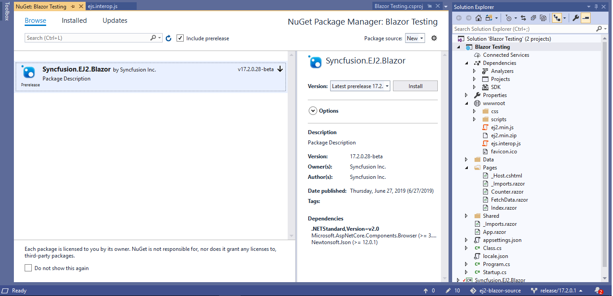
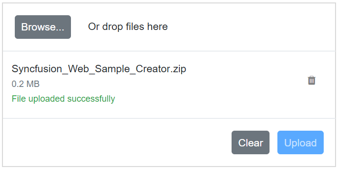

# Getting Started

This article provides a step-by-step instructions to configure Syncfusion Blazor File Upload in a simple Blazor WebAssembly application using [Visual Studio 2019](https://visualstudio.microsoft.com/vs/).

> **Note:** Starting with version 17.4.0.39 (2019 Volume 4), you need to include a valid license key (either paid or trial key) within your applications. Please refer to this [help topic](https://help.syncfusion.com/common/essential-studio/licensing/license-key#blazor) for more information.

## Prerequisites

* [Visual Studio 2019](https://visualstudio.microsoft.com/vs/)
* [.NET Core SDK 3.1.3](https://dotnet.microsoft.com/download/dotnet-core/3.1)

> **Note:** .NET Core SDK 3.1.3 requires Visual Studio 2019 16.6 or later.
>
> Syncfusion Blazor components are compatible with .NET Core 5.0 Preview 6 and it requires Visual Studio 16.7 Preview 1 or later.

## Create a Blazor WebAssembly project in Visual Studio 2019

1. Install the essential project templates in the Visual Studio 2019 by running the below command line in the command prompt.

    ```bash
    dotnet new -i Microsoft.AspNetCore.Components.WebAssembly.Templates::3.2.0-rc1.20223.4
    ````

2. Choose **Create a new project** from the Visual Studio dashboard.

    

3. Select **Blazor App** from the template and click **Next** button.

    

4. Now, the project configuration window will popup. Click **Create** button to create a new project with the default project configuration.

    

5. Choose **Blazor WebAssembly App** from the dashboard and click **Create** button to create a new Blazor WebAssembly application. Make sure **.NET Core** and **ASP.NET Core 3.1** is selected at the top.

    

> **Note:** ASP.NET Core 3.1 available in Visual Studio 2019 version.

## Importing Syncfusion Blazor component in the application

1. Now, install **Syncfusion.Blazor** NuGet package to the newly created application by using the **NuGet Package Manager**. Right-click the project and select Manage NuGet Packages.

    

2. Search **Syncfusion.Blazor** keyword in the Browser tab and install **Syncfusion.Blazor** NuGet package in the application.

    

3. The Syncfusion Blazor package will be installed in the project, once the installation process is completed.

4. Open **~/_Imports.razor** file and import the `Syncfusion.Blazor`.

    ```csharp
    @using Syncfusion.Blazor
    @using Syncfusion.Blazor.Inputs
    ```

5. Open the **~/Program.cs** file and register the Syncfusion Blazor Service.

    ```csharp
    using Syncfusion.Blazor;

    namespace WebApplication1
    {
        public class Program
        {
            public static async Task Main(string[] args)
            {
                ....
                ....
                builder.Services.AddSyncfusionBlazor();
                await builder.Build().RunAsync();
            }
        }
    }
    ```

6. Add the Syncfusion bootstrap4 theme in the `<head>` element of the **~/wwwroot/index.html** page.

    ```html
    <head>
        ....
        ....
        <link href="_content/Syncfusion.Blazor/styles/bootstrap4.css" rel="stylesheet" />
    </head>
    ```

    > **Note:** The same theme file can be referred through the CDN version by using [`https://cdn.syncfusion.com/blazor/{:version:}/styles/bootstrap4.css`](https://cdn.syncfusion.com/blazor/18.2.44/styles/bootstrap4.css).
    > To use manual scripts other than the scripts from NuGet package, register the Blazor service in **~/Program.cs** file by using true parameter as mentioned below.

     ```csharp
    using Syncfusion.Blazor;

     namespace WebApplication1
     {
         public class Program
       {
             public static async Task Main(string[] args)
             {
                ....
                ....
                builder.Services.AddSyncfusionBlazor(true);
                await builder.Build.RunAsync();
             }
         }
     }
     ```

## Adding uploader component to the application

To initialize the uploader component add the below code to your `Index.razor` view page which is present under `~/Pages` folder.

```csharp
<SfUploader></SfUploader>
```

## Run the application

After successful compilation of your application, press `F5` to run the application.

The output will be as follows.


## Without server-side API endpoint

You can upload the files and files of folders in the Blazor application without specifying the server-side API end point using [AsyncSettings](https://help.syncfusion.com/cr/blazor/Syncfusion.Blazor.Inputs.UploaderAsyncSettings.html).

### Save and Remove actions

You can get the uploaded files as file stream in the [ValueChange](https://help.syncfusion.com/cr/blazor/Syncfusion.Blazor.Inputs.UploaderEvents.html#Syncfusion_Blazor_Inputs_UploaderEvents_ValueChange)  event argument. Now, you can write the save handler inside ValueChange event to save the files to desired location. Please find the save action code on below.

```csharp
<SfUploader AutoUpload="false">
    <UploaderEvents ValueChange="OnChange"></UploaderEvents>
</SfUploader>

@code {

    private void OnChange(UploadChangeEventArgs args)
    {
        foreach (var file in args.Files)
        {
            var path = @"path" + file.FileInfo.Name;
            FileStream filestream = new FileStream(path, FileMode.Create, FileAccess.Write);
            file.Stream.WriteTo(filestream);
            filestream.Close();
            file.Stream.Close();
        }
    }
}
```

The output will be as follows.



While clicking on the remove icon in the file list, you will get the [OnRemove](https://help.syncfusion.com/cr/blazor/Syncfusion.Blazor.Inputs.UploaderEvents.html#Syncfusion_Blazor_Inputs_UploaderEvents_OnRemove) event with removing file name as argument. So, you can write the remove handler inside OnRemove event to remove the particular file from desired location. Please find the remove action code on below.

```csharp
Private void onRemove(RemovingEventArgs args)
{
    foreach(var removeFile in args.FilesData)
    {
        if (File.Exists(Path.Combine(@"rootPath", removeFile.Name)))
        {
            File.Delete(Path.Combine(@"rootPath", removeFile.Name))
        }
    }
}
```

## With server-side API endpoint

The upload process requires save and remove action URL to manage the upload process in the server.

> * The save action is necessary to handle the upload operation.
> * The remove action is optional, one can handle the removed files from server.

The save action handler upload the files that needs to be specified in the [SaveUrl](https://help.syncfusion.com/cr/blazor/Syncfusion.Blazor.Inputs.UploaderAsyncSettings.html#Syncfusion_Blazor_Inputs_UploaderAsyncSettings_SaveUrl) property.

The save handler receives the submitted files and manages the save process in server. After uploading the files to server location, the color of the selected file name changes to green and the remove icon is changed as bin icon.

The remove action is optional. The remove action handler removes the files that needs to be specified in the [RemoveUrl](https://help.syncfusion.com/cr/blazor/Syncfusion.Blazor.Inputs.UploaderAsyncSettings.html#Syncfusion_Blazor_Inputs_UploaderAsyncSettings_RemoveUrl) property.

 ```csharp
[Route("api/[controller]")]

    private IHostingEnvironment hostingEnv;

    public SampleDataController(IHostingEnvironment env)
    {
        this.hostingEnv = env;
    }

    [HttpPost("[action]")]
    public void Save(IList<IFormFile> UploadFiles)
    {
        long size = 0;
        try
        {
            foreach (var file in UploadFiles)
            {
                var filename = ContentDispositionHeaderValue
                        .Parse(file.ContentDisposition)
                        .FileName
                        .Trim('"');
                    filename = hostingEnv.ContentRootPath + $@"\{filename}";
                    size += (int)file.Length;
                if (!System.IO.File.Exists(filename))
                {
                    using (FileStream fs = System.IO.File.Create(filename))
                    {
                        file.CopyTo(fs);
                        fs.Flush();
                    }
                }
            }
        }
        catch (Exception e)
        {
            Response.Clear();
            Response.StatusCode = 204;
            Response.HttpContext.Features.Get<IHttpResponseFeature>().ReasonPhrase = "File failed to upload";
            Response.HttpContext.Features.Get<IHttpResponseFeature>().ReasonPhrase = e.Message;
        }
    }
    [HttpPost("[action]")]
    public void Remove(IList<IFormFile> UploadFiles)
    {
        try
        {
            var filename = hostingEnv.ContentRootPath + $@"\{UploadFiles[0].FileName}";
            if (System.IO.File.Exists(filename))
            {
                System.IO.File.Delete(filename);
            }
        }
        catch (Exception e)
        {
            Response.Clear();
            Response.StatusCode = 200;
            Response.HttpContext.Features.Get<IHttpResponseFeature>().ReasonPhrase = "File removed successfully";
            Response.HttpContext.Features.Get<IHttpResponseFeature>().ReasonPhrase = e.Message;
        }
    }
```

```csharp
<SfUploader ID="UploadFiles">
    <UploaderAsyncSettings SaveUrl="api/SampleData/Save" RemoveUrl="api/SampleData/Remove"></UploaderAsyncSettings>
</SfUploader>
```

## Configure allowed file types

You can allow the specific files alone to upload using the [AllowedExtensions](https://help.syncfusion.com/cr/blazor/Syncfusion.Blazor.Inputs.UploaderModel.html#Syncfusion_Blazor_Inputs_UploaderModel_AllowedExtensions) property. The extension can be represented as collection by comma separators. The uploader component filters the selected or dropped files to match against the specified file types and processes the upload operation. The validation happens when you specify value to inline attribute to accept the original input element.

```csharp
<SfUploader AllowedExtensions=".doc, docx, .xls, xlsx"></SfUploader>
```

The output will be as follows.


## See Also

* [Getting Started with Syncfusion Blazor for Client-Side in .NET Core CLI](../getting-started/blazor-webassembly-dotnet-cli/)
* [Getting Started with Syncfusion Blazor for Server-side in Visual Studio 2019](../getting-started/blazor-server-side-visual-studio-2019/)
* [Getting Started with Syncfusion Blazor for Server-Side in .NET Core CLI](../getting-started/blazor-server-side-dotnet-cli/)
