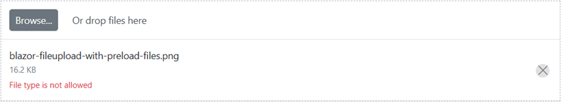

# Blazor File Upload Component in WebAssembly App using Visual Studio

This article provides step-by-step instructions for building a Blazor WebAssembly app with the Blazor File Upload component using [Visual Studio](https://visualstudio.microsoft.com/vs/).

## Prerequisites

* [System requirements for Blazor components](https://blazor.syncfusion.com/documentation/system-requirements)

## Create a Blazor WebAssembly App in Visual Studio

Create a **Blazor WebAssembly App** using Visual Studio via [Microsoft templates](https://learn.microsoft.com/en-us/aspnet/core/blazor/tooling?view=aspnetcore-7.0) or the [Syncfusion<sup style="font-size:70%">&reg;</sup> Blazor Extension](https://blazor.syncfusion.com/documentation/visual-studio-integration/template-studio).

## Install Syncfusion<sup style="font-size:70%">&reg;</sup> Blazor Inputs and Themes NuGet in the App

To add the Blazor File Upload component to the app, open the NuGet Package Manager in Visual Studio (Tools → NuGet Package Manager → Manage NuGet Packages for Solution), then search for and install [Syncfusion.Blazor.Inputs](https://www.nuget.org/packages/Syncfusion.Blazor.Inputs) and [Syncfusion.Blazor.Themes](https://www.nuget.org/packages/Syncfusion.Blazor.Themes/). Alternatively, you can use the following Package Manager commands:




Install-Package Syncfusion.Blazor.Inputs -Version {{ site.releaseversion }}

Install-Package Syncfusion.Blazor.Themes -Version {{ site.releaseversion }}




N> Syncfusion<sup style="font-size:70%">&reg;</sup> Blazor components are available on NuGet. Refer to the [NuGet packages](https://blazor.syncfusion.com/documentation/nuget-packages) topic for the available packages and component details.

## Register Syncfusion<sup style="font-size:70%">&reg;</sup> Blazor Service

Open **~/_Imports.razor** and import the `Syncfusion.Blazor` and `Syncfusion.Blazor.Inputs` namespaces.




@using Syncfusion.Blazor
@using Syncfusion.Blazor.Inputs




Now, register the Syncfusion<sup style="font-size:70%">&reg;</sup> Blazor service in the **~/Program.cs** file of your Blazor WebAssembly app.




using Microsoft.AspNetCore.Components.Web;
using Microsoft.AspNetCore.Components.WebAssembly.Hosting;
using Syncfusion.Blazor;

var builder = WebAssemblyHostBuilder.CreateDefault(args);
builder.RootComponents.Add<App>("#app");
builder.RootComponents.Add<HeadOutlet>("head::after");

builder.Services.AddScoped(sp => new HttpClient { BaseAddress = new Uri(builder.HostEnvironment.BaseAddress) });

builder.Services.AddSyncfusionBlazor();
await builder.Build().RunAsync();
....




## Add stylesheet and script resources

The theme stylesheet and script can be accessed from NuGet through [Static Web Assets](https://blazor.syncfusion.com/documentation/appearance/themes#static-web-assets). Reference the stylesheet and script in the `<head>` of the main page as follows:

* For Blazor WebAssembly app, include them in the **~/index.html** file.

```html
<head>
    ....
    <link href="_content/Syncfusion.Blazor.Themes/bootstrap5.css" rel="stylesheet" />
    <script src="_content/Syncfusion.Blazor.Core/scripts/syncfusion-blazor.min.js" type="text/javascript"></script>
</head>
```
N> See [Blazor Themes](https://blazor.syncfusion.com/documentation/appearance/themes) for multiple ways to reference themes ([Static Web Assets](https://blazor.syncfusion.com/documentation/appearance/themes#static-web-assets), [CDN](https://blazor.syncfusion.com/documentation/appearance/themes#cdn-reference), and [CRG](https://blazor.syncfusion.com/documentation/common/custom-resource-generator)). For script references, see [Adding script references](https://blazor.syncfusion.com/documentation/common/adding-script-references). references in your Blazor application.

## Add Blazor File Upload component

Add the Syncfusion<sup style="font-size:70%">&reg;</sup> Blazor File Upload component in the **~/Pages/Index.razor** file.




<SfUploader></SfUploader>




* Press <kbd>Ctrl</kbd>+<kbd>F5</kbd> (Windows) or <kbd>⌘</kbd>+<kbd>F5</kbd> (macOS) to launch the application. This renders the Syncfusion<sup style="font-size:70%">&reg;</sup> Blazor File Upload component in your default web browser.


## Without server-side API endpoint

Upload files (and folder contents) in a Blazor application without specifying a server-side API endpoint by configuring [AsyncSettings](https://help.syncfusion.com/cr/blazor/Syncfusion.Blazor.Inputs.UploaderAsyncSettings.html).

### Save and Remove actions

Uploaded files as streams in the [ValueChange](https://help.syncfusion.com/cr/blazor/Syncfusion.Blazor.Inputs.UploaderEvents.html#Syncfusion_Blazor_Inputs_UploaderEvents_ValueChange) event arguments. Implement the save logic within the `ValueChange` handler to process files as needed. The concept is illustrated below.




<SfUploader AutoUpload="false">
    <UploaderEvents ValueChange="OnChange"></UploaderEvents>
</SfUploader>

@code {

    private void OnChange(UploadChangeEventArgs args)
    {
        try
        {
            foreach (var file in args.Files)
            {
                var path = @"" + file.FileInfo.Name;
                FileStream filestream = new FileStream(path, FileMode.Create, FileAccess.Write);
                await file.File.OpenReadStream(long.MaxValue).CopyToAsync(filestream);
                filestream.Close();
            }
        }
        catch (Exception ex)
        {
            Console.WriteLine(ex.Message);
        }
    }
}





When clicking the remove icon in the file list, the [OnRemove](https://help.syncfusion.com/cr/blazor/Syncfusion.Blazor.Inputs.UploaderEvents.html#Syncfusion_Blazor_Inputs_UploaderEvents_OnRemove) event provides the file name(s) being removed. Implement the remove logic in the `OnRemove` handler to remove files from the target location as needed in your application.




Private void onRemove(RemovingEventArgs args)
{
    foreach(var removeFile in args.FilesData)
    {
        if (File.Exists(Path.Combine(@"rootPath", removeFile.Name)))
        {
            File.Delete(Path.Combine(@"rootPath", removeFile.Name))
        }
    }
}




## With server-side API endpoint

The upload process can use server endpoints for save and remove actions.

N> * The save action is required to handle the upload operation.
<br/> * The remove action is optional for deleting files on the server.

Specify the save action URL with the [SaveUrl](https://help.syncfusion.com/cr/blazor/Syncfusion.Blazor.Inputs.UploaderAsyncSettings.html#Syncfusion_Blazor_Inputs_UploaderAsyncSettings_SaveUrl) property.

The save handler receives the submitted files and manages the save process on the server. After uploading files to the server location, the color of the selected file name changes to green and the remove icon switches to a bin icon.

Specify the remove action URL with the [RemoveUrl](https://help.syncfusion.com/cr/blazor/Syncfusion.Blazor.Inputs.UploaderAsyncSettings.html#Syncfusion_Blazor_Inputs_UploaderAsyncSettings_RemoveUrl) property to handle server-side deletes.




[Route("api/[controller]")]

private IHostingEnvironment hostingEnv;

public SampleDataController(IHostingEnvironment env)
{
    this.hostingEnv = env;
}

[HttpPost("[action]")]
public void Save(IList<IFormFile> UploadFiles)
{
    long size = 0;
    try
    {
        foreach (var file in UploadFiles)
        {
            var filename = ContentDispositionHeaderValue
                    .Parse(file.ContentDisposition)
                    .FileName
                    .Trim('"');
                filename = hostingEnv.ContentRootPath + $@"\{filename}";
                size += (int)file.Length;
            if (!System.IO.File.Exists(filename))
            {
                using (FileStream fs = System.IO.File.Create(filename))
                {
                    file.CopyTo(fs);
                    fs.Flush();
                }
            }
        }
    }
    catch (Exception e)
    {
        Response.Clear();
        Response.StatusCode = 204;
        Response.HttpContext.Features.Get<IHttpResponseFeature>().ReasonPhrase = "File failed to upload";
        Response.HttpContext.Features.Get<IHttpResponseFeature>().ReasonPhrase = e.Message;
    }
}
[HttpPost("[action]")]
public void Remove(IList<IFormFile> UploadFiles)
{
    try
    {
        var filename = hostingEnv.ContentRootPath + $@"\{UploadFiles[0].FileName}";
        if (System.IO.File.Exists(filename))
        {
            System.IO.File.Delete(filename);
        }
    }
    catch (Exception e)
    {
        Response.Clear();
        Response.StatusCode = 200;
        Response.HttpContext.Features.Get<IHttpResponseFeature>().ReasonPhrase = "File removed successfully";
        Response.HttpContext.Features.Get<IHttpResponseFeature>().ReasonPhrase = e.Message;
    }
}







<SfUploader ID="UploadFiles">
    <UploaderAsyncSettings SaveUrl="api/SampleData/Save" RemoveUrl="api/SampleData/Remove"></UploaderAsyncSettings>
</SfUploader>




## Configure allowed file types

Allow only specific file types to be uploaded using the [AllowedExtensions](https://help.syncfusion.com/cr/blazor/Syncfusion.Blazor.Inputs.SfUploader.html#Syncfusion_Blazor_Inputs_SfUploader_AllowedExtensions) property. Provide extensions as a comma-separated list. The uploader filters selected or dropped files against the specified file types and proceeds with the upload operation. Validation also applies when specifying the native input’s accept attribute.




<SfUploader AllowedExtensions=".doc, .docx, .xls, .xlsx"></SfUploader>






## See Also

* [Getting Started with Syncfusion<sup style="font-size:70%">&reg;</sup> Blazor for Client-Side in .NET Core CLI](../../getting-started/blazor-webassembly-dotnet-cli)
* [Getting Started with Syncfusion<sup style="font-size:70%">&reg;</sup> Blazor for Server-side in Visual Studio](../../getting-started/blazor-server-side-visual-studio)
* [Getting Started with Syncfusion<sup style="font-size:70%">&reg;</sup> Blazor for Server-Side in .NET Core CLI](../../getting-started/blazor-server-side-dotnet-cli)