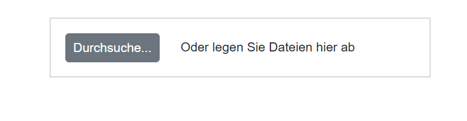

# Localization in Blazor File Upload Component

## Blazor server side

Add `UseRequestLocalization` middle-ware in Configure method in **Startup.cs** file to get browser Culture Info.

Refer the following code to add configuration in Startup.cs file

```csharp
using Microsoft.AspNetCore.Builder;
using Microsoft.AspNetCore.Localization;

namespace BlazorApplication
{
    public class Startup
    {
        ....
        ....

        public void Configure(IApplicationBuilder app, IWebHostEnvironment env)
        {
            app.UseRequestLocalization();
            ....
            ....
        }
    }
}
```

The **Localization** library allows you to localize default text content. The Uploader component has static text that can be changed to other cultures (Arabic, Deutsch, French, etc.).

In the following examples, demonstrate how to enable **Localization** for Uploader in server side Blazor samples. Here, we have used Resource file to translate the static text.

The Resource file is an XML file which contains the strings(key and value pairs) that you want to translate into different language. You can also refer Localization [link](https://blazor.syncfusion.com/documentation/common/localization/) to know more about how to configure and use localization in the ASP.Net Core application framework.

* Open the **Startup.cs** file and add the below configuration in the **ConfigureServices** function as follows.

```csharp
using Syncfusion.Blazor;
using System.Globalization;
using Microsoft.AspNetCore.Localization;

namespace BlazorApplication
{
    public class Startup
    {
        ....
        ....
        public void ConfigureServices(IServiceCollection services)
        {
            ....
            ....
            services.AddSyncfusionBlazor();
            services.AddLocalization(options => options.ResourcesPath = "Resources");
            services.Configure<RequestLocalizationOptions>(options =>
            {
                // define the list of cultures your app will support
                var supportedCultures = new List<CultureInfo>()
                {
                    new CultureInfo("de")
                };
                // set the default culture
                options.DefaultRequestCulture = new RequestCulture("de");
                options.SupportedCultures = supportedCultures;
                options.SupportedUICultures = supportedCultures;
                options.RequestCultureProviders = new List<IRequestCultureProvider>() {
                 new QueryStringRequestCultureProvider() // Here, You can also use other localization provider
                };
            });
            services.AddSingleton(typeof(ISyncfusionStringLocalizer), typeof(SampleLocalizer));
        }
    }
}
```

* Then, write a **class** by inheriting **ISyncfusionStringLocalizer** interface and override the Manager property to get the resource file details from the application end.

```csharp
using Syncfusion.Blazor;

namespace blazorInputs
{
     public class SampleLocalizer : ISyncfusionStringLocalizer
    {

        public string Get(string key)
        {
            return this.Manager.GetString(key);
        }

        public System.Resources.ResourceManager Manager
        {
            get
            {
                return blazorInputs.Resources.SyncfusionBlazorLocale.ResourceManager;
            }
        }
    }
}
```

* Add **.resx** file to Resource folder and enter the key value (Locale Keywords) in the **Name** column and the translated string in the Value column as follows.

| **Name** | **Value (in Deutsch culture)** |
| --- | --- |
| Uploader_Abort | Abbrechen |
| Uploader_Browse | Durchsuche... |
| Uploader_Cancel | Stornieren |
| Uploader_Clear | klar |
| Uploader_Delete | Datei löschen |
| Uploader_DropFilesHint | Oder legen Sie Dateien hier ab |
| Uploader_FileUploadCancel | Datei-Upload abgebrochen |
| Uploader_InProgress | Hochladen |
| Uploader_InvalidFileType | Dateityp ist nicht erlaubt |
| Uploader_InvalidMaxFileSize | Dateigröße ist zu groß |
| Uploader_invalidMinFileSize | Dateigröße ist zu klein |
| Uploader_Pause | Pause |
| Uploader_PauseUpload | Datei-Upload angehalten |
| Uploader_ReadyToUploadMessage | Bereit zum Hochladen |
| Uploader_Remove | Entfernen |
| Uploader_RemovedFailedMessage | Datei kann nicht entfernt werden |
| Uploader_RemovedSuccessMessage | Datei erfolgreich entfernt |
| Uploader_Resume | Fortsetzen |
| Uploader_Retry | Wiederholen |
| Uploader_Upload | Hochladen |
| Uploader_UploadFailedMessage | Datei konnte nicht hochgeladen werden |
| Uploader_UploadSuccessMessage | Datei erfolgreich hochgeladen |

* Finally, Specify the culture for Uploader using `locale` property.

```cshtml
@using Syncfusion.Blazor.Inputs

    <SfUploader ID="UploadFiles" Locale="de">
        <UploaderAsyncSettings SaveUrl="api/SampleData/Save" RemoveUrl="api/SampleData/Remove"></UploaderAsyncSettings>
    </SfUploader>
```

## Blazor WebAssembly

The Localization library allows you to localize static text content of the Uploader according to the culture currently assigned to the Uploader.

| Locale key | en-US (default)
|------|------
| Browse |  Browse...
| Clear | Clear
| Upload | Upload
| dropFilesHint | Or drop files here
| invalidMaxFileSize | File size is too large
| invalidMinFileSize | File size is too small
| invalidFileType | File type is not allowed
| uploadFailedMessage | File failed to upload
| uploadSuccessMessage | File uploaded successfully
| removedSuccessMessage | File removed successfully
| removedFailedMessage | Unable to remove file
| inProgress | Uploading
| readyToUploadMessage | Ready to upload
| abort | Abort
| remove | Remove
| cancel | Cancel
| delete | Delete file
| pauseUpload | File upload paused
| pause | Pause
| resume | Resume
| retry | Retry
| fileUploadCancel | File upload canceled

The following steps explain how to render the Uploader in German culture (‘de-DE’) in Blazor Web Assembly application.

* Open the **program.cs** file and add the below configuration in the **Builder ConfigureServices** function as follows.

```csharp
using Syncfusion.Blazor;
using Microsoft.AspNetCore.Builder;

namespace WebAssemblyLocale
{
    public class Program
    {
        public static async Task Main(string[] args)
        {
            ....
            ....
            builder.Services.Configure<RequestLocalizationOptions>(options =>
            {
                // Define the list of cultures your app will support
                var supportedCultures = new List<System.Globalization.CultureInfo>()
                {
                    new System.Globalization.CultureInfo("en-US"),
                    new System.Globalization.CultureInfo("de"),
                };

                // Set the default culture
                options.DefaultRequestCulture = new Microsoft.AspNetCore.Localization.RequestCulture("de");

                options.SupportedCultures = supportedCultures;
                options.SupportedUICultures = supportedCultures;
                options.RequestCultureProviders = new List<Microsoft.AspNetCore.Localization.IRequestCultureProvider>() {
                 new Microsoft.AspNetCore.Localization.QueryStringRequestCultureProvider()
                };
            });
            ....
            ....
        }
    }
}
```

* Download the required locale packages to render the Blazor Uploader component with specified locale.

* To download the locale definition of Blazor components, use this [link](https://github.com/syncfusion/ej2-locale).

* After downloading the `blazor-locale` package, copy the `blazor-locale` folder with required local definition file into `wwwroot` folder.

* By default, the `blazor-locale` package contains the localized text for static text present in components like button text, placeholder, tooltip, and more.

* Set the culture by using the `SetCulture` method.

```cshtml
@using Syncfusion.Blazor.Inputs
@inject HttpClient Http

 <SfUploader ID="UploadFiles" Locale="de">
    <UploaderAsyncSettings SaveUrl="https://aspnetmvc.syncfusion.com/services/api/uploadbox/Save" RemoveUrl="https://aspnetmvc.syncfusion.com/services/api/uploadbox/Remove"></UploaderAsyncSettings>
</SfUploader>

@code {
    [Inject]
    protected IJSRuntime JsRuntime { get; set; }
    protected override async Task OnInitializedAsync()
    {
        this.JsRuntime.Sf().LoadLocaleData(await Http.GetJsonAsync<object>("blazor-locale/src/de.json")).SetCulture("de");
    }
}
```

The output will be as follows.

