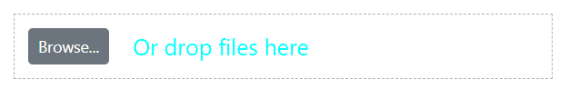

# File Uploader Customization in Blazor

The visual appearance of the Syncfusion Blazor File Upload component can be extensively customized using CSS to align with your application's theme and style. This document provides a detailed guide to the component's CSS structure, enabling you to tailor its look and feel. By targeting specific CSS classes, you can modify elements such as the container, buttons, drop area, file list, and progress bar. For best results, it is recommended to use the CssClass property to apply a custom class, which helps scope your styles and prevent them from affecting other components.

## CssClass Property

The File Upload component allows you to add a custom CSS class to its wrapper element using the [`CssClass`](https://help.syncfusion.com/cr/blazor/Syncfusion.Blazor.Inputs.SfUploader.html#Syncfusion_Blazor_Inputs_SfUploader_CssClass) property. This approach helps scope customizations and prevents unintended global style changes.

```csharp
@using Syncfusion.Blazor.Inputs

<SfUploader CssClass="e-custom-uploader">
    <UploaderEvents ValueChange="OnChange"></UploaderEvents>
</SfUploader>

@code{
    private void OnChange(UploadChangeEventArgs args)
    {
        // here you can get uploaded file data
    }
}

<style>
    .e-custom-uploader {
        border: 3px dotted #554444;
    }
</style>
```




By using the `e-custom-uploader` class, you can target specific elements within the File Upload component.

## Customizing the Container

Customize the main container of the File Upload component to control its overall dimensions and spacing. To scope your changes, target the custom class assigned via the `CssClass` property followed by the component's default class selectors.

```css
/* To specify a custom height, width and padding */
.e-upload.e-control-wrapper {
    height: 200px;
    width: 300px;
    padding: 30px;
}
```




## Customizing the Browse Button

Alter the **Browse** button's appearance by targeting the `.e-file-select-wrap .e-btn` selector within your custom class. This allows you to style properties like `background-color`, `color`, and `font-family` to match your application's design.

```css
/* To specify font styles, background, and color */
.e-upload .e-file-select-wrap .e-btn {
    font-family: 'cursive';
    height: 40px;
    background-color: #ead228;
    color: #ca3d09;
}
```




## Customizing the Content Area

Style the drop zone where users drag and drop files to provide better visual feedback. Use the `.e-file-drop` selector scoped with your custom class to adjust properties like `font-size` and `color`.

```css
/* To specify font size and color */
.e-upload .e-file-select-wrap .e-file-drop {
    font-size: 20px;
    color: aqua;
}
```





## Customizing the File List

Customize the appearance of the file list that displays selected files. Target the `.e-upload-file-list` selector within your custom class to apply styles like `background-color` to the list container.

```css
/* To specify a background color */
.e-upload .e-upload-files .e-upload-file-list {
    background-color: beige;
}
```




## Customizing the Progress Bar

Provide a consistent look during file uploads by customizing the progress bar and its text. Use the `.e-upload-progress-bar` and `.e-progress-bar-text` selectors, scoped with your custom class, to control properties like `background-color` and `font-weight`.

```css
/* To specify the background color of the progress bar */
.e-upload .e-upload-files .e-upload-progress-wrap .e-upload-progress-bar {
    background: green;
}

/* To specify the color of the progress bar text */
.e-upload .e-upload-files .e-upload-progress-wrap .e-progress-bar-text {
    color: #288928;
    font-weight: bold;
}
```




## See Also

* [How to create a responsive, full-height file uploader](https://support.syncfusion.com/kb/article/21232/how-to-create-a-responsive-full-height-file-uploader-in-blazor)
* [How to customize button text](https://support.syncfusion.com/kb/article/17457/customizing-button-text-in-blazor-file-upload-component)
* [How to center the Clear and Upload buttons](https://support.syncfusion.com/kb/article/17534/how-to-center-the-clear-and-upload-buttons-in-blazor-file-upload)
* [How to customize the tooltip for the browse button](https://support.syncfusion.com/kb/article/16150/how-to-customize-tooltip-for-browse-button-in-blazor-file-upload)