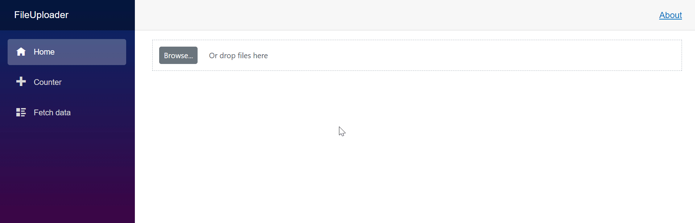

# Template in Blazor File Upload Component

The Blazor File Upload component allows for the customization of the file list items by using a template. This provides the flexibility to define the structure and styling of individual file elements, such as the file name, size, and status. A custom template can create a tailored and visually appealing file upload interface that aligns with an application's design and user experience requirements.

### With server-side API endpoint

```cshtml
@using Syncfusion.Blazor.Inputs

<SfUploader ID="Files" AutoUpload="false">
    <UploaderAsyncSettings SaveUrl="https://blazor.syncfusion.com/services/production/api/FileUploader/Save"
                           RemoveUrl="https://blazor.syncfusion.com/services/production/api/FileUploader/Remove"></UploaderAsyncSettings>
    <UploaderTemplates>
        <Template Context="context">
            <div style="padding: 10px;">
                <div class="name file-name" title="@context.Name">File Name : @context.Name</div>
                <div class="file-size">File Size : @context.Size</div>
                <div class="e-file-status">File Status : @context.Status</div>
            </div>
        </Template>
    </UploaderTemplates>
</SfUploader>
```
### Without server-side API endpoint

```cshtml
@using Syncfusion.Blazor.Inputs

<SfUploader ID="Files" AutoUpload="false">
    <UploaderTemplates>
        <Template Context="context">
            <div style="padding: 10px;">
                <div class="name file-name" title="@context.Name">File Name : @context.Name</div>
                <div class="file-size">File Size : @context.Size</div>
                <div class="e-file-status">File Status : @context.Status</div>
            </div>
        </Template>
    </UploaderTemplates>
</SfUploader>
```



## Adding a progress bar using a template

When using a file upload template, the default progress bar is not displayed in the UI. A progress bar can be added within the template, and its progress can be updated by reading and writing to the stream in the `ValueChange` event. The following code snippet demonstrates how to add a progress bar to a Blazor File Upload component using a custom template. The custom template includes elements to display the file name, size, progress bar, and file status.

```cshtml
@using Syncfusion.Blazor.Inputs
@using Syncfusion.Blazor.ProgressBar

<SfUploader @ref="@uploaderObj" ID="UploadFiles" MaxFileSize="100000000000" ShowProgressBar="false">
    <UploaderEvents BeforeUpload="OnBeforeUpload" Success="OnSuccess" ValueChange="OnChange"></UploaderEvents>
    <UploaderTemplates>
        <Template Context="context">
            <span class="e-file-container">
                <span class="e-file-name" title="@context.Name">@GetFileName(context.Name)</span>
                <span class="e-file-type">@("." + context.Type)</span>
                @if (context.Size > 0)
                {
                    fileSize = CalculateFileSize(context.Size);
                }
                <div class="e-file-size">@fileSize</div>
                @if (CurrentFile != null && (CurrentFile.Name == context.Name && CurrentFile.Size == context.Size && CurrentFile.Status == "Uploading" && context.Status == "File uploaded successfully"))
                {
                    <span class="e-upload-progress-wrap">
                        <span class="e-progress-inner-wrap">
                            <progress class="@("e-upload-progress-bar" + " " + "e-upload-progress")" value="0" max="100" style="width: @(ProgressValue + "%")"></progress>
                        </span>
                        <span class="e-progress-bar-text">@(ProgressValue + "%")</span>
                    </span>
                }
                @if (fileStates.ContainsKey(context.Name) && fileStates[context.Name] && context.Status == "File uploaded successfully")
                {
                    <span class="file-status" style="color: green">@context.Status</span>
                }
                else if (context.Status != "File uploaded successfully" && context.Status != "Ready to upload")
                {
                    <span class="file-status" style="color: red">@context.Status</span>
                }
                else if (context.Status == "Ready to upload" || ((fileStates.ContainsKey(context.Name) && !fileStates[context.Name] && CurrentFile != null && CurrentFile.Size != context.Size)))
                {
                    <span class="file-status">Ready to upload</span>
                }
                @if (fileStates.ContainsKey(context.Name) && fileStates[context.Name] && context.Status == "File uploaded successfully")
                {
                    <span class="e-icons e-file-delete-btn @RemoveIconDisable" id="deleteIcon" title="Delete" @onclick="(args) => ClickHandler(context)"></span>
                }
                else
                {
                    <span class="e-icons e-file-remove-btn @RemoveIconDisable" id="removeIcon" title="Remove" @onclick="(args) => ClickHandler(context)"></span>
                }
            </span>
        </Template>
    </UploaderTemplates>
</SfUploader>

@code {
    private SfUploader uploaderObj;
    private FileInfo CurrentFile { get; set; }
    public string fileSize { get; set; } = "0";
    public string RemoveIconDisable = string.Empty;
    private readonly SemaphoreSlim FileSemaphore = new SemaphoreSlim(1);
    private decimal ProgressValue { get; set; } = 0;
    private Dictionary<string, bool> fileStates = new Dictionary<string, bool>();

    public string CalculateFileSize(double size)
    {
        if (size >= 1024 * 1024)
        {
            return $"{size / (1024f * 1024f):0.00} MB";
        }
        else if (size >= 1024)
        {
            return $"{size / 1024f:0.00} KB";
        }
        else
        {
            return $"{size} bytes";
        }
    }

    private string GetFileName(string fileName)
    {
        string type = GetFileType(fileName);
        string[] names = fileName.Split(new string[] { "." + type }, StringSplitOptions.None);
        return names[0];
    }

    private string GetFileType(string name)
    {
        string extension = string.Empty;
        int index = name.LastIndexOf('.');
        if (index > 0)
        {
            extension = name.Substring(index + 1);
        }
        return !string.IsNullOrEmpty(extension) ? extension : string.Empty;
    }

    public async Task ClickHandler(FileInfo context)
    {
        await uploaderObj.RemoveAsync(new FileInfo[] { context });
    }

    public void OnBeforeUpload(BeforeUploadEventArgs args)
    {
        foreach (var file in args.FilesData)
        {
            fileStates[file.Name] = false;
        }
    }

    public void OnSuccess(SuccessEventArgs args)
    {
        ProgressValue = 0;
    }

    public async Task OnChange(UploadChangeEventArgs args)
    {
        await FileSemaphore.WaitAsync();
        try
        {
            foreach (var file in args.Files)
            {
                var path = Path.Combine(Path.GetTempPath(), file.FileInfo.Name);
                CurrentFile = file.FileInfo;
                CurrentFile.Status = "Uploading";
                await using FileStream writeStream = new(path, FileMode.Create);
                using var readStream = file.File.OpenReadStream(file.File.Size);
                var bytesRead = 0;
                var buffer = new byte[1024 * 10];

                while ((bytesRead = await readStream.ReadAsync(buffer)) != 0)
                {
                    RemoveIconDisable = "e-disabled";
                    await writeStream.WriteAsync(buffer, 0, bytesRead);
                    ProgressValue = (long)((decimal)readStream.Position * 100) / readStream.Length;
                    StateHasChanged();
                }
                CurrentFile.Status = "File uploaded successfully";
                RemoveIconDisable = string.Empty;
                fileStates[file.FileInfo.Name] = true;
            }
        }
        catch (Exception ex)
        {
            RemoveIconDisable = string.Empty;
            Console.WriteLine(ex.Message);
        }
        finally
        {
            FileSemaphore.Release();
        }
    }
}
```



