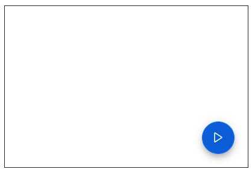
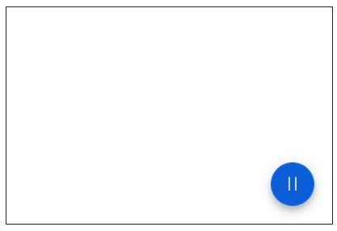

# Events in Floating Action Button Component

You can define the native event using `event` attribute in component. The value of attribute is treated as an event handler. The event specific data will be available in event arguments.

The different event argument types for each event are,

* Focus Events - UIFocusEventArgs
* Mouse Events - UIMouseEventArgs

MouseEventArgs provide the mouse coordinates when the user moves the mouse pointer in the UI. For handling @onclick event of the HTML element, define a function/method in the @code section and then refer the delegate typed value to the @onclick attribute of the HTML element.

## How to bind click event to Floating Action Button

The floating action button control triggers the [`OnClick`](https://help.syncfusion.com/cr/blazor/Syncfusion.Blazor.Buttons.SfButton.html#Syncfusion_Blazor_Buttons_SfButton_OnClick) event when you click on the floating action button. You can use this event to perform the required action.

```csharp

    @using Syncfusion.Blazor.Buttons

    <div id="target" style="min-height:200px; position:relative; width:300px; border:1px solid;">
        <SfFab id="fab" @ref="FabBtn" Target="#target" IconCss="@IconCss" Position="FabPosition.BottomRight" IsToggle="true" OnClick="@onToggleClick"></SfFab>
    </div>

    @code{
        SfFab FabBtn;
        public string IconCss = "e-icons e-play";
        private void onToggleClick(Microsoft.AspNetCore.Components.Web.MouseEventArgs args)
        {
            if (FabBtn.IconCss == "e-icons e-play")
            {
                IconCss = "e-icons e-pause";
            }
            else
            {
                IconCss = "e-icons e-play";
            }
        }
    }

```


