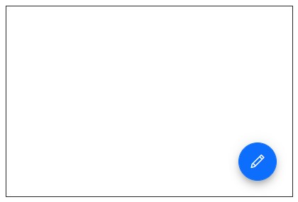
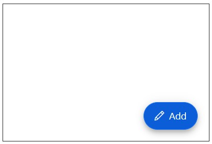
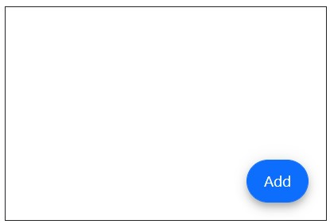

# Icons in Blazor Floating Action Button Component

## Icon types

The types of Floating Action Button Icons are as follows:

* Icon Only
* Icon with Text
* Text Only

## Floating Action Button with Icon Only

Use IconCss property to display icon. Floating Action Button can have an icon to provide the visual representation of the action. To place the icon on a Floating Action Button, set the [IconCss](https://help.syncfusion.com/cr/blazor/Syncfusion.Blazor.Buttons.SfFab.html#properties) property to `e-icons` with the required icon CSS.

In the following example, Floating Action Button is demonstrated with only icons by providing the IconCss property.

```cshtml

@using Syncfusion.Blazor.Buttons

<div id="target" style="min-height:200px; position:relative; width:300px; border:1px solid;">
    <SfFab id="fab" Target="#target" IconCss="e-icons e-edit"></SfFab>
</div>

```



## Floating Action Button with Icon and Text

Use [Content](https://help.syncfusion.com/cr/blazor/Syncfusion.Blazor.Buttons.SfFab.html#properties) property and [IconCss](https://help.syncfusion.com/cr/blazor/Syncfusion.Blazor.Buttons.SfFab.html#properties) property to display the icon and text.

```cshtml

@using Syncfusion.Blazor.Buttons

<div id="target" style="min-height:200px; position:relative; width:300px; border:1px solid;">
    <SfFab id="fab" Target="#target" IconCss="e-icons e-edit" Content="Edit"></SfFab>
</div>

```



## Floating Action Button with Text Only

Use [Content](https://help.syncfusion.com/cr/blazor/Syncfusion.Blazor.Buttons.SfFab.html#properties) property to display the text.

```cshtml

@using Syncfusion.Blazor.Buttons

<div id="target" style="min-height:200px; position:relative; width:300px; border:1px solid;">
    <SfFab id="fab" Target="#target" Content="Edit"></SfFab>
</div>

```

