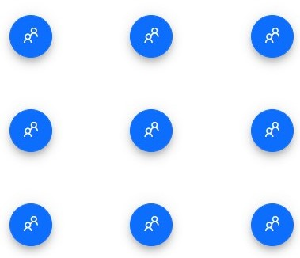

# Positions in Blazor Floating Action Button Component

The Floating Action Button (FAB) can be positioned anywhere within the specified [Target](https://help.syncfusion.com/cr/blazor/Syncfusion.Blazor.Buttons.SfFab.html#Syncfusion_Blazor_Buttons_SfFab_Target) using the [Position](https://help.syncfusion.com/cr/blazor/Syncfusion.Blazor.Buttons.SfFab.html#Syncfusion_Blazor_Buttons_SfFab_Position) property. If `Target` is not defined, the FAB is positioned relative to the browser viewport. When using `Target`, ensure the container is positioned (for example, `position: relative`) so the FAB aligns within its bounds.

The available position values for the Floating Action Button are:

* TopLeft
* TopCenter
* TopRight
* MiddleLeft
* MiddleCenter
* MiddleRight
* BottomLeft
* BottomCenter
* BottomRight

The following example demonstrates the Bottom Left position of the FAB.

```cshtml

@using Syncfusion.Blazor.Buttons

<SfFab id="fab" IconCss="fab-icons fab-icon-people" Position=FabPosition.BottomLeft></SfFab>

<style>

    @@font-face {
        font-family: 'fab-icons';
        src: url(data:application/x-font-ttf;charset=utf-8;base64,AAEAAAAKAIAAAwAgT1MvMj0kSSoAAAEoAAAAVmNtYXCcV5yuAAABlAAAAFRnbHlmHl6slgAAAfQAAASQaGVhZCG5vSMAAADQAAAANmhoZWEHowNkAAAArAAAACRobXR4E6AAAAAAAYAAAAAUbG9jYQGKAywAAAHoAAAADG1heHABEgDDAAABCAAAACBuYW1l0KnKeQAABoQAAAI9cG9zdBh6gIAAAAjEAAAARwABAAADUv9qAFoEAAAA//QD9AABAAAAAAAAAAAAAAAAAAAABQABAAAAAQAAZGlHNV8PPPUACwPoAAAAAN9TvCUAAAAA31O8JQAAAAAD9AP0AAAACAACAAAAAAAAAAEAAAAFALcAAwAAAAAAAgAAAAoACgAAAP8AAAAAAAAAAQPtAZAABQAAAnoCvAAAAIwCegK8AAAB4AAxAQIAAAIABQMAAAAAAAAAAAAAAAAAAAAAAAAAAAAAUGZFZABA5wTnDANS/2oAWgP0AJYAAAABAAAAAAAABAAAAAPoAAAD6AAAA+gAAAPoAAAAAAACAAAAAwAAABQAAwABAAAAFAAEAEAAAAAKAAgAAgAC5wTnCOcK5wz//wAA5wTnCOcK5wz//wAAAAAAAAAAAAEACgAKAAoACgAAAAEAAgADAAQAAAAAABgA5AFyAkgAAQAAAAAD6gPqAAsAAAEzESEVIREjESE1IQHDegGu/lJ6/lIBrgPr/lJ6/lIBrnoAAgAAAAADkwP0AHQAtgAAJRUjFSE1IzU/HjUjDxUvFSMVHx0DER8PPw8RLw8PDgHRiQF3ihISEhIRERAQDxAODg4NDQwLCwsJCQkHBwYGBAQDAgJXAgIDBAQFBQYHBwgIEhUWFxoaHB4eHx8eHhwaGhcWFRIICAcHBgUFBAQDAgJXAgIDBAQGBgcICAkKCgsMDA0NDg8OEBAQEREREhMSdgECBQYICgoMDQ8PEBEREhMTEhEREA8PDQwKCgQHBQQCAQIFBggJCgwNDhAQERETExMTEhEQDw8NDAsJBwYFArhbUVFbAgMDBAUFBgYHCAgICQoKCgsLDAwMDQ0ODQ4PDg8PDxANDAsMCwwLCgsKCgkSEQ8NDAoHBgQBAQQGBwoMDQ8REgkKCgsKCwwLDAsMDRAPDw8ODw4NDg0NDAwMCwsKCgoJCAgIBwYGBQUEAwMCpP64EA8ODg0NCwsJCQcHBAQCAQECBAUGCAkJCwwMBw0ODg8BUBAPDg4NDQsLCQkHBgUEAgEBAgQFBgcJCQsLDQ0ODg8AAAAAAwAAAAADxgPoABAAIQBmAAABHgIUDgIiLgI0PgIyAR4CFA4CIi4CND4CMicOAhUUFhcOAQcuASMiDgIVFBYXDgMVMzQ+AjIeAhUzNC4CJz4BNTQ+AjIeAhUzNC4CJz4BNTQuAiIBYBgkFRUkMTcwJBUVJDA3AakYJBUVJDE3MCQVFSQwN2kkNiArJic9FBxWLylJNiArJiI2JxVDIDZJUkk2IEMVJzYiJisgNklSSTYgQxUnNiImKyA2SVICCwskMTcwJBUVJDA3MSQVAYYLJDE3MCQVFSQwNzEkFTMQNkkpL1YcFD0nJisgNkkpL1YcETM+RyYpSTYgIDZJKSZHPjMRHFYvKUk2ICA2SSkmRz4zERxVMClJNiAAAAADAAAAAAP0A/QAPwB/ALUAACUfDz8PLw8PDgUfDz8PLw8PDgMzEw8CFR8OITUhLwQ3IT8GEz8CNS8GIScjAsgBAQIEBAUFBwcICAkJCgoKCgoKCQkICAcHBQUEBAIBAQEBAgQEBQUHBwgICQkKCgoKCgoJCQgIBwYGBQQEAgH+CwEBAgQEBQUHBwgICQkKCgoKCgoJCQgIBwcFBQQEAgEBAQECBAQFBQcHCAgJCQoKCgoKCgkJCAgHBgYFBAQCAclktUgIAQICBAQFBQcHCAgJCQkKCwJb/bsDAwIBASwBcQ8NDAwKCAi8AwQCAgMFBwgJCv0VK6ZwCgoKCQkICAcGBgUEBAIBAQEBAgQEBQUHBwgICQkKCgoKCgoJCQgIBwcFBQQEAgEBAQECBAQFBQcHCAgJCQoKCgoKCgkJCAgHBgYFBAQCAQEBAQIEBAUFBwcICAkJCgoKCgoKCQkICAcHBQUEBAIBAQEBAgQEBQUHBwgICQkKCgMW/oN3JgwKCgoJCQgIBwYGBQQEAgEBZAEBAwIJVAECBQUHCQoBUAMHBRAKCQgHBQMCZAAAAAAAEgDeAAEAAAAAAAAAAQAAAAEAAAAAAAEACQABAAEAAAAAAAIABwAKAAEAAAAAAAMACQARAAEAAAAAAAQACQAaAAEAAAAAAAUACwAjAAEAAAAAAAYACQAuAAEAAAAAAAoALAA3AAEAAAAAAAsAEgBjAAMAAQQJAAAAAgB1AAMAAQQJAAEAEgB3AAMAAQQJAAIADgCJAAMAAQQJAAMAEgCXAAMAAQQJAAQAEgCpAAMAAQQJAAUAFgC7AAMAAQQJAAYAEgDRAAMAAQQJAAoAWADjAAMAAQQJAAsAJAE7IEZhYi1JY29uc1JlZ3VsYXJGYWItSWNvbnNGYWItSWNvbnNWZXJzaW9uIDEuMEZhYi1JY29uc0ZvbnQgZ2VuZXJhdGVkIHVzaW5nIFN5bmNmdXNpb24gTWV0cm8gU3R1ZGlvd3d3LnN5bmNmdXNpb24uY29tACAARgBhAGIALQBJAGMAbwBuAHMAUgBlAGcAdQBsAGEAcgBGAGEAYgAtAEkAYwBvAG4AcwBGAGEAYgAtAEkAYwBvAG4AcwBWAGUAcgBzAGkAbwBuACAAMQAuADAARgBhAGIALQBJAGMAbwBuAHMARgBvAG4AdAAgAGcAZQBuAGUAcgBhAHQAZQBkACAAdQBzAGkAbgBnACAAUwB5AG4AYwBmAHUAcwBpAG8AbgAgAE0AZQB0AHIAbwAgAFMAdAB1AGQAaQBvAHcAdwB3AC4AcwB5AG4AYwBmAHUAcwBpAG8AbgAuAGMAbwBtAAAAAAIAAAAAAAAACgAAAAAAAAAAAAAAAAAAAAAAAAAAAAAABQECAQMBBAEFAQYAA2FkZANtaWMGcGVvcGxlCHNob3BwaW5nAAAA) format('truetype');
        font-weight: normal;
        font-style: normal;
    }

    [class^="fab-icon-"],
    [class*=" fab-icon-"] {
        font-family: 'fab-icons' !important;
        speak: none;
        font-size: 55px;
        font-style: normal;
        font-weight: normal;
        font-variant: normal;
        text-transform: none;
        line-height: inherit;
        -webkit-font-smoothing: antialiased;
        -moz-osx-font-smoothing: grayscale;
    }

    .fab-icon-people:before {
        content: "\e70a";
    }

</style>

```


The following example demonstrates multiple supported positions of the FAB.

```cshtml

@using Syncfusion.Blazor.Buttons

<SfFab Position="FabPosition.TopLeft" IconCss="fab-icons fab-icon-people"></SfFab>
<SfFab Position="FabPosition.TopCenter" IconCss="fab-icons fab-icon-people"></SfFab>
<SfFab Position="FabPosition.TopRight" IconCss="fab-icons fab-icon-people"></SfFab>
<SfFab Position="FabPosition.MiddleLeft" IconCss="fab-icons fab-icon-people"></SfFab>
<SfFab Position="FabPosition.MiddleCenter" IconCss="fab-icons fab-icon-people"></SfFab>
<SfFab Position="FabPosition.MiddleRight" IconCss="fab-icons fab-icon-people"></SfFab>
<SfFab Position="FabPosition.BottomLeft" IconCss="fab-icons fab-icon-people"></SfFab>
<SfFab Position="FabPosition.BottomCenter" IconCss="fab-icons fab-icon-people"></SfFab>
<SfFab Position="FabPosition.BottomRight" IconCss="fab-icons fab-icon-people"></SfFab>

<style>

    @@font-face {
        font-family: 'fab-icons';
        src: url(data:application/x-font-ttf;charset=utf-8;base64,AAEAAAAKAIAAAwAgT1MvMj0kSSoAAAEoAAAAVmNtYXCcV5yuAAABlAAAAFRnbHlmHl6slgAAAfQAAASQaGVhZCG5vSMAAADQAAAANmhoZWEHowNkAAAArAAAACRobXR4E6AAAAAAAYAAAAAUbG9jYQGKAywAAAHoAAAADG1heHABEgDDAAABCAAAACBuYW1l0KnKeQAABoQAAAI9cG9zdBh6gIAAAAjEAAAARwABAAADUv9qAFoEAAAA//QD9AABAAAAAAAAAAAAAAAAAAAABQABAAAAAQAAZGlHNV8PPPUACwPoAAAAAN9TvCUAAAAA31O8JQAAAAAD9AP0AAAACAACAAAAAAAAAAEAAAAFALcAAwAAAAAAAgAAAAoACgAAAP8AAAAAAAAAAQPtAZAABQAAAnoCvAAAAIwCegK8AAAB4AAxAQIAAAIABQMAAAAAAAAAAAAAAAAAAAAAAAAAAAAAUGZFZABA5wTnDANS/2oAWgP0AJYAAAABAAAAAAAABAAAAAPoAAAD6AAAA+gAAAPoAAAAAAACAAAAAwAAABQAAwABAAAAFAAEAEAAAAAKAAgAAgAC5wTnCOcK5wz//wAA5wTnCOcK5wz//wAAAAAAAAAAAAEACgAKAAoACgAAAAEAAgADAAQAAAAAABgA5AFyAkgAAQAAAAAD6gPqAAsAAAEzESEVIREjESE1IQHDegGu/lJ6/lIBrgPr/lJ6/lIBrnoAAgAAAAADkwP0AHQAtgAAJRUjFSE1IzU/HjUjDxUvFSMVHx0DER8PPw8RLw8PDgHRiQF3ihISEhIRERAQDxAODg4NDQwLCwsJCQkHBwYGBAQDAgJXAgIDBAQFBQYHBwgIEhUWFxoaHB4eHx8eHhwaGhcWFRIICAcHBgUFBAQDAgJXAgIDBAQGBgcICAkKCgsMDA0NDg8OEBAQEREREhMSdgECBQYICgoMDQ8PEBEREhMTEhEREA8PDQwKCgQHBQQCAQIFBggJCgwNDhAQERETExMTEhEQDw8NDAsJBwYFArhbUVFbAgMDBAUFBgYHCAgICQoKCgsLDAwMDQ0ODQ4PDg8PDxANDAsMCwwLCgsKCgkSEQ8NDAoHBgQBAQQGBwoMDQ8REgkKCgsKCwwLDAsMDRAPDw8ODw4NDg0NDAwMCwsKCgoJCAgIBwYGBQUEAwMCpP64EA8ODg0NCwsJCQcHBAQCAQECBAUGCAkJCwwMBw0ODg8BUBAPDg4NDQsLCQkHBgUEAgEBAgQFBgcJCQsLDQ0ODg8AAAAAAwAAAAADxgPoABAAIQBmAAABHgIUDgIiLgI0PgIyAR4CFA4CIi4CND4CMicOAhUUFhcOAQcuASMiDgIVFBYXDgMVMzQ+AjIeAhUzNC4CJz4BNTQ+AjIeAhUzNC4CJz4BNTQuAiIBYBgkFRUkMTcwJBUVJDA3AakYJBUVJDE3MCQVFSQwN2kkNiArJic9FBxWLylJNiArJiI2JxVDIDZJUkk2IEMVJzYiJisgNklSSTYgQxUnNiImKyA2SVICCwskMTcwJBUVJDA3MSQVAYYLJDE3MCQVFSQwNzEkFTMQNkkpL1YcFD0nJisgNkkpL1YcETM+RyYpSTYgIDZJKSZHPjMRHFYvKUk2ICA2SSkmRz4zERxVMClJNiAAAAADAAAAAAP0A/QAPwB/ALUAACUfDz8PLw8PDgUfDz8PLw8PDgMzEw8CFR8OITUhLwQ3IT8GEz8CNS8GIScjAsgBAQIEBAUFBwcICAkJCgoKCgoKCQkICAcHBQUEBAIBAQEBAgQEBQUHBwgICQkKCgoKCgoJCQgIBwYGBQQEAgH+CwEBAgQEBQUHBwgICQkKCgoKCgoJCQgIBwcFBQQEAgEBAQECBAQFBQcHCAgJCQoKCgoKCgkJCAgHBgYFBAQCAclktUgIAQICBAQFBQcHCAgJCQkKCwJb/bsDAwIBASwBcQ8NDAwKCAi8AwQCAgMFBwgJCv0VK6ZwCgoKCQkICAcGBgUEBAIBAQEBAgQEBQUHBwgICQkKCgoKCgoJCQgIBwcFBQQEAgEBAQECBAQFBQcHCAgJCQoKCgoKCgkJCAgHBgYFBAQCAQEBAQIEBAUFBwcICAkJCgoKCgoKCQkICAcHBQUEBAIBAQEBAgQEBQUHBwgICQkKCgMW/oN3JgwKCgoJCQgIBwYGBQQEAgEBZAEBAwIJVAECBQUHCQoBUAMHBRAKCQgHBQMCZAAAAAAAEgDeAAEAAAAAAAAAAQAAAAEAAAAAAAEACQABAAEAAAAAAAIABwAKAAEAAAAAAAMACQARAAEAAAAAAAQACQAaAAEAAAAAAAUACwAjAAEAAAAAAAYACQAuAAEAAAAAAAoALAA3AAEAAAAAAAsAEgBjAAMAAQQJAAAAAgB1AAMAAQQJAAEAEgB3AAMAAQQJAAIADgCJAAMAAQQJAAMAEgCXAAMAAQQJAAQAEgCpAAMAAQQJAAUAFgC7AAMAAQQJAAYAEgDRAAMAAQQJAAoAWADjAAMAAQQJAAsAJAE7IEZhYi1JY29uc1JlZ3VsYXJGYWItSWNvbnNGYWItSWNvbnNWZXJzaW9uIDEuMEZhYi1JY29uc0ZvbnQgZ2VuZXJhdGVkIHVzaW5nIFN5bmNmdXNpb24gTWV0cm8gU3R1ZGlvd3d3LnN5bmNmdXNpb24uY29tACAARgBhAGIALQBJAGMAbwBuAHMAUgBlAGcAdQBsAGEAcgBGAGEAYgAtAEkAYwBvAG4AcwBGAGEAYgAtAEkAYwBvAG4AcwBWAGUAcgBzAGkAbwBuACAAMQAuADAARgBhAGIALQBJAGMAbwBuAHMARgBvAG4AdAAgAGcAZQBuAGUAcgBhAHQAZQBkACAAdQBzAGkAbgBnACAAUwB5AG4AYwBmAHUAcwBpAG8AbgAgAE0AZQB0AHIAbwAgAFMAdAB1AGQAaQBvAHcAdwB3AC4AcwB5AG4AYwBmAHUAcwBpAG8AbgAuAGMAbwBtAAAAAAIAAAAAAAAACgAAAAAAAAAAAAAAAAAAAAAAAAAAAAAABQECAQMBBAEFAQYAA2FkZANtaWMGcGVvcGxlCHNob3BwaW5nAAAA) format('truetype');
        font-weight: normal;
        font-style: normal;
    }

    [class^="fab-icon-"],
    [class*=" fab-icon-"] {
        font-family: 'fab-icons' !important;
        speak: none;
        font-size: 55px;
        font-style: normal;
        font-weight: normal;
        font-variant: normal;
        text-transform: none;
        line-height: inherit;
        -webkit-font-smoothing: antialiased;
        -moz-osx-font-smoothing: grayscale;
    }

    .fab-icon-people:before {
        content: "\e70a";
    }

</style>

```



## Custom position

Define a custom position for the Floating Action Button by overriding the `top`, `left`, `right`, and `bottom` CSS properties using the [CssClass](https://help.syncfusion.com/cr/blazor/Syncfusion.Blazor.Buttons.SfFab.html#Syncfusion_Blazor_Buttons_SfFab_CssClass) property.

```cshtml

@using Syncfusion.Blazor.Buttons

<SfFab CssClass="custom-position" IconCss="e-icons e-edit"></SfFab>

<style>

    .e-fab.e-btn.custom-position {
        left: 40px;
        top: 40px;
        bottom: unset;
        right: unset;
    }

</style>

```

