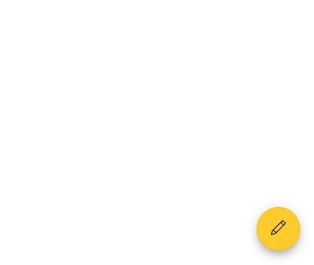
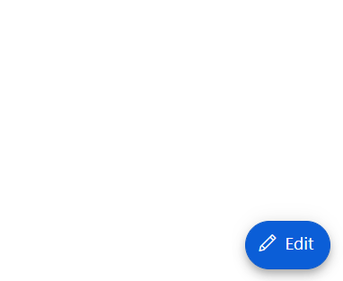
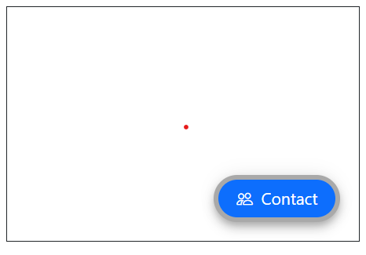

# Styles in Blazor Floating Action Button Component

This section explains the style options for the Blazor Floating Action Button (FAB), including predefined style classes, custom CSS, showing text on hover, and outline customization.

## FAB styles

The Blazor Floating Action Button supports the following predefined styles that can be defined using the [CssClass](https://help.syncfusion.com/cr/blazor/Syncfusion.Blazor.Buttons.SfButton.html#Syncfusion_Blazor_Buttons_SfButton_CssClass) property. You can customize by replacing the `CssClass` property with the below defined class.

| Class | Description |
| -------- | -------- |
| e-success | Represents a positive action. |
| e-outline | Represents an outlined button appearance. |
| e-info | Represents an informative action. |
| e-warning | Represents an action with caution. |
| e-danger | Represents a negative action. |

```csharp

@using Syncfusion.Blazor.Buttons

<SfFab CssClass="e-warning" IconCss="e-icons e-edit"></SfFab>

```



N> Predefined Floating Action Button styles provide only visual indication. So, Floating Action Button [Content](https://help.syncfusion.com/cr/blazor/Syncfusion.Blazor.Buttons.SfButton.html#Syncfusion_Blazor_Buttons_SfButton_Content) property should define the Floating Action Button style for the users of assistive technologies such as screen readers.

## Styles customization

To modify the FAB appearance beyond predefined styles, override the component’s default CSS. The following CSS classes map to common styling scenarios. You can also create a custom theme using the [Theme Studio](https://blazor.syncfusion.com/themestudio/).

| CSS Class | Purpose of Class |
|-----|----- |
| .e-fab.e-btn | Customize the FAB. |
| .e-fab.e-btn:hover | Customize the FAB on hover. |
| .e-fab.e-btn:focus | Customize the FAB on focus. |
| .e-fab.e-btn:active | Customize the FAB on active state. |
| .e-fab .e-btn-icon | Customize the style of the FAB icon. |

## Show text on hover

By using [CssClass](https://help.syncfusion.com/cr/blazor/Syncfusion.Blazor.Buttons.SfButton.html#Syncfusion_Blazor_Buttons_SfButton_CssClass), customize the Floating Action Button to show text on hover with applied transition effect.

```csharp

@using Syncfusion.Blazor.Buttons

<SfFab IconCss="e-icons e-edit" CssClass="fab-hover"><span class="text-container"><span class="textEle">Edit</span></span></SfFab>

<style>

    .e-fab.e-btn.fab-hover {
        padding: 6px 2px 8px 10px;
    }

    .fab-hover .text-container {
        overflow: hidden;
        width: 0;
        margin: 0;
        transition: width .5s linear 0s, margin .2s linear .5s;
    }

    .fab-hover:hover .text-container {
        width: 25px;
        margin-right:10px;
        transition: width .5s linear .2s, margin .2s linear 0s;
    }

</style>

```



## Outline customization

By using the [CssClass](https://help.syncfusion.com/cr/blazor/Syncfusion.Blazor.Buttons.SfButton.html#Syncfusion_Blazor_Buttons_SfButton_CssClass) property, you can customize the outline color of the Floating Action Button.

```csharp

@using Syncfusion.Blazor.Buttons

<div id="target" style="min-height:200px; position:relative; width:300px; border:1px solid;">
    <SfFab Target="#target" Content="Contact" IconCss="e-icons e-people" CssClass="custom-css"></SfFab>
</div>

<style>
.custom-css.e-fab.e-btn {
  border-color: darkgrey;
  border-width: 4px;
}
</style>

```

