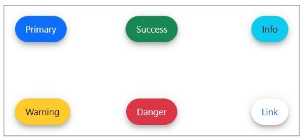

# Styles in Blazor Floating Action Button Component

This section explains the different styles of Floating Action Button.

## Floating Action Button styles

The Blazor Floating Action Button has the following predefined styles that can be defined using the [CssClass]property for represent primary action we have IsPrimary property(https://help.syncfusion.com/cr/blazor/Syncfusion.Blazor.Buttons.SfFab.html#Syncfusion_Blazor_Buttons_SfFab_IsPrimary).

| Class | Description |
| -------- | -------- |
| e-success | Used to represent a positive action. |
| e-info |  Used to represent an informative action. |
| e-warning | Used to represent an action with caution. |
| e-danger | Used to represent a negative action. |
| e-link |  Changes the appearance of the Button like a hyperlink. |

```csharp

@using Syncfusion.Blazor.Buttons

<div id="target" style="height:200px; position:relative; width:450px; border:1px solid;">
    <SfFab Target="#target" IsPrimary=true Content="Primary"></SfFab>
    <SfFab Target="#target" CssClass="e-success" Content="Success"></SfFab>
    <SfFab Target="#target" CssClass="e-info" Content="Info"></SfFab>
    <SfFab Target="#target" CssClass="e-warning" Content="Warning"></SfFab>
    <SfFab Target="#target" CssClass="e-danger" Content="Danger"></SfFab>
    <SfFab Target="#target" CssClass="e-link" Content="Link"></SfFab>
</div>

```



## Styles Customization

To modify the Floating Action Button appearance, you need to override the default CSS of Floating Action Button component. Please find the list of CSS classes and its corresponding section in Floating Action Button component. Also, you have an option to create your own custom theme for the controls using our [Theme Studio](https://blazor.syncfusion.com/themestudio/?theme=material).

|CSS Class | Purpose of Class |
|-----|----- |
|.e-btn|To customize the button.|
|.e-btn:hover|To customize the button on hover.|
|.e-btn:focus|To customize the button on focus.|
|.e-btn:active|To customize the button on active.|
|.e-fab .e-icon-btn|To customize the fab button icons.|