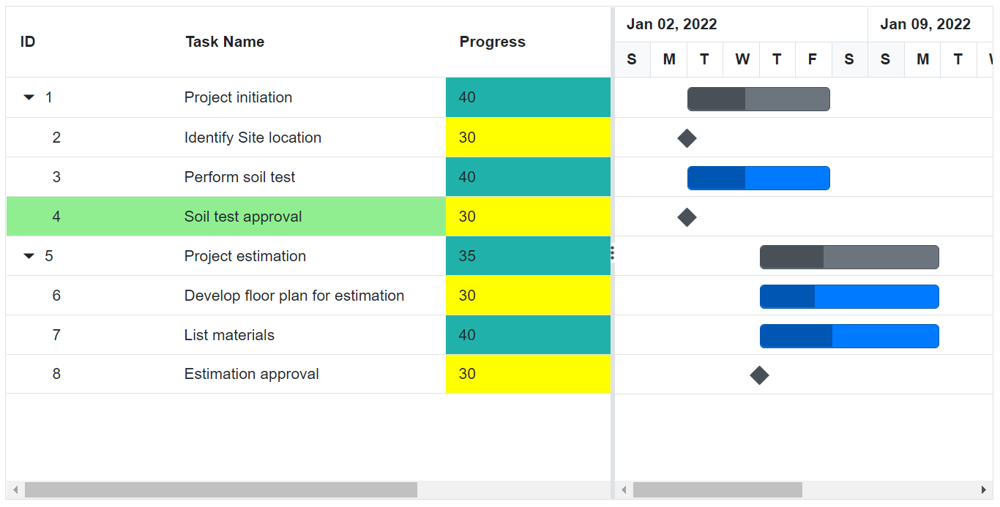
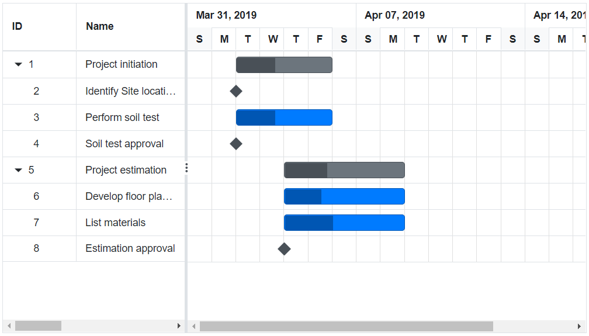
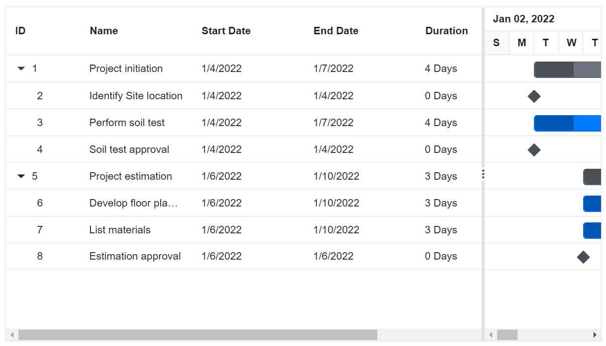
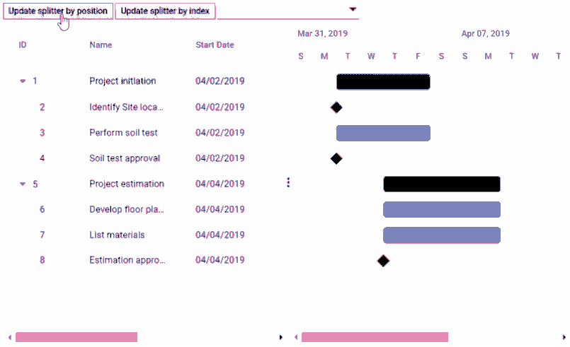

# Appearance Customization in Blazor Gantt Chart Component

## Taskbar customization

### Taskbar height

Height of child taskbars and parent taskbars can be customized by using [TaskbarHeight](https://help.syncfusion.com/cr/blazor/Syncfusion.Blazor.Gantt.SfGantt-1.html#Syncfusion_Blazor_Gantt_SfGantt_1_TaskbarHeight) property. The following code example shows how to use the property.

```cshtml
@using Syncfusion.Blazor.Gantt

<SfGantt DataSource="@TaskCollection" Height="450px" Width="900px" RowHeight=60 TaskbarHeight=50>
    <GanttTaskFields Id="TaskId" Name="TaskName" StartDate="StartDate" EndDate="EndDate"
                     Duration="Duration" Progress="Progress" ParentID="ParentId">
    </GanttTaskFields>
</SfGantt>

@code{
    private List<TaskData> TaskCollection { get; set; }
    protected override void OnInitialized()
    {
        this.TaskCollection = GetTaskCollection();
    }
    public class TaskData
    {
        public int TaskId { get; set; }
        public string TaskName { get; set; }
        public DateTime StartDate { get; set; }
        public DateTime? EndDate { get; set; }
        public string Duration { get; set; }
        public int Progress { get; set; }
        public int? ParentId { get; set; }
    }

    private static List<TaskData> GetTaskCollection()
    {
        List<TaskData> Tasks = new List<TaskData>()
        {
            new TaskData() { TaskId = 1, TaskName = "Project initiation", StartDate = new DateTime(2022, 01, 04), EndDate = new DateTime(2022, 01, 17), },
            new TaskData() { TaskId = 2, TaskName = "Identify Site location", StartDate = new DateTime(2022, 01, 04), Duration = "0", Progress = 30, ParentId = 1, },
            new TaskData() { TaskId = 3, TaskName = "Perform soil test", StartDate = new DateTime(2022, 01, 04), Duration = "4", Progress = 40, ParentId = 1, },
            new TaskData() { TaskId = 4, TaskName = "Soil test approval", StartDate = new DateTime(2022, 01, 04), Duration = "0", Progress = 30, ParentId = 1, },
            new TaskData() { TaskId = 5, TaskName = "Project estimation", StartDate = new DateTime(2022, 01, 04), EndDate = new DateTime(2022, 01, 17), },
            new TaskData() { TaskId = 6, TaskName = "Develop floor plan for estimation", StartDate = new DateTime(2022, 01, 06), Duration = "3", Progress = 30, ParentId = 5, },
            new TaskData() { TaskId = 7, TaskName = "List materials", StartDate = new DateTime(2022, 01, 06), Duration = "3", Progress = 40, ParentId = 5, },
            new TaskData() { TaskId = 8, TaskName = "Estimation approval", StartDate = new DateTime(2022, 01, 06), Duration = "0", Progress = 30, ParentId = 5, }
        };
        return Tasks;
    }
}
```


N> The `TaskbarHeight` property accepts only pixel value.

### Taskbar background

In the Gantt Chart component, the appearance can be customized based on the Hierarchy using the `GetHierarchicalData` method with the custom styles. So, the method `GetHierarchicalData` helps the user to do the customization and access the internal properties of Gantt. The following code example shows how to customize Gantt Chart Rows using Gantt properties as `level` and `hasChildRecords` from `GetHierarchicalData` method in [QueryChartRowInfo](https://help.syncfusion.com/cr/blazor/Syncfusion.Blazor.Gantt.GanttEvents-1.html#Syncfusion_Blazor_Gantt_GanttEvents_1_QueryChartRowInfo) event of Gantt.

```cshtml
@using Syncfusion.Blazor.Gantt
<SfGantt @ref="Gantt" DataSource="@TaskCollection" Height="450px" Width="700px">
    <GanttTaskFields Id="TaskId" Name="TaskName" StartDate="StartDate" EndDate="EndDate" Duration="Duration" Progress="Progress" ParentID="ParentId">
    </GanttTaskFields>
    <GanttEvents TValue="TaskData" QueryChartRowInfo="GanttChartRowInfo"></GanttEvents>
</SfGantt>

@code{
    SfGantt<TaskData> Gantt;
    private List<TaskData> TaskCollection { get; set; }
    protected override void OnInitialized()
    {
        this.TaskCollection = GetTaskCollection();
    }
    private void GanttChartRowInfo(QueryChartRowInfoEventArgs<TaskData> args)
    {
        dynamic data = Gantt.GetHierarchicalData(args.Data.TaskId);
        if (data.Level == 0 && data.HasChildRecords == true)
        {
            args.Row.AddClass(new string[] { "customize-parent" });
        }
        else
        {
            args.Row.AddClass(new string[] { "customize-child" });
        }
    }
    public class TaskData
    {
        public int TaskId { get; set; }
        public string TaskName { get; set; }
        public DateTime StartDate { get; set; }
        public DateTime? EndDate { get; set; }
        public string Duration { get; set; }
        public int Progress { get; set; }
        public int? ParentId { get; set; }
    }

    private static List<TaskData> GetTaskCollection()
    {
        List<TaskData> Tasks = new List<TaskData>()
{
            new TaskData() { TaskId = 1, TaskName = "Project initiation", StartDate = new DateTime(2022, 01, 04), EndDate = new DateTime(2022, 01, 17), },
            new TaskData() { TaskId = 2, TaskName = "Identify Site location", StartDate = new DateTime(2022, 01, 04), Duration = "0", Progress = 30, ParentId = 1, },
            new TaskData() { TaskId = 3, TaskName = "Perform soil test", StartDate = new DateTime(2022, 01, 04), Duration = "4", Progress = 40, ParentId = 1, },
            new TaskData() { TaskId = 4, TaskName = "Soil test approval", StartDate = new DateTime(2022, 01, 04), Duration = "0", Progress = 30, ParentId = 1, },
            new TaskData() { TaskId = 5, TaskName = "Project estimation", StartDate = new DateTime(2022, 01, 04), EndDate = new DateTime(2022, 01, 17), },
            new TaskData() { TaskId = 6, TaskName = "Develop floor plan for estimation", StartDate = new DateTime(2022, 01, 06), Duration = "3", Progress = 30, ParentId = 5, },
            new TaskData() { TaskId = 7, TaskName = "List materials", StartDate = new DateTime(2022, 01, 06), Duration = "3", Progress = 40, ParentId = 5, },
            new TaskData() { TaskId = 8, TaskName = "Estimation approval", StartDate = new DateTime(2022, 01, 06), Duration = "0", Progress = 30, ParentId = 5, }
        };
        return Tasks;
    }
}

<style>
    .customize-parent .e-gantt-parent-taskbar {
        background-color: green !important;
    }

    .customize-child .e-gantt-child-taskbar {
        background-color: red !important;
    }
</style>
```


## Task labels

The Gantt Chart component maps any data source fields to [GanttLabelSettings](https://help.syncfusion.com/cr/blazor/Syncfusion.Blazor.Gantt.GanttLabelSettings-1.html) task labels using the `GanttLabelSettings.LeftLabel`, `GanttLabelSettings.RightLabel`, and `GanttLabelSettings.TaskLabel` properties. You can customize the task labels with templates using `GanttLabelSettings.LeftLabelTemplate`, `GanttLabelSettings.RightLabelTemplate` and `GanttLabelSettings.TaskLabelTemplate`

```cshtml
@using Syncfusion.Blazor.Gantt

<SfGantt DataSource="@TaskCollection" Height="450px" Width="900px">
    <GanttTaskFields Id="TaskId" Name="TaskName" StartDate="StartDate" EndDate="EndDate"
                     Duration="Duration" Progress="Progress" ParentID="ParentId">
    </GanttTaskFields>
    <GanttLabelSettings LeftLabel="TaskId" TValue="TaskData">
        <RightLabelTemplate>
            <div class="e-right-label-inner-div" style="height:22px;margin-top:7px;">
                <span class="e-label">Task Name: @((context as TaskData).TaskName)</span>
            </div>
        </RightLabelTemplate>
        <TaskLabelTemplate>
            <div class="e-task-label-inner-div" style="line-height:21px; height:22px;">
                <span class="e-label">@((context as TaskData).Progress)%</span>
            </div>
        </TaskLabelTemplate>
    </GanttLabelSettings>
</SfGantt>

@code{
    private List<TaskData> TaskCollection { get; set; }

    protected override void OnInitialized()
    {
        this.TaskCollection = GetTaskCollection();
    }
    
    public class TaskData
    {
        public int TaskId { get; set; }
        public string TaskName { get; set; }
        public DateTime StartDate { get; set; }
        public DateTime? EndDate { get; set; }
        public string Duration { get; set; }
        public int Progress { get; set; }
        public int? ParentId { get; set; }
    }

    private static List<TaskData> GetTaskCollection()
    {
        List<TaskData> Tasks = new List<TaskData>()
{
            new TaskData() { TaskId = 1, TaskName = "Project initiation", StartDate = new DateTime(2022, 01, 04), EndDate = new DateTime(2022, 01, 17), },
            new TaskData() { TaskId = 2, TaskName = "Identify Site location", StartDate = new DateTime(2022, 01, 04), Duration = "0", Progress = 30, ParentId = 1, },
            new TaskData() { TaskId = 3, TaskName = "Perform soil test", StartDate = new DateTime(2022, 01, 04), Duration = "4", Progress = 40, ParentId = 1, },
            new TaskData() { TaskId = 4, TaskName = "Soil test approval", StartDate = new DateTime(2022, 01, 04), Duration = "0", Progress = 30, ParentId = 1, },
            new TaskData() { TaskId = 5, TaskName = "Project estimation", StartDate = new DateTime(2022, 01, 04), EndDate = new DateTime(2022, 01, 17), },
            new TaskData() { TaskId = 6, TaskName = "Develop floor plan for estimation", StartDate = new DateTime(2022, 01, 06), Duration = "3", Progress = 30, ParentId = 5, },
            new TaskData() { TaskId = 7, TaskName = "List materials", StartDate = new DateTime(2022, 01, 06), Duration = "3", Progress = 40, ParentId = 5, },
            new TaskData() { TaskId = 8, TaskName = "Estimation approval", StartDate = new DateTime(2022, 01, 06), Duration = "0", Progress = 30, ParentId = 5, }
        };
        return Tasks;
    }
}

<style>
    .e-label {
        color: black !important;
    }
</style>
```


## Connector lines

The width and background color of connector lines in Gantt Chart can be customized using the [ConnectorLineWidth](https://help.syncfusion.com/cr/blazor/Syncfusion.Blazor.Gantt.SfGantt-1.html#Syncfusion_Blazor_Gantt_SfGantt_1_ConnectorLineWidth) and [ConnectorLineBackground](https://help.syncfusion.com/cr/blazor/Syncfusion.Blazor.Gantt.SfGantt-1.html#Syncfusion_Blazor_Gantt_SfGantt_1_ConnectorLineBackground) properties. The following code example shows how to use these properties.

```cshtml
@using Syncfusion.Blazor.Gantt

<SfGantt DataSource="@TaskCollection" Height="450px" Width="800px" ConnectorLineWidth="3" ConnectorLineBackground="red">
    <GanttTaskFields Id="TaskId" Name="TaskName" StartDate="StartDate" EndDate="EndDate" Duration="Duration" Progress="Progress" ParentID="ParentId" Dependency="Predecessor">
    </GanttTaskFields>
</SfGantt>

@code{
    private List<TaskData> TaskCollection { get; set; }

    protected override void OnInitialized()
    {
        this.TaskCollection = GetTaskCollection();
    }

    public class TaskData
    {
        public int TaskId { get; set; }
        public string TaskName { get; set; }
        public DateTime StartDate { get; set; }
        public DateTime? EndDate { get; set; }
        public string Duration { get; set; }
        public int Progress { get; set; }
        public string Predecessor { get; set; }
        public int? ParentId { get; set; }
    }

    private static List<TaskData> GetTaskCollection()
    {
        List<TaskData> Tasks = new List<TaskData>()
        {
            new TaskData() { TaskId = 1, TaskName = "Project initiation", StartDate = new DateTime(2022, 01, 04), EndDate = new DateTime(2022, 01, 17), },
            new TaskData() { TaskId = 2, TaskName = "Identify Site location", StartDate = new DateTime(2022, 01, 04), Duration = "0", Progress = 30, ParentId = 1, },
            new TaskData() { TaskId = 3, TaskName = "Perform soil test", StartDate = new DateTime(2022, 01, 04), Duration = "4", Progress = 40, ParentId = 1, Predecessor="2", },
            new TaskData() { TaskId = 4, TaskName = "Soil test approval", StartDate = new DateTime(2022, 01, 04), Duration = "0", Progress = 30, ParentId = 1, Predecessor="3", },
            new TaskData() { TaskId = 5, TaskName = "Project estimation", StartDate = new DateTime(2022, 01, 04), EndDate = new DateTime(2022, 01, 17), },
            new TaskData() { TaskId = 6, TaskName = "Develop floor plan for estimation", StartDate = new DateTime(2022, 01, 06), Duration = "3", Progress = 30, ParentId = 5, Predecessor="4", },
            new TaskData() { TaskId = 7, TaskName = "List materials", StartDate = new DateTime(2022, 01, 06), Duration = "3", Progress = 40, ParentId = 5, Predecessor="6", },
            new TaskData() { TaskId = 8, TaskName = "Estimation approval", StartDate = new DateTime(2022, 01, 06), Duration = "0", Progress = 30, ParentId = 5, Predecessor="7", }
        };
        return Tasks;
    }
}
```


## Customize rows and cells

While rendering the Tree Grid part in Gantt Chart, the [RowDataBound](https://help.syncfusion.com/cr/blazor/Syncfusion.Blazor.Gantt.GanttEvents-1.html#Syncfusion_Blazor_Gantt_GanttEvents_1_RowDataBound) and [QueryCellInfo](https://help.syncfusion.com/cr/blazor/Syncfusion.Blazor.Gantt.GanttEvents-1.html#Syncfusion_Blazor_Gantt_GanttEvents_1_QueryCellInfo) events trigger for every row and cell. Using these events, you can customize the rows and cells. The following code example shows how to customize the cell and row elements using these events.

```cshtml
@using Syncfusion.Blazor.Gantt
@using Syncfusion.Blazor.Grids
 
<SfGantt DataSource="@TaskCollection" Height="450px" Width="900px">
    <GanttTaskFields Id="TaskId" Name="TaskName" StartDate="StartDate" EndDate="EndDate"
                     Duration="Duration" Progress="Progress" ParentID="ParentId">
    </GanttTaskFields>
    <GanttColumns>
        <GanttColumn Field="TaskId" Width="150"></GanttColumn>
        <GanttColumn Field="TaskName" HeaderText="Task Name" Width="250"></GanttColumn>
        <GanttColumn Field="Progress" Width="150"></GanttColumn>
        <GanttColumn Field="StartDate" HeaderText="Start Date" Width="150"></GanttColumn>
        <GanttColumn Field="Duration" HeaderText="Duration" Width="150"></GanttColumn>
    </GanttColumns>
    <GanttSplitterSettings ColumnIndex=3></GanttSplitterSettings>
    <GanttEvents QueryCellInfo="QueryCellInfo" RowDataBound="RowDataBound" TValue="TaskData"></GanttEvents>
</SfGantt>
<style>
    .custom-row {
        background-color: #90EE90;
    }

    .yellow-cell {
        background-color: #FFFF00;
    }

    .red-cell {
        background-color: #20B2AA;
    }
</style>
@code{
    public void QueryCellInfo(QueryCellInfoEventArgs<TaskData> args)
    {
        if (args.Column.Field == "Progress")
        {
            if (args.Data.Progress == 30)
            {
                args.Cell.AddClass(new string[] { "yellow-cell" });
            }
            else
            {
                args.Cell.AddClass(new string[] { "red-cell" });
            }
        }
    }
    public void RowDataBound(RowDataBoundEventArgs<TaskData> args)
    {
        if (args.Data.TaskId == 4)
        {
            args.Row.AddClass(new string[] { "custom-row" });
        }
    }
    private List<TaskData> TaskCollection { get; set; }

    protected override void OnInitialized()
    {
        this.TaskCollection = GetTaskCollection();
    }

    public class TaskData
    {
        public int TaskId { get; set; }
        public string TaskName { get; set; }
        public DateTime StartDate { get; set; }
        public DateTime? EndDate { get; set; }
        public string Duration { get; set; }
        public int Progress { get; set; }
        public int? ParentId { get; set; }
    }

    private static List<TaskData> GetTaskCollection()
    {
        List<TaskData> Tasks = new List<TaskData>()
        {
            new TaskData() { TaskId = 1, TaskName = "Project initiation", StartDate = new DateTime(2022, 01, 04), EndDate = new DateTime(2022, 01, 17), },
            new TaskData() { TaskId = 2, TaskName = "Identify Site location", StartDate = new DateTime(2022, 01, 04), Duration = "0", Progress = 30, ParentId = 1, },
            new TaskData() { TaskId = 3, TaskName = "Perform soil test", StartDate = new DateTime(2022, 01, 04), Duration = "4", Progress = 40, ParentId = 1, },
            new TaskData() { TaskId = 4, TaskName = "Soil test approval", StartDate = new DateTime(2022, 01, 04), Duration = "0", Progress = 30, ParentId = 1, },
            new TaskData() { TaskId = 5, TaskName = "Project estimation", StartDate = new DateTime(2022, 01, 04), EndDate = new DateTime(2022, 01, 17), },
            new TaskData() { TaskId = 6, TaskName = "Develop floor plan for estimation", StartDate = new DateTime(2022, 01, 06), Duration = "3", Progress = 30, ParentId = 5, },
            new TaskData() { TaskId = 7, TaskName = "List materials", StartDate = new DateTime(2022, 01, 06), Duration = "3", Progress = 40, ParentId = 5, },
            new TaskData() { TaskId = 8, TaskName = "Estimation approval", StartDate = new DateTime(2022, 01, 06), Duration = "0", Progress = 30, ParentId = 5, }
        };
        return Tasks;
    }
}
```



## Grid lines

In the Gantt Chart component, you can show or hide the grid lines in the Tree Grid side and chart side by using the `GridLines` property.

The following options are available in the Gantt Chart component for rendering the grid lines:

* Horizontal: The horizontal grid lines alone will be visible.
* Vertical: The vertical grid lines alone will be visible.
* Both: Both the horizontal and vertical grid lines will be visible on the Tree Grid and chart sides.
* None: Gridlines will not be visible on Tree Grid and chart sides.

N> By default, the `GridLines` property is set to `Horizontal` type.

```cshtml
@using Syncfusion.Blazor.Gantt

<SfGantt DataSource="@TaskCollection" Height="450px" Width="800px" GridLines="Syncfusion.Blazor.Gantt.GridLine.Both">
    <GanttTaskFields Id="TaskId" Name="TaskName" StartDate="StartDate" EndDate="EndDate" Duration="Duration" Progress="Progress" ParentID="ParentId">
    </GanttTaskFields>
</SfGantt>

@code{
    private List<TaskData> TaskCollection { get; set; }

    protected override void OnInitialized()
    {
        this.TaskCollection = GetTaskCollection();
    }

    public class TaskData
    {
        public int TaskId { get; set; }
        public string TaskName { get; set; }
        public DateTime StartDate { get; set; }
        public DateTime? EndDate { get; set; }
        public string Duration { get; set; }
        public int Progress { get; set; }
        public int? ParentId { get; set; }
    }

    private static List<TaskData> GetTaskCollection()
    {
        List<TaskData> Tasks = new List<TaskData>()
        {
            new TaskData() { TaskId = 1, TaskName = "Project initiation", StartDate = new DateTime(2022, 01, 04), EndDate = new DateTime(2022, 01, 17), },
            new TaskData() { TaskId = 2, TaskName = "Identify Site location", StartDate = new DateTime(2022, 01, 04), Duration = "0", Progress = 30, ParentId = 1, },
            new TaskData() { TaskId = 3, TaskName = "Perform soil test", StartDate = new DateTime(2022, 01, 04), Duration = "4", Progress = 40, ParentId = 1, },
            new TaskData() { TaskId = 4, TaskName = "Soil test approval", StartDate = new DateTime(2022, 01, 04), Duration = "0", Progress = 30, ParentId = 1, },
            new TaskData() { TaskId = 5, TaskName = "Project estimation", StartDate = new DateTime(2022, 01, 04), EndDate = new DateTime(2022, 01, 17), },
            new TaskData() { TaskId = 6, TaskName = "Develop floor plan for estimation", StartDate = new DateTime(2022, 01, 06), Duration = "3", Progress = 30, ParentId = 5, },
            new TaskData() { TaskId = 7, TaskName = "List materials", StartDate = new DateTime(2022, 01, 06), Duration = "3", Progress = 40, ParentId = 5, },
            new TaskData() { TaskId = 8, TaskName = "Estimation approval", StartDate = new DateTime(2022, 01, 06), Duration = "0", Progress = 30, ParentId = 5, }
        };
        return Tasks;
    }
}

```



## Splitter

Gantt Chart component consists of both Tree Grid part and Chart part. Splitter is used to resize the Tree Grid section from the Chart section. You can change the position of the Splitter when loading the Gantt Chart component using the [SplitterSettings](https://help.syncfusion.com/cr/blazor/Syncfusion.Blazor.Gantt.GanttSelectionSettings.html) property. The following list defines possible values for this property:

| **Splitter Properties** | **Description** |
| --- | --- |
| `GanttSplitterSettings.Position` | This property denotes the percentage of the Tree Grid section’s width to be rendered and this property supports both pixels and percentage values |
| `GanttSplitterSettings.ColumnIndex` | This property defines the splitter position as column index value |
| `GanttSplitterSettings.View` | * `Default`: Shows Grid side and Gantt Chart side. <br /> * `Grid`: Shows Grid side alone in Gantt Chart. <br /> * `Chart`: Shows chart side alone in Gantt Chart. |

```cshtml
@using Syncfusion.Blazor.Gantt

<SfGantt DataSource="@TaskCollection" Height="450px" Width="800px">
    <GanttTaskFields Id="TaskId" Name="TaskName" StartDate="StartDate" EndDate="EndDate" Duration="Duration" Progress="Progress" ParentID="ParentId">
    </GanttTaskFields>
    <GanttSplitterSettings Position="80%"></GanttSplitterSettings>
</SfGantt>

@code{
    private List<TaskData> TaskCollection { get; set; }

    protected override void OnInitialized()
    {
        this.TaskCollection = GetTaskCollection();
    }

    public class TaskData
    {
        public int TaskId { get; set; }
        public string TaskName { get; set; }
        public DateTime StartDate { get; set; }
        public DateTime? EndDate { get; set; }
        public string Duration { get; set; }
        public int Progress { get; set; }
        public int? ParentId { get; set; }
    }

    private static List<TaskData> GetTaskCollection()
    {
        List<TaskData> Tasks = new List<TaskData>()
        {
            new TaskData() { TaskId = 1, TaskName = "Project initiation", StartDate = new DateTime(2022, 01, 04), EndDate = new DateTime(2022, 01, 17), },
            new TaskData() { TaskId = 2, TaskName = "Identify Site location", StartDate = new DateTime(2022, 01, 04), Duration = "0", Progress = 30, ParentId = 1, },
            new TaskData() { TaskId = 3, TaskName = "Perform soil test", StartDate = new DateTime(2022, 01, 04), Duration = "4", Progress = 40, ParentId = 1, },
            new TaskData() { TaskId = 4, TaskName = "Soil test approval", StartDate = new DateTime(2022, 01, 04), Duration = "0", Progress = 30, ParentId = 1, },
            new TaskData() { TaskId = 5, TaskName = "Project estimation", StartDate = new DateTime(2022, 01, 04), EndDate = new DateTime(2022, 01, 17), },
            new TaskData() { TaskId = 6, TaskName = "Develop floor plan for estimation", StartDate = new DateTime(2022, 01, 06), Duration = "3", Progress = 30, ParentId = 5, },
            new TaskData() { TaskId = 7, TaskName = "List materials", StartDate = new DateTime(2022, 01, 06), Duration = "3", Progress = 40, ParentId = 5, },
            new TaskData() { TaskId = 8, TaskName = "Estimation approval", StartDate = new DateTime(2022, 01, 06), Duration = "0", Progress = 30, ParentId = 5, }
        };
        return Tasks;
    }
}

```



### Change splitter position dynamically

In Gantt Chart, you can change the splitter position dynamically by using `SetSplitterPositionAsync` method. You can change the splitter position by passing value and type parameter to `SetSplitterPositionAsync` method. Type parameter will accept one of the following values 'Position', 'ColumnIndex', 'ViewType'. 

The following code example shows how to use this method.

```cshtml
@using Syncfusion.Blazor.Gantt
@using Syncfusion.Blazor.DropDowns

<button @onclick="UpdateSplitterByPosition">Update splitter by position</button>
<button @onclick="UpdateSplitterByIndex">Update splitter by index</button>
<SfDropDownList TValue="string" TItem="SplitterView" DataSource="@SplitterViews" Width="200px">
    <DropDownListFieldSettings Value="ID" Text="Text"></DropDownListFieldSettings>
    <DropDownListEvents TValue="string" TItem="SplitterView" ValueChange="OnChange"></DropDownListEvents>
</SfDropDownList>
<SfGantt @ref="Gantt" DataSource="@TaskCollection" Height="450px" Width="800px">
    <GanttTaskFields Id="TaskId" Name="TaskName" StartDate="StartDate" EndDate="EndDate" Duration="Duration" Progress="Progress" Child="SubTasks">
    </GanttTaskFields>
</SfGantt>

@code{
    public SfGantt<TaskData> Gantt;
    public class SplitterView
    {
        public string ID { get; set; }
        public string Text { get; set; }
    }
    public List<SplitterView> SplitterViews = new List<SplitterView>
{
        new SplitterView() { ID= "Default", Text= "Default" },
        new SplitterView() { ID= "Grid", Text= "Grid" },
        new SplitterView() { ID= "Chart", Text= "Chart" },
    };
    public void OnChange(Syncfusion.Blazor.DropDowns.ChangeEventArgs<string, SplitterView> args)
    {
        if (args.Value == "Grid")
        {
            this.Gantt.SetSplitterPositionAsync(Syncfusion.Blazor.Gantt.SplitterView.Grid);
        }
        else if (args.Value == "Chart")
        {
            this.Gantt.SetSplitterPositionAsync(Syncfusion.Blazor.Gantt.SplitterView.Chart);
        }
        else
        {
            this.Gantt.SetSplitterPositionAsync(Syncfusion.Blazor.Gantt.SplitterView.Default);
        }
    }
    public void UpdateSplitterByPosition()
    {
        this.Gantt.SetSplitterPositionAsync("70%");
    }
    public void UpdateSplitterByIndex()
    {
        this.Gantt.SetSplitterPositionAsync(0);
    }
    private List<TaskData> TaskCollection { get; set; }

    protected override void OnInitialized()
    {
        this.TaskCollection = GetTaskCollection();
    }

    public class TaskData
    {
        public int TaskId { get; set; }
        public string TaskName { get; set; }
        public DateTime StartDate { get; set; }
        public DateTime? EndDate { get; set; }
        public string Duration { get; set; }
        public int Progress { get; set; }
        public int? ParentId { get; set; }
    }

    private static List<TaskData> GetTaskCollection()
    {
        List<TaskData> Tasks = new List<TaskData>()
        {
            new TaskData() { TaskId = 1, TaskName = "Project initiation", StartDate = new DateTime(2022, 01, 04), EndDate = new DateTime(2022, 01, 17), },
            new TaskData() { TaskId = 2, TaskName = "Identify Site location", StartDate = new DateTime(2022, 01, 04), Duration = "0", Progress = 30, ParentId = 1, },
            new TaskData() { TaskId = 3, TaskName = "Perform soil test", StartDate = new DateTime(2022, 01, 04), Duration = "4", Progress = 40, ParentId = 1, },
            new TaskData() { TaskId = 4, TaskName = "Soil test approval", StartDate = new DateTime(2022, 01, 04), Duration = "0", Progress = 30, ParentId = 1, },
            new TaskData() { TaskId = 5, TaskName = "Project estimation", StartDate = new DateTime(2022, 01, 04), EndDate = new DateTime(2022, 01, 17), },
            new TaskData() { TaskId = 6, TaskName = "Develop floor plan for estimation", StartDate = new DateTime(2022, 01, 06), Duration = "3", Progress = 30, ParentId = 5, },
            new TaskData() { TaskId = 7, TaskName = "List materials", StartDate = new DateTime(2022, 01, 06), Duration = "3", Progress = 40, ParentId = 5, },
            new TaskData() { TaskId = 8, TaskName = "Estimation approval", StartDate = new DateTime(2022, 01, 06), Duration = "0", Progress = 30, ParentId = 5, }
        };
        return Tasks;
    }
}

```



N> You can refer to our [Blazor Gantt Chart](https://www.syncfusion.com/blazor-components/blazor-gantt-chart) feature tour page for its groundbreaking feature representations. You can also explore our [Blazor Gantt Chart example](https://blazor.syncfusion.com/demos/gantt-chart/default-functionalities) to know how to render and configure the gantt.