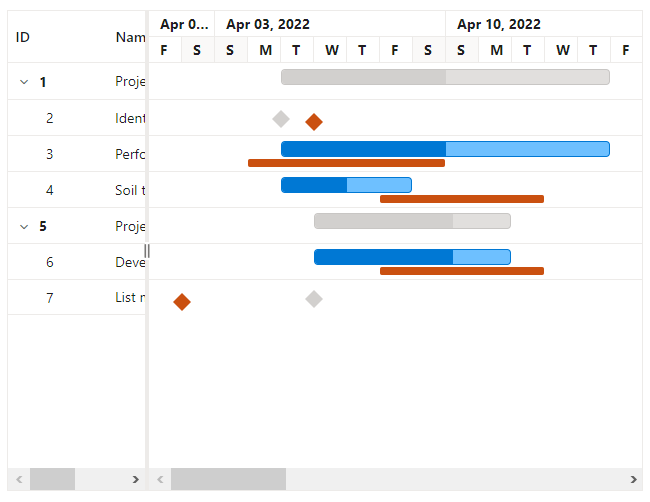

# Baseline in Blazor Gantt Chart Component

The baseline feature enables users to view the deviation between the planned dates and actual dates of the tasks in a project. Baseline dates or planned dates of a task may or may not be same as the actual task dates. The baseline can be enabled by setting the [RenderBaseline](https://help.syncfusion.com/cr/blazor/Syncfusion.Blazor.Gantt.SfGantt-1.html#Syncfusion_Blazor_Gantt_SfGantt_1_RenderBaseline) property to `true` and the baseline color can be changed using the [BaselineColor](https://help.syncfusion.com/cr/blazor/Syncfusion.Blazor.Gantt.SfGantt-1.html#Syncfusion_Blazor_Gantt_SfGantt_1_BaselineColor) property. To render the baseline, you should map the baseline start and end date values from the data source. This can be done using the [GanttTaskFields.BaselineStartDate](https://help.syncfusion.com/cr/blazor/Syncfusion.Blazor.Gantt.GanttTaskFields.html#Syncfusion_Blazor_Gantt_GanttTaskFields_BaselineStartDate) and [GanttTaskFields.BaselineEndDate](https://help.syncfusion.com/cr/blazor/Syncfusion.Blazor.Gantt.GanttTaskFields.html#Syncfusion_Blazor_Gantt_GanttTaskFields_BaselineEndDate) properties. The following code example shows how to enable a baseline in the Gantt Chart component.

```cshtml
@using Syncfusion.Blazor.Gantt
<SfGantt DataSource="@TaskCollection" RenderBaseline="true"
        ProjectStartDate="@ProjectStart" ProjectEndDate="@ProjectEnd" Height="450px" Width="700px">
    <GanttTaskFields Id="TaskId" Name="TaskName" StartDate="StartDate" EndDate="EndDate"
          Duration="Duration" Progress="Progress" ParentID="ParentId" BaselineStartDate="BaselineStartDate"
          BaselineEndDate="BaselineEndDate">
    </GanttTaskFields>
</SfGantt>

@code{
    private DateTime ProjectStart = new DateTime(2022, 04, 01);
    private DateTime ProjectEnd = new DateTime(2022, 04, 30); 
    private List<TaskData> TaskCollection { get; set; }
    protected override void OnInitialized()
    {
        this.TaskCollection = GetTaskCollection();
    }

    public class TaskData
    {
        public int TaskId { get; set; }
        public string TaskName { get; set; }
        public DateTime StartDate { get; set; }
        public DateTime? EndDate { get; set; }
        public DateTime? BaselineStartDate { get; set; }
        public DateTime? BaselineEndDate { get; set; }
        public string Duration { get; set; }
        public int Progress { get; set; }
        public int? ParentId { get; set; }
    }

    public static List<TaskData> GetTaskCollection()
    {
        List<TaskData> Tasks = new List<TaskData>()
        {
            new TaskData() { TaskId = 1, TaskName = "Project initiation", StartDate = new DateTime(2022, 04, 05), EndDate = new DateTime(2022, 04, 21), },
            new TaskData() { TaskId = 2, TaskName = "Identify site location", StartDate = new DateTime(2022, 04, 05), BaselineStartDate = new DateTime(2022, 04, 06), BaselineEndDate = new DateTime(2022, 04, 08), Duration = "0", Progress = 70, ParentId = 1 },
            new TaskData() { TaskId = 3, TaskName = "Perform soil test", StartDate = new DateTime(2022, 04, 05), BaselineStartDate = new DateTime(2022, 04, 04), BaselineEndDate = new DateTime(2022, 04, 09), Duration = "8", Progress = 50, ParentId = 1 },
            new TaskData() { TaskId = 4, TaskName = "Soil test approval", StartDate = new DateTime(2022, 04, 05), BaselineStartDate = new DateTime(2022, 04, 08), BaselineEndDate = new DateTime(2022, 04, 12), Duration = "4", Progress = 50, ParentId = 1 },
            new TaskData() { TaskId = 5, TaskName = "Project estimation", StartDate = new DateTime(2022, 04, 06), EndDate = new DateTime(2022, 04, 21), },
            new TaskData() { TaskId = 6, TaskName = "Develop floor plan for estimation", StartDate = new DateTime(2022, 04, 06), BaselineStartDate = new DateTime(2022, 04, 08), BaselineEndDate = new DateTime(2022, 04, 12), Duration = "4", Progress = 70, ParentId = 5 },
            new TaskData() { TaskId = 7, TaskName = "List materials", StartDate = new DateTime(2022, 04, 06), BaselineStartDate = new DateTime(2022, 04, 02), BaselineEndDate = new DateTime(2022, 04, 02), Duration = "0", Progress = 50, ParentId = 5 },
        };
        return Tasks;
    }
}
```

The following screenshot shows the baselines in Gantt Chart component.



N> You can refer to our [Blazor Gantt Chart](https://www.syncfusion.com/blazor-components/blazor-gantt-chart) feature tour page for its groundbreaking feature representations. You can also explore our [Blazor Gantt Chart example](https://blazor.syncfusion.com/demos/gantt-chart/default-functionalities) to know how to render and configure the gantt.