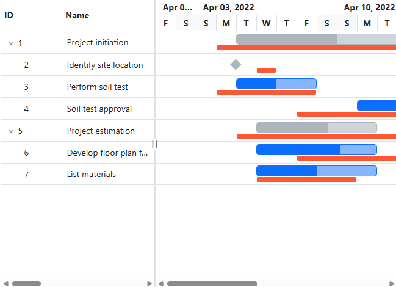

# Baseline in Blazor Gantt Chart Component

The baseline feature in the Syncfusion Blazor Gantt Chart displays the deviation between planned and actual task dates by enabling the [RenderBaseline](https://help.syncfusion.com/cr/blazor/Syncfusion.Blazor.Gantt.SfGantt-1.html#Syncfusion_Blazor_Gantt_SfGantt_1_RenderBaseline) property to `true`. Map planned dates from the data source using [GanttTaskFields.BaselineStartDate](https://help.syncfusion.com/cr/blazor/Syncfusion.Blazor.Gantt.GanttTaskFields.html#Syncfusion_Blazor_Gantt_GanttTaskFields_BaselineStartDate) and [GanttTaskFields.BaselineEndDate](https://help.syncfusion.com/cr/blazor/Syncfusion.Blazor.Gantt.GanttTaskFields.html#Syncfusion_Blazor_Gantt_GanttTaskFields_BaselineEndDate). The data model must include `TaskId`, `TaskName`, `StartDate`, `EndDate`, and optionally `BaselineStartDate` and `BaselineEndDate` for tasks requiring baselines. Customize the baseline appearance with the [BaselineColor](https://help.syncfusion.com/cr/blazor/Syncfusion.Blazor.Gantt.SfGantt-1.html#Syncfusion_Blazor_Gantt_SfGantt_1_BaselineColor) property. The following sections demonstrate enabling baselines and customizing their color.

## Render baselines

Enable baselines by setting `RenderBaseline` to `true` and mapping `BaselineStartDate` and `BaselineEndDate` in the data source. This displays baseline bars alongside actual task bars, using the default color, to highlight scheduling deviations. Ensure valid baseline dates to avoid rendering issues.

```cshtml
@using Syncfusion.Blazor.Gantt
@using Syncfusion.Blazor.Grids

<SfGantt DataSource="@TaskCollection" RenderBaseline="true" ProjectStartDate="@ProjectStart" ProjectEndDate="@ProjectEnd" Height="450px" Width="700px">
    <GanttTaskFields Id="TaskId" Name="TaskName" StartDate="StartDate" EndDate="EndDate" Duration="Duration" Progress="Progress" ParentID="ParentId" BaselineStartDate="BaselineStartDate" BaselineEndDate="BaselineEndDate">
    </GanttTaskFields>
</SfGantt>

@code {
    private DateTime ProjectStart = new DateTime(2022, 04, 01);
    private DateTime ProjectEnd = new DateTime(2022, 04, 30);
    private List<TaskData> TaskCollection { get; set; }

    protected override void OnInitialized()
    {
        this.TaskCollection = GetTaskCollection();
    }

    public class TaskData
    {
        public int TaskId { get; set; }
        public string TaskName { get; set; }
        public DateTime StartDate { get; set; }
        public DateTime? EndDate { get; set; }
        public DateTime? BaselineStartDate { get; set; }
        public DateTime? BaselineEndDate { get; set; }
        public string Duration { get; set; }
        public int Progress { get; set; }
        public int? ParentId { get; set; }
    }

    public static List<TaskData> GetTaskCollection()
    {
        List<TaskData> Tasks = new List<TaskData>()
        {
            new TaskData() { TaskId = 1, TaskName = "Project initiation", StartDate = new DateTime(2022, 04, 05), EndDate = new DateTime(2022, 04, 21), BaselineStartDate = new DateTime(2022, 04, 04), BaselineEndDate = new DateTime(2022, 04, 20) },
            new TaskData() { TaskId = 2, TaskName = "Identify site location", StartDate = new DateTime(2022, 04, 05), BaselineStartDate = new DateTime(2022, 04, 06, 08, 00, 00), BaselineEndDate = new DateTime(2022, 04, 06, 08, 00, 00), Duration = "0", Progress = 70, ParentId = 1 },
            new TaskData() { TaskId = 3, TaskName = "Perform soil test", StartDate = new DateTime(2022, 04, 05), BaselineStartDate = new DateTime(2022, 04, 04), BaselineEndDate = new DateTime(2022, 04, 08), Duration = "4", Progress = 50, ParentId = 1 },
            new TaskData() { TaskId = 4, TaskName = "Soil test approval", StartDate = new DateTime(2022, 04, 09), BaselineStartDate = new DateTime(2022, 04, 08), BaselineEndDate = new DateTime(2022, 04, 12), Duration = "4", Progress = 50, ParentId = 1 },
            new TaskData() { TaskId = 5, TaskName = "Project estimation", StartDate = new DateTime(2022, 04, 06), EndDate = new DateTime(2022, 04, 21), BaselineStartDate = new DateTime(2022, 04, 05), BaselineEndDate = new DateTime(2022, 04, 20) },
            new TaskData() { TaskId = 6, TaskName = "Develop floor plan for estimation", StartDate = new DateTime(2022, 04, 06), BaselineStartDate = new DateTime(2022, 04, 08), BaselineEndDate = new DateTime(2022, 04, 12), Duration = "4", Progress = 70, ParentId = 5 },
            new TaskData() { TaskId = 7, TaskName = "List materials", StartDate = new DateTime(2022, 04, 06), BaselineStartDate = new DateTime(2022, 04, 06), BaselineEndDate = new DateTime(2022, 04, 10), Duration = "4", Progress = 50, ParentId = 5 }
        };
        return Tasks;
    }
}
```


## Customize baseline color

Change the baseline color using the `BaselineColor` property to enhance visibility or match branding. The following example sets a custom orange color for baselines.

```cshtml
@using Syncfusion.Blazor.Gantt

<SfGantt DataSource="@TaskCollection" RenderBaseline="true" BaselineColor="#FF5733" ProjectStartDate="@ProjectStart" ProjectEndDate="@ProjectEnd" Height="450px" Width="700px">
    <GanttTaskFields Id="TaskId" Name="TaskName" StartDate="StartDate" EndDate="EndDate" Duration="Duration" Progress="Progress" ParentID="ParentId" BaselineStartDate="BaselineStartDate" BaselineEndDate="BaselineEndDate">
    </GanttTaskFields>
</SfGantt>

@code {
    private DateTime ProjectStart = new DateTime(2022, 04, 01);
    private DateTime ProjectEnd = new DateTime(2022, 04, 30);
    private List<TaskData> TaskCollection { get; set; }

    protected override void OnInitialized()
    {
        this.TaskCollection = GetTaskCollection();
    }

    public class TaskData
    {
        public int TaskId { get; set; }
        public string TaskName { get; set; }
        public DateTime StartDate { get; set; }
        public DateTime? EndDate { get; set; }
        public DateTime? BaselineStartDate { get; set; }
        public DateTime? BaselineEndDate { get; set; }
        public string Duration { get; set; }
        public int Progress { get; set; }
        public int? ParentId { get; set; }
    }

    public static List<TaskData> GetTaskCollection()
    {
        List<TaskData> Tasks = new List<TaskData>()
        {
            new TaskData() { TaskId = 1, TaskName = "Project initiation", StartDate = new DateTime(2022, 04, 05), EndDate = new DateTime(2022, 04, 21), BaselineStartDate = new DateTime(2022, 04, 04), BaselineEndDate = new DateTime(2022, 04, 20) },
            new TaskData() { TaskId = 2, TaskName = "Identify site location", StartDate = new DateTime(2022, 04, 05), BaselineStartDate = new DateTime(2022, 04, 06), BaselineEndDate = new DateTime(2022, 04, 06), Duration = "0", Progress = 70, ParentId = 1 },
            new TaskData() { TaskId = 3, TaskName = "Perform soil test", StartDate = new DateTime(2022, 04, 05), BaselineStartDate = new DateTime(2022, 04, 04), BaselineEndDate = new DateTime(2022, 04, 08), Duration = "4", Progress = 50, ParentId = 1 },
            new TaskData() { TaskId = 4, TaskName = "Soil test approval", StartDate = new DateTime(2022, 04, 09), BaselineStartDate = new DateTime(2022, 04, 08), BaselineEndDate = new DateTime(2022, 04, 12), Duration = "4", Progress = 50, ParentId = 1 },
            new TaskData() { TaskId = 5, TaskName = "Project estimation", StartDate = new DateTime(2022, 04, 06), EndDate = new DateTime(2022, 04, 21), BaselineStartDate = new DateTime(2022, 04, 05), BaselineEndDate = new DateTime(2022, 04, 20) },
            new TaskData() { TaskId = 6, TaskName = "Develop floor plan for estimation", StartDate = new DateTime(2022, 04, 06), BaselineStartDate = new DateTime(2022, 04, 08), BaselineEndDate = new DateTime(2022, 04, 12), Duration = "4", Progress = 70, ParentId = 5 },
            new TaskData() { TaskId = 7, TaskName = "List materials", StartDate = new DateTime(2022, 04, 06), BaselineStartDate = new DateTime(2022, 04, 06), BaselineEndDate = new DateTime(2022, 04, 10), Duration = "4", Progress = 50, ParentId = 5 }
        };
        return Tasks;
    }
}
```



## See Also

- [Accessibility in Blazor Gantt Chart](https://blazor.syncfusion.com/documentation/gantt-chart/accessibility)
- [Blazor Gantt Chart Feature Tour](https://www.syncfusion.com/blazor-components/blazor-gantt-chart)
- [Blazor Gantt Chart Example](https://blazor.syncfusion.com/demos/gantt-chart/default-functionalities?theme=bootstrap5)