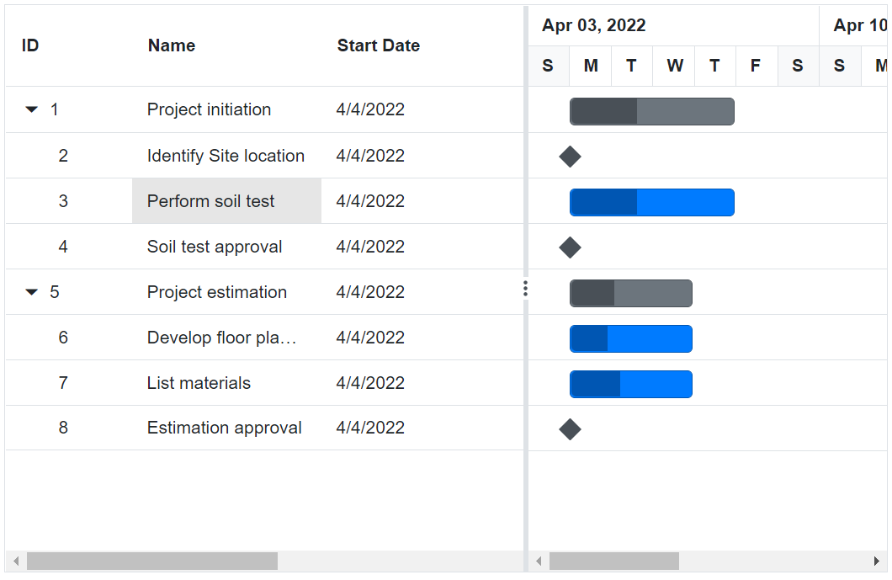
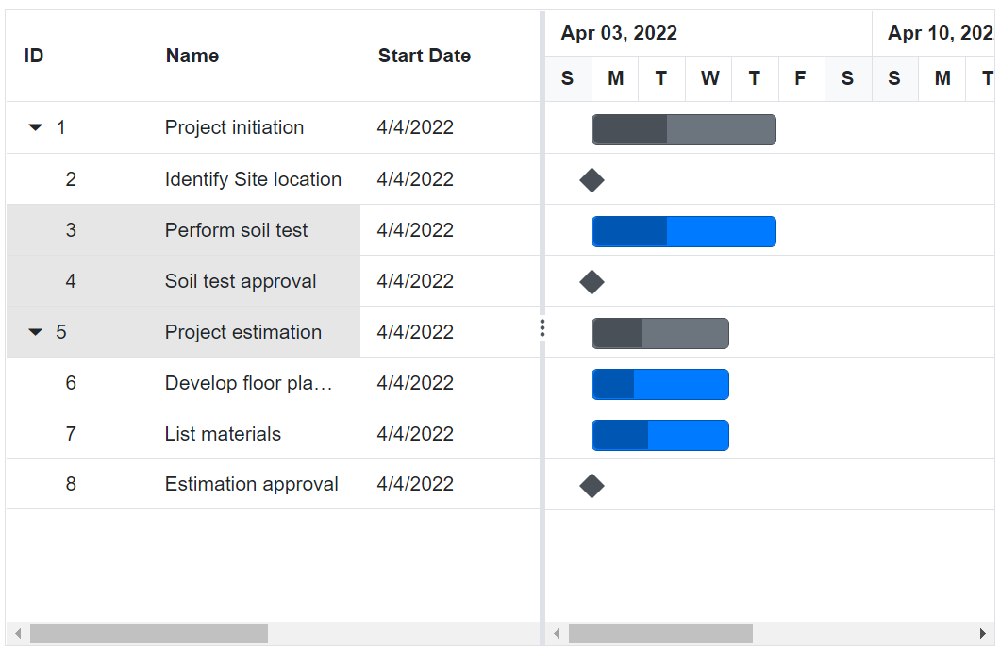
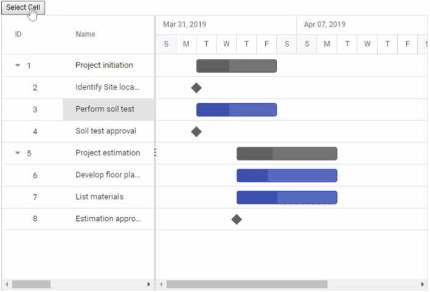

# Cell Selection in Blazor Gantt Chart Component

Cell selection in the Syncfusion Blazor Gantt Chart allows users to select individual cells in the Tree Grid section, enabling interactions like data inspection or editing. Enable this feature by setting the [GanttSelectionSettings.Mode](https://help.syncfusion.com/cr/blazor/Syncfusion.Blazor.Gantt.GanttSelectionSettings.html#Syncfusion_Blazor_Gantt_GanttSelectionSettings_Mode) property to [SelectionMode.Cell](https://help.syncfusion.com/cr/blazor/Syncfusion.Blazor.Grids.SelectionMode.html#Syncfusion_Blazor_Grids_SelectionMode_Cell). The data model must include fields like `TaskId`, `TaskName`, `StartDate`, `EndDate`, `Duration`, `Progress`, and optionally `ParentId` for hierarchical tasks. Use the [GetSelectedRowCellIndexes](https://help.syncfusion.com/cr/blazor/Syncfusion.Blazor.Gantt.SfGantt-1.html#Syncfusion_Blazor_Gantt_SfGantt_1_GetSelectedRowCellIndexes) method to retrieve selected cell information, which returns an object collection with `CellIndexes` and `RowIndex`. This guide covers single cell selection, multiple cell selection, dynamic selection, and customizing selection actions.

## Select single cell

Enable single cell selection by setting `GanttSelectionSettings.Mode` to `Cell`. Click a cell in the Tree Grid section to select it. The selected cell is highlighted, and its details can be accessed programmatically.

```cshtml
@using Syncfusion.Blazor.Gantt
@using Syncfusion.Blazor.Grids

<SfGantt DataSource="@TaskCollection" Height="450px" Width="700px">
    <GanttTaskFields Id="TaskId" Name="TaskName" StartDate="StartDate" EndDate="EndDate" Duration="Duration" Progress="Progress" ParentID="ParentId">
    </GanttTaskFields>
    <GanttSelectionSettings Mode="Syncfusion.Blazor.Grids.SelectionMode.Cell"></GanttSelectionSettings>
</SfGantt>

@code {
    private List<TaskData> TaskCollection { get; set; }

    protected override void OnInitialized()
    {
        this.TaskCollection = GetTaskCollection();
    }

    public class TaskData
    {
        public int TaskId { get; set; }
        public string TaskName { get; set; }
        public DateTime StartDate { get; set; }
        public DateTime? EndDate { get; set; }
        public string Duration { get; set; }
        public int Progress { get; set; }
        public int? ParentId { get; set; }
    }

    public static List<TaskData> GetTaskCollection()
    {
        List<TaskData> Tasks = new List<TaskData>()
        {
            new TaskData() { TaskId = 1, TaskName = "Project initiation", StartDate = new DateTime(2022, 04, 05), EndDate = new DateTime(2022, 04, 21) },
            new TaskData() { TaskId = 2, TaskName = "Identify site location", StartDate = new DateTime(2022, 04, 05), Duration = "0", Progress = 30, ParentId = 1 },
            new TaskData() { TaskId = 3, TaskName = "Perform soil test", StartDate = new DateTime(2022, 04, 05), Duration = "4", Progress = 40, ParentId = 1 },
            new TaskData() { TaskId = 4, TaskName = "Soil test approval", StartDate = new DateTime(2022, 04, 05), Duration = "0", Progress = 30, ParentId = 1 },
            new TaskData() { TaskId = 5, TaskName = "Project estimation", StartDate = new DateTime(2022, 04, 06), EndDate = new DateTime(2022, 04, 21) },
            new TaskData() { TaskId = 6, TaskName = "Develop floor plan for estimation", StartDate = new DateTime(2022, 04, 06), Duration = "3", Progress = 30, ParentId = 5 },
            new TaskData() { TaskId = 7, TaskName = "List materials", StartDate = new DateTime(2022, 04, 06), Duration = "3", Progress = 40, ParentId = 5 },
            new TaskData() { TaskId = 8, TaskName = "Estimation approval", StartDate = new DateTime(2022, 04, 06), Duration = "0", Progress = 30, ParentId = 5 }
        };
        return Tasks;
    }
}
```



> **Note**: Use <kbd>Tab</kbd> and arrow keys for keyboard navigation to select cells on mobile and desktop devices.

## Select multiple cells

Enable multiple cell selection by setting `GanttSelectionSettings.Mode` to `Cell` and `GanttSelectionSettings.Type` to `Syncfusion.Blazor.Grids.SelectionType.Multiple`. Hold the <kbd>Ctrl</kbd> key and click cells to select multiple cells in the Tree Grid section.

```cshtml
@using Syncfusion.Blazor.Gantt
@using Syncfusion.Blazor.Grids

<SfGantt DataSource="@TaskCollection" Height="450px" Width="700px">
    <GanttTaskFields Id="TaskId" Name="TaskName" StartDate="StartDate" EndDate="EndDate" Duration="Duration" Progress="Progress" ParentID="ParentId">
    </GanttTaskFields>
    <GanttSelectionSettings Mode="Syncfusion.Blazor.Grids.SelectionMode.Cell" Type="Syncfusion.Blazor.Grids.SelectionType.Multiple"></GanttSelectionSettings>
</SfGantt>

@code {
    private List<TaskData> TaskCollection { get; set; }

    protected override void OnInitialized()
    {
        this.TaskCollection = GetTaskCollection();
    }

    public class TaskData
    {
        public int TaskId { get; set; }
        public string TaskName { get; set; }
        public DateTime StartDate { get; set; }
        public DateTime? EndDate { get; set; }
        public string Duration { get; set; }
        public int Progress { get; set; }
        public int? ParentId { get; set; }
    }

    public static List<TaskData> GetTaskCollection()
    {
        List<TaskData> Tasks = new List<TaskData>()
        {
            new TaskData() { TaskId = 1, TaskName = "Project initiation", StartDate = new DateTime(2022, 04, 05), EndDate = new DateTime(2022, 04, 21) },
            new TaskData() { TaskId = 2, TaskName = "Identify site location", StartDate = new DateTime(2022, 04, 05), Duration = "0", Progress = 30, ParentId = 1 },
            new TaskData() { TaskId = 3, TaskName = "Perform soil test", StartDate = new DateTime(2022, 04, 05), Duration = "4", Progress = 40, ParentId = 1 },
            new TaskData() { TaskId = 4, TaskName = "Soil test approval", StartDate = new DateTime(2022, 04, 05), Duration = "0", Progress = 30, ParentId = 1 },
            new TaskData() { TaskId = 5, TaskName = "Project estimation", StartDate = new DateTime(2022, 04, 06), EndDate = new DateTime(2022, 04, 21) },
            new TaskData() { TaskId = 6, TaskName = "Develop floor plan for estimation", StartDate = new DateTime(2022, 04, 06), Duration = "3", Progress = 30, ParentId = 5 },
            new TaskData() { TaskId = 7, TaskName = "List materials", StartDate = new DateTime(2022, 04, 06), Duration = "3", Progress = 40, ParentId = 5 },
            new TaskData() { TaskId = 8, TaskName = "Estimation approval", StartDate = new DateTime(2022, 04, 06), Duration = "0", Progress = 30, ParentId = 5 }
        };
        return Tasks;
    }
}
```



> **Note**: Multiple cell selection requires <kbd>Ctrl</kbd> + click on Windows or <kbd>Cmd</kbd> + click on Mac. Ensure selections are visible on smaller screens for mobile responsiveness.

## Select cell dynamically

Programmatically select a cell using the [SelectCellAsync](https://help.syncfusion.com/cr/blazor/Syncfusion.Blazor.Gantt.SfGantt-1.html#Syncfusion_Blazor_Gantt_SfGantt_1_SelectCellAsync_System_ValueTuple_System_Int32_System_Int32__System_Nullable_System_Boolean__) method, specifying the row and column index. Use a reference to the Gantt component and handle potential errors for invalid indices.

```cshtml
@using Syncfusion.Blazor.Gantt
@using Syncfusion.Blazor.Grids
@using Syncfusion.Blazor.Buttons

<SfButton Content="Select Cell" OnClick="SelectCellAsync"></SfButton>
<SfGantt @ref="Gantt" DataSource="@TaskCollection" Height="450px" Width="700px">
    <GanttTaskFields Id="TaskId" Name="TaskName" StartDate="StartDate" EndDate="EndDate" Duration="Duration" Progress="Progress" ParentID="ParentId">
    </GanttTaskFields>
    <GanttSelectionSettings Mode="Syncfusion.Blazor.Grids.SelectionMode.Cell"></GanttSelectionSettings>
</SfGantt>

@code {
    public SfGantt<TaskData> Gantt;

    public async Task SelectCellAsync()
    {
        await Gantt.SelectCellAsync(new ValueTuple<int, int>(1, 2));
    }

    private List<TaskData> TaskCollection { get; set; }

    protected override void OnInitialized()
    {
        this.TaskCollection = GetTaskCollection();
    }

    public class TaskData
    {
        public int TaskId { get; set; }
        public string TaskName { get; set; }
        public DateTime StartDate { get; set; }
        public DateTime? EndDate { get; set; }
        public string Duration { get; set; }
        public int Progress { get; set; }
        public int? ParentId { get; set; }
    }

    public static List<TaskData> GetTaskCollection()
    {
        List<TaskData> Tasks = new List<TaskData>()
        {
            new TaskData() { TaskId = 1, TaskName = "Project initiation", StartDate = new DateTime(2022, 04, 05), EndDate = new DateTime(2022, 04, 21) },
            new TaskData() { TaskId = 2, TaskName = "Identify site location", StartDate = new DateTime(2022, 04, 05), Duration = "0", Progress = 30, ParentId = 1 },
            new TaskData() { TaskId = 3, TaskName = "Perform soil test", StartDate = new DateTime(2022, 04, 05), Duration = "4", Progress = 40, ParentId = 1 },
            new TaskData() { TaskId = 4, TaskName = "Soil test approval", StartDate = new DateTime(2022, 04, 05), Duration = "0", Progress = 30, ParentId = 1 },
            new TaskData() { TaskId = 5, TaskName = "Project estimation", StartDate = new DateTime(2022, 04, 06), EndDate = new DateTime(2022, 04, 21) },
            new TaskData() { TaskId = 6, TaskName = "Develop floor plan for estimation", StartDate = new DateTime(2022, 04, 06), Duration = "3", Progress = 30, ParentId = 5 },
            new TaskData() { TaskId = 7, TaskName = "List materials", StartDate = new DateTime(2022, 04, 06), Duration = "3", Progress = 40, ParentId = 5 },
            new TaskData() { TaskId = 8, TaskName = "Estimation approval", StartDate = new DateTime(2022, 04, 06), Duration = "0", Progress = 30, ParentId = 5 }
        };
        return Tasks;
    }
}
```



> **Note**: Use try-catch blocks with `SelectCellAsync` to handle invalid row or column indices. Ensure the Gantt reference is initialized to avoid runtime errors.

## Customize cell selection

Control cell selection behavior using the [CellSelecting](https://help.syncfusion.com/cr/blazor/Syncfusion.Blazor.Gantt.GanttEvents-1.html#Syncfusion_Blazor_Gantt_GanttEvents_1_CellSelecting) and [CellSelected](https://help.syncfusion.com/cr/blazor/Syncfusion.Blazor.Gantt.GanttEvents-1.html#Syncfusion_Blazor_Gantt_GanttEvents_1_CellSelected) events. The `CellSelecting` event triggers before selection, allowing cancellation of specific cell selections based on conditions (e.g., task ID). The `CellSelected` event triggers after selection, providing access to selected cell details.

```cshtml
@using Syncfusion.Blazor.Gantt
@using Syncfusion.Blazor.Grids

<SfGantt DataSource="@TaskCollection" Height="450px" Width="700px">
    <GanttTaskFields Id="TaskId" Name="TaskName" StartDate="StartDate" EndDate="EndDate" Duration="Duration" Progress="Progress" ParentID="ParentId">
    </GanttTaskFields>
    <GanttSelectionSettings Mode="Syncfusion.Blazor.Grids.SelectionMode.Cell"></GanttSelectionSettings>
    <GanttEvents CellSelecting="CellSelectingAsync" TValue="TaskData"></GanttEvents>
</SfGantt>

@code {
    public async Task CellSelectingAsync(Syncfusion.Blazor.Grids.CellSelectingEventArgs<TaskData> args)
    {
        if (args.Data.TaskId == 2)
        {
            args.Cancel = true;
        }
    }

    private List<TaskData> TaskCollection { get; set; }

    protected override void OnInitialized()
    {
        this.TaskCollection = GetTaskCollection();
    }

    public class TaskData
    {
        public int TaskId { get; set; }
        public string TaskName { get; set; }
        public DateTime StartDate { get; set; }
        public DateTime? EndDate { get; set; }
        public string Duration { get; set; }
        public int Progress { get; set; }
        public int? ParentId { get; set; }
    }

    public static List<TaskData> GetTaskCollection()
    {
        List<TaskData> Tasks = new List<TaskData>()
        {
            new TaskData() { TaskId = 1, TaskName = "Project initiation", StartDate = new DateTime(2022, 04, 05), EndDate = new DateTime(2022, 04, 21) },
            new TaskData() { TaskId = 2, TaskName = "Identify site location", StartDate = new DateTime(2022, 04, 05), Duration = "0", Progress = 30, ParentId = 1 },
            new TaskData() { TaskId = 3, TaskName = "Perform soil test", StartDate = new DateTime(2022, 04, 05), Duration = "4", Progress = 40, ParentId = 1 },
            new TaskData() { TaskId = 4, TaskName = "Soil test approval", StartDate = new DateTime(2022, 04, 05), Duration = "0", Progress = 30, ParentId = 1 },
            new TaskData() { TaskId = 5, TaskName = "Project estimation", StartDate = new DateTime(2022, 04, 06), EndDate = new DateTime(2022, 04, 21) },
            new TaskData() { TaskId = 6, TaskName = "Develop floor plan for estimation", StartDate = new DateTime(2022, 04, 06), Duration = "3", Progress = 30, ParentId = 5 },
            new TaskData() { TaskId = 7, TaskName = "List materials", StartDate = new DateTime(2022, 04, 06), Duration = "3", Progress = 40, ParentId = 5 },
            new TaskData() { TaskId = 8, TaskName = "Estimation approval", StartDate = new DateTime(2022, 04, 06), Duration = "0", Progress = 30, ParentId = 5 }
        };
        return Tasks;
    }
}
```

> **Note**: Use `CellSelecting` to restrict selections based on task properties. Log selected cell details with `CellSelected` for debugging or custom actions. Ensure selections are accessible via keyboard (e.g., <kbd>Shift</kbd> + arrow keys for range selection).

## See Also

- [Accessibility in Blazor Gantt Chart](https://blazor.syncfusion.com/documentation/gantt-chart/accessibility)
- [Blazor Gantt Chart Feature Tour](https://www.syncfusion.com/blazor-components/blazor-gantt-chart)
- [Blazor Gantt Chart Example](https://blazor.syncfusion.com/demos/gantt-chart/default-functionalities?theme=bootstrap5)