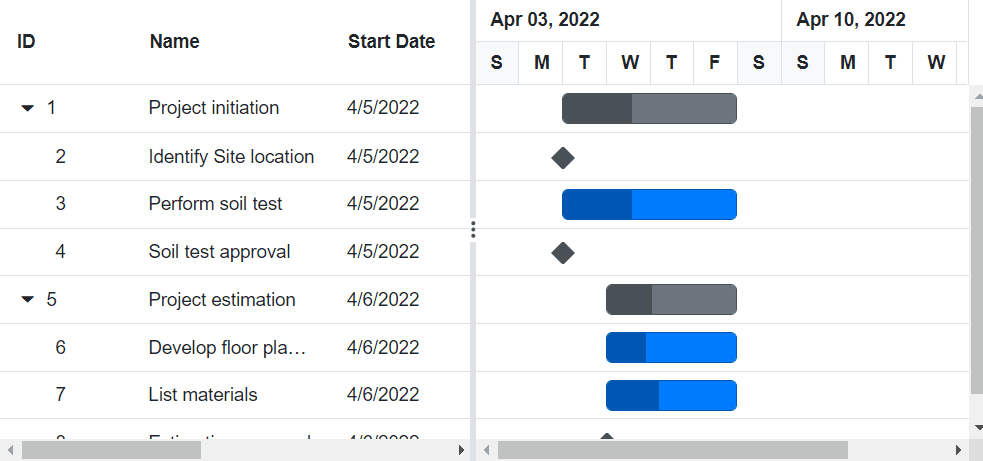
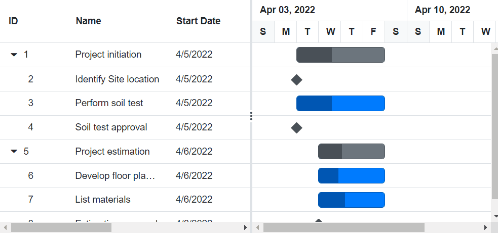
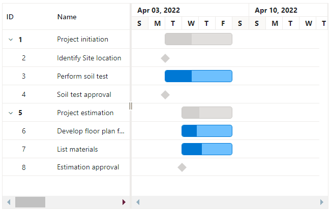

# Clipboard in Blazor Gantt Chart component

The clipboard feature allows copying selected row or cell data from the Gantt Chart component.

The following keyboard shortcut is supported for clipboard operations:

Interaction keys |Description
-----|-----
<kbd>Ctrl + C</kbd> |Copy selected rows or cells data into clipboard.
<kbd>Ctrl + Shift + H</kbd> |Copy selected rows or cells data with header into clipboard.

```cshtml

@using Syncfusion.Blazor.Gantt

<SfGantt DataSource="@TaskCollection" Height="450px" Width="1000px">
    <GanttTaskFields Id="TaskId" Name="TaskName" StartDate="StartDate" EndDate="EndDate" Duration="Duration" Progress="Progress" Dependency="Predecessor" ParentID="ParentId">
    </GanttTaskFields>
</SfGantt>

@code{
    private List<TaskData> TaskCollection { get; set; }
    protected override void OnInitialized()
    {
        this.TaskCollection = GetTaskCollection();
    }

    public class TaskData
    {
        public int TaskId { get; set; }
        public string TaskName { get; set; }
        public DateTime StartDate { get; set; }
        public DateTime? EndDate { get; set; }
        public string Duration { get; set; }
        public int Progress { get; set; }
        public string Predecessor { get; set; }
        public int? ParentId { get; set; }
    }

    public static List<TaskData> GetTaskCollection()
    {
        List<TaskData> Tasks = new List<TaskData>()
        {
            new TaskData() { TaskId = 1, TaskName = "Project initiation", StartDate = new DateTime(2019, 04, 05), EndDate = new DateTime(2019, 04, 21), },
            new TaskData() { TaskId = 2, TaskName = "Identify Site location", StartDate = new DateTime(2019, 04, 05), Duration = "0", Progress = 30, ParentId = 1 },
            new TaskData() { TaskId = 3, TaskName = "Perform soil test", StartDate = new DateTime(2019, 04, 05), Duration = "4", Progress = 40, Predecessor = "2", ParentId = 1 },
            new TaskData() { TaskId = 4, TaskName = "Soil test approval", StartDate = new DateTime(2019, 04, 05), Duration = "0", Progress = 30, Predecessor = "3", ParentId = 1 },
            new TaskData() { TaskId = 5, TaskName = "Project estimation", StartDate = new DateTime(2019, 04, 06), EndDate = new DateTime(2019, 04, 21) },
            new TaskData() { TaskId = 6, TaskName = "Develop floor plan for estimation", StartDate = new DateTime(2019, 04, 06), Duration = "3", Progress = 30, Predecessor = "4" , ParentId = 5 },
            new TaskData() { TaskId = 7, TaskName = "List materials", StartDate = new DateTime(2019, 04, 06), Duration = "3", Progress = 40, Predecessor = "6" , ParentId = 5 },
            new TaskData() { TaskId = 8, TaskName = "Estimation approval", StartDate = new DateTime(2019, 04, 06), Duration = "0", Progress = 30, Predecessor = "7" , ParentId = 5 },
        };
        return Tasks;
    }
}
```

## Copy to clipboard by external buttons

To copy selected rows or cells to the clipboard using external buttons, invoke the [CopyAsync](https://help.syncfusion.com/cr/blazor/Syncfusion.Blazor.Gantt.SfGantt-1.html#Syncfusion_Blazor_Gantt_SfGantt_1_CopyAsync) method.

```cshtml

@using Syncfusion.Blazor.Gantt
@using Syncfusion.Blazor.Navigations

<SfGantt DataSource="@TaskCollection" @ref="GanttObject" Height="450px" Width="1000px">
    <GanttTaskFields Id="TaskId" Name="TaskName" StartDate="StartDate" EndDate="EndDate" Duration="Duration" Progress="Progress" Dependency="Predecessor" ParentID="ParentId">
    </GanttTaskFields>
    <SfToolbar ID="Gantt_Gantt_Toolbar">
        <ToolbarItems>
            <ToolbarItem Id="copyHeader" Text="Copy With Header" OnClick="ToolbarClick" PrefixIcon="e-copy"></ToolbarItem>
            <ToolbarItem Id="copy" Text="Copy" OnClick="ToolbarClick" PrefixIcon="e-copy"></ToolbarItem>
        </ToolbarItems>
    </SfToolbar>
</SfGantt>

@code{
    private List<TaskData> TaskCollection { get; set; }
    private SfGantt<TaskData> GanttObject;

    protected override void OnInitialized()
    {
        this.TaskCollection = GetTaskCollection();
    }

    public async void ToolbarClick(Syncfusion.Blazor.Navigations.ClickEventArgs args)
    {
        var SelectedRecords = await this.GanttObject.GetSelectedRecordsAsync();
        if (SelectedRecords.Count() > 0)
        {
            var WithHeader = false;
            if (args.Item.Id == "copyHeader")
            {
                WithHeader = true;
            }
            await this.GanttObject.CopyAsync(WithHeader);
        }
    }

    public class TaskData
    {
        public int TaskId { get; set; }
        public string TaskName { get; set; }
        public DateTime StartDate { get; set; }
        public DateTime? EndDate { get; set; }
        public string Duration { get; set; }
        public int Progress { get; set; }
        public string Predecessor { get; set; }
        public int? ParentId { get; set; }
    }

    public static List<TaskData> GetTaskCollection()
    {
        List<TaskData> Tasks = new List<TaskData>()
        {
            new TaskData() { TaskId = 1, TaskName = "Project initiation", StartDate = new DateTime(2019, 04, 05), EndDate = new DateTime(2019, 04, 21), },
            new TaskData() { TaskId = 2, TaskName = "Identify Site location", StartDate = new DateTime(2019, 04, 05), Duration = "0", Progress = 30, ParentId = 1 },
            new TaskData() { TaskId = 3, TaskName = "Perform soil test", StartDate = new DateTime(2019, 04, 05), Duration = "4", Progress = 40, Predecessor = "2", ParentId = 1 },
            new TaskData() { TaskId = 4, TaskName = "Soil test approval", StartDate = new DateTime(2019, 04, 05), Duration = "0", Progress = 30, Predecessor = "3", ParentId = 1 },
            new TaskData() { TaskId = 5, TaskName = "Project estimation", StartDate = new DateTime(2019, 04, 06), EndDate = new DateTime(2019, 04, 21) },
            new TaskData() { TaskId = 6, TaskName = "Develop floor plan for estimation", StartDate = new DateTime(2019, 04, 06), Duration = "3", Progress = 30, Predecessor = "4" , ParentId = 5 },
            new TaskData() { TaskId = 7, TaskName = "List materials", StartDate = new DateTime(2019, 04, 06), Duration = "3", Progress = 40, Predecessor = "6" , ParentId = 5 },
            new TaskData() { TaskId = 8, TaskName = "Estimation approval", StartDate = new DateTime(2019, 04, 06), Duration = "0", Progress = 30, Predecessor = "7" , ParentId = 5 },
        };
        return Tasks;
    }
}
```

## Copy hierarchy modes

The Gantt Chart component supports multiple copy modes using the [CopyHierarchyMode](https://help.syncfusion.com/cr/blazor/Syncfusion.Blazor.TreeGrid.CopyHierarchyType.html) property. The following modes are available:

- **Parent**: Copies selected records along with their parent records. If no parent exists, only the selected records are copied.

- **Child**: Copies selected records along with their child records. If no child exists, only the selected records are copied.

- **Both**: Copies selected records with both parent and child records. If neither exists, only the selected records are copied.

- **None**: Copies only the selected records without any hierarchy.

```cshtml
@using Syncfusion.Blazor.Gantt
@using Syncfusion.Blazor.TreeGrid
@using Syncfusion.Blazor.Navigations
@using Syncfusion.Blazor.DropDowns;

<SfDropDownList TValue="string" TItem="DropdownData" @bind-Value="@CopyMode" DataSource="@CopyModes">
    <DropDownListEvents TValue="string" TItem="DropdownData" ValueChange="OnTypeChange"></DropDownListEvents>
    <DropDownListFieldSettings Text="Mode" Value="Id"></DropDownListFieldSettings>
</SfDropDownList>
<SfGantt DataSource="@TaskCollection" @ref="GanttObject" CopyHierarchyMode="@CopyType"  Height="450px" Width="1000px">
    <GanttTaskFields Id="TaskId" Name="TaskName" StartDate="StartDate" EndDate="EndDate" Duration="Duration" Progress="Progress"
    Dependency="Predecessor" ParentID="ParentId"></GanttTaskFields>
    <SfToolbar ID="Gantt_Gantt_Toolbar">
        <ToolbarItems>
            <ToolbarItem Id="copyHeader" Text="Copy With Header" OnClick="ToolbarClick" PrefixIcon="e-copy"></ToolbarItem>
            <ToolbarItem Id="copy" Text="Copy" OnClick="ToolbarClick" PrefixIcon="e-copy"></ToolbarItem>
        </ToolbarItems>
    </SfToolbar>
</SfGantt>

@code{
    private List<TaskData> TaskCollection { get; set; }
    private SfGantt<TaskData> GanttObject;
    public string CopyMode { get; set; } = "Parent";
    public CopyHierarchyType CopyType { get; set; } = CopyHierarchyType.Parent;
    public List<DropdownData> CopyModes { get; set; } = new List<DropdownData>();
    public class DropdownData
    {
        public string Id { get; set; }
        public string Mode { get; set; }
    }

    protected override void OnInitialized()
    {
        this.TaskCollection = GetTaskCollection();
        this.CopyModes.Add(new DropdownData() { Id = "Parent", Mode = "Parent" });
        this.CopyModes.Add(new DropdownData() { Id = "Child", Mode = "Child" });
        this.CopyModes.Add(new DropdownData() { Id = "Both", Mode = "Both" });
        this.CopyModes.Add(new DropdownData() { Id = "None", Mode = "None" });
    }

    private async void OnTypeChange(Syncfusion.Blazor.DropDowns.ChangeEventArgs<string, DropdownData> Args)
    {
        if (Args.Value == "Parent")
        {
            CopyType = CopyHierarchyType.Parent;
        }
        else if (Args.Value == "Child")
        {
            CopyType = CopyHierarchyType.Child;
        }
        else if (Args.Value == "Both")
        {
            CopyType = CopyHierarchyType.Both;
        }
        else if(Args.Value == "None")
        {
            CopyType = CopyHierarchyType.None;
        }
    }

    public async void ToolbarClick(Syncfusion.Blazor.Navigations.ClickEventArgs args)
    {
        var SelectedRecords = await this.GanttObject.GetSelectedRecordsAsync();
        if (SelectedRecords.Count() > 0)
        {
            var WithHeader = false;
            if (args.Item.Id == "copyHeader")
            {
                WithHeader = true;
            }
            await this.GanttObject.CopyAsync(WithHeader);
        }
    }

    public class TaskData
    {
        public int TaskId { get; set; }
        public string TaskName { get; set; }
        public DateTime StartDate { get; set; }
        public DateTime? EndDate { get; set; }
        public string Duration { get; set; }
        public int Progress { get; set; }
        public string Predecessor { get; set; }
        public int? ParentId { get; set; }
    }

    public static List<TaskData> GetTaskCollection()
    {
        List<TaskData> Tasks = new List<TaskData>()
        {
            new TaskData() { TaskId = 1, TaskName = "Project initiation", StartDate = new DateTime(2019, 04, 05), EndDate = new DateTime(2019, 04, 21), },
            new TaskData() { TaskId = 2, TaskName = "Identify Site location", StartDate = new DateTime(2019, 04, 05), Duration = "0", Progress = 30, ParentId = 1 },
            new TaskData() { TaskId = 3, TaskName = "Perform soil test", StartDate = new DateTime(2019, 04, 05), Duration = "4", Progress = 40, Predecessor = "2", ParentId = 1 },
            new TaskData() { TaskId = 4, TaskName = "Soil test approval", StartDate = new DateTime(2019, 04, 05), Duration = "0", Progress = 30, Predecessor = "3", ParentId = 1 },
            new TaskData() { TaskId = 5, TaskName = "Project estimation", StartDate = new DateTime(2019, 04, 06), EndDate = new DateTime(2019, 04, 21) },
            new TaskData() { TaskId = 6, TaskName = "Develop floor plan for estimation", StartDate = new DateTime(2019, 04, 06), Duration = "3", Progress = 30, Predecessor = "4" , ParentId = 5 },
            new TaskData() { TaskId = 7, TaskName = "List materials", StartDate = new DateTime(2019, 04, 06), Duration = "3", Progress = 40, Predecessor = "6" , ParentId = 5 },
            new TaskData() { TaskId = 8, TaskName = "Estimation approval", StartDate = new DateTime(2019, 04, 06), Duration = "0", Progress = 30, Predecessor = "7" , ParentId = 5 },
        };
        return Tasks;
    }
}
```

## Paste

You can copy the content of a row or cell by selecting it and pressing the <kbd>Ctrl + C</kbd> shortcut key. To paste the copied data, press <kbd>Ctrl + V</kbd>.

**Selected row copy and paste:**

You can use the [RowSelected](https://blazor.syncfusion.com/documentation/gantt-chart/events#rowselected) event, which captures the index of the active row. When a copy command is triggered (`Ctrl + C`), the [BeforeCopy](https://help.syncfusion.com/cr/blazor/Syncfusion.Blazor.Gantt.GanttEvents-1.html#Syncfusion_Blazor_Gantt_GanttEvents_1_BeforeCopy) event processes the selected row data and prepares it for duplication. The paste operation is initiated through the `onkeyup` keyboard event (`Ctrl + V`) and handled using the [AddRecordAsync](https://help.syncfusion.com/cr/blazor/Syncfusion.Blazor.Gantt.SfGantt-1.html#Syncfusion_Blazor_Gantt_SfGantt_1_AddRecordAsync__0_System_Nullable_System_Double__System_Nullable_Syncfusion_Blazor_Gantt_RowPosition__) method, which inserts the copied records above the selected row. To prevent unintended paste actions, the [RowDeselected](https://blazor.syncfusion.com/documentation/gantt-chart/events#rowdeselected) event resets the selection index when no row is active.

```cshtml
@using Syncfusion.Blazor.Gantt
@using Syncfusion.Blazor.Grids

<SfGantt @ref=GanttChart DataSource="@TaskCollection" @onkeyup="KeyUp" Height="350px" Width="750px">
    <GanttTaskFields Id="TaskId" Name="TaskName" StartDate="StartDate" EndDate="EndDate" Duration="Duration"
        ParentID="ParentId">
    </GanttTaskFields>
    <GanttSelectionSettings Type="SelectionType.Multiple"></GanttSelectionSettings>
    <GanttEditSettings AllowAdding="true"> </GanttEditSettings>
    <GanttEvents BeforeCopy="BeforeCopyHandler" RowSelected="RowSelect" RowDeselected="RowDeselect" TValue="TaskData">
    </GanttEvents>
</SfGantt>

@code {
    private SfGantt<TaskData> GanttChart;
    private List<TaskData> TaskCollection { get; set; }
    public List<TaskData> CopiedRecords { get; set; } = new List<TaskData>();
    public double SelectedIndex { get; set; }

    public void RowDeselect(RowDeselectEventArgs<TaskData> Args)
    {
        SelectedIndex = -1;
    }
    private async void BeforeCopyHandler(Syncfusion.Blazor.Gantt.BeforeCopyEventArgs args)
    {
        var columns = GanttChart.GetColumnsAsync().Result;
        var clip = args.ClipboardText;
        if (clip != "" || clip != null)
        {
            var record = clip.Split("\n");
            int index = 0;
            foreach (var rec in record)
            {
                var colVal = rec.Split("\t");
                int colIndex = 0;
                int id = TaskCollection.Max(a => a.TaskId) + 1;
                TaskData ganttData = new TaskData() { };
                foreach (var col in columns)
                {
                    if (col.Field == GanttChart.TaskFields.Id)
                    {
                        ganttData.GetType().GetProperty(col.Field).SetValue(ganttData, id + index);
                    }
                    else if (col.Type == ColumnType.Date)
                    {
                        ganttData.GetType().GetProperty(col.Field).SetValue(ganttData, Convert.ToDateTime(colVal[colIndex]));
                    }
                    else if (col.Type == ColumnType.String)
                    {
                        ganttData.GetType().GetProperty(col.Field).SetValue(ganttData, colVal[colIndex]);
                    }
                    else if (col.Type == ColumnType.Number)
                    {
                        ganttData.GetType().GetProperty(col.Field).SetValue(ganttData, Convert.ToInt32(colVal[colIndex]));
                    }
                    colIndex++;
                }
                index++;
                CopiedRecords.Add(ganttData);
            }
        }
    }

    public void RowSelect(RowSelectEventArgs<TaskData> Args)
    {
        SelectedIndex = Args.RowIndex;
    }

    protected override void OnInitialized()
    {
        this.TaskCollection = GetTaskCollection();
    }

    private async Task KeyUp(KeyboardEventArgs Args)
    {
        if (Args.CtrlKey && Args.Code == "KeyV" && CopiedRecords.Count > 0 && SelectedIndex > -1)
        {
            var parentID = TaskCollection[(int)SelectedIndex].ParentId;
            for (var i = 0; i < CopiedRecords.Count; i++)
            {
                CopiedRecords[i].ParentId = parentID;
                GanttChart.AddRecordAsync(CopiedRecords[i],(int)SelectedIndex, RowPosition.Above);
            }
            CopiedRecords = new List<TaskData>();
        }
    }

    public class TaskData
    {
        public int TaskId { get; set; }
        public string TaskName { get; set; }
        public DateTime StartDate { get; set; }
        public DateTime? EndDate { get; set; }
        public string Duration { get; set; }
        public int Progress { get; set; }
        public int? ParentId { get; set; }
    }

    public static List<TaskData> GetTaskCollection()
    {
        List<TaskData> Tasks = new List<TaskData>() {
            new TaskData() { TaskId = 1, TaskName = "Project initiation", StartDate = new DateTime(2022, 04, 05), EndDate = new
            DateTime(2022, 04, 21) },
            new TaskData() { TaskId = 2, TaskName = "Identify Site location", StartDate = new DateTime(2022, 04, 05), Duration =
            "0", Progress = 30, ParentId = 1 },
            new TaskData() { TaskId = 3, TaskName = "Perform soil test", StartDate = new DateTime(2022, 04, 05), Duration = "4",
            Progress = 40, ParentId = 1 },
            new TaskData() { TaskId = 4, TaskName = "Soil test approval", StartDate = new DateTime(2022, 04, 05), Duration = "0",
            Progress = 30, ParentId = 1 },
            new TaskData() { TaskId = 5, TaskName = "Project estimation", StartDate = new DateTime(2022, 04, 06), EndDate = new
            DateTime(2022, 04, 21) },
            new TaskData() { TaskId = 6, TaskName = "Develop floor plan for estimation", StartDate = new DateTime(2022, 04, 06),
            Duration = "3", Progress = 30, ParentId = 5 },
            new TaskData() { TaskId = 7, TaskName = "List materials", StartDate = new DateTime(2022, 04, 06), Duration = "3",
            Progress = 40, ParentId = 5 },
            new TaskData() { TaskId = 8, TaskName = "Estimation approval", StartDate = new DateTime(2022, 04, 06), Duration = "0",
            Progress = 30, ParentId = 5 }
        };
        return Tasks;
    }
}
```


**Selected Cell Copy and Paste:** 

You can use the [CellSelected](https://blazor.syncfusion.com/documentation/gantt-chart/events#cellselected) event to identify the active row when a cell is selected. When the copy command (`Ctrl + C`) is triggered, the selected cell positions are captured using `GetSelectedRowCellIndexesAsync`. On paste (`Ctrl + V`), the copied values are applied to the corresponding cells in the target rows using the [UpdateRecordByIDAsync](https://help.syncfusion.com/cr/blazor/Syncfusion.Blazor.Gantt.SfGantt-1.html#Syncfusion_Blazor_Gantt_SfGantt_1_UpdateRecordByIDAsync__0_) method. The copy and paste actions are handled through `onkeydown` and `onkeyup` keyboard events. To avoid unintended updates, the [CellDeselected](https://blazor.syncfusion.com/documentation/gantt-chart/events#celldeselected) event resets the selection index when no cell is active. 

```cshtml
@using Syncfusion.Blazor.Gantt
@using Syncfusion.Blazor.Grids
<SfGantt @ref=GanttChart DataSource="@TaskCollection" @onkeydown="KeyDown" @onkeyup="KeyUp" Height="450px" Width="1000px">
    <GanttTaskFields Id="TaskId" Name="TaskName" StartDate="StartDate" EndDate="EndDate" Duration="Duration" Progress="Progress" ParentID="ParentId">
    </GanttTaskFields>
    <GanttSelectionSettings Mode="SelectionMode.Cell" Type="SelectionType.Multiple"></GanttSelectionSettings>
    <GanttEditSettings AllowEditing="true"> </GanttEditSettings>
    <GanttEvents CellSelected="CellSelected" CellDeselected="CellDeSelected" TValue="TaskData"></GanttEvents>
</SfGantt>

@code {
    private SfGantt<TaskData> GanttChart;
    private List<TaskData> TaskCollection { get; set; }
    public int SelectedIndex { get; set; }
    private List<ValueTuple<int, int>> clonedRecordIndex;

    public void CellDeSelected(CellDeselectEventArgs<TaskData> Args)
    {
        SelectedIndex = -1;
    }
    public async void CellSelected(CellSelectEventArgs<TaskData> Args)
    {
        SelectedIndex = Convert.ToInt32(Args.RowIndex);
    }
    protected override void OnInitialized()
    {
        this.TaskCollection = GetTaskCollection();
    }
    private async Task KeyDown(KeyboardEventArgs Args)
    {
        if (Args.CtrlKey && Args.Code == "KeyC")
        {
            clonedRecordIndex = await GanttChart.GetSelectedRowCellIndexesAsync();
        }
    }
    private async Task KeyUp(KeyboardEventArgs Args)
    {
        if (Args.CtrlKey && Args.Code == "KeyV" && clonedRecordIndex.Count>0 && SelectedIndex > -1)
        {
            var columns = GanttChart.GetColumnsAsync().Result;
            var currentRecords = GanttChart.GetCurrentViewRecords();
            IDictionary<double, List<double>> clonedRecords = new Dictionary<double, List<double>>(); ;
            for (int i = 0; i < clonedRecordIndex.Count; i++)
            {
                if (!clonedRecords.ContainsKey(clonedRecordIndex[i].Item1))
                {
                    List<double> cellIndex = new List<double>();
                    cellIndex.Add(clonedRecordIndex[i].Item2);
                    clonedRecords[clonedRecordIndex[i].Item1] = cellIndex;
                }
                else
                {
                    List<double> cellIndex = (List<double>)clonedRecords[clonedRecordIndex[i].Item1];
                    cellIndex.Add(clonedRecordIndex[i].Item2);
                }
            }
            for (int i = 0; i < clonedRecords.Count; i++)
            {
                double clonedRecRowIndex = clonedRecords.ElementAt(i).Key;
                List<double> clonedRecCellIndex = clonedRecords.ElementAt(i).Value;
                TaskData clonedRec = currentRecords[Convert.ToInt32(clonedRecRowIndex)];
                if (SelectedIndex + i < currentRecords.Count)
                {
                    TaskData updatedRec = currentRecords[SelectedIndex + i];
                    for (int j = 0; j < clonedRecCellIndex.Count; j++)
                    {
                        GanttColumn col = columns[Convert.ToInt32(clonedRecCellIndex[j])];
                        if (!col.IsPrimaryKey)
                        {
                            var clonedValue = clonedRec.GetType().GetProperty(col.Field).GetValue(clonedRec);
                            updatedRec.GetType().GetProperty(col.Field).SetValue(updatedRec, clonedValue);
                        }
                    }
                    GanttChart.UpdateRecordByIDAsync(updatedRec);
                }
            }
        }
    }

    public class TaskData
    {
        public int TaskId { get; set; }
        public string TaskName { get; set; }
        public DateTime StartDate { get; set; }
        public DateTime? EndDate { get; set; }
        public string Duration { get; set; }
        public int Progress { get; set; }
        public int? ParentId { get; set; }
    }

    public static List<TaskData> GetTaskCollection()
    {
        List<TaskData> Tasks = new List<TaskData>() {
            new TaskData() { TaskId = 1, TaskName = "Project initiation", StartDate = new DateTime(2022, 04, 05), EndDate = new
            DateTime(2022, 04, 21) },
            new TaskData() { TaskId = 2, TaskName = "Identify Site location", StartDate = new DateTime(2022, 04, 05), Duration =
            "0", Progress = 30, ParentId = 1 },
            new TaskData() { TaskId = 3, TaskName = "Perform soil test", StartDate = new DateTime(2022, 04, 05), Duration = "4",
            Progress = 40, ParentId = 1 },
            new TaskData() { TaskId = 4, TaskName = "Soil test approval", StartDate = new DateTime(2022, 04, 05), Duration = "0",
            Progress = 30, ParentId = 1 },
            new TaskData() { TaskId = 5, TaskName = "Project estimation", StartDate = new DateTime(2022, 04, 06), EndDate = new
            DateTime(2022, 04, 21) },
            new TaskData() { TaskId = 6, TaskName = "Develop floor plan for estimation", StartDate = new DateTime(2022, 04, 06),
            Duration = "3", Progress = 30, ParentId = 5 },
            new TaskData() { TaskId = 7, TaskName = "List materials", StartDate = new DateTime(2022, 04, 06), Duration = "3",
            Progress = 40, ParentId = 5 },
            new TaskData() { TaskId = 8, TaskName = "Estimation approval", StartDate = new DateTime(2022, 04, 06), Duration = "0",
            Progress = 30, ParentId = 5 }
        };
        return Tasks;
    }
}
```


## Autofill

To achieve the autofill functionality in the Gantt chart, the drag selection feature must be enabled, and the `keyup` event must be bound.

The following properties have been configured in the [GanttSelectionSettings](https://help.syncfusion.com/cr/blazor/Syncfusion.Blazor.Gantt.GanttSelectionSettings.html) to enable the drag selection feature:

- [AllowDragSelection](https://help.syncfusion.com/cr/blazor/Syncfusion.Blazor.Gantt.GanttSelectionSettings.html#Syncfusion_Blazor_Gantt_GanttSelectionSettings_AllowDragSelection): **true**
- [Mode](https://help.syncfusion.com/cr/blazor/Syncfusion.Blazor.Gantt.GanttSelectionSettings.html#Syncfusion_Blazor_Gantt_GanttSelectionSettings_Mode): [Cell](https://help.syncfusion.com/cr/blazor/Syncfusion.Blazor.Grids.SelectionMode.html#Syncfusion_Blazor_Grids_SelectionMode_Cell)
- [Type](https://help.syncfusion.com/cr/blazor/Syncfusion.Blazor.Gantt.GanttSelectionSettings.html#Syncfusion_Blazor_Gantt_GanttSelectionSettings_Type): [Multiple](https://help.syncfusion.com/cr/blazor/Syncfusion.Blazor.Grids.SelectionType.html#Syncfusion_Blazor_Grids_SelectionType_Multiple)
- [CellSelectionMode](https://help.syncfusion.com/cr/blazor/Syncfusion.Blazor.Gantt.GanttSelectionSettings.html#Syncfusion_Blazor_Gantt_GanttSelectionSettings_CellSelectionMode): [Box](https://help.syncfusion.com/cr/blazor/Syncfusion.Blazor.Grids.CellSelectionMode.html#Syncfusion_Blazor_Grids_CellSelectionMode_Box)

These settings allow users to select multiple cells by dragging the mouse.

The `keyup` event is used to detect key actions. For more information, please refer to this [page](https://blazor.syncfusion.com/documentation/gantt-chart/how-to/bind-native-events). In this example, pressing the `Alt` key triggers autofill. The value of the first selected cell is captured during the `CellSelected` event based on the selected cell index. 

When the `Alt` key is released during a multi-cell selection, the [UpdateRecordByID](https://help.syncfusion.com/cr/blazor/Syncfusion.Blazor.Gantt.SfGantt-1.html#Syncfusion_Blazor_Gantt_SfGantt_1_UpdateRecordByIDAsync__0_) method is called in the `keyup` event. This updates all selected rows by copying the value from the first selected cell to the corresponding cells in other rows.

This customization enables users to quickly update multiple cells, improving data entry efficiency in the Gantt chart.

```cshtml
@using Syncfusion.Blazor.Gantt
@using Syncfusion.Blazor.Grids

<SfGantt @ref=GanttChart DataSource="@TaskCollection" @onkeyup="KeyUp" Height="450px" Width="1000px">
    <GanttTaskFields Id="TaskId" Name="TaskName" StartDate="StartDate" EndDate="EndDate" Duration="Duration" Progress="Progress" ParentID="ParentId">
    </GanttTaskFields>
    <GanttSelectionSettings Mode="SelectionMode.Cell" Type="SelectionType.Multiple" AllowDragSelection="true" CellSelectionMode="CellSelectionMode.Box"></GanttSelectionSettings>
    <GanttEditSettings AllowEditing="true"> </GanttEditSettings>
    <GanttEvents CellSelected="CellSelectedHandler"  CellDeselected="CellDeSelectedHandler" TValue="TaskData"></GanttEvents>
</SfGantt>

@code {
    private SfGantt<TaskData> GanttChart;

    private List<TaskData> TaskCollection { get; set; }

    private object Value { get; set; }

    private string ColumnField { get; set; }

    private void CellSelectedHandler(CellSelectEventArgs<TaskData> args)
    {
        if (Value == null)
        {
            ColumnField = GanttChart.GetColumnsAsync().Result[Convert.ToInt32(args.CellIndex)].Field;
            Value = args.Data.GetType().GetProperty(ColumnField).GetValue(args.Data);
        }
    }

    private void CellDeSelectedHandler()
    {
        Value = null;
    }

    protected override void OnInitialized()
    {
        this.TaskCollection = GetTaskCollection();
    }

    private async Task KeyUp(KeyboardEventArgs args)
    {
        if (args.Code == "AltLeft" || args.Code == "AltRight")
        {
            var data = GanttChart.GetSelectedRowCellIndexesAsync();
            List<TaskData> AutofillData = new List<TaskData>();
            for (var i = 0; i < data.Result.Count; i++)
            {
                TaskData currentRecord = GanttChart.GetCurrentViewRecords().ElementAt(Convert.ToInt32(data.Result[i].Item1));
                AutofillData.Add(currentRecord);
            }
            for (var j = 0; j < AutofillData.Count; j++)
            {
                AutofillData[j].GetType().GetProperty(ColumnField).SetValue(AutofillData[j], Value);
                await GanttChart.UpdateRecordByIDAsync(AutofillData[j]);
            }
        }
    }

    public class TaskData
    {
        public int TaskId { get; set; }
        public string TaskName { get; set; }
        public DateTime StartDate { get; set; }
        public DateTime? EndDate { get; set; }
        public string Duration { get; set; }
        public int Progress { get; set; }
        public int? ParentId { get; set; }
    }

    public static List<TaskData> GetTaskCollection()
    {
        List<TaskData> Tasks = new List<TaskData>()
        {
            new TaskData() { TaskId = 1, TaskName = "Project initiation", StartDate = new DateTime(2022, 04, 05), EndDate = new DateTime(2022, 04, 21), },
            new TaskData() { TaskId = 2, TaskName = "Identify Site location", StartDate = new DateTime(2022, 04, 05), Duration = "0", Progress = 30, ParentId = 1 },
            new TaskData() { TaskId = 3, TaskName = "Perform soil test", StartDate = new DateTime(2022, 04, 05), Duration = "4", Progress = 40, ParentId = 1 },
            new TaskData() { TaskId = 4, TaskName = "Soil test approval", StartDate = new DateTime(2022, 04, 05), Duration = "0", Progress = 30,  ParentId = 1 },
            new TaskData() { TaskId = 5, TaskName = "Project estimation", StartDate = new DateTime(2022, 04, 06), EndDate = new DateTime(2022, 04, 21), },
            new TaskData() { TaskId = 6, TaskName = "Develop floor plan for estimation", StartDate = new DateTime(2022, 04, 06), Duration = "3", Progress = 30, ParentId = 5 },
            new TaskData() { TaskId = 7, TaskName = "List materials", StartDate = new DateTime(2022, 04, 06), Duration = "3", Progress = 40, ParentId = 5 },
            new TaskData() { TaskId = 8, TaskName = "Estimation approval", StartDate = new DateTime(2022, 04, 06), Duration = "0", Progress = 30,  ParentId = 5 },
        };
        return Tasks;
    }
}

```

