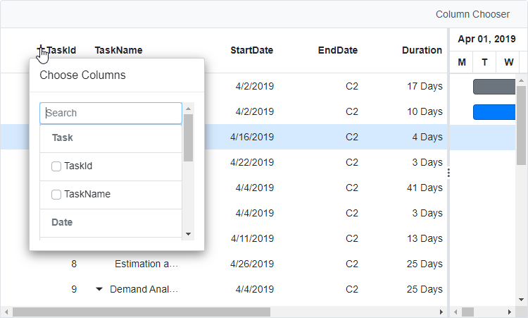

# Column Chooser in Blazor Gantt Chart Component

The column chooser feature in the Syncfusion&reg; Blazor Gantt Chart component provides dynamic control over which columns are displayed in the Gantt view.

To enable this feature, set the [ShowColumnChooser](https://help.syncfusion.com/cr/blazor/Syncfusion.Blazor.Gantt.SfGantt-1.html#Syncfusion_Blazor_Gantt_SfGantt_1_ShowColumnChooser) property to **true**.

You can add a custom column chooser option to the toolbar using the [Toolbar](https://help.syncfusion.com/cr/blazor/Syncfusion.Blazor.Gantt.SfGantt-1.html#Syncfusion_Blazor_Gantt_SfGantt_1_Toolbar) property. To open the column chooser at a specific position, use the [OpenColumnChooser](https://help.syncfusion.com/cr/blazor/Syncfusion.Blazor.Gantt.SfGantt-1.html#Syncfusion_Blazor_Gantt_SfGantt_1_OpenColumnChooser_System_Nullable_System_Double__System_Nullable_System_Double_) method with optional X and Y coordinates within the [OnToolbarClick](https://blazor.syncfusion.com/documentation/gantt-chart/events#ontoolbarclick) event.




@using Syncfusion.Blazor.Gantt

<SfGantt @ref="GanttInstance" DataSource="@TaskCollection" Toolbar="@ToolbarItems" ShowColumnChooser="true" Height="450px" Width="700px">
    <GanttTaskFields Id="TaskID" Name="TaskName" StartDate="StartDate" EndDate="EndDate" Duration="Duration" Progress="Progress" ParentID="ParentID">
    </GanttTaskFields>
    <GanttEvents OnToolbarClick="ToolbarClickAsync" TValue="TaskData"></GanttEvents>
</SfGantt>

@code{
    public SfGantt<TaskData> GanttInstance;
    private List<TaskData> TaskCollection { get; set; }
    public List<Object> ToolbarItems = new List<Object>() {
        new Syncfusion.Blazor.Navigations.ToolbarItem() { 
            Text = "Column Chooser", TooltipText = "Column Chooser", Id = "columnchooser"
        }
    };

    public async Task ToolbarClickAsync(Syncfusion.Blazor.Navigations.ClickEventArgs args)
    {
        if (args.Item.Id == "columnchooser")
        {
            await GanttInstance.OpenColumnChooser(100, 40);
        }
    }
    
    protected override void OnInitialized()
    {
        this.TaskCollection = GetTaskCollection();
    }

    public class TaskData
    {
        public int TaskID { get; set; }
        public string TaskName { get; set; }
        public DateTime StartDate { get; set; }
        public DateTime? EndDate { get; set; }
        public string Duration { get; set; }
        public int Progress { get; set; }
        public int? ParentID { get; set; }
    }

    public static List<TaskData> GetTaskCollection()
    {
        List<TaskData> Tasks = new List<TaskData>() 
        {
            new TaskData() { TaskID = 1, TaskName = "Project initiation", StartDate = new DateTime(2022, 04, 05), EndDate = new DateTime(2022, 04, 08), },
            new TaskData() { TaskID = 2, TaskName = "Identify Site location", StartDate = new DateTime(2022, 04, 05), Duration = "0", Progress = 30, ParentID = 1 },
            new TaskData() { TaskID = 3, TaskName = "Perform soil test", StartDate = new DateTime(2022, 04, 05), Duration = "4", Progress = 40, ParentID = 1 },
            new TaskData() { TaskID = 4, TaskName = "Soil test approval", StartDate = new DateTime(2022, 04, 05), Duration = "0", Progress = 30, ParentID = 1 },
            new TaskData() { TaskID = 5, TaskName = "Project estimation", StartDate = new DateTime(2022, 04, 06), EndDate = new DateTime(2022, 04, 08), },
            new TaskData() { TaskID = 6, TaskName = "Develop floor plan for estimation", StartDate = new DateTime(2022, 04, 06), Duration = "3", Progress = 30, ParentID = 5 },
            new TaskData() { TaskID = 7, TaskName = "List materials", StartDate = new DateTime(2022, 04, 06), Duration = "3", Progress = 40, ParentID = 5 },
            new TaskData() { TaskID = 8, TaskName = "Estimation approval", StartDate = new DateTime(2022, 04, 06), Duration = "0", Progress = 30, ParentID = 5 }
        };
        return Tasks;
    }
}






> **Note**: Use <kbd>Tab</kbd> and arrow keys for keyboard navigation in the chooser. Test on mobile devices for responsiveness.

## Custom component in column chooser template

You can customize the column chooser dialog in the Gantt Chart by assigning a custom template using the [GanttColumnChooserSettings.Template](https://help.syncfusion.com/cr/blazor/Syncfusion.Blazor.Gantt.GanttColumnChooserSettings.html#Syncfusion_Blazor_Gantt_GanttColumnChooserSettings_Template) property. This allows you to render custom components or layouts within the column chooser.

The following sample renders a [ListView](https://blazor.syncfusion.com/documentation/listview/getting-started-webapp) inside the column chooser template to support grouped column selection. It also includes a search box for filtering columns based on user input.




@rendermode InteractiveServer
@using Syncfusion.Blazor.Gantt
@using Syncfusion.Blazor.Grids

    

        <SfGantt @ref="Gantt" DataSource="@Orders" ShowColumnChooser="true" ProjectStartDate="new DateTime(2022, 4, 1)" ID="GanttChart" Width="1200px" Height="450px" HighlightWeekends="true" AllowReordering="true" TreeColumnIndex="1" GridLines="Syncfusion.Blazor.Gantt.GridLine.None">
            <GanttTaskFields Id="TaskID" Name="TaskName" StartDate="StartDate" EndDate="EndDate" Duration="Duration" ParentID="ParentID" Dependency="Predecessor"></GanttTaskFields>
            <GanttColumnChooserSettings>
                <Template>
                    @{
                        var ct = context as ColumnChooserTemplateContext;
                        <CustomColumnChooser @ref="ins" ActionCompleted="@AfterCompletion" ColumnContext="ct" CustomGantt="Gantt"></CustomColumnChooser>
                    }
                </Template>
            </GanttColumnChooserSettings>
            <GanttColumns>
                <GanttColumn Field=@nameof(TaskData.TaskID) HeaderText="Task ID" TextAlign="TextAlign.Right" Width="120">
                    <HeaderTemplate>
                         OpenColumnChooser(e, nameof(TaskData.TaskID))" class="e-icons e-plus-icon">Task ID
                    </HeaderTemplate>
                </GanttColumn>
                <GanttColumn Field=@nameof(TaskData.TaskName) HeaderText="Task Name" Width="150">
                    <HeaderTemplate>
                         OpenColumnChooser(e, nameof(TaskData.TaskName))" class="e-icons e-plus-icon">Task Name
                    </HeaderTemplate>
                </GanttColumn>
                <GanttColumn Field=@nameof(TaskData.StartDate) HeaderText="Start Date" Format="d" Type="ColumnType.Date" TextAlign="TextAlign.Right" Width="130">
                    <HeaderTemplate>
                         OpenColumnChooser(e, nameof(TaskData.StartDate))" class="e-icons e-plus-icon">Start Date
                    </HeaderTemplate>
                </GanttColumn>
                <GanttColumn Field=@nameof(TaskData.EndDate) HeaderText="End Date" Format="d" Type="ColumnType.Date" TextAlign="TextAlign.Right" Width="120">
                    <HeaderTemplate>
                         OpenColumnChooser(e, nameof(TaskData.EndDate))" class="e-icons e-plus-icon">End Date
                    </HeaderTemplate>
                </GanttColumn>
                <GanttColumn Field=@nameof(TaskData.Duration) HeaderText="Duration" TextAlign="TextAlign.Right" Width="120">
                    <HeaderTemplate>
                         OpenColumnChooser(e, nameof(TaskData.Duration))" class="e-icons e-plus-icon">Duration
                    </HeaderTemplate>
                </GanttColumn>
                <GanttColumn Field=@nameof(TaskData.Progress) HeaderText="Progress" Width="150">
                    <HeaderTemplate>
                         OpenColumnChooser(e, nameof(TaskData.Progress))" class="e-icons e-plus-icon">Progress
                    </HeaderTemplate>
                </GanttColumn>
                <GanttColumn Field=@nameof(TaskData.Predecessor) HeaderText="Predecessor" Format="d" Type="ColumnType.Date" TextAlign="TextAlign.Right" Width="130">
                    <HeaderTemplate>
                         OpenColumnChooser(e, nameof(TaskData.Predecessor))" class="e-icons e-plus-icon">Predecessor
                    </HeaderTemplate>
                </GanttColumn>
                <GanttColumn Field=@nameof(TaskData.Done) HeaderText="Done" TextAlign="TextAlign.Right" Width="120">
                    <HeaderTemplate>
                         OpenColumnChooser(e, nameof(TaskData.Done))" class="e-icons e-plus-icon">Done
                    </HeaderTemplate>
                </GanttColumn>
            </GanttColumns>

        </SfGantt>
    

@code {
    public List<TaskData> Orders { get; set; }
    public SfGantt<TaskData> Gantt;
    public CustomColumnChooser ins;

    public async void AfterCompletion(string[] hideColumns, string[] showColumns)
    {
        if (Gantt == null) return;
        try
        {
            if (hideColumns.Any())
            {
                await Gantt.HideColumnsAsync(hideColumns, "Field");
            }
            if (showColumns.Any())
            {
                await Gantt.ShowColumnsAsync(showColumns, "Field");
            }
        }
        catch (Exception ex)
        {
            Console.WriteLine($"Error in AfterCompletion: {ex.Message}");
        }
    }
    private async Task OpenColumnChooser(MouseEventArgs e, string columnName)
    {
        var columns = Gantt.Columns;
        var columnIndex = columns.Select(c => c.Field).ToList().IndexOf(columnName);
        var xOffset = columnIndex == columns.Count - 1 ? e.ClientX - 450 : e.ClientX - 300;
        await Gantt.OpenColumnChooser(xOffset, e.ClientY - 100);
    }

    protected override void OnInitialized()
    {
        Orders = GetTaskCollection();
    }

    public static List<TaskData> GetTaskCollection()
    {
        List<TaskData> Tasks = new List<TaskData>
        {
            new() { TaskID = 1, TaskName = "Project initiation", StartDate = new DateTime(2022, 04, 05), EndDate = new DateTime(2022, 04, 21), Done = "Yes" },
            new() { TaskID = 2, TaskName = "Identify Site location", StartDate = new DateTime(2022, 04, 05), Duration = "10", Progress = 30, ParentID = 1, Done = "No" },
            new() { TaskID = 3, TaskName = "Perform soil test", StartDate = new DateTime(2022, 04, 05), Duration = "4", Progress = 40, ParentID = 1, Predecessor = "2", Done = "No", IsMilestone = true },
            new() { TaskID = 4, TaskName = "Soil test approval", StartDate = new DateTime(2022, 04, 05), Duration = "3", Progress = 30, ParentID = 1, Predecessor = "3", Done = "No" },
            new() { TaskID = 5, TaskName = "Project estimation", StartDate = new DateTime(2022, 04, 06), EndDate = new DateTime(2022, 04, 21), Done = "Yes" },
            new() { TaskID = 6, TaskName = "Develop floor plan for estimation", StartDate = new DateTime(2022, 04, 06), Duration = "3", Progress = 30, ParentID = 5, Done = "No" },
            new() { TaskID = 7, TaskName = "List materials", StartDate = new DateTime(2022, 04, 06), Duration = "13", Progress = 40, ParentID = 5, Predecessor = "6+2", Done = "No", IsMilestone = true },
            new() { TaskID = 8, TaskName = "Estimation approval", StartDate = new DateTime(2022, 04, 06), Duration = "25", Progress = 30, ParentID = 5, Predecessor = "7-2", Done = "No" },
            new() { TaskID = 9, TaskName = "Demand Analysis", StartDate = new DateTime(2022, 04, 07), EndDate = new DateTime(2022, 04, 21), Done = "Yes" },
            new() { TaskID = 10, TaskName = "Customer Strength", StartDate = new DateTime(2022, 04, 07), Duration = "3", Progress = 30, ParentID = 9, Done = "Yes" },
            new() { TaskID = 11, TaskName = "Competitor analysis", StartDate = new DateTime(2022, 04, 07), Duration = "13", Progress = 40, ParentID = 10, Done = "Yes" },
            new() { TaskID = 12, TaskName = "Product Strength Analysis", StartDate = new DateTime(2022, 04, 07), Duration = "25", Progress = 30, ParentID = 11, Done = "No" },
            new() { TaskID = 13, TaskName = "Project estimation", StartDate = new DateTime(2022, 04, 07), EndDate = new DateTime(2022, 04, 21), Done = "Yes" },
            new() { TaskID = 14, TaskName = "Develop floor plan for estimation", StartDate = new DateTime(2022, 04, 22), Duration = "25", Progress = 30, ParentID = 13, Done = "Yes" },
            new() { TaskID = 15, TaskName = "List materials", StartDate = new DateTime(2022, 04, 07), Duration = "12", Progress = 40, ParentID = 14, Done = "Yes" },
            new() { TaskID = 16, TaskName = "Estimation approval", StartDate = new DateTime(2022, 04, 07), Duration = "6", Progress = 30, ParentID = 15, Done = "Yes" },
            new() { TaskID = 17, TaskName = "Identifying raw materials", StartDate = new DateTime(2022, 04, 07), Duration = "6", ParentID = 16, Done = "Yes" },
            new() { TaskID = 18, TaskName = "Define cost plan", StartDate = new DateTime(2022, 04, 12), Progress = 30, ParentID = 17, Done = "Yes" },
            new() { TaskID = 19, TaskName = "Manufacturing cost", StartDate = new DateTime(2022, 04, 12), Duration = "7", Progress = 40, ParentID = 18, Done = "Yes" },
            new() { TaskID = 20, TaskName = "Selling cost", StartDate = new DateTime(2022, 04, 12), Duration = "6", Progress = 30, ParentID = 19, Done = "Yes" },
            new() { TaskID = 21, TaskName = "Development of final design", StartDate = new DateTime(2022, 04, 12), Duration = "5", ParentID = 20, Done = "Yes" },
            new() { TaskID = 22, TaskName = "Develop dimensions and design", StartDate = new DateTime(2022, 04, 12), Duration = "15", Progress = 30, ParentID = 21, Done = "Yes" },
            new() { TaskID = 23, TaskName = "Develop designs to meet industry", StartDate = new DateTime(2022, 04, 12), Duration = "15", Progress = 40, ParentID = 22, Done = "Yes" },
            new() { TaskID = 24, TaskName = "Include all the details", StartDate = new DateTime(2022, 04, 12), Duration = "25", Progress = 30, ParentID = 23, Done = "No" }
        };
        return Tasks;
    }
}





@using Syncfusion.Blazor.Gantt
@using Syncfusion.Blazor.Grids
@using Syncfusion.Blazor.Inputs
@using Syncfusion.Blazor.Lists

<SfTextBox Placeholder="Search Columns" ShowClearButton="true" Input="@OnInput" CssClass="e-search-input"></SfTextBox>

<SfListView @ref="ListView" ID="ListViewCtl" Height="300px" ShowCheckBox="true" DataSource="@DataSourceCopy" CssClass="e-column-chooser-list">
    <ListViewFieldSettings TValue="DataModel" Id="Id" Text="Text" GroupBy="Type"></ListViewFieldSettings>
    <ListViewEvents Clicked="OnClicked" TValue="DataModel"></ListViewEvents>
</SfListView>

@code {
    public List<DataModel> DataSourceCopy { get; set; } = new();
    public SfListView<DataModel> ListView { get; set; }

    [Parameter]
    public SfGantt<TaskData> CustomGantt { get; set; }

    [Parameter]
    public Action<string[], string[]> ActionCompleted { get; set; }

    [Parameter]
    public ColumnChooserTemplateContext ColumnContext { get; set; }

    private static readonly List<DataModel> DataSource = new()
    {
        new() { Text = nameof(TaskData.TaskID), Id = nameof(TaskData.TaskID), Type = "Task" },
        new() { Text = nameof(TaskData.TaskName), Id = nameof(TaskData.TaskName), Type = "Task" },
        new() { Text = nameof(TaskData.StartDate), Id = nameof(TaskData.StartDate), Type = "Date" },
        new() { Text = nameof(TaskData.EndDate), Id = nameof(TaskData.EndDate), Type = "Date" },
        new() { Text = nameof(TaskData.Duration), Id = nameof(TaskData.Duration), Type = "Duration" },
        new() { Text = nameof(TaskData.Progress), Id = nameof(TaskData.Progress), Type = "Status" },
        new() { Text = nameof(TaskData.Predecessor), Id = nameof(TaskData.Predecessor), Type = "Status" },
        new() { Text = nameof(TaskData.Done), Id = nameof(TaskData.Done), Type = "Status" }
    };

    protected override void OnInitialized()
    {
        DataSourceCopy = new(DataSource);
    }

    protected override async Task OnAfterRenderAsync(bool firstRender)
    {
        Console.WriteLine("OnAfterRenderAsync");
        if (firstRender && ListView != null && ColumnContext != null)
        {
            await PreselectVisibleColumns();
        }
    }

    private async Task OnInput(InputEventArgs args)
    {
        Console.WriteLine("OnInput");

        string searchText = args.Value?.ToLower() ?? "";
        DataSourceCopy = DataSource
            .Where(e => e.Text.ToLower().Contains(searchText))
            .ToList();
        await PreselectVisibleColumns();
    }

    private async Task PreselectVisibleColumns()
    {
        Console.WriteLine("preselect");
        if (ColumnContext?.Columns == null || ListView == null) return;

        var visibleFields = ColumnContext.Columns
            .Where(c => c.Visible)
            .Select(c => c.Field)
            .ToList();

        var itemsToCheck = DataSourceCopy
            .Where(item => visibleFields.Contains(item.Text))
            .ToList();

        await ListView.CheckItemsAsync(itemsToCheck);
    }

    private async Task OnClicked(ClickEventArgs<DataModel> args)
    {
        Console.WriteLine("OnClicked");

        if (CustomGantt == null || ListView == null) return;

        try
        {
            var checkedItems = await ListView.GetCheckedItemsAsync();
            var checkedFields = checkedItems.Data.Select(item => item.Text).ToList();
            var allFields = DataSource.Select(d => d.Text).ToList();
            var fieldsToHide = allFields.Except(checkedFields).ToList();

            // Show checked columns
            if (checkedFields.Any())
            {
                await CustomGantt.ShowColumnsAsync(checkedFields.ToArray(), "Field");
            }

            // Hide unchecked columns
            if (fieldsToHide.Any())
            {
                await CustomGantt.HideColumnsAsync(fieldsToHide.ToArray(), "Field");
            }

            // Notify parent component
            ActionCompleted?.Invoke(fieldsToHide.ToArray(), checkedFields.ToArray());
        }
        catch (Exception ex)
        {
            Console.WriteLine($"Error in OnClicked: {ex.Message}");
        }
    }

    public class DataModel
    {
        public string Id { get; set; }
        public string Text { get; set; }
        public string Type { get; set; }
    }
}





public class DataModel
{
    public string Id { get; set; }
    public string Text { get; set; }
    public string Type { get; set; }
}

public class TaskData
{
    public int TaskId { get; set; }
    public string TaskName { get; set; }
    public DateTime StartDate { get; set; }
    public DateTime EndDate { get; set; }
    public string Duration { get; set; }
    public int Progress { get; set; }
    public string Predecessor { get; set; }
    public int? ParentId { get; set; }
    public bool IsExpanded { get; set; }
    public string Done { get; set; }
    public bool IsMilestone { get; set; }
}




## See also

- [Accessibility in Blazor Gantt Chart](https://blazor.syncfusion.com/documentation/gantt-chart/accessibility)
- [Blazor Gantt Chart Feature Tour](https://www.syncfusion.com/blazor-components/blazor-gantt-chart)
- [Blazor Gantt Chart Example](https://blazor.syncfusion.com/demos/gantt-chart/default-functionalities?theme=bootstrap5)