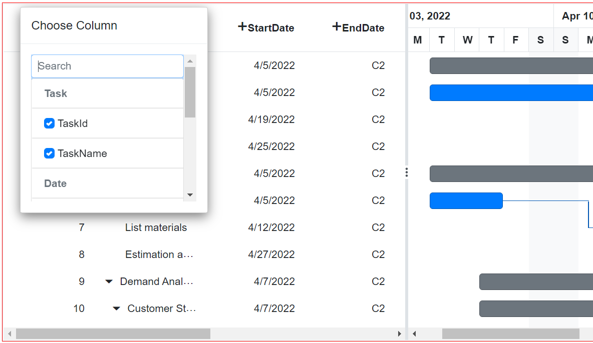

# Column Chooser in Blazor Gantt Chart Component

## Column chooser
The column chooser has options to show or hide columns dynamically. It can be enabled by defining the [ShowColumnChooser](https://help.syncfusion.com/cr/blazor/Syncfusion.Blazor.Gantt.SfGantt-1.html#Syncfusion_Blazor_Gantt_SfGantt_1_ShowColumnChooser) as true.

```cshtml
@using Syncfusion.Blazor.Gantt;

<SfGantt DataSource="@TaskCollections" Toolbar="@ToolbarItems" ShowColumnChooser="true" ProjectStartDate="new DateTime(2019, 4, 1)" ID="GanttChart" Width="1200px" Height="450px" @ref="Gantt" HighlightWeekends="true" AllowReordering="true" TreeColumnIndex=1 GridLines="Syncfusion.Blazor.Gantt.GridLine.None">
    <GanttTaskFields Id="TaskId" Name="TaskName" StartDate="StartDate" EndDate="EndDate" Duration="Duration" ParentID="ParentId" Dependency="Predecessor"></GanttTaskFields>
    <GanttEvents OnToolbarClick="ToolbarClickHandler" TValue="TaskData"></GanttEvents>
</SfGantt>

@code{
    [Parameter]
    public SfGantt<TaskData> Gantt { get; set; }
    public List<Object> ToolbarItems = new List<Object>() {new Syncfusion.Blazor.Navigations.ToolbarItem() { Text = "Column Chooser", TooltipText = "Column Chooser", Id = "columnchooser"}};
    private List<TaskData> TaskCollections { get; set; }
    public void ToolbarClickHandler(Syncfusion.Blazor.Navigations.ClickEventArgs args)
    {
        if (args.Item.Id == "columnchooser")
        {
            this.Gantt.OpenColumnChooser(100, 50);
        }
    }
    protected override void OnInitialized()
    {
        this.TaskCollections = GetTaskCollection();
    }

    public class TaskData
    {
        public int TaskId { get; set; }
        public string TaskName { get; set; }
        public DateTime StartDate { get; set; }
        public DateTime EndDate { get; set; }
        public string Duration { get; set; }
        public int Progress { get; set; }
        public string Predecessor { get; set; }
        public int? ParentId { get; set; }
        public bool IsExpanded { get; set; }
        public string Done { get; set; }
        public bool IsMilestone { get; set; }
    }

    public static List<TaskData> GetTaskCollection()
    {
        List<TaskData> Tasks = new List<TaskData>() {
            new TaskData() { TaskId = 1, TaskName = "Project initiation" ,StartDate = new DateTime(2019, 04, 05), EndDate = new DateTime(2019, 04, 21), IsExpanded = false, Done = "Yes"},
            new TaskData() { TaskId = 2, TaskName = "Identify Site location",StartDate = new DateTime(2019, 04, 05), Duration = "10", Progress = 30, ParentId = 1, IsExpanded = true, Done = "No"},
            new TaskData() { TaskId = 3, TaskName = "Perform soil test",StartDate = new DateTime(2019, 04, 05), Duration = "4", Progress = 40, ParentId = 1, Predecessor = "2", IsExpanded = true, Done = "No",IsMilestone = true },
            new TaskData() { TaskId = 4, TaskName = "Soil test approval",StartDate = new DateTime(2019, 04, 05), Duration = "3", Progress = 30, ParentId = 1, Predecessor = "3", IsExpanded = true, Done = "No" },
            new TaskData() { TaskId = 5, TaskName = "Project estimation", StartDate = new DateTime(2019, 04, 06), EndDate = new DateTime(2019,04, 21), IsExpanded = true, Done = "Yes" },
            new TaskData() { TaskId = 6, TaskName = "Develop floor plan for estimation", StartDate = new DateTime(2019, 04, 06), Duration = "3",Progress = 30, ParentId = 5, IsExpanded = true, Done = "No" },
            new TaskData() { TaskId = 7, TaskName = "List materials", StartDate = new DateTime(2019, 04, 06), Duration = "13", Progress = 40,ParentId = 5, IsExpanded = true,  },
            new TaskData() { TaskId = 8, TaskName = "Estimation approval",StartDate = new DateTime(2019, 04, 06), Duration = "25", Progress = 30, ParentId = 5, IsExpanded = true, Predecessor="7-2", Done = "No" },
            new TaskData() { TaskId = 9, TaskName = "Demand Analysis", StartDate = new DateTime(2019, 04, 06), EndDate = new DateTime(2019, 04, 21),IsExpanded = true, Done = "Yes" },
            new TaskData() { TaskId = 10, TaskName = "Customer Strength",StartDate = new DateTime(2019, 04, 06), Duration = "3", Progress = 30, ParentId = 9, IsExpanded = false, Done = "Yes" },
        };
        return Tasks;
    }
}
```


## Custom component in column chooser template

In the following example, ListView has been rendered as custom component inside the Template of [`GanttColumnChooserSettings`](https://help.syncfusion.com/cr/blazor/Syncfusion.Blazor.Gantt.SfGantt-1.html#Syncfusion_Blazor_Gantt_SfGantt_1_ShowColumnChooser) in gantt. Inside the custom component, the items are grouped.

```cshtml
@using Syncfusion.Blazor.Gantt;
@using Syncfusion.Blazor.Grids;
<div style="height: 100%; width: 100%">
    <div style="position: relative;border:1px solid red; height: 100%;width:100%;min-height: 450px;min-width:800px">
        <SfGantt DataSource="@Orders" ShowColumnChooser="true" ProjectStartDate="new DateTime(2022,4,1)" ID="GanttChart" Width="1200px" Height="450px" @ref="Gantt" HighlightWeekends="true" AllowReordering="true" TreeColumnIndex=1 GridLines="Syncfusion.Blazor.Gantt.GridLine.None">
            <GanttTaskFields Id="TaskId" Name="TaskName" StartDate="StartDate" EndDate="EndDate" Duration="Duration" ParentID="ParentId" Dependency="Predecessor"></GanttTaskFields>
            <GanttColumnChooserSettings>
                <Template>
                    @{
                        var ct = context as ColumnChooserTemplateContext;
                        <CustomColumnChooser @ref="ins" ActionCompleted="AftterCompletion" @key="ct.Columns.Count" ColumnContext="ct" CustomGantt="Gantt"></CustomColumnChooser>
                    }
                </Template>
                <FooterTemplate></FooterTemplate>
            </GanttColumnChooserSettings>
            <GanttColumns>
                <GanttColumn Field=@nameof(TaskData.TaskId) HeaderText="TaskID" TextAlign="TextAlign.Right" Width="120">
                    <HeaderTemplate>
                        @{
                            var a = "TaskId";
                        }
                        <span style="width:20px;height:20px;border-color:red" @onclick="(e)=>onclick(e,a)" class="e-icons e-plus-icon"></span>@a
                    </HeaderTemplate>
                </GanttColumn>
                <GanttColumn Field=@nameof(TaskData.TaskName) HeaderText="TaskName" Width="150">
                    <HeaderTemplate>
                        @{
                            var a = "TaskName";
                        }
                        <span style="width:20px;height:20px;border-color:red" @onclick="(e)=>onclick(e,a)" class="e-icons e-plus-icon"></span>@a
                    </HeaderTemplate>
                </GanttColumn>
                <GanttColumn Field=@nameof(TaskData.StartDate) HeaderText="StartDate" Format="d" Type="ColumnType.Date" TextAlign="TextAlign.Right" Width="130">
                    <HeaderTemplate>
                        @{
                            var a = "StartDate";
                        }
                        <span style="width:20px;height:20px;border-color:red" @onclick="(e)=>onclick(e,a)" class="e-icons e-plus-icon"></span>@a
                    </HeaderTemplate>
                </GanttColumn>
                <GanttColumn Field=@nameof(TaskData.EndDate) HeaderText="EndDate" Format="C2" TextAlign="TextAlign.Right" Width="120">
                    <HeaderTemplate>
                        @{
                            var a = "EndDate";
                        }
                        <span style="width:20px;height:20px;border-color:red" @onclick="(e)=>onclick(e,a)" class="e-icons e-plus-icon"></span>@a
                    </HeaderTemplate>
                </GanttColumn>

                <GanttColumn Field=@nameof(TaskData.Duration) HeaderText="Duration" TextAlign="TextAlign.Right" Width="120">
                    <HeaderTemplate>
                        @{
                            var a = "Duration";
                        }
                        <span style="width:20px;height:20px;border-color:red" @onclick="(e)=>onclick(e,a)" class="e-icons e-plus-icon"></span>@a
                    </HeaderTemplate>
                </GanttColumn>
                <GanttColumn Field=@nameof(TaskData.Progress) HeaderText="Progress" Width="150">
                    <HeaderTemplate>
                        @{
                            var a = "Progress";
                        }
                        <span style="width:20px;height:20px;border-color:red" @onclick="(e)=>onclick(e,a)" class="e-icons e-plus-icon"></span>@a
                    </HeaderTemplate>
                </GanttColumn>
                <GanttColumn Field=@nameof(TaskData.Predecessor) HeaderText="Predecessor" Format="d" Type="ColumnType.Date" TextAlign="TextAlign.Right" Width="130">
                    <HeaderTemplate>
                        @{
                            var a = "Predecessor";
                        }
                        <span style="width:20px;height:20px;border-color:red" @onclick="(e)=>onclick(e,a)" class="e-icons e-plus-icon"></span>@a
                    </HeaderTemplate>
                </GanttColumn>
                <GanttColumn Field=@nameof(TaskData.Done) HeaderText="Done" TextAlign="TextAlign.Right" Width="120">
                    <HeaderTemplate>
                        @{
                            var a = "Done";
                        }
                        <span style="width:20px;height:20px;border-color:red" @onclick="(e)=>onclick(e,a)" class="e-icons e-plus-icon"></span>@a
                    </HeaderTemplate>
                </GanttColumn>
            </GanttColumns>
        </SfGantt>
    </div>
</div>

<style>
    #treeGridGanttChart .e-cc-searchdiv {
        display: none;
    }

    #treeGridGanttChart .e-dlg-content {
        margin-top: 0px;
    }

    #treeGridGanttChart div.e-footer-content {
        display: none;
    }

    .e-list-item.e-level-1.e-checklist.e-focused {
        background-color: none;
    }

    #treeGridGanttChart_gridcontrol_ccdlg .e-content {
        overflow-y: unset;
    }

    .e-plus-icon::before {
        content: '\e759';
    }
</style>

@code{
    public List<TaskData> Orders { get; set; }
    public List<GanttColumn> VisibleCols { get; set; }
    public SfGantt<TaskData> Gantt;
    public int currentColIndex;

    public CustomColumnChooser ins { get; set; }

    public async Task onclick(MouseEventArgs e, string ColName)
    {
        var cols = Gantt.Columns;
        VisibleCols = Gantt.Columns;
        await ins.loadData();
        if (VisibleCols.IndexOf(cols.Where(x => x.Field == ColName).FirstOrDefault()) == (VisibleCols.Count - 1))
        {
            await this.Gantt.OpenColumnChooser(e.ClientX - 450, e.ClientY - 100);
        }
        else
        {
            await this.Gantt.OpenColumnChooser(e.ClientX - 300, e.ClientY - 100);
        }
        var colsList = Gantt.Columns;
        currentColIndex = VisibleCols.Select(x => x.Field).ToList().IndexOf(ColName);
    }

    public async Task OnActionComplete(GanttActionEventArgs<TaskData> args)
    {
        if (args.RequestType.Equals(Syncfusion.Blazor.Gantt.Action.ColumnState))
        {
            foreach (var a in args.VisibleColumns)
            {
                if (VisibleCols.Where(e => e.Field == a.Field).Count() == 0)
                {
                    currentColIndex = currentColIndex + 1;
                    VisibleCols = Gantt.Columns;
                }
            }
        }
    }

    public async void AftterCompletion(string col)
    {
        var newcols = Gantt.Columns;
        var clickedCol = newcols[currentColIndex];
        await Gantt.ReorderColumnsAsync(new List<string>() { col }, clickedCol.Field);
    }

    protected override void OnInitialized()
    {
        this.Orders = GetTaskCollection();
    }

    public static List<TaskData> GetTaskCollection()
    {
        List<TaskData> Tasks = new List<TaskData>() {
            new TaskData() { TaskId = 1, TaskName = "Project initiation", StartDate = new DateTime(2022, 04, 05), EndDate = new DateTime(2022, 04, 21), IsExpanded = false, Done = "Yes" },
            new TaskData() { TaskId = 2, TaskName = "Identify Site location", StartDate = new DateTime(2022, 04, 05), Duration = "10", Progress = 30, ParentId = 1, IsExpanded = true, Done = "No" },
            new TaskData() { TaskId = 3, TaskName = "Perform soil test", StartDate = new DateTime(2022, 04, 05), Duration = "4", Progress = 40, ParentId = 1, Predecessor = "2", IsExpanded = true, Done = "No", IsMilestone = true },
            new TaskData() { TaskId = 4, TaskName = "Soil test approval", StartDate = new DateTime(2022, 04, 05), Duration = "3", Progress = 30, ParentId = 1, Predecessor = "3", IsExpanded = true, Done = "No" },
            new TaskData() { TaskId = 5, TaskName = "Project estimation", StartDate = new DateTime(2022, 04, 06), EndDate = new DateTime(2022, 04, 21), IsExpanded = true, Done = "Yes" },
            new TaskData() { TaskId = 6, TaskName = "Develop floor plan for estimation", StartDate = new DateTime(2022, 04, 06), Duration = "3", Progress = 30, ParentId = 5, IsExpanded = true, Done = "No" },
            new TaskData() { TaskId = 7, TaskName = "List materials", StartDate = new DateTime(2022, 04, 06), Duration = "13", Progress = 40, ParentId = 5, IsExpanded = true, Done = "No", Predecessor = "6+2", IsMilestone = true },
            new TaskData() { TaskId = 8, TaskName = "Estimation approval", StartDate = new DateTime(2022, 04, 06), Duration = "25", Progress = 30, ParentId = 5, IsExpanded = true, Predecessor="7-2", Done = "No" },
            new TaskData() { TaskId = 9, TaskName = "Demand Analysis", StartDate = new DateTime(2022, 04, 07), EndDate = new DateTime(2022, 04, 21), IsExpanded = true, Done = "Yes" },
            new TaskData() { TaskId = 10, TaskName = "Customer Strength", StartDate = new DateTime(2022, 04, 07), Duration = "3", Progress = 30, ParentId = 9, IsExpanded = false, Done = "Yes" },
            new TaskData() { TaskId = 11, TaskName = "Competitor analysis", StartDate = new DateTime(2022, 04, 07), Duration = "13", Progress = 40, ParentId = 10, IsExpanded = true, Done = "Yes" },
            new TaskData() { TaskId = 12, TaskName = "Product Strength Analysis", StartDate = new DateTime(2022, 04, 07), Duration = "25", Progress = 30, ParentId = 11, IsExpanded = true, Done = "No" },
            new TaskData() { TaskId = 13, TaskName = "Project estimation", StartDate = new DateTime(2022, 04, 07), EndDate = new DateTime(2019, 04, 21), IsExpanded = true, Done = "Yes" },
            new TaskData() { TaskId = 14, TaskName = "Develop floor plan for estimation", StartDate = new DateTime(2019, 04, 22), Duration = "25", Progress = 30, ParentId = 13, IsExpanded = true, Done = "Yes" },
            new TaskData() { TaskId = 15, TaskName = "List materials", StartDate = new DateTime(2022, 04, 07), Duration = "12", Progress = 40, ParentId = 14, IsExpanded = true, Done = "Yes" },
            new TaskData() { TaskId = 16, TaskName = "Estimation approval", StartDate = new DateTime(2022, 04, 07), Duration = "6", Progress = 30, ParentId = 15, IsExpanded = true, Done = "Yes" },
            new TaskData() { TaskId = 17, TaskName = "Identifying raw materials", StartDate = new DateTime(2022, 04, 07), Duration = "6", ParentId=16, IsExpanded = true, Done = "Yes" },
            new TaskData() { TaskId = 18, TaskName = "Define cost plan", StartDate = new DateTime(2022, 04, 12), Progress = 30, ParentId=17, IsExpanded = true, Done = "Yes" },
            new TaskData() { TaskId = 19, TaskName = "Manufacturing cost", StartDate = new DateTime(2022, 04, 12), Duration = "7", Progress = 40, ParentId = 18, IsExpanded = true, Done = "Yes" },
            new TaskData() { TaskId = 20, TaskName = "Selling cost", StartDate = new DateTime(2022, 04, 12), Duration = "6", Progress = 30, ParentId = 19, IsExpanded = true, Done = "Yes" },
            new TaskData() { TaskId = 21, TaskName = "Development of final design", StartDate = new DateTime(2022, 04, 12), Duration = "5", ParentId=20, IsExpanded = true, Done = "Yes" },
            new TaskData() { TaskId = 22, TaskName = "Develope dimensions and design", StartDate = new DateTime(2022, 04, 12), Duration = "15", Progress = 30, ParentId=21, IsExpanded = true, Done = "Yes" },
            new TaskData() { TaskId = 23, TaskName = "Develope designs to meet industry", StartDate = new DateTime(2022, 04, 12), Duration = "15", Progress = 40, ParentId = 22, IsExpanded = true, Done = "Yes" },
            new TaskData() { TaskId = 24,TaskName = "Include all the details", StartDate = new DateTime(2022, 04, 12), Duration = "25", Progress = 30, ParentId = 23, IsExpanded = true, Done = "No" },
        };
        return Tasks;
    }
}
````
CustomColumnChooser.razor
```cshtml
@using Syncfusion.Blazor.Grids
@using Syncfusion.Blazor.TreeGrid
@using Syncfusion.Blazor.Lists;
@using Syncfusion.Blazor.Inputs;
@using Syncfusion.Blazor.Gantt;

<SfTextBox Placeholder="Search" ShowClearButton="true" Input="@OnInput"></SfTextBox>
<SfListView @ref="ListView" ID="ListViewCtl" Height="100%" ShowCheckBox="true" DataSource="@DataSourceCopy">
    <ListViewFieldSettings TValue="DataModel" Id="Id" Text="Text" GroupBy="Type"></ListViewFieldSettings>
    <ListViewEvents Clicked="OnClicked" TValue="DataModel"></ListViewEvents>
</SfListView>


@code{
    public List<DataModel> DataSourceCopy { get; set; } = new List<DataModel>();

    [Parameter]
    public SfGantt<TaskData> CustomGantt { get; set; }

    [Parameter]
    public Action<string> ActionCompleted { get; set; }

    [Parameter]
    public ColumnChooserTemplateContext ColumnContext { get; set; }

    public SfListView<DataModel> ListView { get; set; }

    async Task OnInput(InputEventArgs eventArgs)
    {
        DataSourceCopy = DataSource.FindAll(e => e.Text.ToLower().StartsWith(eventArgs.Value.ToLower()));
        await Task.Delay(100);
        await Preselect();
    }

    protected override async Task OnInitializedAsync()
    {
        DataSourceCopy = DataSource;
        await Task.Delay(100);
        await Preselect();
    }


    static List<DataModel> DataSource = new List<DataModel>
    {
        new DataModel() { Text = nameof(TaskData.TaskId), Id = nameof(TaskData.TaskId), Type = "Task" },
        new DataModel() { Text = nameof(TaskData.TaskName), Id =nameof(TaskData.TaskName), Type = "Task" },
        new DataModel() { Text =nameof(TaskData.StartDate), Id = nameof(TaskData.StartDate), Type = "Date" },
        new DataModel() { Text = nameof(TaskData.EndDate), Id = nameof(TaskData.EndDate), Type = "Date" },
        new DataModel() { Text = nameof(TaskData.Progress), Id = nameof(TaskData.Progress), Type = "status"  },
        new DataModel() { Text = nameof(TaskData.Duration), Id = nameof(TaskData.Duration), Type = "Date" },
        new DataModel() { Text = nameof(TaskData.Predecessor), Id = nameof(TaskData.Predecessor), Type = "status" },
        new DataModel() { Text = nameof(TaskData.Done), Id = nameof(TaskData.Done), Type = "status"},
    };

    public async Task loadData()
    {
        await Preselect();
    }

    public async Task Preselect()
    {
        var cols = ColumnContext.Columns.FindAll(x => x.Visible == true).ToList();
        var selectlist = new List<DataModel>();
        foreach (var column in cols)
        {
            selectlist.Add(DataSource.Where(x => x.Text == column.Field).FirstOrDefault());
        }
        if (selectlist.Count > 0)
        {
            if (ListView != null)
            {
                await ListView?.CheckItemsAsync(selectlist.AsEnumerable());
            }
        }
    }

    public async Task OnClicked(ClickEventArgs<DataModel> args)
    {
        if (args.IsChecked)
        {
            await CustomGantt.HideColumnAsync(args.Text, "field");
        }
        else
        {
            await CustomGantt.ShowColumnAsync(args.Text, "field");
            await Task.Delay(500);
            ActionCompleted.Invoke(args.Text);
        }
    }
}
````
Model.cs
```cshtml
   public class DataModel
    {
        public string Id { get; set; }
        public string Text { get; set; }
        public string Type { get; set; }
    }
    public class TaskData
    {
        public int TaskId { get; set; }
        public string TaskName { get; set; }
        public DateTime StartDate { get; set; }
        public DateTime EndDate { get; set; }
        public string Duration { get; set; }
        public int Progress { get; set; }
        public string Predecessor { get; set; }
        public int? ParentId { get; set; }
        public bool IsExpanded { get; set; }
        public string Done { get; set; }
        public bool IsMilestone { get; set; }
    }
```

The following output is displayed as a result of the above code example.



