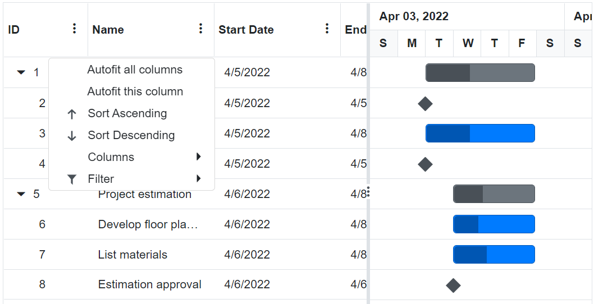

# Column Menu in Blazor Gantt Chart Component

The column menu feature in the Syncfusion Blazor Gantt Chart enables sorting, filtering, and autofit options through a menu accessed by clicking a column's icon. Enable it by setting the [ShowColumnMenu](https://help.syncfusion.com/cr/blazor/Syncfusion.Blazor.Gantt.SfGantt-1.html#Syncfusion_Blazor_Gantt_SfGantt_1_ShowColumnMenu) property to `true`. This guide covers enabling and using the column menu.

## Column Menu

Enable the column menu by setting `ShowColumnMenu` to `true`, along with [AllowSorting](https://help.syncfusion.com/cr/blazor/Syncfusion.Blazor.Gantt.SfGantt-1.html#Syncfusion_Blazor_Gantt_SfGantt_1_AllowSorting), [AllowFiltering](https://help.syncfusion.com/cr/blazor/Syncfusion.Blazor.Gantt.SfGantt-1.html#Syncfusion_Blazor_Gantt_SfGantt_1_AllowFiltering), and [AllowResizing](https://help.syncfusion.com/cr/blazor/Syncfusion.Blazor.Gantt.SfGantt-1.html#Syncfusion_Blazor_Gantt_SfGantt_1_AllowResizing) for respective features. Clicking the column header icon displays a menu with options based on the column type.

The default menu items are:

| Item | Description |
|------|-------------|
| `Sort Ascending` | Sort the current column in ascending order. |
| `Sort Descending` | Sort the current column in descending order. |
| `Auto Fit` | Auto fit the current column. |
| `Auto Fit All` | Auto fit all columns. |
| `Column Chooser` | Choose column visibility. |
| `Filter` | Show the filter menu based on column type. |

```cshtml
@using Syncfusion.Blazor.Gantt

<SfGantt DataSource="@TaskCollection" Height="450px" Width="700px" AllowResizing="true" ShowColumnMenu="true" AllowFiltering="true" AllowSorting="true">
    <GanttTaskFields Id="TaskId" Name="TaskName" StartDate="StartDate" EndDate="EndDate" Duration="Duration" Progress="Progress" ParentID="ParentId"></GanttTaskFields>
</SfGantt>

@code {
    private List<TaskData> TaskCollection { get; set; }

    protected override void OnInitialized()
    {
        this.TaskCollection = GetTaskCollection();
    }

    public class TaskData
    {
        public int TaskId { get; set; }
        public string TaskName { get; set; }
        public DateTime StartDate { get; set; }
        public DateTime? EndDate { get; set; }
        public string Duration { get; set; }
        public int Progress { get; set; }
        public int? ParentId { get; set; }
    }

    public static List<TaskData> GetTaskCollection()
    {
        List<TaskData> Tasks = new List<TaskData>()
        {
            new TaskData() { TaskId = 1, TaskName = "Project initiation", StartDate = new DateTime(2022, 04, 05), EndDate = new DateTime(2022, 04, 21) },
            new TaskData() { TaskId = 2, TaskName = "Identify site location", StartDate = new DateTime(2022, 04, 05), Duration = "0", Progress = 30, ParentId = 1 },
            new TaskData() { TaskId = 3, TaskName = "Perform soil test", StartDate = new DateTime(2022, 04, 05), Duration = "4", Progress = 40, ParentId = 1 },
            new TaskData() { TaskId = 4, TaskName = "Soil test approval", StartDate = new DateTime(2022, 04, 05), Duration = "0", Progress = 30, ParentId = 1 },
            new TaskData() { TaskId = 5, TaskName = "Project estimation", StartDate = new DateTime(2022, 04, 06), EndDate = new DateTime(2022, 04, 21) },
            new TaskData() { TaskId = 6, TaskName = "Develop floor plan for estimation", StartDate = new DateTime(2022, 04, 06), Duration = "3", Progress = 30, ParentId = 5 },
            new TaskData() { TaskId = 7, TaskName = "List materials", StartDate = new DateTime(2022, 04, 06), Duration = "3", Progress = 40, ParentId = 5 },
            new TaskData() { TaskId = 8, TaskName = "Estimation approval", StartDate = new DateTime(2022, 04, 06), Duration = "0", Progress = 30, ParentId = 5 }
        };
        return Tasks;
    }
}
```



> **Note**: Disable the column menu for a specific column by setting [GanttColumn.ShowColumnMenu](https://help.syncfusion.com/cr/blazor/Syncfusion.Blazor.Gantt.GanttColumn.html#Syncfusion_Blazor_Gantt_GanttColumn_ShowColumnMenu) to `false`.

## See also

- [Accessibility in Blazor Gantt Chart](https://blazor.syncfusion.com/documentation/gantt-chart/accessibility)
- [Blazor Gantt Chart Feature Tour](https://www.syncfusion.com/blazor-components/blazor-gantt-chart)
- [Blazor Gantt Chart Example](https://blazor.syncfusion.com/demos/gantt-chart/default-functionalities?theme=bootstrap5)