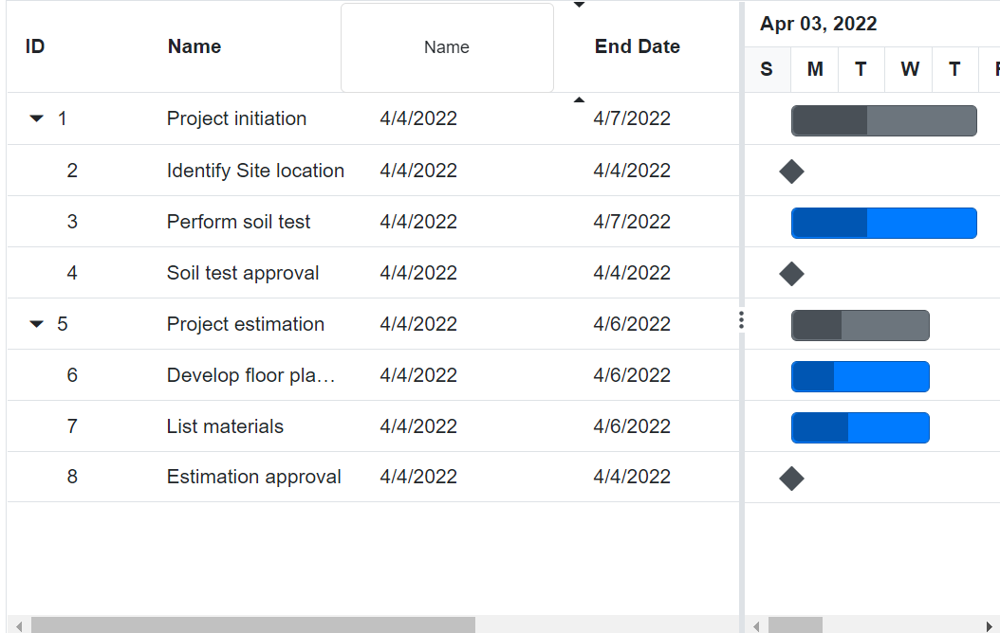
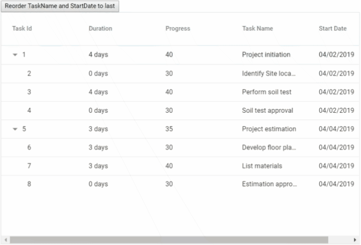

# Column Reordering in Blazor Gantt Chart Component

## Column reordering

The column reordering can be done by dragging a column header from one index to another index within the Tree Grid. To enable reordering, set the `AllowReordering` property to true.

```cshtml
@using Syncfusion.Blazor.Gantt
<SfGantt DataSource="@TaskCollection" Height="450px" Width="700px" AllowReordering="true">
    <GanttTaskFields Id="TaskId" Name="TaskName" StartDate="StartDate" EndDate="EndDate"
             Duration="Duration" Progress="Progress" ParentID="ParentId">
    </GanttTaskFields>
</SfGantt>

@code{
    private List<TaskData> TaskCollection { get; set; }
    protected override void OnInitialized()
    {
        this.TaskCollection = GetTaskCollection();
    }

    public class TaskData
    {
        public int TaskId { get; set; }
        public string TaskName { get; set; }
        public DateTime StartDate { get; set; }
        public DateTime? EndDate { get; set; }
        public string Duration { get; set; }
        public int Progress { get; set; }
        public int? ParentId { get; set; }
    }

    public static List<TaskData> GetTaskCollection()
    {
        List<TaskData> Tasks = new List<TaskData>() 
        {
            new TaskData() { TaskId = 1, TaskName = "Project initiation", StartDate = new DateTime(2022, 04, 05), EndDate = new DateTime(2022, 04, 21), },
            new TaskData() { TaskId = 2, TaskName = "Identify Site location", StartDate = new DateTime(2022, 04, 05), Duration = "0", Progress = 30, ParentId = 1 },
            new TaskData() { TaskId = 3, TaskName = "Perform soil test", StartDate = new DateTime(2022, 04, 05), Duration = "4", Progress = 40, ParentId = 1 },
            new TaskData() { TaskId = 4, TaskName = "Soil test approval", StartDate = new DateTime(2022, 04, 05), Duration = "0", Progress = 30, ParentId = 1 },
            new TaskData() { TaskId = 5, TaskName = "Project estimation", StartDate = new DateTime(2022, 04, 06), EndDate = new DateTime(2022, 04, 21), },
            new TaskData() { TaskId = 6, TaskName = "Develop floor plan for estimation", StartDate = new DateTime(2022, 04, 06), Duration = "3", Progress = 30, ParentId = 5 },
            new TaskData() { TaskId = 7, TaskName = "List materials", StartDate = new DateTime(2022, 04, 06), Duration = "3", Progress = 40, ParentId = 5 },
            new TaskData() { TaskId = 8, TaskName = "Estimation approval", StartDate = new DateTime(2022, 04, 06), Duration = "0", Progress = 30, ParentId = 5 }
        };
        return Tasks;
    }
}
```



N> You can disable the reordering of a particular column by setting the `GanttColumn.AllowReordering` property to `false`.

### Reorder single column

Gantt chart has option to reorder single column either by Interaction or by using the [ReorderColumns](https://help.syncfusion.com/cr/blazor/Syncfusion.Blazor.Gantt.SfGantt-1.html#Syncfusion_Blazor_Gantt_SfGantt_1_ReorderColumnsAsync_System_Collections_Generic_List_System_String__System_String_) method. In the following sample, **Duration** column is reordered to last column position by using the method.


```cshtml
@using Syncfusion.Blazor.Gantt
@using Syncfusion.Blazor.Buttons
<SfButton OnClick="ReorderBtn" CssClass="e-primary" IsPrimary="true" Content="Reorder Freight"></SfButton>
<SfGantt DataSource="@TaskCollection" @ref="Gantt" Height="450px" Width="700px" AllowReordering="true">
    <GanttTaskFields Id="TaskId" Name="TaskName" StartDate="StartDate" EndDate="EndDate"
             Duration="Duration" Progress="Progress" ParentID="ParentId">
    </GanttTaskFields>
    <GanttColumns>
        <GanttColumn Field="TaskId" HeaderText="Task Id" Width="150"></GanttColumn>
        <GanttColumn Field="TaskName" HeaderText="Task Name"></GanttColumn>
        <GanttColumn Field="StartDate" HeaderText="Start Date"></GanttColumn>
        <GanttColumn Field="Duration" HeaderText="Duration"></GanttColumn>
        <GanttColumn Field="Progress" HeaderText="Progress"></GanttColumn>
    </GanttColumns>
</SfGantt>

@code{
    public SfGantt<TaskData> Gantt;
    private List<TaskData> TaskCollection { get; set; }
    protected override void OnInitialized()
    {
        this.TaskCollection = GetTaskCollection();
    }

    public class TaskData
    {
        public int TaskId { get; set; }
        public string TaskName { get; set; }
        public DateTime StartDate { get; set; }
        public DateTime EndDate { get; set; }
        public string Duration { get; set; }
        public int Progress { get; set; }
        public int? ParentId { get; set; }
    }

    public static List<TaskData> GetTaskCollection()
    {
        List<TaskData> Tasks = new List<TaskData>() 
        {
            new TaskData() { TaskId = 1, TaskName = "Project initiation", StartDate = new DateTime(2022, 04, 05), EndDate = new DateTime(2022, 04, 21), },
            new TaskData() { TaskId = 2, TaskName = "Identify Site location", StartDate = new DateTime(2022, 04, 05), Duration = "0", Progress = 30, ParentId = 1 },
            new TaskData() { TaskId = 3, TaskName = "Perform soil test", StartDate = new DateTime(2022, 04, 05), Duration = "4", Progress = 40, ParentId = 1 },
            new TaskData() { TaskId = 4, TaskName = "Soil test approval", StartDate = new DateTime(2022, 04, 05), Duration = "0", Progress = 30, ParentId = 1 },
            new TaskData() { TaskId = 5, TaskName = "Project estimation", StartDate = new DateTime(2022, 04, 06), EndDate = new DateTime(2022, 04, 21), },
            new TaskData() { TaskId = 6, TaskName = "Develop floor plan for estimation", StartDate = new DateTime(2022, 04, 06), Duration = "3", Progress = 30, ParentId = 5 },
            new TaskData() { TaskId = 7, TaskName = "List materials", StartDate = new DateTime(2022, 04, 06), Duration = "3", Progress = 40, ParentId = 5 },
            new TaskData() { TaskId = 8, TaskName = "Estimation approval", StartDate = new DateTime(2022, 04, 06), Duration = "0", Progress = 30, ParentId = 5 }
        };
        return Tasks;
    }

    public async void ReorderBtn()
    {
        await this.Gantt.ReorderColumnsAsync(new List<string>() { "Duration" }, "Progress");
    }
}
```
### Reorder multiple columns

Multiple columns can be reordered at a time by using the `ReorderColumnsAsync` method.

```cshtml
@using Syncfusion.Blazor.Gantt
@using Syncfusion.Blazor.Buttons
<SfButton @onclick="ReorderColumn">Reorder TaskName and StartDate to last</SfButton>
<SfGantt @ref="Gantt" DataSource="@TaskCollection" Height="450px" Width="700px" AllowReordering="true">
    <GanttTaskFields Id="TaskId" Name="TaskName" StartDate="StartDate" EndDate="EndDate"
             Duration="Duration" Progress="Progress" ParentID="ParentId">
    </GanttTaskFields>
    <GanttColumns>
        <GanttColumn Field="TaskId" HeaderText="Task Id" Width="150"></GanttColumn>
        <GanttColumn Field="TaskName" HeaderText="Task Name"></GanttColumn>
        <GanttColumn Field="StartDate" HeaderText="Start Date"></GanttColumn>
        <GanttColumn Field="Duration" HeaderText="Duration"></GanttColumn>
        <GanttColumn Field="Progress" HeaderText="Progress"></GanttColumn>
    </GanttColumns>
    <GanttSplitterSettings Position="100%"></GanttSplitterSettings>
</SfGantt>

@code{
    public SfGantt<TaskData> Gantt;
    public void ReorderColumn()
    {
        this.Gantt.ReorderColumnsAsync(new List<string>(){"TaskName", "StartDate"},"Progress");
    }
    private List<TaskData> TaskCollection { get; set; }
    protected override void OnInitialized()
    {
        this.TaskCollection = GetTaskCollection();
    }

    public class TaskData
    {
        public int TaskId { get; set; }
        public string TaskName { get; set; }
        public DateTime StartDate { get; set; }
        public DateTime? EndDate { get; set; }
        public string Duration { get; set; }
        public int Progress { get; set; }
        public int? ParentId { get; set; }
    }

    public static List<TaskData> GetTaskCollection()
    {
        List<TaskData> Tasks = new List<TaskData>() 
        {
            new TaskData() { TaskId = 1, TaskName = "Project initiation", StartDate = new DateTime(2022, 04, 05), EndDate = new DateTime(2022, 04, 21), },
            new TaskData() { TaskId = 2, TaskName = "Identify Site location", StartDate = new DateTime(2022, 04, 05), Duration = "0", Progress = 30, ParentId = 1 },
            new TaskData() { TaskId = 3, TaskName = "Perform soil test", StartDate = new DateTime(2022, 04, 05), Duration = "4", Progress = 40, ParentId = 1 },
            new TaskData() { TaskId = 4, TaskName = "Soil test approval", StartDate = new DateTime(2022, 04, 05), Duration = "0", Progress = 30, ParentId = 1 },
            new TaskData() { TaskId = 5, TaskName = "Project estimation", StartDate = new DateTime(2022, 04, 06), EndDate = new DateTime(2022, 04, 21), },
            new TaskData() { TaskId = 6, TaskName = "Develop floor plan for estimation", StartDate = new DateTime(2022, 04, 06), Duration = "3", Progress = 30, ParentId = 5 },
            new TaskData() { TaskId = 7, TaskName = "List materials", StartDate = new DateTime(2022, 04, 06), Duration = "3", Progress = 40, ParentId = 5 },
            new TaskData() { TaskId = 8, TaskName = "Estimation approval", StartDate = new DateTime(2022, 04, 06), Duration = "0", Progress = 30, ParentId = 5 }
        };
        return Tasks;
    }
}
```


