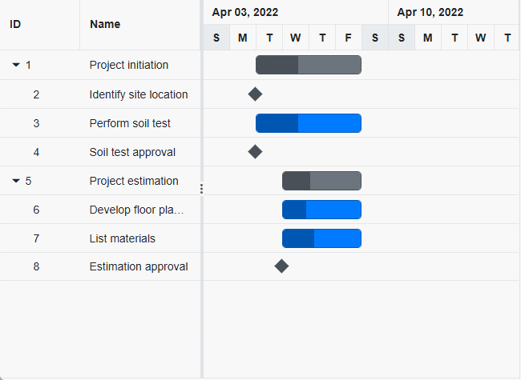

# Column Resizing in Blazor Gantt Chart Component

The column resizing feature in the Syncfusion Blazor Gantt Chart allows users to adjust column widths by dragging the right edge of the header with a mouse or touch, or auto-fit columns by double-clicking the edge. Enable it by setting the [AllowResizing](https://help.syncfusion.com/cr/blazor/Syncfusion.Blazor.Gantt.SfGantt-1.html#Syncfusion_Blazor_Gantt_SfGantt_1_AllowResizing) property to `true`. This guide covers enabling resizing, setting minimum and maximum widths, and touch interaction.

## Column resizing

Enable column resizing by setting `AllowResizing` to `true`. Drag the right edge of a column header to adjust its width, or double-click the edge to auto-fit based on the widest cell content.

```cshtml
@using Syncfusion.Blazor.Gantt

<SfGantt   DataSource="@TaskCollection" Height="450px" Width="700px" AllowResizing="true">
    <GanttTaskFields Id="TaskId" Name="TaskName" StartDate="StartDate" EndDate="EndDate" Duration="Duration" Progress="Progress" ParentID="ParentId"></GanttTaskFields>
</SfGantt>

@code {
    private List<TaskData> TaskCollection { get; set; }

    protected override void OnInitialized()
    {
        this.TaskCollection = GetTaskCollection();
    }

    public class TaskData
    {
        public int TaskId { get; set; }
        public string TaskName { get; set; }
        public DateTime StartDate { get; set; }
        public DateTime? EndDate { get; set; }
        public string Duration { get; set; }
        public int Progress { get; set; }
        public int? ParentId { get; set; }
    }

    public static List<TaskData> GetTaskCollection()
    {
        List<TaskData> Tasks = new List<TaskData>()
        {
            new TaskData() { TaskId = 1, TaskName = "Project initiation", StartDate = new DateTime(2022, 04, 05), EndDate = new DateTime(2022, 04, 21) },
            new TaskData() { TaskId = 2, TaskName = "Identify site location", StartDate = new DateTime(2022, 04, 05), Duration = "0", Progress = 30, ParentId = 1 },
            new TaskData() { TaskId = 3, TaskName = "Perform soil test", StartDate = new DateTime(2022, 04, 05), Duration = "4", Progress = 40, ParentId = 1 },
            new TaskData() { TaskId = 4, TaskName = "Soil test approval", StartDate = new DateTime(2022, 04, 05), Duration = "0", Progress = 30, ParentId = 1 },
            new TaskData() { TaskId = 5, TaskName = "Project estimation", StartDate = new DateTime(2022, 04, 06), EndDate = new DateTime(2022, 04, 21) },
            new TaskData() { TaskId = 6, TaskName = "Develop floor plan for estimation", StartDate = new DateTime(2022, 04, 06), Duration = "3", Progress = 30, ParentId = 5 },
            new TaskData() { TaskId = 7, TaskName = "List materials", StartDate = new DateTime(2022, 04, 06), Duration = "3", Progress = 40, ParentId = 5 },
            new TaskData() { TaskId = 8, TaskName = "Estimation approval", StartDate = new DateTime(2022, 04, 06), Duration = "0", Progress = 30, ParentId = 5 }
        };
        return Tasks;
    }
}
```



> **Note**: Disable resizing for a specific column by setting [GanttColumn.AllowResizing](https://help.syncfusion.com/cr/blazor/Syncfusion.Blazor.Gantt.GanttColumn.html#Syncfusion_Blazor_Gantt_GanttColumn_AllowResizing) to `false`.

## Defining minimum and maximum column width

Restrict column resizing by setting the [GanttColumn.MinWidth](https://help.syncfusion.com/cr/blazor/Syncfusion.Blazor.Gantt.GanttColumn.html#Syncfusion_Blazor_Gantt_GanttColumn_MinWidth) and [GanttColumn.MaxWidth](https://help.syncfusion.com/cr/blazor/Syncfusion.Blazor.Gantt.GanttColumn.html#Syncfusion_Blazor_Gantt_GanttColumn_MaxWidth) properties. This example sets minimum and maximum widths for the `TaskName` and `Duration` columns.

```cshtml
@using Syncfusion.Blazor.Gantt

<SfGantt DataSource="@TaskCollection" Height="450px" Width="700px" AllowResizing="true">
    <GanttTaskFields Id="TaskId" Name="TaskName" StartDate="StartDate" EndDate="EndDate" Duration="Duration" Progress="Progress" ParentID="ParentId"></GanttTaskFields>
    <GanttColumns>
        <GanttColumn Field="TaskId" Width="50"></GanttColumn>
        <GanttColumn Field="TaskName" Width="200" MinWidth="150" MaxWidth="250"></GanttColumn>
        <GanttColumn Field="StartDate"></GanttColumn>
        <GanttColumn Field="Duration" Width="100" MinWidth="50" MaxWidth="200"></GanttColumn>
        <GanttColumn Field="Progress"></GanttColumn>
    </GanttColumns>
</SfGantt>

@code {
    private List<TaskData> TaskCollection { get; set; }

    protected override void OnInitialized()
    {
        this.TaskCollection = GetTaskCollection();
    }

    public class TaskData
    {
        public int TaskId { get; set; }
        public string TaskName { get; set; }
        public DateTime StartDate { get; set; }
        public DateTime? EndDate { get; set; }
        public string Duration { get; set; }
        public int Progress { get; set; }
        public int? ParentId { get; set; }
    }

    public static List<TaskData> GetTaskCollection()
    {
        List<TaskData> Tasks = new List<TaskData>()
        {
            new TaskData() { TaskId = 1, TaskName = "Project initiation", StartDate = new DateTime(2022, 04, 05), EndDate = new DateTime(2022, 04, 21) },
            new TaskData() { TaskId = 2, TaskName = "Identify site location", StartDate = new DateTime(2022, 04, 05), Duration = "0", Progress = 30, ParentId = 1 },
            new TaskData() { TaskId = 3, TaskName = "Perform soil test", StartDate = new DateTime(2022, 04, 05), Duration = "4", Progress = 40, ParentId = 1 },
            new TaskData() { TaskId = 4, TaskName = "Soil test approval", StartDate = new DateTime(2022, 04, 05), Duration = "0", Progress = 30, ParentId = 1 },
            new TaskData() { TaskId = 5, TaskName = "Project estimation", StartDate = new DateTime(2022, 04, 06), EndDate = new DateTime(2022, 04, 21) },
            new TaskData() { TaskId = 6, TaskName = "Develop floor plan for estimation", StartDate = new DateTime(2022, 04, 06), Duration = "3", Progress = 30, ParentId = 5 },
            new TaskData() { TaskId = 7, TaskName = "List materials", StartDate = new DateTime(2022, 04, 06), Duration = "3", Progress = 40, ParentId = 5 },
            new TaskData() { TaskId = 8, TaskName = "Estimation approval", StartDate = new DateTime(2022, 04, 06), Duration = "0", Progress = 30, ParentId = 5 }
        };
        return Tasks;
    }
}
```

> **Note**: Ensure `MinWidth` and `MaxWidth` values are positive and `MinWidth` is less than `MaxWidth`. Use the column menu's autofit option for accessibility.

## Touch interaction

In touch-enabled devices, tap and drag the right edge of a column header to resize it. A floating handler appears on tap to assist with dragging. Double-tap the edge to auto-fit the column.

The following screenshot represents the Gantt column resizing in touch device.


When you `tap` gantt row, tapped row will be selected.

[Single selection](selection/#selection-mode) : To select a single row or cell, perform `single tap` on it.

[Multiple selection](selection/#multiple-row-selection) : To perform multiple selection, `tap` on the multiple selection popup, and then tap the desired rows or cells.


## See also

- [Accessibility in Blazor Gantt Chart](https://blazor.syncfusion.com/documentation/gantt-chart/accessibility)
- [Blazor Gantt Chart Feature Tour](https://www.syncfusion.com/blazor-components/blazor-gantt-chart)
- [Blazor Gantt Chart Example](https://blazor.syncfusion.com/demos/gantt-chart/default-functionalities?theme=bootstrap5)