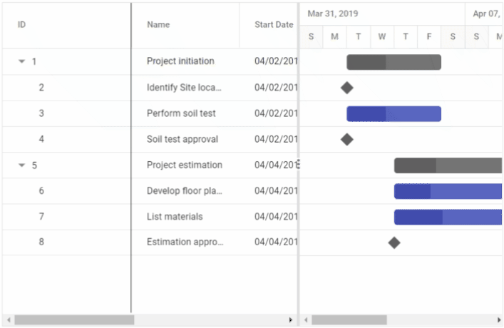

# Column Resizing in Blazor Gantt Chart Component

The column width can be resized by clicking and dragging the right edge of the column header. While dragging, the width of the column will be resized immediately. Each column can be auto resized by double-clicking the right edge of the column header to fit the width of that column based on the widest cell content. To resize the column, set the `AllowResizing` property to true. The following code example shows how to enable the column resize feature in the Gantt Chart component.




@using Syncfusion.Blazor.Gantt
<SfGantt DataSource="@TaskCollection" Height="450px" Width="700px" AllowResizing="true">
    <GanttTaskFields Id="TaskID" Name="TaskName" StartDate="StartDate" EndDate="EndDate"
            Duration="Duration" Progress="Progress" ParentID="ParentID">
    </GanttTaskFields>
</SfGantt>

@code{
    private List<TaskData> TaskCollection { get; set; }
    protected override void OnInitialized()
    {
        this.TaskCollection = GetTaskCollection();
    }

    public class TaskData
    {
        public int TaskID { get; set; }
        public string TaskName { get; set; }
        public DateTime StartDate { get; set; }
        public DateTime? EndDate { get; set; }
        public string Duration { get; set; }
        public int Progress { get; set; }
        public int? ParentID { get; set; }
    }

    public static List<TaskData> GetTaskCollection()
    {
        List<TaskData> Tasks = new List<TaskData>() 
        {
            new TaskData() { TaskID = 1, TaskName = "Project initiation", StartDate = new DateTime(2022, 04, 05), EndDate = new DateTime(2022, 04, 21), },
            new TaskData() { TaskID = 2, TaskName = "Identify Site location", StartDate = new DateTime(2022, 04, 05), Duration = "0", Progress = 30, ParentID = 1 },
            new TaskData() { TaskID = 3, TaskName = "Perform soil test", StartDate = new DateTime(2022, 04, 05), Duration = "4", Progress = 40, ParentID = 1 },
            new TaskData() { TaskID = 4, TaskName = "Soil test approval", StartDate = new DateTime(2022, 04, 05), Duration = "0", Progress = 30, ParentID = 1 },
            new TaskData() { TaskID = 5, TaskName = "Project estimation", StartDate = new DateTime(2022, 04, 06), EndDate = new DateTime(2022, 04, 21), },
            new TaskData() { TaskID = 6, TaskName = "Develop floor plan for estimation", StartDate = new DateTime(2022, 04, 06), Duration = "3", Progress = 30, ParentID = 5 },
            new TaskData() { TaskID = 7, TaskName = "List materials", StartDate = new DateTime(2022, 04, 06), Duration = "3", Progress = 40, ParentID = 5 },
            new TaskData() { TaskID = 8, TaskName = "Estimation approval", StartDate = new DateTime(2022, 04, 06), Duration = "0", Progress = 30, ParentID = 5 }
        };
        return Tasks;
    }
}






N> You can disable resizing for a particular column by setting the `GanttColumn.AllowResizing` to `false`.

### Defining minimum and maximum column width

The column resizing can be restricted between minimum and maximum widths by defining the `GanttColumn.MinWidth` and `GanttColumn.MaxWidth` properties.

In the following example, the minimum and maximum widths are defined for the `Duration` and `Task Name` columns.




@using Syncfusion.Blazor.Gantt
<SfGantt DataSource="@TaskCollection" Height="450px" Width="700px" AllowResizing="true">
    <GanttTaskFields Id="TaskID" Name="TaskName" StartDate="StartDate" EndDate="EndDate"
              Duration="Duration" Progress="Progress" ParentID="ParentID">
    </GanttTaskFields>
    <GanttColumns>
        <GanttColumn Field="TaskID" Width="50"></GanttColumn>
        <GanttColumn Field="TaskName" Width="200" MinWidth="150" MaxWidth="250"></GanttColumn>
        <GanttColumn Field="StartDate"></GanttColumn>
        <GanttColumn Field="Duration" Width="100" MinWidth="50" MaxWidth="200"></GanttColumn>
        <GanttColumn Field="Progress"></GanttColumn>
    </GanttColumns>
</SfGantt>
@code{
    private List<TaskData> TaskCollection { get; set; }
    protected override void OnInitialized()
    {
        this.TaskCollection = GetTaskCollection();
    }

    public class TaskData
    {
        public int TaskID { get; set; }
        public string TaskName { get; set; }
        public DateTime StartDate { get; set; }
        public DateTime? EndDate { get; set; }
        public string Duration { get; set; }
        public int Progress { get; set; }
        public int? ParentID { get; set; }
    }

    public static List<TaskData> GetTaskCollection()
    {
        List<TaskData> Tasks = new List<TaskData>() 
        {
            new TaskData() { TaskID = 1, TaskName = "Project initiation", StartDate = new DateTime(2022, 04, 05), EndDate = new DateTime(2022, 04, 21), },
            new TaskData() { TaskID = 2, TaskName = "Identify Site location", StartDate = new DateTime(2022, 04, 05), Duration = "0", Progress = 30, ParentID = 1 },
            new TaskData() { TaskID = 3, TaskName = "Perform soil test", StartDate = new DateTime(2022, 04, 05), Duration = "4", Progress = 40, ParentID = 1 },
            new TaskData() { TaskID = 4, TaskName = "Soil test approval", StartDate = new DateTime(2022, 04, 05), Duration = "0", Progress = 30, ParentID = 1 },
            new TaskData() { TaskID = 5, TaskName = "Project estimation", StartDate = new DateTime(2022, 04, 06), EndDate = new DateTime(2022, 04, 21), },
            new TaskData() { TaskID = 6, TaskName = "Develop floor plan for estimation", StartDate = new DateTime(2022, 04, 06), Duration = "3", Progress = 30, ParentID = 5 },
            new TaskData() { TaskID = 7, TaskName = "List materials", StartDate = new DateTime(2022, 04, 06), Duration = "3", Progress = 40, ParentID = 5 },
            new TaskData() { TaskID = 8, TaskName = "Estimation approval", StartDate = new DateTime(2022, 04, 06), Duration = "0", Progress = 30, ParentID = 5 }
        };
        return Tasks;
    }
}






## Touch interaction 

The Gantt Chart component supports to perform user interactions in mobile and tablet devices. This section explains how to interact with the Gantt features in touch-enabled devices.

When the right edge of the column header cell is `tapped`, a floating handler will be visible over the right border of the column. To [Resize](columns/#column-resizing) the column, drag the floating handler as needed.

The following screenshot represents the Gantt column resizing in touch device.

When you `tap` gantt row, tapped row will be selected.

[Single selection](selection/#selection-mode) : To select a single row or cell, perform `single tap` on it.

[Multiple selection](selection/#multiple-row-selection) : To perform multiple selection, `tap` on the multiple selection popup, and then tap the desired rows or cells.

N> You can refer to our [Blazor Gantt Chart](https://www.syncfusion.com/blazor-components/blazor-gantt-chart) feature tour page for its groundbreaking feature representations. You can also explore our [Blazor Gantt Chart example](https://blazor.syncfusion.com/demos/gantt-chart/default-functionalities?theme=bootstrap4) to know how to render and configure the Gantt.