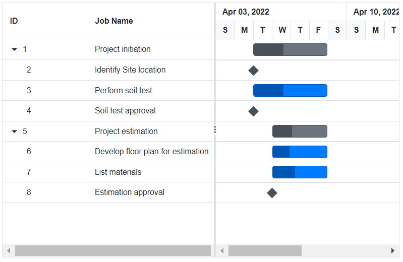

# Columns in Blazor Gantt Chart Component

The column displays information from a bound data source, and you can edit the values of column to update the task details through Tree Grid. The operations such as sorting, filtering, and searching can be performed based on column definitions. To display a Gantt Chart column, the `Field` property should be mapped from the data source to the column.

N> If the column `Field` is not specified in the data source, the column values will be empty.

The `TreeColumnIndex` property is used to define the expander column in the Gantt Chart component to expand and collapse the child rows.

## Defining columns

Using the `GanttColumns` property, you can define the columns in Gantt Chart. If the columns are not defined, then the default columns will be rendered based on the mapped data source fields in the `GanttTaskFields` property. Refer to the following code example for defining the columns in Gantt Chart along with their widths.

```cshtml
@using Syncfusion.Blazor.Gantt
<SfGantt DataSource="@TaskCollection" Height="450px" Width="700px">
    <GanttTaskFields Id="TaskId" Name="TaskName" StartDate="StartDate" EndDate="EndDate"
            Duration="Duration" Progress="Progress" ParentID="ParentId">
    </GanttTaskFields>
    <GanttColumns>
        <GanttColumn Field="TaskId" Width="150"></GanttColumn>
        <GanttColumn Field="TaskName" HeaderText="Job Name" Width="250"></GanttColumn>
    </GanttColumns>
</SfGantt>

@code{
    private List<TaskData> TaskCollection { get; set; }
    protected override void OnInitialized()
    {
        this.TaskCollection = GetTaskCollection();
    }

    public class TaskData
    {
        public int TaskId { get; set; }
        public string TaskName { get; set; }
        public DateTime StartDate { get; set; }
        public DateTime EndDate { get; set; }
        public string Duration { get; set; }
        public int Progress { get; set; }
        public int? ParentId { get; set; }
    }

    public static List<TaskData> GetTaskCollection()
    {
        List<TaskData> Tasks = new List<TaskData>() 
        {
            new TaskData() { TaskId = 1, TaskName = "Project initiation", StartDate = new DateTime(2022, 04, 05), EndDate = new DateTime(2022, 04, 21), },
            new TaskData() { TaskId = 2, TaskName = "Identify Site location", StartDate = new DateTime(2022, 04, 05), Duration = "0", Progress = 30, ParentId = 1 },
            new TaskData() { TaskId = 3, TaskName = "Perform soil test", StartDate = new DateTime(2022, 04, 05), Duration = "4", Progress = 40, ParentId = 1 },
            new TaskData() { TaskId = 4, TaskName = "Soil test approval", StartDate = new DateTime(2022, 04, 05), Duration = "0", Progress = 30, ParentId = 1 },
            new TaskData() { TaskId = 5, TaskName = "Project estimation", StartDate = new DateTime(2022, 04, 06), EndDate = new DateTime(2022, 04, 21), },
            new TaskData() { TaskId = 6, TaskName = "Develop floor plan for estimation", StartDate = new DateTime(2022, 04, 06), Duration = "3", Progress = 30, ParentId = 5 },
            new TaskData() { TaskId = 7, TaskName = "List materials", StartDate = new DateTime(2022, 04, 06), Duration = "3", Progress = 40, ParentId = 5 },
            new TaskData() { TaskId = 8, TaskName = "Estimation approval", StartDate = new DateTime(2022, 04, 06), Duration = "0", Progress = 30, ParentId = 5 }
        };
        return Tasks;
    }
}
```



## Header template

N> Before adding the header template to the Gantt Chart, it is strongly recommended to go through the [template](./templates#templates) section topic to configure the template.

The Header Template has options to display custom element values or content in the header. You can use the [HeaderTemplate](https://help.syncfusion.com/cr/blazor/Syncfusion.Blazor.Gantt.GanttColumn.html#Syncfusion_Blazor_Gantt_GanttColumn_HeaderTemplate) of the [GanttColumn](https://help.syncfusion.com/cr/blazor/Syncfusion.Blazor.Gantt.GanttColumn.html) component to specify the custom content.

```cshtml
@using Syncfusion.Blazor.Gantt
@using Syncfusion.Blazor.Grids

<SfGantt DataSource="@TaskCollection" Width="700px" Height="400px">
    <GanttTaskFields Id="TaskId" Name="TaskName" StartDate="StartDate" EndDate="EndDate" Duration="Duration" Progress="Progress" ParentID="Parent_Id"></GanttTaskFields>
    <GanttColumns>
        <GanttColumn Field="TaskName" HeaderText="Job Name" Width="250">
            <HeaderTemplate>
                <div>
                    
                    @((context as GridColumn).HeaderText)
                </div>
            </HeaderTemplate>
        </GanttColumn>
        <GanttColumn Field="StartDate" HeaderText="Start Date" Width="250">
            <HeaderTemplate>
                <div>
                    
                    @((context as GridColumn).HeaderText)
                </div>
            </HeaderTemplate>
        </GanttColumn>
        <GanttColumn Field="EndDate" HeaderText="End Date" Width="250">
            <HeaderTemplate>
                <div>
                    
                    @((context as GridColumn).HeaderText)
                </div>
            </HeaderTemplate>
        </GanttColumn>
        <GanttColumn Field="Duration" HeaderText="Duration" Width="250">
            <HeaderTemplate>
                <div>
                    
                    @((context as GridColumn).HeaderText)
                </div>
            </HeaderTemplate>
        </GanttColumn>
        <GanttColumn Field="Progress" HeaderText="Progress" Width="250">
            <HeaderTemplate>
                <div>
                    
                    @((context as GridColumn).HeaderText)
                </div>
            </HeaderTemplate>
        </GanttColumn>
    </GanttColumns>
</SfGantt>
<style>

    @@font-face {
        font-family: 'ej2-headertemplate';
        src: url(data:application/x-font-ttf;charset=utf-8;base64,AAEAAAAKAIAAAwAgT1MvMj1vTFIAAAEoAAAAVmNtYXDS2c5qAAABjAAAAEBnbHlmQmNFrQAAAdQAAANoaGVhZBRdbkIAAADQAAAANmhoZWEIUQQEAAAArAAAACRobXR4DAAAAAAAAYAAAAAMbG9jYQCOAbQAAAHMAAAACG1heHABHgENAAABCAAAACBuYW1lohGZJQAABTwAAAKpcG9zdA2o3w0AAAfoAAAAQAABAAAEAAAAAFwEAAAAAAAD9AABAAAAAAAAAAAAAAAAAAAAAwABAAAAAQAATBXy9l8PPPUACwQAAAAAANillKkAAAAA2KWUqQAAAAAD9APzAAAACAACAAAAAAAAAAEAAAADAQEAEQAAAAAAAgAAAAoACgAAAP8AAAAAAAAAAQQAAZAABQAAAokCzAAAAI8CiQLMAAAB6wAyAQgAAAIABQMAAAAAAAAAAAAAAAAAAAAAAAAAAAAAUGZFZABA5wLpYAQAAAAAXAQAAAAAAAABAAAAAAAABAAAAAQAAAAEAAAAAAAAAgAAAAMAAAAUAAMAAQAAABQABAAsAAAABgAEAAEAAucC6WD//wAA5wLpYP//AAAAAAABAAYABgAAAAIAAQAAAAAAjgG0ABEAAAAAA8kD8wADAAcACwAPABMAFwAbAB8AIwAnACsALwAzADcAOwBPAGsAACUVIzUjFSM1IxUjNSMVIzUjFSM1JRUjNSMVIzUjFSM1IxUjNSMVIzUlFSM1IxUjNSMVIzUjFSM1IxUjNQMVHwYhPwcRITcjDwghNS8HIzUjFSE1IwN2U1NTU1RTU1NTAuxTU1NTVFNTU1MC7FNTU1NUU1NTU1QCAwUGBggIA0QICAcHBQQBAvxsp30ICAcHAgUDAQEDlAECBAUHBwgIfVP+YFOzU1NTU1NTU1NTU6dUVFRUVFRUVFRUplNTU1NTU1NTU1P+NgQIBwcGBAMCAQIEBQcHAwgCdPoBAgQFAwcHCIF8CQgHBgUEAgFTU1MABAAAAAAD9APeADQAbQCuAQAAAAEfCDc1Lwc1PwIPBy8HHww3HwQPATMVPwc1Lx0jDwMfAgUdAR8GBTUzLxQjDx0BFxUfEDsBPxA1Nyc1LxIPEhUCCg8OGxcVExANCgMBAQMDCQQDAgECAxESEhMTExUUFRQTFBISEhEHCwYHCAkKCw0NDw8SuQQGAwIBAgRxlgsKCQcGBAMBAgMDAwUFBQcGBwgICQkKCgsKDAsMDQwNDQ4NDg45BQUDAQEEA/1eAgUGBwkKCwHjeggKDhEUFxs1FRMSEA4NCwoJBwcJBjwODg0ODQ0MDQwLDAoLCgoJCQgIBwYHBQUFAwMDAgEBAQECAgYICg0ODxISFBUXFwwMDA0MDQwMFxcVFBISDw4MCwgGAgIBAQICAwcJCw0PERITFRUXDAwMDA0NDAwMDAsXFRQTEQ8ODQoIBgICAVQEAwgJCgsMCwwbEBAREREZEA8VDAwKCgoIBwYFAwIBAQIDBQYHCAoUFQwLCwsLCgoJCAcGMwsWFhUVHB3QAQIEBggICgueDg4ODg0NDA0MCwsLCwoKCQgJBwgGBwUFBAQDAwECCw8NDxETCrIlawsKCAgGBAIB0AoLCwoLCQgNCAkLDA0NDg4ODg4ZFAIBAwMEBAUGBgYIBwkICQoKCwsLDAwMDA0ODQ4ODgH7DQwMDBgWFRQTERAODAoIBgICAQECAgYICgwOEBETFBUWGAwMDA0MDQwMCxcWFRMSEA8NDAkHAwIBAQEBAQECAwMICwwOEBETFBUWFwwMDQAAAAASAN4AAQAAAAAAAAABAAAAAQAAAAAAAQASAAEAAQAAAAAAAgAHABMAAQAAAAAAAwASABoAAQAAAAAABAASACwAAQAAAAAABQALAD4AAQAAAAAABgASAEkAAQAAAAAACgAsAFsAAQAAAAAACwASAIcAAwABBAkAAAACAJkAAwABBAkAAQAkAJsAAwABBAkAAgAOAL8AAwABBAkAAwAkAM0AAwABBAkABAAkAPEAAwABBAkABQAWARUAAwABBAkABgAkASsAAwABBAkACgBYAU8AAwABBAkACwAkAacgZWoyLWhlYWRlcnRlbXBsYXRlUmVndWxhcmVqMi1oZWFkZXJ0ZW1wbGF0ZWVqMi1oZWFkZXJ0ZW1wbGF0ZVZlcnNpb24gMS4wZWoyLWhlYWRlcnRlbXBsYXRlRm9udCBnZW5lcmF0ZWQgdXNpbmcgU3luY2Z1c2lvbiBNZXRybyBTdHVkaW93d3cuc3luY2Z1c2lvbi5jb20AIABlAGoAMgAtAGgAZQBhAGQAZQByAHQAZQBtAHAAbABhAHQAZQBSAGUAZwB1AGwAYQByAGUAagAyAC0AaABlAGEAZABlAHIAdABlAG0AcABsAGEAdABlAGUAagAyAC0AaABlAGEAZABlAHIAdABlAG0AcABsAGEAdABlAFYAZQByAHMAaQBvAG4AIAAxAC4AMABlAGoAMgAtAGgAZQBhAGQAZQByAHQAZQBtAHAAbABhAHQAZQBGAG8AbgB0ACAAZwBlAG4AZQByAGEAdABlAGQAIAB1AHMAaQBuAGcAIABTAHkAbgBjAGYAdQBzAGkAbwBuACAATQBlAHQAcgBvACAAUwB0AHUAZABpAG8AdwB3AHcALgBzAHkAbgBjAGYAdQBzAGkAbwBuAC4AYwBvAG0AAAAAAgAAAAAAAAAKAAAAAAAAAAAAAAAAAAAAAAAAAAAAAAADAQIBAwEEAAtCVF9DYWxlbmRhcghlbXBsb3llZQAA) format('truetype');
        font-weight: normal;
        font-style: normal;
    }

    .e-grid .e-icon-userlogin::before {
        font-family: 'ej2-headertemplate';
        width: 15px !important;
        content: '\e702';
    }

    .e-grid .e-icon-calender::before {
        font-family: 'ej2-headertemplate';
        width: 15px !important;
        content: '\e960';
    }
</style>
@code{ 
    private List<TaskData> TaskCollection { get; set; }

    protected override void OnInitialized()
    {
        this.TaskCollection = GetTaskCollection();
    }

    public class TaskData
    {
        public int TaskId { get; set; }
        public string TaskName { get; set; }
        public DateTime StartDate { get; set; }
        public DateTime EndDate { get; set; }
        public string Duration { get; set; }
        public int Progress { get; set; }
        public int? Parent_Id { get; set; }

    }

    public static List<TaskData> GetTaskCollection()
    {
        List<TaskData> Tasks = new List<TaskData>()
                {
            new TaskData() { TaskId = 1, TaskName = "Project initiation", StartDate = new DateTime(2022, 04, 05), EndDate = new DateTime(2022, 04, 21)},
            new TaskData() { TaskId = 2, TaskName = "Identify Site location", StartDate = new DateTime(2022, 04, 05), Duration = "0", Progress = 30, Parent_Id = 1},
            new TaskData() { TaskId = 3, TaskName = "Perform soil test", StartDate = new DateTime(2022, 04, 05), Duration = "4", Progress = 40, Parent_Id = 1},
            new TaskData() { TaskId = 4, TaskName = "Soil test approval", StartDate = new DateTime(2022, 04, 05), Duration = "0", Progress = 30, Parent_Id =1},
            new TaskData() { TaskId = 5, TaskName = "Project estimation", StartDate = new DateTime(2022, 04, 06), EndDate = new DateTime(2022, 04, 21)},
            new TaskData() { TaskId = 6, TaskName = "Develop floor plan for estimation", StartDate = new DateTime(2022, 04, 06), Duration = "3", Progress = 30, Parent_Id =5},
            new TaskData() { TaskId = 7, TaskName = "List materials", StartDate = new DateTime(2022, 04, 06), Duration = "3", Progress = 40, Parent_Id =5},
            new TaskData() { TaskId = 8, TaskName = "Estimation approval", StartDate = new DateTime(2022, 04, 06), Duration = "0", Progress = 30, Parent_Id =5}

        };
        return Tasks;
    } }
```

 

## Format

To format the cell values based on a specific culture, use the `GanttColumn.Format` property. The [Blazor Gantt Chart](https://www.syncfusion.com/blazor-components/blazor-gantt-chart) component uses the `Internationalization` library to format `number` and `date` values.

```cshtml
@using Syncfusion.Blazor.Gantt
<SfGantt DataSource="@TaskCollection" Height="450px" Width="700px">
    <GanttTaskFields Id="TaskId" Name="TaskName" StartDate="StartDate" EndDate="EndDate"
             Duration="Duration" Progress="Progress" ParentID="ParentId">
    </GanttTaskFields>
    <GanttColumns>
        <GanttColumn Field="TaskId" Width="150"></GanttColumn>
        <GanttColumn Field="Progress" Format="@NumberFormat" Width="250"></GanttColumn>
    </GanttColumns>
</SfGantt>

@code{
    private List<TaskData> TaskCollection { get; set; }
    private string NumberFormat = "C";
    protected override void OnInitialized()
    {
        this.TaskCollection = GetTaskCollection();
    }

    public class TaskData
    {
        public int TaskId { get; set; }
        public string TaskName { get; set; }
        public DateTime StartDate { get; set; }
        public DateTime EndDate { get; set; }
        public string Duration { get; set; }
        public int Progress { get; set; }
        public int? ParentId { get; set; }
    }

    public static List<TaskData> GetTaskCollection()
    {
        List<TaskData> Tasks = new List<TaskData>() 
        {
            new TaskData() { TaskId = 1, TaskName = "Project initiation", StartDate = new DateTime(2022, 04, 05), EndDate = new DateTime(2022, 04, 21), },
            new TaskData() { TaskId = 2, TaskName = "Identify Site location", StartDate = new DateTime(2022, 04, 05), Duration = "0", Progress = 30, ParentId = 1 },
            new TaskData() { TaskId = 3, TaskName = "Perform soil test", StartDate = new DateTime(2022, 04, 05), Duration = "4", Progress = 40, ParentId = 1 },
            new TaskData() { TaskId = 4, TaskName = "Soil test approval", StartDate = new DateTime(2022, 04, 05), Duration = "0", Progress = 30, ParentId = 1 },
            new TaskData() { TaskId = 5, TaskName = "Project estimation", StartDate = new DateTime(2022, 04, 06), EndDate = new DateTime(2022, 04, 21), },
            new TaskData() { TaskId = 6, TaskName = "Develop floor plan for estimation", StartDate = new DateTime(2022, 04, 06), Duration = "3", Progress = 30, ParentId = 5 },
            new TaskData() { TaskId = 7, TaskName = "List materials", StartDate = new DateTime(2022, 04, 06), Duration = "3", Progress = 40, ParentId = 5 },
            new TaskData() { TaskId = 8, TaskName = "Estimation approval", StartDate = new DateTime(2022, 04, 06), Duration = "0", Progress = 30, ParentId = 5 }
        };
        return Tasks;
    }
}
```


N> By default, the `number` and `date` values are formatted in `en-US` culture.

### Number formatting

The number or integer values can be formatted using the following format strings.

Format |Description |Remarks
-----|-----
N | Denotes numeric type. | The numeric format is followed by an integer value like N2 or N3, which denotes the number of precisions to be allowed.
C | Denotes currency type. | The currency format is followed by an integer value like C2 or C3, which denotes the number of precisions to be allowed.
P | Denotes percentage type | The percentage format expects the input value to be in the range of 0 to 100. For example, the cell value `0.2` is formatted as `20%`. The percentage format is followed by an integer value like P2, P3, which denotes the number of precisions to be allowed.

### Date formatting

You can format date values either using the built-in date format string or a custom format string. For the built-in date format, you can specify the `GanttColumn.Format` property as string (example: `yMd`).

You can also use the custom format string to format the date values. Some of the custom formats and the formatted date values are given in the following table.

Format | Formatted value
-----|-----
{ type:'date', format:'dd/MM/yyyy' } | 04/07/2022
{ type:'date', format:'dd.MM.yyyy' } | 04.07.2022
{ type:'date', skeleton:'short' } | 7/4/22
{ type: 'dateTime', format: 'dd/MM/yyyy hh:mm tt' } | 04/07/2022 12:00 AM
{ type: 'dateTime', format: 'MM/dd/yyyy hh:mm:ss tt' } | 07/04/2022 12:00:00 AM

```cshtml
@using Syncfusion.Blazor.Gantt
<SfGantt DataSource="@TaskCollection" Height="450px" Width="700px">
    <GanttTaskFields Id="TaskId" Name="TaskName" StartDate="StartDate" EndDate="EndDate"
             Duration="Duration" Progress="Progress" ParentID="ParentId">
    </GanttTaskFields>
    <GanttColumns>
        <GanttColumn Field="TaskId" Width="150"></GanttColumn>
        <GanttColumn Field="TaskName" HeaderText="Job Name" Width="250"></GanttColumn>
        <GanttColumn Field="StartDate" Format="@DateFormat"></GanttColumn>
        <GanttColumn Field="Duration"></GanttColumn>
    </GanttColumns>
</SfGantt>

@code{
    private List<TaskData> TaskCollection { get; set; }
    private string DateFormat = "MM/dd/yyyy";
    protected override void OnInitialized()
    {
        this.TaskCollection = GetTaskCollection();
    }

    public class TaskData
    {
        public int TaskId { get; set; }
        public string TaskName { get; set; }
        public DateTime StartDate { get; set; }
        public DateTime EndDate { get; set; }
        public string Duration { get; set; }
        public int Progress { get; set; }
        public int? ParentId { get; set; }
    }

    public static List<TaskData> GetTaskCollection()
    {
        List<TaskData> Tasks = new List<TaskData>() 
        {
            new TaskData() { TaskId = 1, TaskName = "Project initiation", StartDate = new DateTime(2022, 04, 05), EndDate = new DateTime(2022, 04, 21), },
            new TaskData() { TaskId = 2, TaskName = "Identify Site location", StartDate = new DateTime(2022, 04, 05), Duration = "0", Progress = 30, ParentId = 1 },
            new TaskData() { TaskId = 3, TaskName = "Perform soil test", StartDate = new DateTime(2022, 04, 05), Duration = "4", Progress = 40, ParentId = 1 },
            new TaskData() { TaskId = 4, TaskName = "Soil test approval", StartDate = new DateTime(2022, 04, 05), Duration = "0", Progress = 30, ParentId = 1 },
            new TaskData() { TaskId = 5, TaskName = "Project estimation", StartDate = new DateTime(2022, 04, 06), EndDate = new DateTime(2022, 04, 21), },
            new TaskData() { TaskId = 6, TaskName = "Develop floor plan for estimation", StartDate = new DateTime(2022, 04, 06), Duration = "3", Progress = 30, ParentId = 5 },
            new TaskData() { TaskId = 7, TaskName = "List materials", StartDate = new DateTime(2022, 04, 06), Duration = "3", Progress = 40, ParentId = 5 },
            new TaskData() { TaskId = 8, TaskName = "Estimation approval", StartDate = new DateTime(2022, 04, 06), Duration = "0", Progress = 30, ParentId = 5 }
        };
        return Tasks;
    }
}
```


## Change tree/expander column

The tree/expander column is a column in the Gantt Chart component that has icons to expand or collapse the parent records. You can define the tree column index in the Gantt Chart component by using the `TreeColumnIndex` property and the default value of this property is `0`. The following code example shows how to use this property.

```cshtml
@using Syncfusion.Blazor.Gantt
    <SfGantt DataSource="@TaskCollection" TreeColumnIndex="2" Height="450px" Width="700px">
        <GanttTaskFields Id="TaskId" Name="TaskName" StartDate="StartDate" EndDate="EndDate"
              Duration="Duration" Progress="Progress" ParentID="ParentId"></GanttTaskFields>
    </SfGantt>
@code{
    private List<TaskData> TaskCollection { get; set; }
    protected override void OnInitialized()
    {
        this.TaskCollection = GetTaskCollection();
    }

    public class TaskData
    {
        public int TaskId { get; set; }
        public string TaskName { get; set; }
        public DateTime StartDate { get; set; }
        public DateTime EndDate { get; set; }
        public string Duration { get; set; }
        public int Progress { get; set; }
        public int? ParentId { get; set; }
    }

    public static List<TaskData> GetTaskCollection()
    {
        List<TaskData> Tasks = new List<TaskData>() 
        {
            new TaskData() { TaskId = 1, TaskName = "Project initiation", StartDate = new DateTime(2022, 04, 05), EndDate = new DateTime(2022, 04, 21), },
            new TaskData() { TaskId = 2, TaskName = "Identify Site location", StartDate = new DateTime(2022, 04, 05), Duration = "0", Progress = 30, ParentId = 1 },
            new TaskData() { TaskId = 3, TaskName = "Perform soil test", StartDate = new DateTime(2022, 04, 05), Duration = "4", Progress = 40, ParentId = 1 },
            new TaskData() { TaskId = 4, TaskName = "Soil test approval", StartDate = new DateTime(2022, 04, 05), Duration = "0", Progress = 30, ParentId = 1 },
            new TaskData() { TaskId = 5, TaskName = "Project estimation", StartDate = new DateTime(2022, 04, 06), EndDate = new DateTime(2022, 04, 21), },
            new TaskData() { TaskId = 6, TaskName = "Develop floor plan for estimation", StartDate = new DateTime(2022, 04, 06), Duration = "3", Progress = 30, ParentId = 5 },
            new TaskData() { TaskId = 7, TaskName = "List materials", StartDate = new DateTime(2022, 04, 06), Duration = "3", Progress = 40, ParentId = 5 },
            new TaskData() { TaskId = 8, TaskName = "Estimation approval", StartDate = new DateTime(2022, 04, 06), Duration = "0", Progress = 30, ParentId = 5 }
        };
        return Tasks;
    }
}
```


## Show or hide columns dynamically

You can show or hide gantt component columns dynamically using external buttons by invoking the `ShowColumnsAsync` or `HideColumnsAsync` method.

```cshtml
@using Syncfusion.Blazor.Gantt
<button @onclick="show">Show columns</button>
<button @onclick="hide">Hide columns</button>
<SfGantt @ref="Gantt" DataSource="@TaskCollection" Height="450px" Width="900px">
    <GanttTaskFields Id="TaskId" Name="TaskName" StartDate="StartDate" EndDate="EndDate" Duration="Duration" Progress="Progress" ParentID="ParentId">
    </GanttTaskFields>
    <GanttColumns>
        <GanttColumn Field="TaskId" Width="100"></GanttColumn>
        <GanttColumn Field="TaskName" HeaderText="Job Name" Width="250"></GanttColumn>
        <GanttColumn Field="StartDate"></GanttColumn>
        <GanttColumn Field="EndDate"></GanttColumn>
        <GanttColumn Field="Duration"></GanttColumn>
        <GanttColumn Field="Progress"></GanttColumn>
    </GanttColumns>
</SfGantt>

@code{
    public SfGantt<TaskData> Gantt;
    private List<TaskData> TaskCollection { get; set; }
    private string[] ColumnList = {"TaskName", "StartDate"};
    public void show() {
        this.Gantt.ShowColumnsAsync(ColumnList, "Field");
    }
    public void hide() {
        this.Gantt.HideColumnsAsync(ColumnList, "Field");
    }
    protected override void OnInitialized()
    {
        this.TaskCollection = GetTaskCollection();
    }
    public class TaskData
    {
        public int TaskId { get; set; }
        public string TaskName { get; set; }
        public DateTime StartDate { get; set; }
        public DateTime EndDate { get; set; }
        public string Duration { get; set; }
        public int Progress { get; set; }
        public int? ParentId { get; set; }
    }

    public static List<TaskData> GetTaskCollection()
    {
        List<TaskData> Tasks = new List<TaskData>() 
        {
            new TaskData() { TaskId = 1, TaskName = "Project initiation", StartDate = new DateTime(2022, 04, 05), EndDate = new DateTime(2022, 04, 21), },
            new TaskData() { TaskId = 2, TaskName = "Identify Site location", StartDate = new DateTime(2022, 04, 05), Duration = "0", Progress = 30, ParentId = 1 },
            new TaskData() { TaskId = 3, TaskName = "Perform soil test", StartDate = new DateTime(2022, 04, 05), Duration = "4", Progress = 40, ParentId = 1 },
            new TaskData() { TaskId = 4, TaskName = "Soil test approval", StartDate = new DateTime(2022, 04, 05), Duration = "0", Progress = 30, ParentId = 1 },
            new TaskData() { TaskId = 5, TaskName = "Project estimation", StartDate = new DateTime(2022, 04, 06), EndDate = new DateTime(2022, 04, 21), },
            new TaskData() { TaskId = 6, TaskName = "Develop floor plan for estimation", StartDate = new DateTime(2022, 04, 06), Duration = "3", Progress = 30, ParentId = 5 },
            new TaskData() { TaskId = 7, TaskName = "List materials", StartDate = new DateTime(2022, 04, 06), Duration = "3", Progress = 40, ParentId = 5 },
            new TaskData() { TaskId = 8, TaskName = "Estimation approval", StartDate = new DateTime(2022, 04, 06), Duration = "0", Progress = 30, ParentId = 5 },   
        };
        return Tasks;
    }
}
```

## Controlling Gantt column actions

You can enable or disable gantt component action for a particular column by setting the `AllowFiltering`, `AllowSorting`, `AllowReordering`, and `AllowEditing` properties.

```cshtml
@using Syncfusion.Blazor.Gantt
<SfGantt @ref="Gantt" DataSource="@TaskCollection" Height="450px" Width="900px" AllowSorting="true" AllowFiltering="true" AllowReordering="true">
    <GanttTaskFields Id="TaskId" Name="TaskName" StartDate="StartDate" EndDate="EndDate" Duration="Duration" Progress="Progress" ParentID="ParentId">
    </GanttTaskFields>
    <GanttColumns>
        <GanttColumn Field="TaskId" Width="100"></GanttColumn>
        <GanttColumn Field="TaskName" AllowReordering="false" Width="250"></GanttColumn>
        <GanttColumn Field="StartDate" AllowEditing="false"></GanttColumn>
        <GanttColumn Field="Duration" AllowSorting="false"></GanttColumn>
        <GanttColumn Field="Progress" AllowFiltering="false"></GanttColumn>
    </GanttColumns>
    <GanttEditSettings AllowEditing="true"></GanttEditSettings>
</SfGantt>

@code{
    public SfGantt<TaskData> Gantt;
    private List<TaskData> TaskCollection { get; set; }
    protected override void OnInitialized()
    {
        this.TaskCollection = GetTaskCollection();
    }
    public class TaskData
    {
        public int TaskId { get; set; }
        public string TaskName { get; set; }
        public DateTime StartDate { get; set; }
        public DateTime EndDate { get; set; }
        public string Duration { get; set; }
        public int Progress { get; set; }
        public bool Verified { get; set; }
        public int? ParentId { get; set; }
    }

    public static List<TaskData> GetTaskCollection()
    {
        List<TaskData> Tasks = new List<TaskData>() 
        {
            new TaskData() { TaskId = 1, TaskName = "Project initiation", StartDate = new DateTime(2022, 04, 05), EndDate = new DateTime(2022, 04, 21), Verified = true, },
            new TaskData() { TaskId = 2, TaskName = "Identify Site location", StartDate = new DateTime(2022, 04, 05), Duration = "0", Verified = true, Progress = 30, ParentId = 1 },
            new TaskData() { TaskId = 3, TaskName = "Perform soil test", StartDate = new DateTime(2022, 04, 05), Duration = "4", Verified = false, Progress = 40, ParentId = 1 },
            new TaskData() { TaskId = 4, TaskName = "Soil test approval", StartDate = new DateTime(2019, 04, 02), Duration = "0", Verified = true, Progress = 30, ParentId = 1 },
            new TaskData() { TaskId = 5, TaskName = "Project estimation", StartDate = new DateTime(2022, 04, 06), EndDate = new DateTime(2022, 04, 21), Verified = false, },
            new TaskData() { TaskId = 6, TaskName = "Develop floor plan for estimation", StartDate = new DateTime(2022, 04, 06), Duration = "3", Verified = true, Progress = 30, ParentId = 5 },
            new TaskData() { TaskId = 7, TaskName = "List materials", StartDate = new DateTime(2022, 04, 06), Duration = "3", Verified = false, Progress = 40, ParentId = 5 },
            new TaskData() { TaskId = 8, TaskName = "Estimation approval", StartDate = new DateTime(2022, 04, 06), Duration = "0", Verified = true, Progress = 30, ParentId = 5 }, 
        };
        return Tasks;
    }
}
```

## Column type

Column type can be specified using the `GanttColumn.Type` property. It specifies the type of data the column binds. If the `GanttColumn.Format` is defined for a column, the column uses `GanttColumn.Type` to select the appropriate format option number or date.

Gantt column supports the following types:

* String
* Number
* Boolean
* Date
* DateTime

N> If the `GanttColumn.Type` is not defined, it will be determined from the first record of the `DataSource`. If the first record of the `DataSource` is null/blank value for a column then it is necessary to define the `GanttColumn.Type` for that column.

## Custom columns

Using the `GanttColumns` property, you can define the Custom Columns in Gantt Chart. If custom columns are required, then you can generate columns that was not defined in the `GanttTaskFields` property. Refer to the following code example for defining the custom columns in Gantt Chart.

```cshtml
@using Syncfusion.Blazor.Gantt
<SfGantt DataSource="@TaskCollection" Height="450px" Width="700px">
    <GanttTaskFields Id="TaskId" Name="TaskName" StartDate="StartDate" EndDate="EndDate"
                     Duration="Duration" Progress="Progress" ParentID="ParentId">
    </GanttTaskFields>
    <GanttColumns>
        <GanttColumn Field="TaskId" Width="150"></GanttColumn>
        <GanttColumn Field="TaskName" HeaderText="Job Name" Width="150"></GanttColumn>
        <GanttColumn Field="StartDate" HeaderText="Start Date" Width="150"></GanttColumn>
        <GanttColumn Field="EndDate" HeaderText="End Date" Width="150"></GanttColumn>
        <GanttColumn Field="Duration" HeaderText="Duration" Width="150"></GanttColumn>
        <GanttColumn Field="Progress" HeaderText="Progress" Width="150"></GanttColumn>
        <GanttColumn Field="Status" HeaderText="Status" Width="150" EditType=Syncfusion.Blazor.Grids.EditType.DefaultEdit></GanttColumn>
        <GanttColumn Field="WorkersCount" HeaderText="Workers Count" Width="150" EditType=Syncfusion.Blazor.Grids.EditType.NumericEdit></GanttColumn>
    </GanttColumns>
</SfGantt>

@code{
    private List<TaskData> TaskCollection { get; set; }
    protected override void OnInitialized()
    {
        this.TaskCollection = GetTaskCollection();
    }

    public class TaskData
    {
        public int TaskId { get; set; }
        public string TaskName { get; set; }
        public DateTime StartDate { get; set; }
        public DateTime EndDate { get; set; }
        public string Duration { get; set; }
        public int Progress { get; set; }
        public string Status { get; set; }
        public int WorkersCount { get; set; }
        public int? ParentId { get; set; }
    }

    public static List<TaskData> GetTaskCollection()
    {
        List<TaskData> Tasks = new List<TaskData>() 
        {
            new TaskData() { TaskId = 1, TaskName = "Project initiation", StartDate = new DateTime(2022, 04, 05), EndDate = new DateTime(2022, 04, 21), Status="Progress", WorkersCount=20, },
            new TaskData() { TaskId = 2, TaskName = "Identify Site location", StartDate = new DateTime(2022, 04, 05), Duration = "0", Progress = 5, Status="Progress", WorkersCount=10, ParentId = 1 },
            new TaskData() { TaskId = 3, TaskName = "Perform soil test", StartDate = new DateTime(2022, 04, 05), Duration = "4", Progress = 10, Status="Hold", WorkersCount=15, ParentId = 1 },
            new TaskData() { TaskId = 4, TaskName = "Soil test approval", StartDate = new DateTime(2022, 04, 05), Duration = "0", Progress = 30, Status="PostPoned", WorkersCount=5, ParentId = 1 },
            new TaskData() { TaskId = 5, TaskName = "Project estimation", StartDate = new DateTime(2022, 04, 06), EndDate = new DateTime(2022, 04, 21), Status="Progress", WorkersCount=25, },
            new TaskData() { TaskId = 6, TaskName = "Develop floor plan for estimation", StartDate = new DateTime(2022, 04, 06), Duration = "3", Progress = 30, Status="PostPoned", WorkersCount=10, ParentId = 5 },
            new TaskData() { TaskId = 7, TaskName = "List materials", StartDate = new DateTime(2022, 04, 06), Duration = "3", Progress = 40, Status="Progress", WorkersCount=5, ParentId = 5 },
            new TaskData() { TaskId = 8, TaskName = "Estimation approval", StartDate = new DateTime(2022, 04, 06), Duration = "0", Progress = 30, Status="Progress", WorkersCount=10, ParentId = 5 }  
        };
        return Tasks;
    }
}
```


## Column chooser

The column chooser has options to show or hide columns dynamically. It can be enabled by defining the [ShowColumnChooser](https://help.syncfusion.com/cr/blazor/Syncfusion.Blazor.Gantt.SfGantt-1.html#Syncfusion_Blazor_Gantt_SfGantt_1_ShowColumnChooser) as true.

```cshtml
@using Syncfusion.Blazor.Gantt;

<SfGantt DataSource="@TaskCollections" Toolbar="@ToolbarItems" ShowColumnChooser="true" ProjectStartDate="new DateTime(2019, 4, 1)" ID="GanttChart" Width="1200px" Height="450px" @ref="Gantt" HighlightWeekends="true" AllowReordering="true" TreeColumnIndex=1 GridLines="Syncfusion.Blazor.Gantt.GridLine.None">
    <GanttTaskFields Id="TaskId" Name="TaskName" StartDate="StartDate" EndDate="EndDate" Duration="Duration" ParentID="ParentId" Dependency="Predecessor"></GanttTaskFields>
    <GanttEvents OnToolbarClick="ToolbarClickHandler" TValue="TaskData"></GanttEvents>
</SfGantt>

@code{
    [Parameter]
    public SfGantt<TaskData> Gantt { get; set; }
    public List<Object> ToolbarItems = new List<Object>() {new Syncfusion.Blazor.Navigations.ToolbarItem() { Text = "Column Chooser", TooltipText = "Column Chooser", Id = "columnchooser"}};
    private List<TaskData> TaskCollections { get; set; }
    public void ToolbarClickHandler(Syncfusion.Blazor.Navigations.ClickEventArgs args)
    {
        if (args.Item.Id == "columnchooser")
        {
            this.Gantt.OpenColumnChooser(100, 50);
        }
    }
    protected override void OnInitialized()
    {
        this.TaskCollections = GetTaskCollection();
    }

    public class TaskData
    {
        public int TaskId { get; set; }
        public string TaskName { get; set; }
        public DateTime StartDate { get; set; }
        public DateTime EndDate { get; set; }
        public string Duration { get; set; }
        public int Progress { get; set; }
        public string Predecessor { get; set; }
        public int? ParentId { get; set; }
        public bool IsExpanded { get; set; }
        public string Done { get; set; }
        public bool IsMilestone { get; set; }
    }

    public static List<TaskData> GetTaskCollection()
    {
        List<TaskData> Tasks = new List<TaskData>() {
            new TaskData() { TaskId = 1, TaskName = "Project initiation" ,StartDate = new DateTime(2019, 04, 05), EndDate = new DateTime(2019, 04, 21), IsExpanded = false, Done = "Yes"},
            new TaskData() { TaskId = 2, TaskName = "Identify Site location",StartDate = new DateTime(2019, 04, 05), Duration = "10", Progress = 30, ParentId = 1, IsExpanded = true, Done = "No"},
            new TaskData() { TaskId = 3, TaskName = "Perform soil test",StartDate = new DateTime(2019, 04, 05), Duration = "4", Progress = 40, ParentId = 1, Predecessor = "2", IsExpanded = true, Done = "No",IsMilestone = true },
            new TaskData() { TaskId = 4, TaskName = "Soil test approval",StartDate = new DateTime(2019, 04, 05), Duration = "3", Progress = 30, ParentId = 1, Predecessor = "3", IsExpanded = true, Done = "No" },
            new TaskData() { TaskId = 5, TaskName = "Project estimation", StartDate = new DateTime(2019, 04, 06), EndDate = new DateTime(2019,04, 21), IsExpanded = true, Done = "Yes" },
            new TaskData() { TaskId = 6, TaskName = "Develop floor plan for estimation", StartDate = new DateTime(2019, 04, 06), Duration = "3",Progress = 30, ParentId = 5, IsExpanded = true, Done = "No" },
            new TaskData() { TaskId = 7, TaskName = "List materials", StartDate = new DateTime(2019, 04, 06), Duration = "13", Progress = 40,ParentId = 5, IsExpanded = true,  },
            new TaskData() { TaskId = 8, TaskName = "Estimation approval",StartDate = new DateTime(2019, 04, 06), Duration = "25", Progress = 30, ParentId = 5, IsExpanded = true, Predecessor="7-2", Done = "No" },
            new TaskData() { TaskId = 9, TaskName = "Demand Analysis", StartDate = new DateTime(2019, 04, 06), EndDate = new DateTime(2019, 04, 21),IsExpanded = true, Done = "Yes" },
            new TaskData() { TaskId = 10, TaskName = "Customer Strength",StartDate = new DateTime(2019, 04, 06), Duration = "3", Progress = 30, ParentId = 9, IsExpanded = false, Done = "Yes" },
        };
        return Tasks;
    }
}
`````````


## Custom component in column chooser template

In the following example, ListView has been rendered as custom component inside the Template of [`GanttColumnChooserSettings`](https://help.syncfusion.com/cr/blazor/Syncfusion.Blazor.Gantt.SfGantt-1.html#Syncfusion_Blazor_Gantt_SfGantt_1_ShowColumnChooser) in gantt. Inside the custom component, the items are grouped.

```cshtml
@using Syncfusion.Blazor.Gantt;
@using Syncfusion.Blazor.Grids;
<div style="height: 100%; width: 100%">
    <div style="position: relative;border:1px solid red; height: 100%;width:100%;min-height: 450px;min-width:800px">
        <SfGantt DataSource="@Orders" ShowColumnChooser="true" ProjectStartDate="new DateTime(2022,4,1)" ID="GanttChart" Width="1200px" Height="450px" @ref="Gantt" HighlightWeekends="true" AllowReordering="true" TreeColumnIndex=1 GridLines="Syncfusion.Blazor.Gantt.GridLine.None">
            <GanttTaskFields Id="TaskId" Name="TaskName" StartDate="StartDate" EndDate="EndDate" Duration="Duration" ParentID="ParentId" Dependency="Predecessor"></GanttTaskFields>
            <GanttColumnChooserSettings>
                <Template>
                    @{
                        var ct = context as ColumnChooserTemplateContext;
                        <CustomColumnChooser @ref="ins" ActionCompleted="AftterCompletion" @key="ct.Columns.Count" ColumnContext="ct" CustomGantt="Gantt"></CustomColumnChooser>
                    }
                </Template>
                <FooterTemplate></FooterTemplate>
            </GanttColumnChooserSettings>
            <GanttColumns>
                <GanttColumn Field=@nameof(TaskData.TaskId) HeaderText="TaskID" TextAlign="TextAlign.Right" Width="120">
                    <HeaderTemplate>
                        @{
                            var a = "TaskId";
                        }
                        <span style="width:20px;height:20px;border-color:red" @onclick="(e)=>onclick(e,a)" class="e-icons e-plus-icon"></span>@a
                    </HeaderTemplate>
                </GanttColumn>
                <GanttColumn Field=@nameof(TaskData.TaskName) HeaderText="TaskName" Width="150">
                    <HeaderTemplate>
                        @{
                            var a = "TaskName";
                        }
                        <span style="width:20px;height:20px;border-color:red" @onclick="(e)=>onclick(e,a)" class="e-icons e-plus-icon"></span>@a
                    </HeaderTemplate>
                </GanttColumn>
                <GanttColumn Field=@nameof(TaskData.StartDate) HeaderText="StartDate" Format="d" Type="ColumnType.Date" TextAlign="TextAlign.Right" Width="130">
                    <HeaderTemplate>
                        @{
                            var a = "StartDate";
                        }
                        <span style="width:20px;height:20px;border-color:red" @onclick="(e)=>onclick(e,a)" class="e-icons e-plus-icon"></span>@a
                    </HeaderTemplate>
                </GanttColumn>
                <GanttColumn Field=@nameof(TaskData.EndDate) HeaderText="EndDate" Format="C2" TextAlign="TextAlign.Right" Width="120">
                    <HeaderTemplate>
                        @{
                            var a = "EndDate";
                        }
                        <span style="width:20px;height:20px;border-color:red" @onclick="(e)=>onclick(e,a)" class="e-icons e-plus-icon"></span>@a
                    </HeaderTemplate>
                </GanttColumn>

                <GanttColumn Field=@nameof(TaskData.Duration) HeaderText="Duration" TextAlign="TextAlign.Right" Width="120">
                    <HeaderTemplate>
                        @{
                            var a = "Duration";
                        }
                        <span style="width:20px;height:20px;border-color:red" @onclick="(e)=>onclick(e,a)" class="e-icons e-plus-icon"></span>@a
                    </HeaderTemplate>
                </GanttColumn>
                <GanttColumn Field=@nameof(TaskData.Progress) HeaderText="Progress" Width="150">
                    <HeaderTemplate>
                        @{
                            var a = "Progress";
                        }
                        <span style="width:20px;height:20px;border-color:red" @onclick="(e)=>onclick(e,a)" class="e-icons e-plus-icon"></span>@a
                    </HeaderTemplate>
                </GanttColumn>
                <GanttColumn Field=@nameof(TaskData.Predecessor) HeaderText="Predecessor" Format="d" Type="ColumnType.Date" TextAlign="TextAlign.Right" Width="130">
                    <HeaderTemplate>
                        @{
                            var a = "Predecessor";
                        }
                        <span style="width:20px;height:20px;border-color:red" @onclick="(e)=>onclick(e,a)" class="e-icons e-plus-icon"></span>@a
                    </HeaderTemplate>
                </GanttColumn>
                <GanttColumn Field=@nameof(TaskData.Done) HeaderText="Done" TextAlign="TextAlign.Right" Width="120">
                    <HeaderTemplate>
                        @{
                            var a = "Done";
                        }
                        <span style="width:20px;height:20px;border-color:red" @onclick="(e)=>onclick(e,a)" class="e-icons e-plus-icon"></span>@a
                    </HeaderTemplate>
                </GanttColumn>
            </GanttColumns>
        </SfGantt>
    </div>
</div>

<style>
    #treeGridGanttChart .e-cc-searchdiv {
        display: none;
    }

    #treeGridGanttChart .e-dlg-content {
        margin-top: 0px;
    }

    #treeGridGanttChart div.e-footer-content {
        display: none;
    }

    .e-list-item.e-level-1.e-checklist.e-focused {
        background-color: none;
    }

    #treeGridGanttChart_gridcontrol_ccdlg .e-content {
        overflow-y: unset;
    }

    .e-plus-icon::before {
        content: '\e759';
    }
</style>

@code{
    public List<TaskData> Orders { get; set; }
    public List<GanttColumn> VisibleCols { get; set; }
    public SfGantt<TaskData> Gantt;
    public int currentColIndex;

    public CustomColumnChooser ins { get; set; }

    public async Task onclick(MouseEventArgs e, string ColName)
    {
        var cols = Gantt.Columns;
        VisibleCols = Gantt.Columns;
        await ins.loadData();
        if (VisibleCols.IndexOf(cols.Where(x => x.Field == ColName).FirstOrDefault()) == (VisibleCols.Count - 1))
        {
            await this.Gantt.OpenColumnChooser(e.ClientX - 450, e.ClientY - 100);
        }
        else
        {
            await this.Gantt.OpenColumnChooser(e.ClientX - 300, e.ClientY - 100);
        }
        var colsList = Gantt.Columns;
        currentColIndex = VisibleCols.Select(x => x.Field).ToList().IndexOf(ColName);
    }

    public async Task OnActionComplete(GanttActionEventArgs<TaskData> args)
    {
        if (args.RequestType.Equals(Syncfusion.Blazor.Gantt.Action.ColumnState))
        {
            foreach (var a in args.VisibleColumns)
            {
                if (VisibleCols.Where(e => e.Field == a.Field).Count() == 0)
                {
                    currentColIndex = currentColIndex + 1;
                    VisibleCols = Gantt.Columns;
                }
            }
        }
    }

    public async void AftterCompletion(string col)
    {
        var newcols = Gantt.Columns;
        var clickedCol = newcols[currentColIndex];
        await Gantt.ReorderColumnsAsync(new List<string>() { col }, clickedCol.Field);
    }

    protected override void OnInitialized()
    {
        this.Orders = GetTaskCollection();
    }

    public static List<TaskData> GetTaskCollection()
    {
        List<TaskData> Tasks = new List<TaskData>() {
            new TaskData() { TaskId = 1, TaskName = "Project initiation", StartDate = new DateTime(2022, 04, 05), EndDate = new DateTime(2022, 04, 21), IsExpanded = false, Done = "Yes" },
            new TaskData() { TaskId = 2, TaskName = "Identify Site location", StartDate = new DateTime(2022, 04, 05), Duration = "10", Progress = 30, ParentId = 1, IsExpanded = true, Done = "No" },
            new TaskData() { TaskId = 3, TaskName = "Perform soil test", StartDate = new DateTime(2022, 04, 05), Duration = "4", Progress = 40, ParentId = 1, Predecessor = "2", IsExpanded = true, Done = "No", IsMilestone = true },
            new TaskData() { TaskId = 4, TaskName = "Soil test approval", StartDate = new DateTime(2022, 04, 05), Duration = "3", Progress = 30, ParentId = 1, Predecessor = "3", IsExpanded = true, Done = "No" },
            new TaskData() { TaskId = 5, TaskName = "Project estimation", StartDate = new DateTime(2022, 04, 06), EndDate = new DateTime(2022, 04, 21), IsExpanded = true, Done = "Yes" },
            new TaskData() { TaskId = 6, TaskName = "Develop floor plan for estimation", StartDate = new DateTime(2022, 04, 06), Duration = "3", Progress = 30, ParentId = 5, IsExpanded = true, Done = "No" },
            new TaskData() { TaskId = 7, TaskName = "List materials", StartDate = new DateTime(2022, 04, 06), Duration = "13", Progress = 40, ParentId = 5, IsExpanded = true, Done = "No", Predecessor = "6+2", IsMilestone = true },
            new TaskData() { TaskId = 8, TaskName = "Estimation approval", StartDate = new DateTime(2022, 04, 06), Duration = "25", Progress = 30, ParentId = 5, IsExpanded = true, Predecessor="7-2", Done = "No" },
            new TaskData() { TaskId = 9, TaskName = "Demand Analysis", StartDate = new DateTime(2022, 04, 07), EndDate = new DateTime(2022, 04, 21), IsExpanded = true, Done = "Yes" },
            new TaskData() { TaskId = 10, TaskName = "Customer Strength", StartDate = new DateTime(2022, 04, 07), Duration = "3", Progress = 30, ParentId = 9, IsExpanded = false, Done = "Yes" },
            new TaskData() { TaskId = 11, TaskName = "Competitor analysis", StartDate = new DateTime(2022, 04, 07), Duration = "13", Progress = 40, ParentId = 10, IsExpanded = true, Done = "Yes" },
            new TaskData() { TaskId = 12, TaskName = "Product Strength Analysis", StartDate = new DateTime(2022, 04, 07), Duration = "25", Progress = 30, ParentId = 11, IsExpanded = true, Done = "No" },
            new TaskData() { TaskId = 13, TaskName = "Project estimation", StartDate = new DateTime(2022, 04, 07), EndDate = new DateTime(2019, 04, 21), IsExpanded = true, Done = "Yes" },
            new TaskData() { TaskId = 14, TaskName = "Develop floor plan for estimation", StartDate = new DateTime(2019, 04, 22), Duration = "25", Progress = 30, ParentId = 13, IsExpanded = true, Done = "Yes" },
            new TaskData() { TaskId = 15, TaskName = "List materials", StartDate = new DateTime(2022, 04, 07), Duration = "12", Progress = 40, ParentId = 14, IsExpanded = true, Done = "Yes" },
            new TaskData() { TaskId = 16, TaskName = "Estimation approval", StartDate = new DateTime(2022, 04, 07), Duration = "6", Progress = 30, ParentId = 15, IsExpanded = true, Done = "Yes" },
            new TaskData() { TaskId = 17, TaskName = "Identifying raw materials", StartDate = new DateTime(2022, 04, 07), Duration = "6", ParentId=16, IsExpanded = true, Done = "Yes" },
            new TaskData() { TaskId = 18, TaskName = "Define cost plan", StartDate = new DateTime(2022, 04, 12), Progress = 30, ParentId=17, IsExpanded = true, Done = "Yes" },
            new TaskData() { TaskId = 19, TaskName = "Manufacturing cost", StartDate = new DateTime(2022, 04, 12), Duration = "7", Progress = 40, ParentId = 18, IsExpanded = true, Done = "Yes" },
            new TaskData() { TaskId = 20, TaskName = "Selling cost", StartDate = new DateTime(2022, 04, 12), Duration = "6", Progress = 30, ParentId = 19, IsExpanded = true, Done = "Yes" },
            new TaskData() { TaskId = 21, TaskName = "Development of final design", StartDate = new DateTime(2022, 04, 12), Duration = "5", ParentId=20, IsExpanded = true, Done = "Yes" },
            new TaskData() { TaskId = 22, TaskName = "Develope dimensions and design", StartDate = new DateTime(2022, 04, 12), Duration = "15", Progress = 30, ParentId=21, IsExpanded = true, Done = "Yes" },
            new TaskData() { TaskId = 23, TaskName = "Develope designs to meet industry", StartDate = new DateTime(2022, 04, 12), Duration = "15", Progress = 40, ParentId = 22, IsExpanded = true, Done = "Yes" },
            new TaskData() { TaskId = 24,TaskName = "Include all the details", StartDate = new DateTime(2022, 04, 12), Duration = "25", Progress = 30, ParentId = 23, IsExpanded = true, Done = "No" },
        };
        return Tasks;
    }
}
````
CustomColumnChooser.razor
```cshtml
@using Syncfusion.Blazor.Grids
@using Syncfusion.Blazor.TreeGrid
@using Syncfusion.Blazor.Lists;
@using Syncfusion.Blazor.Inputs;
@using Syncfusion.Blazor.Gantt;

<SfTextBox Placeholder="Search" ShowClearButton="true" Input="@OnInput"></SfTextBox>
<SfListView @ref="ListView" ID="ListViewCtl" Height="100%" ShowCheckBox="true" DataSource="@DataSourceCopy">
    <ListViewFieldSettings TValue="DataModel" Id="Id" Text="Text" GroupBy="Type"></ListViewFieldSettings>
    <ListViewEvents Clicked="OnClicked" TValue="DataModel"></ListViewEvents>
</SfListView>


@code{
    public List<DataModel> DataSourceCopy { get; set; } = new List<DataModel>();

    [Parameter]
    public SfGantt<TaskData> CustomGantt { get; set; }

    [Parameter]
    public Action<string> ActionCompleted { get; set; }

    [Parameter]
    public ColumnChooserTemplateContext ColumnContext { get; set; }

    public SfListView<DataModel> ListView { get; set; }

    async Task OnInput(InputEventArgs eventArgs)
    {
        DataSourceCopy = DataSource.FindAll(e => e.Text.ToLower().StartsWith(eventArgs.Value.ToLower()));
        await Task.Delay(100);
        await Preselect();
    }

    protected override async Task OnInitializedAsync()
    {
        DataSourceCopy = DataSource;
        await Task.Delay(100);
        await Preselect();
    }


    static List<DataModel> DataSource = new List<DataModel>
    {
        new DataModel() { Text = nameof(TaskData.TaskId), Id = nameof(TaskData.TaskId), Type = "Task" },
        new DataModel() { Text = nameof(TaskData.TaskName), Id =nameof(TaskData.TaskName), Type = "Task" },
        new DataModel() { Text =nameof(TaskData.StartDate), Id = nameof(TaskData.StartDate), Type = "Date" },
        new DataModel() { Text = nameof(TaskData.EndDate), Id = nameof(TaskData.EndDate), Type = "Date" },
        new DataModel() { Text = nameof(TaskData.Progress), Id = nameof(TaskData.Progress), Type = "status"  },
        new DataModel() { Text = nameof(TaskData.Duration), Id = nameof(TaskData.Duration), Type = "Date" },
        new DataModel() { Text = nameof(TaskData.Predecessor), Id = nameof(TaskData.Predecessor), Type = "status" },
        new DataModel() { Text = nameof(TaskData.Done), Id = nameof(TaskData.Done), Type = "status"},
    };

    public async Task loadData()
    {
        await Preselect();
    }

    public async Task Preselect()
    {
        var cols = ColumnContext.Columns.FindAll(x => x.Visible == true).ToList();
        var selectlist = new List<DataModel>();
        foreach (var column in cols)
        {
            selectlist.Add(DataSource.Where(x => x.Text == column.Field).FirstOrDefault());
        }
        if (selectlist.Count > 0)
        {
            if (ListView != null)
            {
                await ListView?.CheckItemsAsync(selectlist.AsEnumerable());
            }
        }
    }

    public async Task OnClicked(ClickEventArgs<DataModel> args)
    {
        if (args.IsChecked)
        {
            await CustomGantt.HideColumnAsync(args.Text, "field");
        }
        else
        {
            await CustomGantt.ShowColumnAsync(args.Text, "field");
            await Task.Delay(500);
            ActionCompleted.Invoke(args.Text);
        }
    }
}
````
Model.cs
```cshtml
   public class DataModel
    {
        public string Id { get; set; }
        public string Text { get; set; }
        public string Type { get; set; }
    }
    public class TaskData
    {
        public int TaskId { get; set; }
        public string TaskName { get; set; }
        public DateTime StartDate { get; set; }
        public DateTime EndDate { get; set; }
        public string Duration { get; set; }
        public int Progress { get; set; }
        public string Predecessor { get; set; }
        public int? ParentId { get; set; }
        public bool IsExpanded { get; set; }
        public string Done { get; set; }
        public bool IsMilestone { get; set; }
    }
````

The following output is displayed as a result of the above code example.


<!-- Column Spanning

The gantt has option to span the adjacent cells. You need to define the `ColSpan` attribute to span cells in the `QueryCellInfo` event.

In the following demo, **Work 1**  cells have been spanned.

```cshtml
@using Syncfusion.Blazor.Gantt
<SfGantt DataSource="@TaskCollection" Height="450px" Width="900px">
    <GanttTaskFields Id="TaskId" Name="TaskName" StartDate="StartDate" EndDate="EndDate" Duration="Duration" Progress="Progress"
            ParentID="ParentId">
    </GanttTaskFields>
    <GanttColumns>
        <GanttColumn Field="TaskId" Width="150"></GanttColumn>
        <GanttColumn Field="TaskName" HeaderText="Job Name" Width="250"></GanttColumn>
        <GanttColumn Field="StartDate"></GanttColumn>
        <GanttColumn Field="Duration"></GanttColumn>
        <GanttColumn Field="Work1"></GanttColumn>
        <GanttColumn Field="Work2"></GanttColumn>
    </GanttColumns>
    <GanttEvents QueryCellInfo="queryCell" TValue="TaskData"></GanttEvents>
</SfGantt>
@code{
    public List<TaskData> TaskCollection { get; set; }
    protected override void OnInitialized()
    {
        this.TaskCollection = GetTaskCollection();
    }
    public void queryCell(QueryCellInfoEventArgs<TaskData> args) {
        switch(args.Data.TaskId) {
            case 1:
            if ((args.Column.Field == "Work1") && (args.Data.Work1 == "support")) {
                args.ColSpan = 2;
            }
            break;
            case 2:
            if ((args.Column.Field == "Work1") && (args.Data.Work1 == "support")) {
                args.ColSpan = 2;
            }
            break;
            case 3:
            if ((args.Column.Field == "Work1") && (args.Data.Work1 == "support")) {
                args.ColSpan = 2;
            }
            break;
            case 4:
            if ((args.Column.Field == "Work1") && (args.Data.Work1 == "support")) {
                args.ColSpan = 2;
            }
            break;
            case 5  :
            if ((args.Column.Field == "Work1") && (args.Data.Work1 == "support")) {
                args.ColSpan = 2;
            }
            break;
            case 7:
            if ((args.Column.Field == "Work1") && (args.Data.Work1 == "support")) {
                args.ColSpan = 2;
            }
            break;
        }
    }
    public class TaskData
    {
        public int TaskId { get; set; }
        public string TaskName { get; set; }
        public DateTime StartDate { get; set; }
        public DateTime EndDate { get; set; }
        public string Duration { get; set; }
        public int Progress { get; set; }
        public int? ParentId { get; set; }
        public string Work1 { get; set; }
        public string Work2 { get; set; }
    }
    public static List <TaskData> GetTaskCollection() {
        List <TaskData> Tasks = new List <TaskData> () {
            new TaskData() {
                TaskId = 1,
                TaskName = "Project initiation",
                StartDate = new DateTime(2019, 03, 28),
                EndDate = new DateTime(2019, 07, 28),
                Duration="4",
                Work1 = "Testing",
                Work2 = "Development"
            },
            new TaskData() {
                TaskId = 2,
                TaskName = "Identify Site location",
                StartDate = new DateTime(2019, 03, 29),
                Progress = 30,
                ParentId = 1,
                Duration="2",
                Work1 = "Support",
                Work2 = "Support"
            },
            new TaskData() {
                TaskId = 3,
                TaskName = "Perform soil test",
                StartDate = new DateTime(2019, 03, 29),
                ParentId = 1,
                Duration="4",
                Work1 = "Consulting",
                Work2 = "Support"
            },
            new TaskData() {
                TaskId = 4,
                TaskName = "Soil test approval",
                StartDate = new DateTime(2019, 03, 29),
                Duration = "4",
                Progress = 30,
                ParentId = 1,
                Work1 = "Support",
                Work2 = "Support"
            },
            new TaskData() {
                TaskId = 5,
                TaskName = "Project estimation",
                StartDate = new DateTime(2019, 03, 29),
                EndDate = new DateTime(2019, 04, 2),
                Duration="4",
                Work1 = "Development",
                Work2 = "Support"
            },
            new TaskData() {
                TaskId = 6,
                TaskName = "Develop floor plan for estimation",
                StartDate = new DateTime(2019, 03, 29),
                Duration = "3",
                Progress = 30,
                ParentId = 5,
                Work1 = "Development",
                Work2 = "Support"
            },
            new TaskData() {
                TaskId = 7,
                TaskName = "List materials",
                StartDate = new DateTime(2019, 04, 01),
                Duration = "3",
                Progress = 30,
                ParentId = 5,
                Work1 = "Support",
                Work2 = "Support"
            },
            new TaskData() {
                TaskId = 8,
                TaskName = "Estimation approval",
                StartDate = new DateTime(2019, 04, 01),
                Duration = "2",
                ParentId = 5,
                Work1 = "Consulting",
                Work2 = "Support"
            }
        };
        return Tasks;
    }
}
``` -->