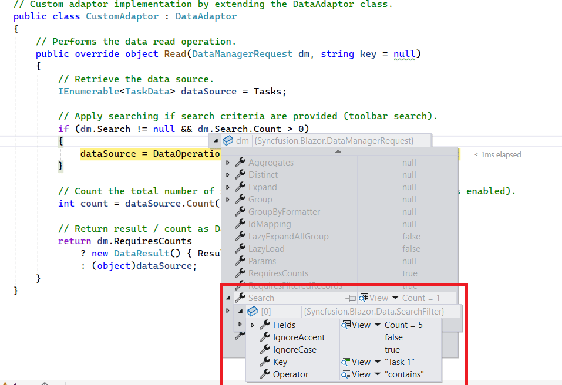
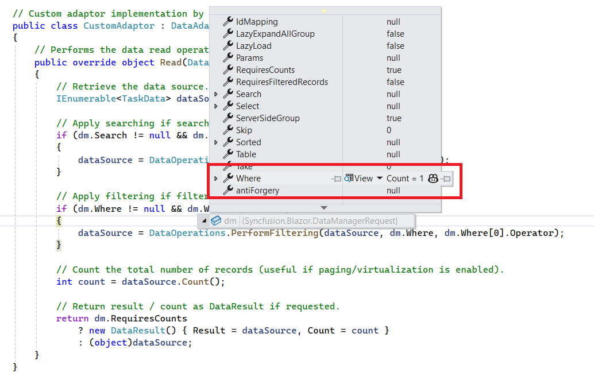
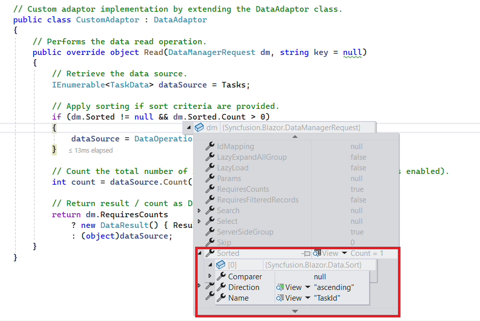
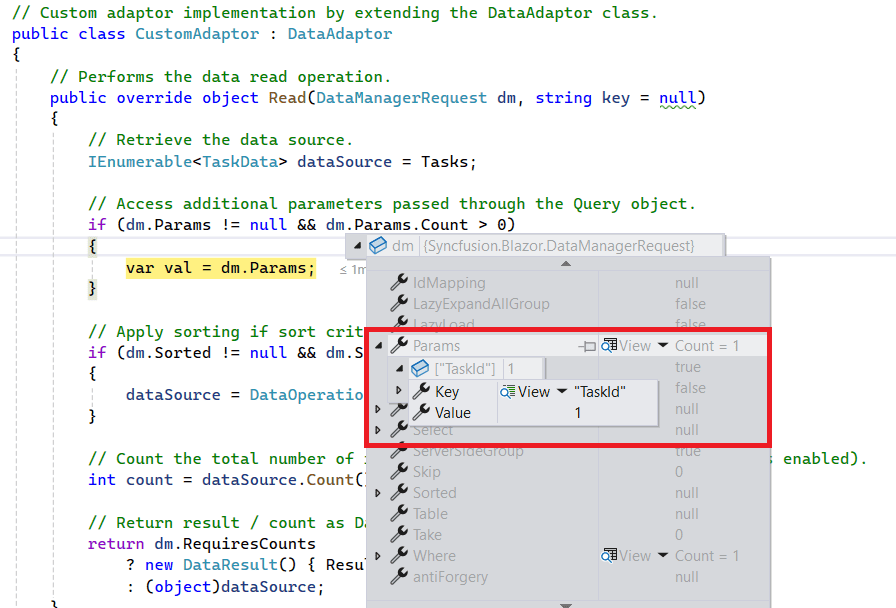

# Custom Binding in Blazor Gantt Chart

The [SfDataManager](https://help.syncfusion.com/cr/blazor/Syncfusion.Blazor.Data.SfDataManager.html) supports custom adaptors, enabling manual operations on data. It is useful for implementing custom data binding and editing operations in the Syncfusion<sup style="font-size:70%">&reg;</sup> Blazor Gantt Chart.

To implement custom data binding in the Gantt Chart, the [DataAdaptor](https://help.syncfusion.com/cr/blazor/Syncfusion.Blazor.DataAdaptor.html) class is used. This abstract class serves as a base class for the custom adaptor.

The `DataAdaptor` abstract class includes both synchronous and asynchronous method signatures, which can be overridden in the custom adaptor. The following are the method signatures available in this class:

```csharp
public abstract class DataAdaptor
{
    /// <summary>
    /// Performs data read operation synchronously.
    /// </summary>
    public virtual object Read(DataManagerRequest dataManagerRequest, string key = null)

    /// <summary>
    /// Performs data read operation asynchronously.
    /// </summary>
    public virtual Task<object> ReadAsync(DataManagerRequest dataManagerRequest, string key = null)

    /// <summary>
    /// Performs insert operation synchronously.
    /// </summary>
    public virtual object Insert(DataManager dataManager, object data, string key)
    /// <summary>
    /// Performs insert operation asynchronously.
    /// </summary>
    public virtual Task<object> InsertAsync(DataManager dataManager, object data, string key)

    /// <summary>
    /// Performs remove operation synchronously.
    /// </summary>
    public virtual object Remove(DataManager dataManager, object data, string keyField, string key)

    /// <summary>
    /// Performs remove operation asynchronously.
    /// </summary>
    public virtual Task<object> RemoveAsync(DataManager dataManager, object data, string keyField, string key)

    /// <summary>
    /// Performs update operation synchronously.
    /// </summary>
    public virtual object Update(DataManager dataManager, object data, string keyField, string key)

    /// <summary>
    /// Performs update operation asynchronously.
    /// </summary>
    public virtual Task<object> UpdateAsync(DataManager dataManager, object data, string keyField, string key)

    /// <summary>
    /// Performs batch CRUD operations synchronously.
    /// </summary>
    public virtual object BatchUpdate(DataManager dataManager, object changedRecords, object addedRecords, object deletedRecords, string keyField, string key, int? dropIndex)

    /// <summary>
    /// Performs batch CRUD operations asynchronously.
    /// </summary>
    public virtual Task<object> BatchUpdateAsync(DataManager dataManager, object changedRecords, object addedRecords, object deletedRecords, string keyField, string key, int? dropIndex)
}
```

## Data Binding

Custom data binding in the Syncfusion<sup style="font-size:70%">&reg;</sup> Blazor Gantt Chart is achieved by providing a custom adaptor class and overriding the [Read](https://help.syncfusion.com/cr/blazor/Syncfusion.Blazor.DataAdaptor.html#Syncfusion_Blazor_DataAdaptor_Read_Syncfusion_Blazor_DataManagerRequest_System_String_) or [ReadAsync](https://help.syncfusion.com/cr/blazor/Syncfusion.Blazor.DataAdaptor.html#Syncfusion_Blazor_DataAdaptor_ReadAsync_Syncfusion_Blazor_DataManagerRequest_System_String_) methods of the `DataAdaptor` abstract class.

The following example demonstrates how to implement custom data binding using a custom adaptor:

```cshtml
@using Syncfusion.Blazor.Gantt;
@using Syncfusion.Blazor.Data;
@using Syncfusion.Blazor;

<SfGantt TValue="TaskData" Height="450px" Width="1000px" >
     <SfDataManager AdaptorInstance="@typeof(CustomAdaptor)" Adaptor="Adaptors.CustomAdaptor"></SfDataManager>
    <GanttTaskFields Id="TaskID" Name="TaskName" StartDate="StartDate" EndDate="EndDate" Progress="Progress" Duration="Duration"  ParentID="ParentID">
    </GanttTaskFields>
</SfGantt>

@code{
    public static List<TaskData> GanttData { get; set; }
    public class TaskData
    {
        public int? TaskID { get; set; }
        public string TaskName { get; set; }
        public DateTime StartDate { get; set; }
        public DateTime EndDate { get; set; }
        public int Progress { get; set; }
        public int Duration { get; set; }
        public int? ParentID { get; set; }
        public TaskData() { }
    }
    protected override void OnInitialized()
    {
        GanttData = GetTaskCollection().ToList();
    }
    public static List<TaskData> GetTaskCollection()
    {
        List<TaskData> DataCollection = new List<TaskData>();
        Random rand = new Random();
        var x = 0;
        for (var i = 1; i <= 2; i++)
        {
            var name = rand.Next(0, 100);
            TaskData Parent = new TaskData()
            {
                TaskID = ++x,
                TaskName = "Task " + x,
                StartDate = new DateTime(2017, 1, 9),
                EndDate = new DateTime(2017, 1, 13),
                Duration = 5,
                Progress = rand.Next(100),
                ParentID = null,
            };
            DataCollection.Add(Parent);
            for (var j = 1; j <= 4; j++)
            {
                var childName = rand.Next(0, 100);
                DataCollection.Add(new TaskData()
                {
                    TaskID = ++x,
                    TaskName = "Task " + x,
                    StartDate = new DateTime(2017, 1, 9),
                    EndDate = new DateTime(2019, 1, 13),
                    Duration = 5,
                    Progress = rand.Next(100),
                    ParentID = Parent.TaskID,

                });
            }
        }
        return DataCollection;
    }

    // Implementing custom adaptor by extending the DataAdaptor class.
    public class CustomAdaptor : DataAdaptor
    {
        // Performs data Read operation.
        public override object Read(DataManagerRequest dm, string key = null)
        {
            IEnumerable<TaskData> DataSource = GanttData;
            if (dm.Search != null && dm.Search.Count > 0)
            {
                // Searching
                DataSource = DataOperations.PerformSearching(DataSource, dm.Search);
            }
            if (dm.Sorted != null && dm.Sorted.Count > 0)
            {
                // Sorting
                DataSource = DataOperations.PerformSorting(DataSource, dm.Sorted);
            }
            if (dm.Where != null && dm.Where.Count > 0)
            {
                // Filtering
                if (dm.Where[0].Field != null && dm.Where[0].Field == @nameof(TaskData.ParentID)){}
                else
                {
                    DataSource = DataOperations.PerformFiltering(DataSource, dm.Where, dm.Where[0].Operator);
                }
            }
            int count = DataSource.Cast<TaskData>().Count();
            if (dm.Skip != 0)
            {
                //Paging
                DataSource = DataOperations.PerformSkip(DataSource, dm.Skip);
            }
            if (dm.Take != 0)
            {
                DataSource = DataOperations.PerformTake(DataSource, dm.Take);
            }
            return dm.RequiresCounts ? new DataResult() { Result = DataSource, Count = count } : (object)DataSource;
        }
    }
}
```

> If the [DataManagerRequest.RequiresCounts](https://help.syncfusion.com/cr/blazor/Syncfusion.Blazor.DataManagerRequest.html#Syncfusion_Blazor_DataManagerRequest_RequiresCounts) property is **true**, the `Read/ReadAsync` method must return a **DataResult** containing both **Result** (a collection of records) and **Count** (the total number of records). When **false**, return only the collection of records.

The following image shows the custom-bind data displayed in the Gantt Chart:


> If the `Read/ReadAsync` method is not overridden in the custom adaptor, the default read handler will be used.

## Inject service into custom adaptor

To inject a service into the custom adaptor for data operations, follow the steps shown below.

First, register the `CustomAdaptor` class as scoped service in the `Program.cs` file.

```csharp
// Registering services in the Program.cs file.
builder.Services.AddSingleton<TaskDataAccessLayer>();
builder.Services.AddScoped<CustomAdaptor>();
builder.Services.AddScoped<ServiceClass>();
```

The following example demonstrates how to inject a service into the Custom Adaptor and using it for data operations:

```cshtml
@using Syncfusion.Blazor.Gantt;
@using Syncfusion.Blazor.Data;
@using Syncfusion.Blazor;

<SfGantt TValue="TaskData" Height="450px" Width="1000px" LoadChildOnDemand="true">
     <SfDataManager AdaptorInstance="@typeof(CustomAdaptor)" Adaptor="Adaptors.CustomAdaptor"></SfDataManager>
    <GanttTaskFields Id="TaskID" Name="TaskName" StartDate="StartDate" EndDate="EndDate" Progress="Progress" Duration="Duration"  ParentID="ParentID">
    </GanttTaskFields>
</SfGantt>

@code{
    public static List<TaskData> GanttData { get; set; }
    public static List<TaskData> gantt = new List<TaskData>();
    public class TaskData
    {
        public int? TaskID { get; set; }
        public string TaskName { get; set; }
        public DateTime StartDate { get; set; }
        public DateTime EndDate { get; set; }
        public int Progress { get; set; }
        public int Duration { get; set; }
        public int? ParentID { get; set; }
        public TaskData() { }
    }
    public static List<TaskData> GetGantt()
    {
        if (gantt.Count == 0)
        {
            int root = -1;
            for (var t = 1; t <= 8; t++)
            {
                string math = (60 % 3) == 0 ? "High" : (60 % 2) == 0 ? "Release Breaker" : "Critical";
                root++;
                int rootItem = gantt.Count + root + 1;
                gantt.Add(new TaskData() { TaskID = rootItem, TaskName = "Parent Task " + rootItem.ToString(), StartDate = new DateTime(2022, 06, 07), EndDate = new DateTime(2022, 08, 25), Progress = 70, ParentID = null, Duration = 20 });
                int parent = gantt.Count;
                for (var c = 0; c < 3; c++)
                {
                    root++;
                    string val = ((parent + c + 1) % 3 == 0) ? "Low" : "Critical";
                    int parn = parent + c + 1;
                    int iD = gantt.Count + root + 1;
                    gantt.Add(new TaskData() { TaskID = iD, TaskName = "Child Task " + iD.ToString(), StartDate = new DateTime(2022, 06, 07), EndDate = new DateTime(2022, 08, 25), Progress = 30, ParentID = rootItem, Duration = 5 });
                    if ((((parent + c + 1) % 3) == 0))
                    {
                        int immParent = gantt.Count;
                        for (var s = 0; s <= 1; s++)
                        {
                            root++;
                            gantt.Add(new TaskData() { TaskID = gantt.Count + root + 1, TaskName = "Sub Task " + (gantt.Count + root + 1).ToString(), StartDate = new DateTime(2022, 06, 07), EndDate = new DateTime(2022, 08, 25), Progress = 50, ParentID = iD, Duration = 8 });
                        }
                    }
                }
            }
        }
        return gantt;
    }

    // Implementing custom adaptor by extending the DataAdaptor class.
    public class CustomAdaptor : DataAdaptor
    {
        // Inject the required service instance.
        [Inject]
        public TaskDataAccessLayer context { get; set; } = new TaskDataAccessLayer();
        // Performs data Read operation
        public override object Read(DataManagerRequest dm, string key = null)
        {
            IEnumerable<TaskData> DataSource = GanttData;
            if (dm.Search != null && dm.Search.Count > 0)
            {
                // Searching
                DataSource = DataOperations.PerformSearching(DataSource, dm.Search);
            }
            if (dm.Sorted != null && dm.Sorted.Count > 0)
            {
                // Sorting
                DataSource = DataOperations.PerformSorting(DataSource, dm.Sorted);
            }
            if (dm.Where != null && dm.Where.Count > 0)
            {
                // Filtering
                if (dm.Where[0].Field != null && dm.Where[0].Field == "ParentID"){}
                else
                {
                    DataSource = DataOperations.PerformFiltering(DataSource, dm.Where, dm.Where[0].Operator);
                }
            }
            int count = DataSource.Cast<TaskData>().Count();
            if (dm.Skip != 0)
            {
                //Paging
                DataSource = DataOperations.PerformSkip(DataSource, dm.Skip);
            }
            if (dm.Take != 0)
            {
                DataSource = DataOperations.PerformTake(DataSource, dm.Take);
            }
            return dm.RequiresCounts ? new DataResult() { Result = DataSource, Count = count } : (object)DataSource;
        }
    }
    protected override void OnInitialized()
    {
        GanttData = GetGantt().ToList();
    }
}
```
## Handling searching operation

When using a custom adaptor, searching operation must be handled by overriding the `Read` or `ReadAsync` method of the `DataAdaptor` abstract class. The `DataManagerRequest` object provides details about the search action as shown in the image below:



The following example demonstrates how to implement searching operation for custom-bound data:

```cshtml

@using Syncfusion.Blazor
@using Syncfusion.Blazor.Data
@using Syncfusion.Blazor.Gantt
@using System.Collections

<SfGantt TValue="TaskData" Height="450px" Toolbar="@(new List<string>() { "Search" })">
    
    <SfDataManager AdaptorInstance="@typeof(CustomAdaptor)" Adaptor="Adaptors.CustomAdaptor">
    </SfDataManager>

    <GanttTaskFields Id="TaskID"
                     Name="TaskName"
                     StartDate="StartDate"
                     EndDate="EndDate"
                     Progress="Progress">
    </GanttTaskFields>
    
    <GanttColumns>
        <GanttColumn Field="TaskID" HeaderText="Task ID" Width="100"></GanttColumn>
        <GanttColumn Field="TaskName" HeaderText="Task Name" Width="220"></GanttColumn>
        <GanttColumn Field="StartDate" HeaderText="Start Date" Format="d" Width="140"></GanttColumn>
        <GanttColumn Field="EndDate" HeaderText="End Date" Format="d" Width="140"></GanttColumn>
        <GanttColumn Field="Progress" HeaderText="Progress" Width="120"></GanttColumn>
    </GanttColumns>
</SfGantt>

@code {
    public static List<TaskData> Tasks { get; set; } = new();

    protected override void OnInitialized()
    {        
        var baseDate = new DateTime(2026, 04, 01);
        var rand = new Random();

        Tasks = Enumerable.Range(1, 75).Select(x => new TaskData
        {
            TaskID = 0+ x,
            TaskName = $"Task {0 + x}",
            StartDate = baseDate.AddDays(x % 10),           
            EndDate = baseDate.AddDays((x % 10) + 3),       
            Progress = rand.Next(0, 101)                    
        }).ToList();
    }

    public class TaskData
    {
        public int TaskID { get; set; }
        public string TaskName { get; set; } = string.Empty;
        public DateTime? StartDate { get; set; }
        public DateTime? EndDate { get; set; }
        public int Progress { get; set; }
    }

    // Custom adaptor implementation by extending the DataAdaptor class.
    public class CustomAdaptor : DataAdaptor
    {
        // Performs the data read operation.
        public override object Read(DataManagerRequest dm, string key = null)
        {
            // Retrieve the data source.
            IEnumerable<TaskData> dataSource = Tasks;

            // Apply searching if search criteria are provided (toolbar search).
            if (dm.Search != null && dm.Search.Count > 0)
            {
                dataSource = DataOperations.PerformSearching(dataSource, dm.Search);
            }

            // Count the total number of records.
            int count = dataSource.Count();

            // Return result / count as DataResult if requested.
            return dm.RequiresCounts
                ? new DataResult() { Result = dataSource, Count = count }
                : (object)dataSource;
        }
    }
}   

```

## Handling filtering operation

When using a custom adaptor, filtering operation must be handled by overriding the `Read` or `ReadAsync` method of the `DataAdaptor` abstract class. The `DataManagerRequest` object provides filtering details as shown in the image below:



Based on this information, the custom data source can be filtered using the built-in [PerformFiltering](https://help.syncfusion.com/cr/blazor/Syncfusion.Blazor.DataOperations.html#Syncfusion_Blazor_DataOperations_PerformFiltering__1_System_Collections_Generic_IEnumerable___0__System_Collections_Generic_List_Syncfusion_Blazor_Data_WhereFilter__System_String_) method of the `DataOperations` class.

> You can also create your own custom filtering logic and bind the filtered  data to the Gantt Chart.

The following example demonstrates how to implement the filtering operation for custom-bound data:

```cshtml

@using Syncfusion.Blazor
@using Syncfusion.Blazor.Data
@using Syncfusion.Blazor.Gantt
@using System.Collections

<SfGantt TValue="TaskData" Height="450px" AllowFiltering="true">
    
    <SfDataManager AdaptorInstance="@typeof(CustomAdaptor)" Adaptor="Adaptors.CustomAdaptor">
    </SfDataManager>

    <GanttTaskFields Id="TaskID"
                     Name="TaskName"
                     StartDate="StartDate"
                     EndDate="EndDate"
                     Progress="Progress">
    </GanttTaskFields>
    
    <GanttColumns>
        <GanttColumn Field="TaskID" HeaderText="Task ID" Width="100"></GanttColumn>
        <GanttColumn Field="TaskName" HeaderText="Task Name" Width="220"></GanttColumn>
        <GanttColumn Field="StartDate" HeaderText="Start Date" Format="d" Width="140"></GanttColumn>
        <GanttColumn Field="EndDate" HeaderText="End Date" Format="d" Width="140"></GanttColumn>
        <GanttColumn Field="Progress" HeaderText="Progress" Width="120"></GanttColumn>
    </GanttColumns>
</SfGantt>

@code {
    public static List<TaskData> Tasks { get; set; } = new();

    protected override void OnInitialized()
    {        
        var baseDate = new DateTime(2026, 04, 01);
        var rand = new Random();

        Tasks = Enumerable.Range(1, 75).Select(x => new TaskData
        {
            TaskID = 0+ x,
            TaskName = $"Task {0 + x}",
            StartDate = baseDate.AddDays(x % 10),           
            EndDate = baseDate.AddDays((x % 10) + 3),       
            Progress = rand.Next(0, 101)                    
        }).ToList();
    }

    public class TaskData
    {
        public int TaskID { get; set; }
        public string TaskName { get; set; }
        public DateTime? StartDate { get; set; }
        public DateTime? EndDate { get; set; }
        public int Progress { get; set; }
    }

    // Custom adaptor implementation by extending the DataAdaptor class.
    public class CustomAdaptor : DataAdaptor
    {
        // Performs the data read operation.
        public override object Read(DataManagerRequest dm, string key = null)
        {
            // Retrieve the data source.
            IEnumerable<TaskData> dataSource = Tasks;

            // Apply filtering if filter criteria are provided.
            if (dm.Where != null && dm.Where.Count > 0)
            {
                dataSource = DataOperations.PerformFiltering(dataSource, dm.Where, dm.Where[0].Operator);
            }

            // Count the total number of records 
            int count = dataSource.Count();

            // Return result / count as DataResult if requested.
            return dm.RequiresCounts
                ? new DataResult() { Result = dataSource, Count = count }
                : (object)dataSource;
        }
    }
} 

```

## Handling sorting operation

When using a custom adaptor, the sorting operation must be handled by overriding the `Read` or `ReadAsync` method of the `DataAdaptor` abstract class. The `DataManagerRequest` object provides sorting details, as shown in the image below:



You can sort data using the built‑in [PerformSorting](https://help.syncfusion.com/cr/blazor/Syncfusion.Blazor.DataOperations.html#Syncfusion_Blazor_DataOperations_PerformSorting_System_Collections_IEnumerable_System_Collections_Generic_List_Syncfusion_Blazor_Data_SortedColumn__) method of the `DataOperations` class.

N> Alternatively, you can also implement a custom sorting method and bind the sorted data to the Gantt Chart.

The following example demonstrates how to implement the sorting operation for custom-bound data:

```cshtml

@using Syncfusion.Blazor
@using Syncfusion.Blazor.Data
@using Syncfusion.Blazor.Gantt
@using System.Collections

<SfGantt TValue="TaskData" Height="450px" AllowSorting="true">
    
    <SfDataManager AdaptorInstance="@typeof(CustomAdaptor)" Adaptor="Adaptors.CustomAdaptor">
    </SfDataManager>

    <GanttTaskFields Id="TaskID"
                     Name="TaskName"
                     StartDate="StartDate"
                     EndDate="EndDate"
                     Progress="Progress">
    </GanttTaskFields>
    
    <GanttColumns>
        <GanttColumn Field="TaskID" HeaderText="Task ID" Width="100"></GanttColumn>
        <GanttColumn Field="TaskName" HeaderText="Task Name" Width="220"></GanttColumn>
        <GanttColumn Field="StartDate" HeaderText="Start Date" Format="d" Width="140"></GanttColumn>
        <GanttColumn Field="EndDate" HeaderText="End Date" Format="d" Width="140"></GanttColumn>
        <GanttColumn Field="Progress" HeaderText="Progress" Width="120"></GanttColumn>
    </GanttColumns>
</SfGantt>

@code {
    public static List<TaskData> Tasks { get; set; } = new();

    protected override void OnInitialized()
    {        
        var baseDate = new DateTime(2026, 04, 01);
        var rand = new Random();

        Tasks = Enumerable.Range(1, 75).Select(x => new TaskData
        {
            TaskID = 0+ x,
            TaskName = $"Task {0 + x}",
            StartDate = baseDate.AddDays(x % 10),           
            EndDate = baseDate.AddDays((x % 10) + 3),       
            Progress = rand.Next(0, 101)                    
        }).ToList();
    }

    public class TaskData
    {
        public int TaskID { get; set; }
        public string TaskName { get; set; } = string.Empty;
        public DateTime? StartDate { get; set; }
        public DateTime? EndDate { get; set; }
        public int Progress { get; set; }
    }

    // Custom adaptor implementation by extending the DataAdaptor class.
    public class CustomAdaptor : DataAdaptor
    {
        // Performs the data read operation.
        public override object Read(DataManagerRequest dm, string key = null)
        {
            // Retrieve the data source.
            IEnumerable<TaskData> dataSource = Tasks;

            // Apply sorting if sort criteria are provided.
            if (dm.Sorted != null && dm.Sorted.Count > 0)
            {
                dataSource = DataOperations.PerformSorting(dataSource, dm.Sorted);
            }

            // Count the total number of records (useful if paging/virtualization is enabled).
            int count = dataSource.Count();

            // Return result / count as DataResult if requested.
            return dm.RequiresCounts
                ? new DataResult() { Result = dataSource, Count = count }
                : (object)dataSource;
        }
    }
}   

```

## Handling CRUD operations

The CRUD operations for custom-bound data can be implemented by overriding the following CRUD methods of the `DataAdaptor` abstract class:

* [Insert](https://help.syncfusion.com/cr/blazor/Syncfusion.Blazor.DataAdaptor.html#Syncfusion_Blazor_DataAdaptor_Insert_Syncfusion_Blazor_DataManager_System_Object_System_String_)/[InsertAsync](https://help.syncfusion.com/cr/blazor/Syncfusion.Blazor.DataAdaptor.html#Syncfusion_Blazor_DataAdaptor_InsertAsync_Syncfusion_Blazor_DataManager_System_Object_System_String_)
* [Remove](https://help.syncfusion.com/cr/blazor/Syncfusion.Blazor.DataAdaptor.html#Syncfusion_Blazor_DataAdaptor_Remove_Syncfusion_Blazor_DataManager_System_Object_System_String_System_String_)/[RemoveAsync](https://help.syncfusion.com/cr/blazor/Syncfusion.Blazor.DataAdaptor.html#Syncfusion_Blazor_DataAdaptor_RemoveAsync_Syncfusion_Blazor_DataManager_System_Object_System_String_System_String_)
* [Update](https://help.syncfusion.com/cr/blazor/Syncfusion.Blazor.DataAdaptor.html#Syncfusion_Blazor_DataAdaptor_Update_Syncfusion_Blazor_DataManager_System_Object_System_String_System_String_)/[UpdateAsync](https://help.syncfusion.com/cr/blazor/Syncfusion.Blazor.DataAdaptor.html#Syncfusion_Blazor_DataAdaptor_UpdateAsync_Syncfusion_Blazor_DataManager_System_Object_System_String_System_String_)
* [BatchUpdate](https://help.syncfusion.com/cr/blazor/Syncfusion.Blazor.DataAdaptor.html#Syncfusion_Blazor_DataAdaptor_BatchUpdate_Syncfusion_Blazor_DataManager_System_Object_System_Object_System_Object_System_String_System_String_System_Nullable_System_Int32__)/[BatchUpdateAsync](https://help.syncfusion.com/cr/blazor/Syncfusion.Blazor.DataAdaptor.html#Syncfusion_Blazor_DataAdaptor_BatchUpdateAsync_Syncfusion_Blazor_DataManager_System_Object_System_Object_System_Object_System_String_System_String_System_Nullable_System_Int32__)

N> When using batch editing in the Gantt Chart, use the `BatchUpdate`/`BatchUpdateAsync` method to handle the corresponding CRUD operation.

The following example demonstrates how to implement CRUD operations for custom-bound data:

```cshtml
@using Syncfusion.Blazor.Gantt;
@using Syncfusion.Blazor.Data;
@using Syncfusion.Blazor;

<SfGantt TValue="TaskData" Height="450px" Width="1000px" Toolbar="@(new List<string>() { "Add", "Edit", "Delete", "Update", "Cancel", "Search"})">
     <SfDataManager AdaptorInstance="@typeof(CustomAdaptor)" Adaptor="Adaptors.CustomAdaptor"></SfDataManager>
    <GanttTaskFields Id="TaskID" Name="TaskName" StartDate="StartDate" EndDate="EndDate" Progress="Progress" Duration="Duration"  ParentID="ParentID">
    </GanttTaskFields>
     <GanttEditSettings AllowEditing="true" AllowAdding="true" AllowDeleting="true"></GanttEditSettings>
     <GanttEvents RowUpdating="RowUpdatingHandler" TValue="TaskData"></GanttEvents>
</SfGantt>

@code{
    public static List<TaskData> GanttData { get; set; }
    public static List<TaskData> gantt = new List<TaskData>();
    public static int index = 0;

    public void RowUpdatingHandler(GanttRowUpdatingEventArgs<TaskData> args)
    {
        index = args.Index;
    }

    public class TaskData
    {
        public int? TaskID { get; set; }
        public string TaskName { get; set; }
        public DateTime StartDate { get; set; }
        public DateTime EndDate { get; set; }
        public int Progress { get; set; }
        public int Duration { get; set; }
        public int? ParentID { get; set; }
        public TaskData() { }
    }

    protected override void OnInitialized()
    {
        GanttData = GetGantt().ToList();
    }
    public static List<TaskData> GetGantt()
    {
        if (gantt.Count == 0)
        {
            int root = -1;
            for (var t = 1; t <= 8; t++)
            {
                string math = (42 % 3) == 0 ? "High" : (42 % 2) == 0 ? "Release Breaker" : "Critical";
                root++;
                int rootItem = gantt.Count + root + 1;
                gantt.Add(new TaskData() { TaskID = rootItem, TaskName = "Parent Task " + rootItem.ToString(), StartDate = new DateTime(2022, 06, 07), EndDate = new DateTime(2022, 08, 25), Progress = 70, ParentID = null, Duration = 20 });
                int parent = gantt.Count;
                for (var c = 0; c < 3; c++)
                {
                    root++;
                    string val = ((parent + c + 1) % 3 == 0) ? "Low" : "Critical";
                    int parn = parent + c + 1;
                    int iD = gantt.Count + root + 1;
                    gantt.Add(new TaskData() { TaskID = iD, TaskName = "Child Task " + iD.ToString(), StartDate = new DateTime(2022, 06, 07), EndDate = new DateTime(2022, 08, 25), Progress = 30, ParentID = rootItem, Duration = 5 });
                    if ((((parent + c + 1) % 3) == 0))
                    {
                        int immParent = gantt.Count;
                        for (var s = 0; s <= 1; s++)
                        {
                            root++;
                            gantt.Add(new TaskData() { TaskID = gantt.Count + root + 1, TaskName = "Sub Task " + (gantt.Count + root + 1).ToString(), StartDate = new DateTime(2022, 06, 07), EndDate = new DateTime(2022, 08, 25), Progress = 50, ParentID = iD, Duration = 8 });
                        }
                    }
                }
            }
        }
        return gantt;
    }

    // Implementing custom adaptor by extending the DataAdaptor class.
    public class CustomAdaptor : DataAdaptor
    {
        // Performs data Read operation.
        public override object Read(DataManagerRequest dm, string key = null)
        {
            IEnumerable<TaskData> DataSource = GanttData;
            if (dm.Search != null && dm.Search.Count > 0)
            {
                // Searching
                DataSource = DataOperations.PerformSearching(DataSource, dm.Search);
            }
            if (dm.Sorted != null && dm.Sorted.Count > 0)
            {
                // Sorting
                DataSource = DataOperations.PerformSorting(DataSource, dm.Sorted);
            }
            if (dm.Where != null && dm.Where.Count > 0)
            {
                // Filtering
                if (dm.Where[0].Field != null && dm.Where[0].Field == "ParentID"){}
                else
                {
                    DataSource = DataOperations.PerformFiltering(DataSource, dm.Where, dm.Where[0].Operator);
                }
            }
            int count = DataSource.Cast<TaskData>().Count();
            if (dm.Skip != 0)
            {
                //Paging
                DataSource = DataOperations.PerformSkip(DataSource, dm.Skip);
            }
            if (dm.Take != 0)
            {
                DataSource = DataOperations.PerformTake(DataSource, dm.Take);
            }
            return dm.RequiresCounts ? new DataResult() { Result = DataSource, Count = count } : (object)DataSource;
        }
        public override object Insert(DataManager dm, object value, string key)
        {
            GanttData.Insert(index, value as TaskData);
            return value;
        }

        // Performs Remove operation.
        public override object Remove(DataManager dm, object value, string keyField, string key)
        {
            GanttData.Remove(GanttData.Where(or => or.TaskID == int.Parse(value.ToString())).FirstOrDefault());
            return value;
        }

        // Performs Update operation.
        public override object Update(DataManager dm, object value, string keyField, string key)
        {
            var data = GanttData.Where(or => or.TaskID == (value as TaskData).TaskID).FirstOrDefault();
            if (data != null)
            {
                data.TaskID = (value as TaskData).TaskID;
                data.TaskName = (value as TaskData).TaskName;
                data.StartDate = (value as TaskData).StartDate;
                data.EndDate = (value as TaskData).EndDate;
                data.Duration = (value as TaskData).Duration;
                data.Progress = (value as TaskData).Progress;
            }
            return value;
        }
    }
}
```

> You can refer to the [Syncfusion<sup style="font-size:70%">&reg;</sup> Blazor Gantt Chart](https://www.syncfusion.com/blazor-components/blazor-gantt) feature tour page for its groundbreaking feature representations. You can also explore the [Syncfusion<sup style="font-size:70%">&reg;</sup> Blazor Gantt Chart example](https://blazor.syncfusion.com/demos/gantt-chart/overview?theme=fluent2) to understand how to present and manipulate data.

## How to pass additional parameters to custom adaptor

The Syncfusion<sup style="font-size:70%">&reg;</sup> Blazor Gantt Chart allows sending custom parameters along with data requests.This is useful when additional information (e.g., user role, token, or filters) must be sent to the server.

Use the [Query](https://help.syncfusion.com/cr/blazor/Syncfusion.Blazor.Gantt.SfGantt-1.html#Syncfusion_Blazor_Gantt_SfGantt_1_Query) property of the Gantt Chart along with the [AddParams](https://help.syncfusion.com/cr/blazor/Syncfusion.Blazor.Data.Query.html#Syncfusion_Blazor_Data_Query_AddParams_System_String_System_Object_) method of the `Query` class to send custom parameters.

To enable custom parameters in data requests for the Gantt Chart, follow these steps:

1. **Bind the Query Object to the Gantt Chart:**  
    Assign the initialized Query object to the Gantt’s `Query` property.
2. **Initialize the Query Object:**  
    Create a new instance of the `Query` class and use the `AddParams` method to add your custom parameters.
3. **Access Parameters in the Custom Adaptor:**  
    Access the parameters via `Params` inside the custom adaptor and apply them as required for server-side logic.

The following example demonstrates how to send additional parameters to the server.

```cshtml
@using Syncfusion.Blazor
@using Syncfusion.Blazor.Data
@using Syncfusion.Blazor.Gantt
@using System.Collections

<SfGantt TValue="TaskData" Height="450px" Query="@Query">
    
    <SfDataManager AdaptorInstance="@typeof(CustomAdaptor)" Adaptor="Adaptors.CustomAdaptor">
    </SfDataManager>

    <GanttTaskFields Id="TaskID"
                     Name="TaskName"
                     StartDate="StartDate"
                     EndDate="EndDate"
                     Progress="Progress">
    </GanttTaskFields>
    
    <GanttColumns>
        <GanttColumn Field="TaskID" HeaderText="Task ID" Width="100"></GanttColumn>
        <GanttColumn Field="TaskName" HeaderText="Task Name" Width="220"></GanttColumn>
        <GanttColumn Field="StartDate" HeaderText="Start Date" Format="d" Width="140"></GanttColumn>
        <GanttColumn Field="EndDate" HeaderText="End Date" Format="d" Width="140"></GanttColumn>
        <GanttColumn Field="Progress" HeaderText="Progress" Width="120"></GanttColumn>
    </GanttColumns>
</SfGantt>

@code {
    public static List<TaskData> Tasks { get; set; } = new();
    public Query Query = new Query().AddParams("TaskID", 1);

    protected override void OnInitialized()
    {        
        var baseDate = new DateTime(2026, 04, 01);
        var rand = new Random();

        Tasks = Enumerable.Range(1, 75).Select(x => new TaskData
        {
            TaskID = 0+ x,
            TaskName = $"Task {0 + x}",
            StartDate = baseDate.AddDays(x % 10),           
            EndDate = baseDate.AddDays((x % 10) + 3),       
            Progress = rand.Next(0, 101)                    
        }).ToList();
    }

    public class TaskData
    {
        public int TaskID { get; set; }
        public string TaskName { get; set; } = string.Empty;
        public DateTime? StartDate { get; set; }
        public DateTime? EndDate { get; set; }
        public int Progress { get; set; }
    }

    // Custom adaptor implementation by extending the DataAdaptor class.
    public class CustomAdaptor : DataAdaptor
    {
        // Performs the data read operation.
        public override object Read(DataManagerRequest dm, string key = null)
        {
            // Retrieve the data source.
            IEnumerable<TaskData> dataSource = Tasks;

            // Access additional parameters passed through the Query object.
            if (dm.Params != null && dm.Params.Count > 0)
            {
                var val = dm.Params;
            }            

            // Count the total number of records.
            int count = dataSource.Count();

            // Return result / count as DataResult if requested.
            return dm.RequiresCounts
                ? new DataResult() { Result = dataSource, Count = count }
                : (object)dataSource;
        }
    }
}   

```

